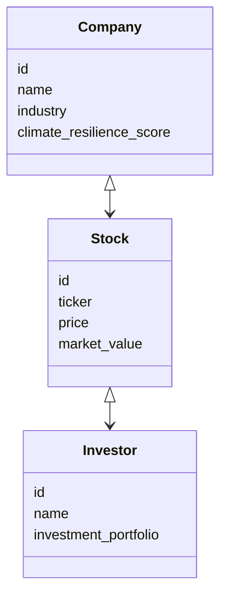

                 


# 特价股票与公司长期气候适应能力的关系分析

## 关键词：特价股票、公司气候适应能力、气候变化、股票市场、风险管理

## 摘要：本文分析了特价股票与公司气候适应能力之间的关系，探讨了气候变化对股票市场的影响，以及如何通过提升公司的气候适应能力来优化特价股票的投资价值。文章从背景、核心概念、算法原理、系统设计、项目实战等多方面展开，结合实际案例和数据模型，为投资者和企业管理者提供了科学的分析方法和决策支持。

---

## 第1章：背景介绍

### 1.1 问题背景

#### 1.1.1 特价股票的定义与市场表现
特价股票通常指价格远低于行业平均水平的股票，可能因市场波动、公司短期困境或行业调整而被低估。这些股票在市场低迷时往往具有较高的反弹潜力，吸引风险偏好较高的投资者。

#### 1.1.2 公司气候适应能力的定义与重要性
公司气候适应能力是指企业在面对气候变化带来的物理、监管和社会风险时，调整经营策略、优化资源配置和恢复业务的能力。随着全球气候变化加剧，具备气候适应能力的公司更可能在长期竞争中存活并发展。

#### 1.1.3 问题背景：气候变化对企业的影响
气候变化导致极端天气事件频发，影响企业供应链、运营成本和市场需求。具备气候适应能力的公司能够更好地应对这些挑战，从而在股价上体现出更强的抗压性和增长潜力。

---

### 1.2 问题描述

#### 1.2.1 特价股票的波动性分析
特价股票价格波动剧烈，投资者需识别其波动背后的因素，如公司基本面、行业趋势和市场情绪。气候变化可能加剧市场波动，影响特价股票的表现。

#### 1.2.2 公司气候适应能力的评估维度
公司气候适应能力可以从治理结构、风险管理、信息披露和技术创新等方面评估。具备较强气候适应能力的公司更可能在气候变化中保持稳定，进而影响股价表现。

#### 1.2.3 问题的核心：气候变化对股票市场的长期影响
气候变化不仅是环境问题，更是经济问题。具备气候适应能力的公司在市场中的表现更优，这为投资者提供了长期投资的方向。

---

### 1.3 问题解决

#### 1.3.1 特价股票的市场机会与风险
投资者需识别具备长期增长潜力的特价股票，同时警惕因公司治理或业务模式不佳导致的长期风险。

#### 1.3.2 公司气候适应能力的提升策略
企业需优化治理结构、加强风险管理、提升信息披露透明度，并投资于可持续发展项目。

#### 1.3.3 如何将气候适应能力转化为股票价值
投资者应关注具备气候适应能力的公司的股价表现，将气候适应能力作为投资决策的重要指标。

---

### 1.4 边界与外延

#### 1.4.1 特价股票的适用范围
特价股票主要适用于市场低迷或行业调整期，投资者需结合市场周期选择投资策略。

#### 1.4.2 公司气候适应能力的评估边界
气候适应能力的评估需考虑行业特性、公司规模和地理位置等因素，不同行业对气候变化的敏感度不同。

#### 1.4.3 相关概念的对比与区分
将气候适应能力与传统风险管理进行对比，明确两者的异同，避免混淆概念。

---

## 第2章：核心概念的原理与联系

### 2.1 核心概念原理

#### 2.1.1 特价股票的市场机制
特价股票的价格波动反映了市场对公司的短期看法，但具备气候适应能力的公司能够在长期获得更多投资者青睐。

#### 2.1.2 公司气候适应能力的构成要素
包括治理结构、风险管理、技术创新和信息披露等方面，这些要素共同决定了公司的气候适应能力。

#### 2.1.3 气候变化对股票市场的影响路径
气候变化通过影响企业运营、供应链和市场需求，进而影响股价表现。具备气候适应能力的公司能够有效缓解这些影响。

---

### 2.2 概念属性特征对比

| 特性                | 特价股票                      | 公司气候适应能力                 |
|---------------------|-------------------------------|-----------------------------------|
| 定义                | 价格远低于行业平均水平的股票 | 公司在气候变化中的适应能力       |
| 主要影响因素        | 市场情绪、公司基本面          | 治理结构、风险管理、技术创新       |
| 评估指标            | 市场价格、成交量              | 气候适应指数、风险管理评分         |
| 长期影响            | 可能反弹，也可能持续低迷      | 影响公司长期竞争力和股价稳定性     |

---

### 2.3 ER实体关系图

```mermaid
erDiagram
    company {
        id
        name
        industry
        climate_resilience_score
    }
    stock {
        id
        ticker
        price
        market_value
    }
    company_stock_link {
        company_id
        stock_id
        relation_type
    }
```

---

## 第3章：算法原理讲解

### 3.1 算法概述

#### 3.1.1 算法目的
通过分析公司气候适应能力评分，筛选具备长期气候适应能力的特价股票，为投资者提供投资建议。

#### 3.1.2 算法输入
- 公司气候适应能力评分
- 特价股票列表
- 市场数据

#### 3.1.3 算法输出
- 符合条件的特价股票列表
- 投资建议

---

### 3.2 算法流程图

```mermaid
graph TD
    A[开始] -> B[获取公司气候适应能力评分]
    B -> C[获取特价股票列表]
    C -> D[分析市场数据]
    D -> E[筛选符合气候适应能力的特价股票]
    E -> F[生成投资建议]
    F -> G[结束]
```

---

### 3.3 算法实现

#### 3.3.1 数据预处理
- 清洗数据，处理缺失值和异常值
- 标准化处理公司气候适应能力评分

#### 3.3.2 算法实现代码

```python
import pandas as pd
import numpy as np

# 数据加载
df_company = pd.read_csv('company_data.csv')
df_stock = pd.read_csv('stock_data.csv')

# 数据预处理
df_company['climate_resilience_score'] = df_company['climate_resilience_score'].fillna(df_company['climate_resilience_score'].mean())
df_stock['price'] = df_stock['price'].apply(lambda x: np.log(x) if x > 0 else 0)

# 算法实现
def select_promotion_stocks(df_company, df_stock):
    # 筛选气候适应能力强的公司
    top_companies = df_company[df_company['climate_resilience_score'] > df_company['climate_resilience_score'].mean()]['id']
    
    # 获取对应股票
    promotion_stocks = df_stock[df_stock['id'].isin(top_companies)]
    return promotion_stocks

# 获取结果
result = select_promotion_stocks(df_company, df_stock)
print(result)
```

---

### 3.4 算法模型与公式

#### 3.4.1 气候适应能力评分公式
$$ climate\_resilience\_score = \frac{governance\_score + risk\_management\_score + innovation\_score}{3} $$

#### 3.4.2 特价股票筛选公式
$$ selection\_criteria = (climate\_resilience\_score > mean\_score) \& (price < industry\_average\_price) $$

---

## 第4章：系统分析与架构设计方案

### 4.1 系统功能设计

#### 4.1.1 领域模型类图



---

### 4.2 系统架构设计

#### 4.2.1 系统架构图


---

### 4.3 系统接口设计

- API接口：提供气候适应能力评分和股票数据查询
- 数据接口：连接数据库，获取实时市场数据

---

## 第5章：项目实战

### 5.1 环境配置

#### 5.1.1 安装必要的库
```bash
pip install pandas numpy matplotlib
```

#### 5.1.2 数据源
- 公司数据：包含气候适应能力评分
- 股票数据：包含股价、成交量等信息

---

### 5.2 系统核心实现

#### 5.2.1 数据预处理代码

```python
import pandas as pd
import numpy as np

# 加载数据
df_company = pd.read_csv('company.csv')
df_stock = pd.read_csv('stock.csv')

# 数据清洗
df_company['climate_resilience_score'] = df_company['climate_resilience_score'].fillna(df_company['climate_resilience_score'].mean())
df_stock['price'] = df_stock['price'].apply(lambda x: np.log(x) if x > 0 else 0)

# 数据合并
merged_df = df_company.merge(df_stock, on='id')
```

#### 5.2.2 模型实现代码

```python
def calculate_climate_resilience_score(df):
    return df['climate_resilience_score'].mean()

def select_promotion_stocks(df_company, df_stock):
    mean_score = calculate_climate_resilience_score(df_company)
    promotion_stocks = df_stock[df_stock['climate_resilience_score'] > mean_score]
    return promotion_stocks

result = select_promotion_stocks(df_company, df_stock)
print(result)
```

---

### 5.3 案例分析

#### 5.3.1 案例背景
假设某行业受气候变化影响较大，选择一家具备高气候适应能力的公司进行分析。

#### 5.3.2 数据分析
通过模型筛选出具备气候适应能力的特价股票，分析其历史表现和未来潜力。

---

## 第6章：总结与展望

### 6.1 总结

#### 6.1.1 主要发现
- 具备气候适应能力的公司在特价股票中具有更高的投资价值。
- 气候变化对股票市场的长期影响需引起重视。

#### 6.1.2 小结
通过分析气候适应能力，投资者可以选择更具长期稳定性的特价股票。

---

### 6.2 展望

#### 6.2.1 气候变化对股票市场的长期影响
未来，气候变化将继续影响市场，具备气候适应能力的公司将继续保持优势。

#### 6.2.2 投资者的应对策略
投资者应将气候适应能力作为投资决策的重要指标，关注可持续发展。

---

## 结语

本文通过分析特价股票与公司气候适应能力的关系，为投资者提供了科学的决策支持。未来，随着气候变化的加剧，具备气候适应能力的公司在股票市场中的地位将愈发重要。

---

**参考文献**：[此处列出相关文献和数据来源]

---

**附录**：[包含数据处理代码、模型详细说明等附加内容]

