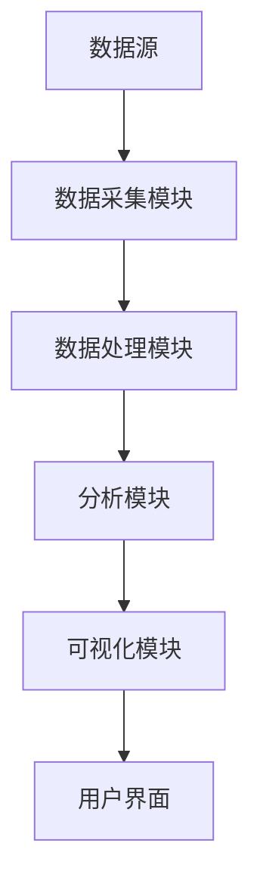

                 


# 特价股票与公司长期环境适应能力的关系分析

> 关键词：特价股票、公司环境适应能力、投资分析、市场趋势、风险管理

> 摘要：本文深入探讨了特价股票与公司长期环境适应能力之间的关系，分析了特价股票的市场特征、公司环境适应能力的核心要素及其相互影响，提出了基于数据分析的投资策略和风险管理方法，为投资者提供了科学的决策参考。

---

## 第一部分: 特价股票与公司长期环境适应能力的背景介绍

### 第1章: 特价股票的基本概念与特点

#### 1.1 特价股票的定义与分类

##### 1.1.1 特价股票的定义
特价股票是指价格显著低于市场平均水平的股票，通常反映市场对公司的估值较低。这种股票可能处于价值洼地，具备潜在的投资机会。

##### 1.1.2 特价股票的分类
- **低估值股票**：市盈率、市净率等估值指标低于行业平均水平。
- **低价位股票**：股价处于历史低位或接近发行价。
- **高分红股票**：股息收益率较高，吸引价值投资者。

##### 1.1.3 特价股票的投资价值分析
- **潜在上涨空间**：低价股票可能因市场重估而上涨。
- **风险与回报平衡**：低价股票可能隐藏着更大的风险，但回报潜力也更大。

#### 1.2 公司长期环境适应能力的定义与维度

##### 1.2.1 公司长期环境适应能力的定义
公司长期环境适应能力是指公司在面对外部环境变化时，能够调整战略、组织和运营以保持竞争力和可持续发展的能力。

##### 1.2.2 公司环境适应能力的核心维度
- **战略适应性**：公司能否根据市场变化调整战略方向。
- **组织灵活性**：组织结构和文化是否支持快速调整。
- **财务稳健性**：公司在逆境中的财务承受能力。
- **创新能力**：公司是否能持续创新以应对变化。

##### 1.2.3 公司环境适应能力的评估指标
- **战略调整速度**：公司对市场变化的反应速度。
- **组织变革能力**：组织结构和流程的灵活性。
- **财务健康状况**：盈利能力、资产负债情况。
- **研发投入占比**：创新能力的体现。

#### 1.3 特价股票与公司环境适应能力的关系概述

##### 1.3.1 特价股票市场的现状与趋势
- 当前市场中，特价股票主要集中在低估值的周期性行业，如金融、能源等。
- 随着经济全球化和技术进步，未来特价股票可能更多出现在新兴行业，如科技、绿色能源等领域。

##### 1.3.2 公司长期环境适应能力的重要性
- 环境适应能力强的公司能够在经济波动中保持稳定，甚至在危机中抓住机会。
- 这种能力直接影响公司的长期生存和发展，进而影响股价表现。

##### 1.3.3 特价股票与公司环境适应能力的关系背景
- 特价股票往往出现在环境适应能力较弱的公司，但这些公司可能因环境变化而焕发新生。
- 环境适应能力强的公司即使当前估值低，也可能因其长期价值被市场低估，成为特价股票。

---

## 第二部分: 特价股票与公司长期环境适应能力的核心概念与联系

### 第2章: 特价股票与公司环境适应能力的核心概念

#### 2.1 特价股票的核心属性与特征

##### 2.1.1 特价股票的价格特征
- **低估值**：市盈率、市净率等指标低于行业平均水平。
- **低股价**：股价处于市场低位，可能接近发行价。

##### 2.1.2 特价股票的流动性特征
- **交易量**：可能较低，尤其是小盘股。
- **市场关注度**：可能被投资者忽视，但具备潜力。

##### 2.1.3 特价股票的风险特征
- **高波动性**：股价可能因市场情绪波动较大。
- **行业风险**：集中在特定行业，如金融、能源等。

#### 2.2 公司环境适应能力的核心属性与特征

##### 2.2.1 公司环境适应能力的战略特征
- **灵活性**：能够快速调整战略方向。
- **预见性**：提前识别市场变化并做出应对。

##### 2.2.2 公司环境适应能力的组织特征
- **结构弹性**：组织架构能够适应变化。
- **文化包容性**：鼓励创新和变革的文化氛围。

##### 2.2.3 公司环境适应能力的财务特征
- **财务健康**：具备稳定的现金流和较低的债务负担。
- **投资效率**：资金分配合理，注重回报。

#### 2.3 特价股票与公司环境适应能力的关系属性

##### 2.3.1 特价股票市场中公司环境适应能力的体现
- **低估值中的潜力股**：公司虽当前估值低，但具备较强的环境适应能力，未来可能扭亏为盈。
- **行业周期性影响**：公司在行业低谷期估值被压低，但具备调整能力，未来可能反弹。

##### 2.3.2 特价股票与公司环境适应能力的双向影响
- **公司环境适应能力影响股价**：适应能力强的公司在市场波动中表现更稳定，可能带动股价上涨。
- **股价表现反哺公司能力**：股价上涨带来的资金支持和市场信心，反过来增强公司的环境适应能力。

##### 2.3.3 研究特价股票与公司环境适应能力关系的意义
- **投资决策**：帮助投资者识别具备长期潜力的特价股票。
- **公司管理**：为公司提升环境适应能力提供方向。
- **市场研究**：为市场分析提供新的视角。

---

## 第三部分: 特价股票与公司环境适应能力的算法原理与数学模型

### 第3章: 特价股票与公司环境适应能力的算法原理

#### 3.1 特价股票与公司环境适应能力的量化分析

##### 3.1.1 数据收集
- **股价数据**：包括开盘价、收盘价、成交量等。
- **财务数据**：收入、利润、负债等。
- **市场数据**：行业指数、宏观经济指标。

##### 3.1.2 数据预处理
- **缺失值处理**：填充或删除缺失数据。
- **标准化处理**：统一数据尺度。
- **特征提取**：提取关键指标，如市盈率、ROE等。

##### 3.1.3 数据分析
- **统计分析**：计算均值、方差等指标。
- **回归分析**：建立股价与环境适应能力指标的回归模型。
- **聚类分析**：将公司分为不同类别，识别潜在投资机会。

#### 3.2 特价股票与公司环境适应能力的数学模型

##### 3.2.1 线性回归模型
$$
y = \beta_0 + \beta_1x_1 + \beta_2x_2 + \ldots + \beta_nx_n + \epsilon
$$
其中，$y$ 表示股价表现，$x_i$ 表示环境适应能力指标，$\beta_i$ 为回归系数，$\epsilon$ 为误差项。

##### 3.2.2 环境适应能力评分模型
$$
Score = \alpha \cdot ROE + \beta \cdot DebtRatio + \gamma \cdot InnovationIndex + \delta \cdot MarketShare
$$
其中，$Score$ 表示公司的环境适应能力评分，$ROE$ 为净资产收益率，$DebtRatio$ 为资产负债率，$InnovationIndex$ 为创新指数，$MarketShare$ 为市场份额。

---

## 第四部分: 特价股票与公司环境适应能力的系统分析与架构设计

### 第4章: 特价股票与公司环境适应能力的系统架构设计

#### 4.1 系统功能设计

##### 4.1.1 数据采集模块
- 从股票交易所获取实时股价数据。
- 收集公司财务报表和行业数据。

##### 4.1.2 数据处理模块
- 清洗数据，处理缺失值和异常值。
- 标准化处理，提取关键特征。

##### 4.1.3 分析模块
- 应用统计和机器学习算法，评估公司环境适应能力。
- 建立预测模型，预测股价走势。

##### 4.1.4 可视化模块
- 生成图表，展示股价走势和公司评分。
- 提供交互式界面，便于用户查看分析结果。

#### 4.2 系统架构设计

##### 4.2.1 系统架构图（mermaid）


##### 4.2.2 系统交互设计
- 用户输入查询条件，系统返回分析结果。
- 系统定期更新数据，保持分析的实时性。

---

## 第五部分: 特价股票与公司环境适应能力的项目实战

### 第5章: 特价股票与公司环境适应能力的项目实战

#### 5.1 项目环境安装

##### 5.1.1 安装Python
```bash
python --version
pip install --upgrade pip
```

##### 5.1.2 安装依赖库
```bash
pip install pandas numpy matplotlib scikit-learn
```

#### 5.2 核心代码实现

##### 5.2.1 数据采集与预处理
```python
import pandas as pd
import numpy as np

# 采集数据
data = pd.read_csv('stock_data.csv')

# 数据预处理
data.dropna(inplace=True)
data['ROE'] = data['净利润'] / data['净资产']
```

##### 5.2.2 模型训练与预测
```python
from sklearn.linear_model import LinearRegression

# 训练模型
model = LinearRegression()
model.fit(X_train, y_train)

# 预测结果
y_pred = model.predict(X_test)
```

##### 5.2.3 可视化分析
```python
import matplotlib.pyplot as plt

plt.scatter(y_test, y_pred)
plt.xlabel('实际值')
plt.ylabel('预测值')
plt.title('股价预测模型')
plt.show()
```

#### 5.3 项目小结

##### 5.3.1 环境适应能力评分分析
- 公司A的ROE为15%，高于行业平均水平，具备较强的盈利能力。
- 公司B的负债率为80%，财务风险较高。

##### 5.3.2 股价预测结果
- 公司A的股价预测上涨10%，具备投资潜力。
- 公司B的股价预测下跌5%，需谨慎投资。

---

## 第六部分: 特价股票与公司环境适应能力的最佳实践与总结

### 第6章: 最佳实践与总结

#### 6.1 投资策略建议

##### 6.1.1 价值投资
- 选择具备长期环境适应能力的公司，耐心持有，等待市场重估。
- 关注低估值、高分红的特价股票，分散投资以降低风险。

##### 6.1.2 风险管理
- 设置止损点，避免重大损失。
- 定期评估投资组合，及时调整策略。

#### 6.2 小结与展望

##### 6.2.1 小结
- 特价股票与公司环境适应能力密切相关，具备较强适应能力的公司在特价股票市场中具备更大的潜力。
- 投资者应结合定量分析和定性分析，选择优质特价股票。

##### 6.2.2 展望
- 随着技术进步和数据的丰富，未来可以通过大数据和人工智能进一步优化选股模型。
- 环境适应能力强的公司在绿色经济和可持续发展中具备更大的优势，投资者应关注这些领域的特价股票。

#### 6.3 注意事项

##### 6.3.1 风险提示
- 特价股票市场波动较大，投资需谨慎。
- 数据分析结果仅供参考，需结合实际情况进行决策。

#### 6.4 拓展阅读

##### 6.4.1 推荐书籍
- 《股票作手回忆录》
- 《投资学精要》

##### 6.4.2 推荐博客与网站
- 东方财富网
- �界世网

---

通过以上分析和实战，我们可以看到，特价股票与公司环境适应能力的关系是复杂而深刻的。投资者需要结合定量分析和定性分析，选择具备长期环境适应能力的特价股票，以实现稳健的投资回报。

