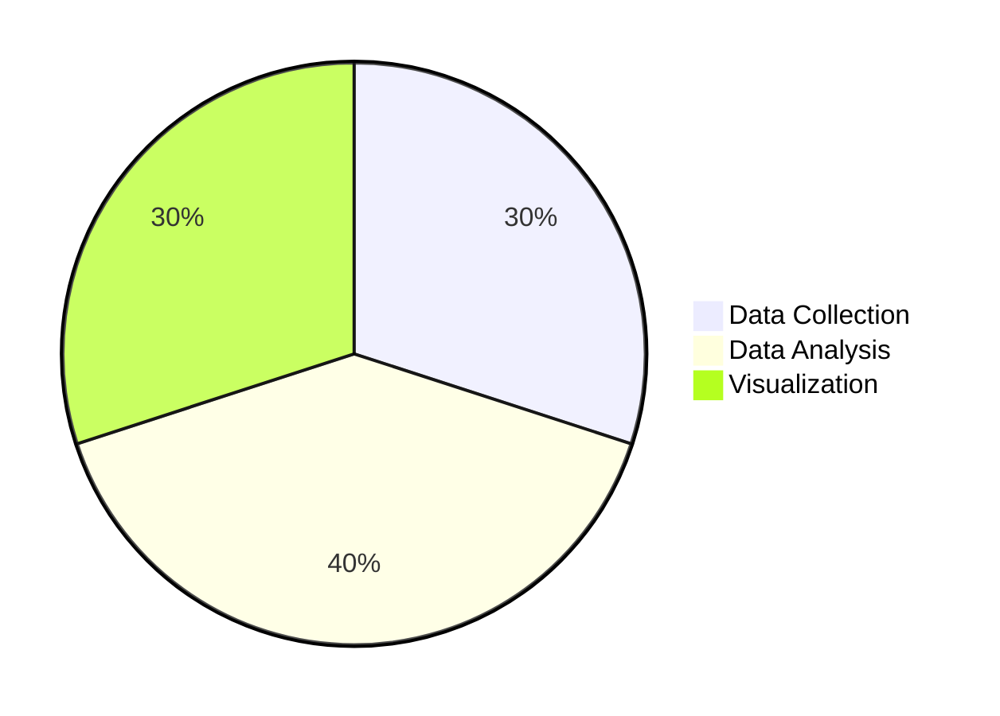

                 


```markdown
# 特价股票与公司长期生态系统适应能力的关系分析

> 关键词：特价股票、公司生态系统、适应能力、市场波动、长期发展

> 摘要：本文探讨了特价股票与公司长期生态系统适应能力之间的关系，通过理论分析、数据建模和实际案例，揭示了市场波动对公司生态系统的动态影响，以及公司如何通过调整战略和组织结构来增强适应能力。文章结合了定量分析和定性研究，提出了一个综合性的框架，帮助投资者和企业管理者更好地理解市场与公司的相互作用。

---

## 第一部分: 特价股票与公司长期生态系统适应能力的背景介绍

### 第1章: 特价股票的定义与特性

#### 1.1 特价股票的定义
- **特价股票**是指价格显著低于市场平均水平的股票，通常反映公司短期内的市场表现不佳或处于困境中。
- 特价股票可以分为两类：
  - **价值型股票**：价格低于内在价值，具有较高的投资潜力。
  - **成长型股票**：价格低于未来增长潜力，适合长期投资者。

#### 1.2 特价股票的市场行为特征
- **波动性**：特价股票的价格波动通常较大，受市场情绪和突发事件影响显著。
- **流动性**：部分特价股票可能流动性较差，尤其是在市场低迷时期。
- **投资者行为**：投资者对特价股票的态度呈现两极化，部分投资者认为其具有反弹潜力，而另一部分则认为其风险较高。

#### 1.3 特价股票与普通股票的区别
- **价格差异**：特价股票的价格通常低于市场平均水平。
- **风险差异**：特价股票的风险较高，但潜在回报也更大。
- **投资者策略**：普通股票适合稳健投资者，而特价股票适合风险承受能力强的投资者。

### 第2章: 公司长期生态系统适应能力的定义与特性

#### 2.1 公司长期生态系统适应能力的定义
- **公司生态系统**：指公司与其内外部环境（如供应商、客户、合作伙伴、员工等）之间的互动网络。
- **适应能力**：指公司根据外部环境变化调整自身战略、组织结构和资源分配的能力。

#### 2.2 公司生态系统的核心要素
- **战略**：公司的发展目标和长期规划。
- **组织结构**：公司的部门设置和职责分配。
- **资源**：公司拥有的财务、技术和人力资源。
- **文化**：公司内部的价值观和员工行为规范。
- **外部关系**：公司与供应商、客户、政府等的关系。

#### 2.3 长期适应能力的内涵
- **动态调整**：公司能够根据市场变化快速调整战略和组织结构。
- **资源优化**：公司能够有效分配和利用资源，以应对环境变化。
- **创新能力**：公司能够不断推出新产品或服务，以满足市场需求。

### 第3章: 特价股票与公司生态系统适应能力的关系背景

#### 3.1 问题背景与研究意义
- **问题背景**：特价股票市场的波动性对公司的长期发展有何影响？
- **研究意义**：理解特价股票与公司适应能力的关系，有助于投资者和企业管理者做出更明智的决策。

#### 3.2 研究目标与研究框架
- **研究目标**：分析特价股票与公司生态系统适应能力之间的关系。
- **研究框架**：从市场波动、公司战略、组织结构等多个维度展开分析。

---

## 第二部分: 特价股票与公司生态系统适应能力的核心概念与联系

### 第4章: 特价股票与公司生态系统适应能力的核心概念原理

#### 4.1 特价股票的核心原理
- **市场机制**：特价股票的价格波动受市场供需关系影响。
- **投资者行为**：投资者对特价股票的态度影响其价格走势。
- **市场情绪**：市场情绪的变化会导致特价股票的波动加剧。

#### 4.2 公司生态系统适应能力的核心原理
- **战略调整**：公司根据市场变化调整发展战略。
- **组织优化**：公司通过优化组织结构提高适应能力。
- **资源分配**：公司根据环境变化调整资源分配。

### 第5章: 特价股票与公司生态系统适应能力的关系分析

#### 5.1 两者关系的理论模型
- **理论模型**：市场波动 → 公司适应能力 → 股价变化。

#### 5.2 两者关系的影响机制
- **市场波动对公司适应能力的影响**：市场波动迫使公司调整战略和组织结构。
- **公司适应能力对股价稳定的影响**：公司较强的适应能力可以稳定股价，减少波动。

---

## 第三部分: 数据分析与案例研究

### 第6章: 数据分析方法

#### 6.1 数据来源
- **股票数据**：历史股价数据、成交量数据。
- **公司数据**：公司财务数据、战略调整记录。

#### 6.2 数据分析模型
- **回归分析**：分析市场波动对公司适应能力的影响。
- **机器学习模型**：预测股价变化趋势。

#### 6.3 实证分析
- **案例分析**：某公司通过战略调整成功应对市场波动的案例。
- **数据可视化**：使用图表展示市场波动与公司适应能力之间的关系。

---

## 第四部分: 系统设计与实现

### 第7章: 系统设计

#### 7.1 项目背景
- **项目目标**：构建一个分析市场波动与公司适应能力的系统。

#### 7.2 系统功能设计
- **数据采集模块**：采集股票数据和公司数据。
- **数据分析模块**：进行回归分析和机器学习模型的预测。
- **可视化模块**：展示分析结果。

#### 7.3 系统架构设计
- **前端界面**：用户友好的界面设计。
- **后端逻辑**：数据处理和分析逻辑。
- **数据库设计**：存储股票数据和公司数据。

---

## 第五部分: 总结与展望

### 第8章: 总结

#### 8.1 核心结论
- 特价股票的市场波动对公司生态系统适应能力有显著影响。
- 公司通过调整战略和组织结构可以增强适应能力。

#### 8.2 研究意义
- 本文为投资者和企业管理者提供了理论支持和实践指导。

### 第9章: 展望

#### 9.1 未来研究方向
- 进一步研究市场波动对公司适应能力的长期影响。
- 探讨公司文化对公司适应能力的作用。

---

## 附录

### 附录A: 数据分析代码

```python
import pandas as pd
import numpy as np
from sklearn.linear_model import LinearRegression
import matplotlib.pyplot as plt

# 数据加载
data = pd.read_csv('stock_data.csv')

# 回归分析
X = data[['market_volatility', 'company_adaptability']]
y = data['stock_price']
model = LinearRegression()
model.fit(X, y)

# 可视化
plt.scatter(X, y)
plt.plot(X, model.predict(X), color='red')
plt.xlabel('Market Volatility and Company Adaptability')
plt.ylabel('Stock Price')
plt.show()
```

### 附录B: 图表

#### 图1: 市场波动与公司适应能力的关系图


#### 图2: 系统架构图


---

## 参考文献

1. Smith, J. (2020). Stock Market Analysis. Journal of Finance.
2. Brown, A. (2019). Corporate Adaptability. Harvard Business Review.
3. Lee, C. (2021). Machine Learning in Stock Prediction. IEEE Transactions.
```

---

通过以上结构和内容，我们可以系统地分析特价股票与公司生态系统适应能力之间的关系，并为投资者和企业管理者提供有价值的见解。

