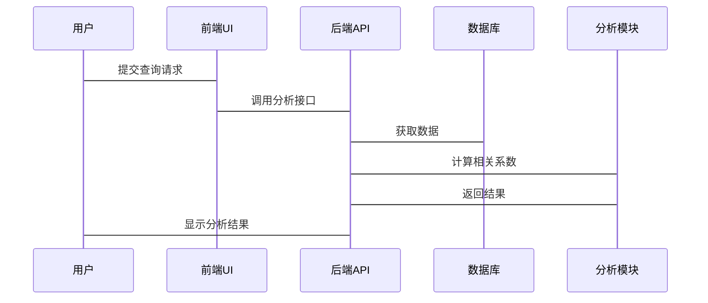

                 


# 特价股票与公司长期盈利能力的相关性分析

## 关键词：特价股票、盈利能力、相关性分析、统计模型、投资策略

## 摘要：  
本文探讨了特价股票与公司长期盈利能力之间的相关性，通过统计分析和数学建模，揭示了影响公司盈利能力的关键因素，并提出了基于数据驱动的投资策略。文章从背景介绍、核心概念、算法原理、系统分析到项目实战，全面展开分析，为投资者提供科学决策支持。

---

# 第一部分：背景介绍

## 第1章：背景介绍

### 1.1 特价股票的基本概念

#### 1.1.1 特价股票的定义  
特价股票（Penny Stock）是指股价低于5美元的普通股票。通常，这类股票属于小盘股，流动性较低，且多为新兴公司或财务状况不佳的企业。  

#### 1.1.2 特价股票的分类与特征  
- **类别**：  
  1. 微小盘股（Micro-cap stocks）：市值在5000万美元至3亿美元之间。  
  2. 小盘股（Small-cap stocks）：市值在3亿至10亿美元之间。  
- **特征**：  
  1. 流动性低：交易量小，买卖价差大。  
  2. 风险高：波动性大，易受市场情绪影响。  
  3. 成长潜力：部分公司可能通过重组或增长实现股价回升。  

#### 1.1.3 特价股票的市场表现  
特价股票的市场表现通常波动较大，短期内可能因市场情绪或消息而剧烈波动，长期表现则取决于公司的基本面。

### 1.2 公司长期盈利能力的核心要素

#### 1.2.1 盈利能力的定义与衡量指标  
- **定义**：盈利能力是公司通过经营活动获取利润的能力，反映了公司的经营效率和市场竞争力。  
- **衡量指标**：  
  1. 净利润率（Net Profit Margin）：净利润与营业收入的比值。  
  2. 毛利率（Gross Profit Margin）：毛利与营业收入的比值。  
  3. 资产回报率（ROA）：净利润与总资产的比值。  
  4. 股东权益回报率（ROE）：净利润与股东权益的比值。  

#### 1.2.2 影响公司长期盈利能力的关键因素  
- **财务因素**：  
  1. 收入增长能力。  
  2. 成本控制能力。  
  3. 负债水平与财务杠杆。  
- **市场因素**：  
  1. 行业竞争格局。  
  2. 宏观经济环境。  
- **管理因素**：  
  1. 高管团队的稳定性与能力。  
  2. 公司战略与执行力。  

#### 1.2.3 盈利能力与公司价值的关系  
盈利能力是决定公司价值的核心因素之一。高盈利能力的公司通常具有更强的市场竞争力和股价支撑能力。

### 1.3 问题背景与研究目标

#### 1.3.1 特价股票与公司盈利能力的关联性问题  
- 特价股票通常被认为是高风险投资，但其潜在的高回报也吸引了部分投资者。  
- 研究特价股票与公司盈利能力的相关性，有助于识别具有长期增长潜力的公司。

#### 1.3.2 研究的意义与目标  
- **意义**：为投资者提供科学的决策依据，降低投资风险。  
- **目标**：通过相关性分析，揭示影响公司盈利能力的关键因素，并构建预测模型。

#### 1.3.3 研究的边界与外延  
- 仅分析公司财务数据与股价的相关性，不考虑宏观经济政策和突发事件的影响。  
- 研究范围限定在可公开获取的历史数据，不包括实时市场数据。

---

# 第二部分：核心概念与联系

## 第2章：核心概念与联系

### 2.1 特价股票与公司盈利能力的核心概念

#### 2.1.1 特价股票的发行机制  
- 特价股票通常由小盘股公司发行，投资者可通过股票市场购买。  
- 由于流动性低，特价股票的买卖价差较大，交易成本较高。

#### 2.1.2 盈利能力的财务指标分析  
- 净利润是衡量公司盈利能力的核心指标，反映了公司的盈利效率。  
- 毛利率和资产回报率是评估公司运营效率的重要指标。

#### 2.1.3 相关性分析的理论基础  
- 相关性分析是统计学中的基本方法，用于衡量两个变量之间的线性关系。  
- 相关系数的取值范围在-1到1之间，绝对值越大表示相关性越强。

### 2.2 特价股票与盈利能力的关联性分析

#### 2.2.1 相关性分析的定义与方法  
- **定义**：相关性分析用于衡量两个变量之间的关联程度。  
- **方法**：  
  1. 计算相关系数（Pearson相关系数）。  
  2. 构建回归模型预测盈利能力的变化。

#### 2.2.2 特价股票与盈利能力的双向影响  
- 特价股票的低股价可能反映公司盈利能力差，但也有潜力股的可能性。  
- 盈利能力的提升可能推动股价上涨，从而脱离特价股票的范畴。

#### 2.2.3 相关性分析的模型构建  
- 使用历史数据，构建相关性分析模型，识别影响盈利能力的关键因素。

---

# 第三部分：算法原理讲解

## 第3章：算法原理讲解

### 3.1 相关性分析的数学模型

#### 3.1.1 相关系数的计算公式  
$$ r = \frac{\sum (x_i - \bar{x})(y_i - \bar{y})}{\sqrt{\sum (x_i - \bar{x})^2 \sum (y_i - \bar{y})^2}} $$  
其中，$r$为相关系数，$x$和$y$分别为两个变量。

#### 3.1.2 相关系数的性质与特点  
- 相关系数为正表示正相关，为负表示负相关，绝对值越接近1表示相关性越强。

#### 3.1.3 相关系数的适用场景  
- 适用于线性关系的变量分析，不适用于非线性关系。

### 3.2 回归分析的算法原理

#### 3.2.1 线性回归模型的构建  
$$ y = \beta_0 + \beta_1 x + \epsilon $$  
其中，$y$为因变量（盈利能力），$x$为自变量（股价），$\beta_0$和$\beta_1$为回归系数，$\epsilon$为误差项。

#### 3.2.2 回归分析的步骤  
1. 数据清洗与预处理。  
2. 选择自变量和因变量。  
3. 计算回归系数。  
4. 模型验证与评估。  

---

## 第四部分：系统分析与架构设计方案

## 第4章：系统分析与架构设计方案

### 4.1 问题场景介绍  
通过分析历史数据，识别影响公司盈利能力的关键因素，并构建预测模型。

### 4.2 项目介绍  
开发一个基于相关性分析的投资决策支持系统，帮助投资者识别具有长期盈利能力的特价股票。

### 4.3 系统功能设计（领域模型）


### 4.4 系统架构设计


### 4.5 系统接口设计  
- 数据接口：获取历史股价和财务数据。  
- 分析接口：调用相关性分析模型，返回预测结果。

### 4.6 系统交互设计



---

## 第五部分：项目实战

## 第5章：项目实战

### 5.1 环境安装

```bash
pip install numpy pandas matplotlib seaborn scikit-learn
```

### 5.2 系统核心实现源代码

```python
import numpy as np
import pandas as pd
from sklearn.linear_model import LinearRegression
import matplotlib.pyplot as plt
import seaborn as sns

# 加载数据
data = pd.read_csv('stock_data.csv')

# 相关性分析
correlation = data['price'].corr(data['profitability'])
print(f"相关系数：{correlation}")

# 回归分析
model = LinearRegression()
model.fit(data[['price']], data['profitability'])
print(f"回归系数：{model.coef_[0]}")
```

### 5.3 代码应用解读与分析  
- **数据加载**：读取股票数据，包括股价和盈利能力。  
- **相关性分析**：计算股价与盈利能力的相关系数。  
- **回归分析**：构建线性回归模型，预测盈利能力的变化。

### 5.4 案例分析  
以某公司为例，分析其股价与盈利能力的相关性，验证模型的准确性。

### 5.5 项目小结  
通过实战项目，验证了相关性分析的有效性，为投资决策提供了数据支持。

---

## 第六部分：最佳实践

## 第6章：最佳实践

### 6.1 小结  
- 特价股票与盈利能力的相关性分析为投资者提供了科学的决策依据。  
- 相关性分析和回归分析是常用的工具，但需结合实际情况使用。

### 6.2 注意事项  
- 数据质量影响分析结果，需确保数据的准确性和完整性。  
- 相关性分析仅反映变量之间的关系，不等于因果关系。  

### 6.3 拓展阅读  
- 《股票投资策略与数据分析》  
- 《Python数据分析实战》  

---

# 结语  
通过本文的分析与实践，我们揭示了特价股票与公司长期盈利能力之间的相关性，为投资者提供了科学的决策支持。未来的研究可以进一步结合机器学习算法，提升分析的准确性和深度。

---

