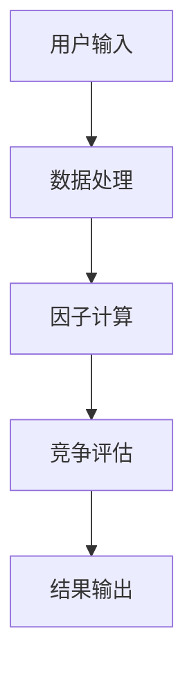

                 


# 特价股票与公司长期竞争优势的关联性

## 关键词：特价股票，公司竞争优势，股价波动，投资策略，财务分析

## 摘要：本文探讨了特价股票与公司长期竞争优势之间的关联性。通过分析特价股票的市场特点、长期竞争优势的核心要素，揭示了两者在投资决策中的相互影响。结合算法模型和实际案例，本文为投资者提供了深度的分析方法和实践建议。

---

# 第一部分：背景与概念

## 第1章：特价股票的基本概念

### 1.1 特价股票的定义与特点

#### 1.1.1 特价股票的定义
特价股票通常指价格远低于行业平均水平的股票，可能因市场低估或公司困境导致。这类股票往往具有较高的潜在回报，吸引投资者关注。

#### 1.1.2 特价股票的特点
- **低估值**：市盈率、市净率等指标低于行业平均水平。
- **高波动性**：价格波动较大，受市场情绪影响显著。
- **风险较高**：公司可能面临财务困境或行业衰退。

#### 1.1.3 特价股票的分类与市场现状
- **周期性股票**：受经济周期影响较大，如原材料行业。
- **困境反转股**：公司基本面改善，股价尚未反映。
- **价值低估股**：市场未充分认识到其价值。

---

## 第2章：公司长期竞争优势的核心要素

### 2.1 长期竞争优势的定义

#### 2.1.1 长期竞争优势的定义
长期竞争优势是指公司在行业内持续保持竞争优势的能力，包括市场地位、技术优势、成本控制等。

#### 2.1.2 长期竞争优势的构成要素
- **市场地位**：品牌影响力、市场份额。
- **财务健康**：盈利能力、现金流。
- **管理团队**：领导力和战略决策。
- **技术创新**：研发能力、专利数量。

#### 2.1.3 长期竞争优势与公司价值的关系
长期竞争优势是公司持续创造价值的基础，直接影响股价的长期表现。

---

## 第3章：特价股票与公司长期竞争优势的关联性概述

### 3.1 特价股票与公司长期竞争优势的初步联系

#### 3.1.1 特价股票市场的特点
- 价格低廉，投资者可能忽视公司基本面。
- 市场情绪波动大，容易被市场低估。

#### 3.1.2 长期竞争优势对股价的影响
- 公司的竞争优势决定了其盈利能力和成长性，直接影响股价。
- 投资者可能因公司优势而长期看好其股价。

#### 3.1.3 研究意义
分析特价股票与长期竞争优势的关联性，有助于投资者发现潜在投资机会，避免短期波动带来的风险。

---

# 第二部分：理论分析与关联机制

## 第4章：特价股票的分类与市场表现

### 4.1 特价股票的分类与分析

#### 4.1.1 特价股票的分类
- **周期性特价股票**：如原材料行业的股票，价格受经济周期影响。
- **困境反转特价股票**：公司基本面改善，股价尚未反映。
- **价值低估特价股票**：市场未充分认识到其价值。

#### 4.1.2 特价股票的市场表现
- 周期性特价股票在经济复苏时表现较好。
- 困境反转特价股票可能因公司改善而股价回升。
- 价值低估特价股票可能因市场重新评估而上涨。

---

## 第5章：公司长期竞争优势的构成与评估

### 5.1 长期竞争优势的构成要素

#### 5.1.1 市场地位与品牌价值
- 市场份额高，品牌影响力强的公司更具竞争力。

#### 5.1.2 财务健康状况
- 盈利能力、现金流等财务指标反映公司的健康状况。

#### 5.1.3 管理团队与公司治理
- 高效的管理团队和良好的公司治理是竞争优势的重要部分。

#### 5.1.4 技术创新与研发能力
- 技术创新能力强的公司更具竞争优势。

---

## 第6章：特价股票与长期竞争优势的关联机制

### 6.1 特价股票市场中的长期竞争优势

#### 6.1.1 长期竞争优势对股价的支撑作用
- 公司的竞争优势使其在行业中具有定价权，支撑股价。

#### 6.1.2 特价股票市场中的价值发现机制
- 投资者可能因公司长期竞争优势而重新评估其价值，推动股价上涨。

#### 6.1.3 市场情绪与长期竞争优势的关系
- 市场情绪可能影响特价股票的短期波动，但长期竞争优势决定了其长期表现。

---

# 第三部分：关联性分析方法

## 第7章：特价股票与长期竞争优势的关联性分析方法

### 7.1 特价股票的多因子分析模型

#### 7.1.1 多因子模型简介
- 通过多个因子（如市值、价值、动量等）筛选具有长期竞争优势的特价股票。

#### 7.1.2 实现步骤
1. 收集数据：包括股价、市盈率、市净率等。
2. 计算因子：如ROE、ROA等。
3. 筛选股票：根据因子表现筛选具有长期竞争优势的特价股票。

#### 7.1.3 代码实现
```python
import pandas as pd
import numpy as np

# 假设df是股票数据，包含'ROE'、'ROA'等因子
def calculate_factors(df):
    df['ROE'] = df['净利润'] / df['净资产']
    df['ROA'] = df['净利润'] / df['营业收入']
    return df

# 筛选特价股票
df = calculate_factors(df)
df = df[df['股价'] < df['股价'].quantile(0.25)]
```

---

## 第8章：数学模型与公式推导

### 8.1 长期竞争优势的数学模型

#### 8.1.1 竞争优势指数
$$
\text{竞争优势指数} = \frac{\text{市场份额} + \text{技术创新} + \text{财务健康}}{3}
$$

#### 8.1.2 特价股票的评估公式
$$
\text{潜在价值} = \text{市盈率} \times \text{净利润} \times \text{竞争优势指数}
$$

---

## 第9章：系统分析与架构设计

### 9.1 系统架构图


---

## 第10章：项目实战与案例分析

### 10.1 实战环境与数据准备

#### 10.1.1 环境准备
- 数据库：MySQL，存储股票数据。
- 工具：Python、Pandas、Matplotlib。

#### 10.1.2 数据获取
```python
import pandas as pd
import requests

url = 'https://example.com/stock_data'
response = requests.get(url)
data = response.json()
df = pd.DataFrame(data)
```

---

## 第11章：总结与展望

### 11.1 投资建议
- 投资者应关注具有长期竞争优势的特价股票，结合市场情绪和财务指标进行决策。

### 11.2 未来研究方向
- 研究市场波动对特价股票长期竞争优势的影响。
- 探索更多因子，优化多因子分析模型。

---

通过以上分析，我们深入探讨了特价股票与公司长期竞争优势的关联性，为投资者提供了系统的分析方法和实践建议。

