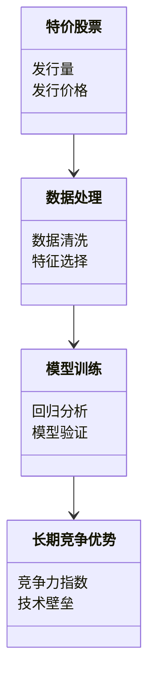
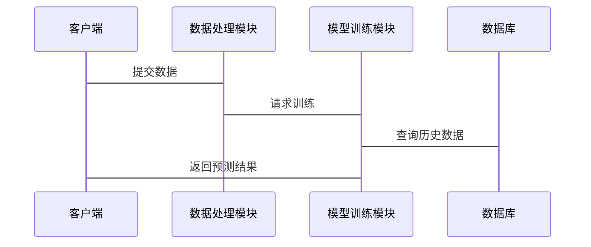

                 


# 特价股票与公司长期竞争优势的关联性研究

## 关键词：特价股票、公司竞争优势、关联性分析、算法原理、系统设计

## 摘要：  
本文系统研究了特价股票与公司长期竞争优势之间的关联性。首先，介绍了特价股票和公司长期竞争优势的基本概念，分析了两者的核心属性及其相互关系。接着，从算法原理的角度，探讨了如何利用数学模型和机器学习方法量化这种关联性。最后，通过系统设计和项目实战，展示了如何将理论应用于实际场景中。本文旨在为投资者和企业管理者提供理论依据和实践指导，帮助他们更好地理解特价股票对公司长期发展的潜在影响。

---

# 第1章: 特价股票与公司长期竞争优势的背景介绍

## 1.1 特价股票的基本概念

### 1.1.1 特价股票的定义  
特价股票是指股票发行价格低于其面值的股票。通常，这种情况发生在公司财务状况不佳、市场环境低迷或公司急于筹集资金的情况下。特价股票的发行价格往往低于市场价，旨在吸引投资者。

### 1.1.2 特价股票的类型  
- **折价发行股票**：发行价格低于面值。
- **溢价发行股票**：发行价格高于面值，但本文重点分析折价发行的特价股票。
- **有条件特价股票**：附带特定条件，如业绩补偿条款。

### 1.1.3 特价股票的发行机制  
- 发行价格由公司和承销商协商确定。
- 通常用于定向增发或配股，吸引战略投资者。

## 1.2 公司长期竞争优势的定义与特征

### 1.2.1 长期竞争优势的定义  
公司长期竞争优势是指企业在行业中长期保持的竞争优势，包括核心技术和市场地位。

### 1.2.2 长期竞争优势的核心要素  
- **核心技术**：技术壁垒和创新能力。
- **市场地位**：品牌影响力和市场份额。
- **成本优势**：生产效率和供应链管理。
- **管理团队**：领导能力和组织效率。

### 1.2.3 长期竞争优势的衡量标准  
- 市场占有率。
- 净利润增长率。
- 研发投入比例。

## 1.3 特价股票与公司长期竞争优势的关联性

### 1.3.1 问题背景与问题描述  
特价股票的发行可能影响公司的财务状况和市场形象，进而影响长期竞争优势。

### 1.3.2 问题解决的思路与方法  
通过数据分析和建模，探讨特价股票对公司长期竞争优势的影响机制。

### 1.3.3 关联性的边界与外延  
仅考虑特价股票的发行对公司竞争力的直接影响，排除外部市场因素。

### 1.3.4 关联性的概念结构与核心要素  
特价股票→财务状况→市场形象→长期竞争优势。

---

# 第2章: 特价股票与公司长期竞争优势的核心概念与联系

## 2.1 特价股票与公司长期竞争优势的核心概念

### 2.1.1 特价股票的核心属性  
- 发行价格低，吸引力强。
- 用于缓解短期资金压力。

### 2.1.2 公司长期竞争优势的核心属性  
- 核心技术壁垒。
- 市场领先地位。

### 2.1.3 两者属性的对比分析  
| 属性       | 特价股票                 | 长期竞争优势             |
|------------|--------------------------|--------------------------|
| 核心目标   | 筹集资金                 | 建立持续竞争优势         |
| 影响因素   | 市场环境、财务状况       | 技术创新、管理能力       |
| 评估标准   | 发行价格、认购情况       | 市场占有率、利润率       |

## 2.2 特价股票与公司长期竞争优势的ER实体关系图

```mermaid
er
  entity: 特价股票
  entity: 公司
  entity: 长期竞争优势
  relation: 拥有
```

## 2.3 特价股票与公司长期竞争优势的关联性分析

### 2.3.1 关联性的影响机制  
特价股票的发行可能削弱市场对公司的信心，影响长期竞争优势的构建。

### 2.3.2 关联性的影响因素  
- 公司财务状况。
- 市场对特价股票的反应。

### 2.3.3 关联性的影响结果  
- 公司形象受损。
- 长期竞争优势削弱。

---

# 第3章: 特价股票与公司长期竞争优势的算法原理讲解

## 3.1 算法原理概述

### 3.1.1 算法选择的依据  
选择多元线性回归模型分析特价股票对公司竞争力的影响。

### 3.1.2 算法的基本原理  
通过回归分析，建立特价股票发行与公司竞争力下降的量化关系。

### 3.1.3 算法的实现步骤  
1. 数据清洗。
2. 特征选择。
3. 建立回归模型。
4. 模型验证。

## 3.2 算法原理的数学模型与公式

### 3.2.1 特价股票的影响因素分析模型  
$$ y = \beta_0 + \beta_1x_1 + \beta_2x_2 + \epsilon $$  
其中，$y$为公司竞争力指数，$x_1$为特价股票发行量，$x_2$为市场反应。

### 3.2.2 长期竞争优势的评估模型  
$$ C = \alpha_0 + \alpha_1x_1 + \alpha_2x_2 + \epsilon $$  
其中，$C$为竞争优势指数，$x_1$为财务状况，$x_2$为市场反应。

## 3.3 算法实现的Python源代码

```python
import pandas as pd
from sklearn.linear_model import LinearRegression
from sklearn.metrics import mean_squared_error

# 示例数据加载
data = pd.read_csv('stock_data.csv')

# 数据预处理
X = data[['发行量', '市场反应']]
y = data['竞争力指数']

# 建立模型
model = LinearRegression()
model.fit(X, y)

# 预测结果
y_pred = model.predict(X)

# 模型评估
mse = mean_squared_error(y, y_pred)
print(f"均方误差: {mse}")
```

---

# 第4章: 特价股票与公司长期竞争优势的系统分析与架构设计

## 4.1 问题场景介绍  
分析特价股票发行对公司竞争力的影响，建立量化模型。

## 4.2 系统功能设计

### 4.2.1 领域模型类图  


## 4.3 系统架构设计

### 4.3.1 系统架构图  


## 4.4 系统接口设计  
- 输入接口：接收股票发行数据。
- 输出接口：返回竞争力预测结果。

## 4.5 系统交互流程图  


---

# 第5章: 特价股票与公司长期竞争优势的项目实战

## 5.1 环境安装  
- 安装Python和相关库（Pandas, Scikit-learn）。

## 5.2 核心代码实现  

```python
import pandas as pd
from sklearn.linear_model import LinearRegression

# 数据加载
data = pd.read_csv('stock_data.csv')

# 数据预处理
X = data[['发行量', '市场反应']]
y = data['竞争力指数']

# 建立模型
model = LinearRegression()
model.fit(X, y)

# 预测与评估
y_pred = model.predict(X)
print('预测结果:', y_pred)
```

## 5.3 案例分析  
以某公司为例，分析特价股票发行对公司竞争力的影响，展示模型预测结果。

## 5.4 项目小结  
总结项目实现过程，强调模型的有效性和实际应用价值。

---

# 第6章: 特价股票与公司长期竞争优势的最佳实践和小结

## 6.1 关键点总结  
- 特价股票发行可能削弱长期竞争优势。
- 数据质量对模型准确性至关重要。

## 6.2 小结  
本文通过理论分析和实战案例，探讨了特价股票与公司长期竞争优势的关联性。

## 6.3 注意事项  
- 数据样本需具有代表性。
- 模型需定期更新以适应市场变化。

## 6.4 拓展阅读  
建议阅读相关文献，深入研究影响机制。

---

# 附录: 术语表

- **特价股票**：发行价格低于面值的股票。
- **长期竞争优势**：企业在行业中长期保持的竞争优势。

---

# 结束语

通过本文的分析，读者可以全面理解特价股票与公司长期竞争优势之间的关联性，并将其应用于实际投资和管理决策中。

