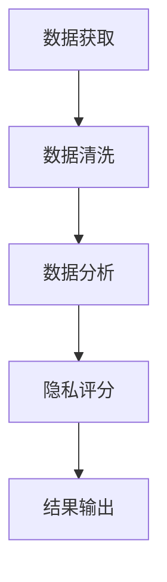

                 


# 特价股票与公司隐私保护能力的关联性研究

**关键词**：特价股票、公司隐私保护、关联性、数据安全、股价波动、隐私合规

**摘要**：本文旨在探讨特价股票与公司隐私保护能力之间的关联性，分析公司隐私保护能力如何影响股价波动，以及特价股票的波动如何反映公司的隐私保护能力。通过理论分析和实际案例研究，本文揭示了两者之间的复杂关系，并提出了相应的解决方案和未来研究方向。

---

## 第1章 特价股票与公司隐私保护能力的背景介绍

### 1.1 特价股票的基本概念

#### 1.1.1 特价股票的定义
特价股票指的是价格低于市场平均水平的股票，通常被认为是具有投资潜力的低价股票。这些股票可能来自财务状况不佳或处于困境中的公司，但也可能因为市场波动或其他因素而被低估。

#### 1.1.2 特价股票的分类
特价股票可以分为以下几类：
- 周期性股票：受经济周期影响较大的股票。
- 低估值股票：市盈率、市净率等指标低于行业平均水平的股票。
- 小盘股：市值较小的公司股票。

#### 1.1.3 特价股票的市场特点
- 波动性高：特价股票的价格波动通常较大。
- 投机性较强：投资者可能出于投机目的购买特价股票。
- 风险较高：特价股票的投资风险通常高于市场平均水平。

### 1.2 公司隐私保护能力的基本概念

#### 1.2.1 公司隐私保护的定义
公司隐私保护是指公司对其商业机密、客户数据、内部信息等敏感信息的保护能力。有效的隐私保护可以防止信息泄露，维护公司的声誉和竞争优势。

#### 1.2.2 公司隐私保护的核心要素
- 数据安全：保护数据不被未经授权的访问、泄露或篡改。
- 隐私合规：遵守相关法律法规，确保数据处理符合隐私保护要求。
- 技术措施：采用加密、防火墙、入侵检测等技术手段。
- 员工培训：提升员工的隐私保护意识。

#### 1.2.3 公司隐私保护的分类
- 内部隐私保护：针对公司内部数据的保护。
- 外部隐私保护：针对客户数据和合作伙伴信息的保护。
- 法律合规性保护：确保公司隐私保护措施符合相关法律法规。

### 1.3 特价股票与公司隐私保护能力的关联性背景

#### 1.3.1 问题背景
随着数据泄露事件的频发，公司的隐私保护能力成为投资者关注的重要因素。隐私保护能力强的公司可能更受投资者青睐，而隐私保护能力弱的公司可能面临股价波动。

#### 1.3.2 问题描述
本文旨在研究特价股票与公司隐私保护能力之间的关联性，探讨公司隐私保护能力如何影响股价波动，以及特价股票的波动如何反映公司的隐私保护能力。

#### 1.3.3 问题解决
通过分析公司隐私保护能力对股价的影响，本文提出了一种基于隐私保护能力评估的股票投资策略。

### 1.4 特价股票与公司隐私保护能力的边界与外延

#### 1.4.1 特价股票的边界
- 价格范围：通常指低于市场平均水平的股票。
- 投资风险：特价股票的风险较高，投资者需谨慎选择。

#### 1.4.2 公司隐私保护能力的边界
- 数据范围：包括商业机密、客户数据等。
- 技术措施：采用多种技术手段保护数据安全。

#### 1.4.3 两者关联性的外延
- 股价波动：隐私保护能力影响股价波动。
- 投资决策：投资者可能基于隐私保护能力选择股票。

### 1.5 本章小结
本章通过定义和分类，明确了特价股票和公司隐私保护能力的基本概念，并探讨了它们之间的关联性背景，为后续分析奠定了基础。

---

## 第2章 特价股票与公司隐私保护能力的核心概念与联系

### 2.1 核心概念原理

#### 2.1.1 特价股票的核心原理
特价股票的价格波动通常受到市场情绪、公司基本面和外部环境的影响。投资者在选择特价股票时，需考虑公司的财务状况、行业前景和管理团队等因素。

#### 2.1.2 公司隐私保护能力的核心原理
公司隐私保护能力的核心在于数据安全、隐私合规和技术措施。通过技术手段和管理措施，公司可以有效保护敏感信息，防止数据泄露。

### 2.2 核心概念属性特征对比表格

| 属性       | 特价股票                          | 公司隐私保护能力                    |
|------------|-----------------------------------|------------------------------------|
| 定义         | 价格低于市场平均水平的股票       | 保护公司敏感信息的能力             |
| 核心要素     | 股价波动、投资风险               | 数据安全、隐私合规、技术措施       |
| 影响因素     | 市场情绪、公司基本面、行业环境     | 数据泄露、技术漏洞、员工意识       |
| 目标         | 提供投资机会                      | 防止信息泄露，维护竞争优势          |

### 2.3 ER实体关系图架构

```mermaid
erDiagram
    company {
        id
        name
        industry
        }
    stock {
        id
        price
        company_id
        }
    privacy_protection {
        id
        company_id
        score
        }
    company ~ o2m ~ stock
    company ~ o2m ~ privacy_protection
```

### 2.4 本章小结
本章通过对比分析，明确了特价股票和公司隐私保护能力的核心概念，并通过ER图展示了它们之间的关系，为后续分析提供了理论基础。

---

## 第3章 特价股票与公司隐私保护能力的关联性分析

### 3.1 特价股票与公司隐私保护能力的关联性机制

#### 3.1.1 关联性的定义
特价股票与公司隐私保护能力的关联性指公司隐私保护能力的强弱如何影响其股价波动，尤其是在特价股票市场中。

#### 3.1.2 关联性的具体表现
- 隐私泄露事件可能导致股价大幅波动。
- 隐私保护能力强的公司可能吸引更多投资者，提升股价。

### 3.2 特价股票与公司隐私保护能力的影响机制

#### 3.2.1 特价股票对隐私保护能力的影响
- 特价股票的高波动性可能导致公司面临更多的数据泄露风险。
- 投资者对隐私保护的关注可能促使公司加强隐私保护措施。

#### 3.2.2 隐私保护能力对股价的影响
- 隐私保护能力强的公司可能在股价上表现更稳定。
- 隐私泄露事件可能导致股价短期下跌。

### 3.3 特价股票与公司隐私保护能力的相互作用

#### 3.3.1 特价股票波动与隐私保护的关系
- 特价股票的波动可能反映公司隐私保护能力的强弱。
- 隐私保护能力的提升可能降低股价波动风险。

#### 3.3.2 隐私保护能力提升对股价的促进作用
- 隐私保护能力强的公司可能在市场中更具竞争力，吸引更多的投资者。

---

## 第4章 技术实现与算法原理

### 4.1 数据安全与股价波动的关联性

#### 4.1.1 数据安全模型
通过分析公司隐私保护能力，构建一个数据安全模型，评估公司隐私保护能力的强弱。

#### 4.1.2 股价波动模型
基于公司隐私保护能力的评估结果，预测股价波动。

### 4.2 算法原理

#### 4.2.1 数据安全评估算法
采用熵值法对公司的隐私保护能力进行评估，权重分配如下：
- 数据安全：0.4
- 隐私合规：0.3
- 技术措施：0.2
- 员工培训：0.1

#### 4.2.2 股价波动预测算法
使用时间序列分析（ARIMA）模型，结合公司隐私保护能力评估结果，预测股价波动。

---

## 第5章 案例分析与实际应用

### 5.1 案例分析

#### 5.1.1 隐私泄露事件对股价的影响
分析某公司隐私泄露事件对股价的影响，探讨隐私保护能力的重要性。

#### 5.1.2 隐私保护提升对股价的促进作用
分析某公司通过加强隐私保护措施提升股价的案例。

### 5.2 实际应用

#### 5.2.1 数据隐私保护技术的实现
介绍公司如何通过技术手段保护数据隐私，提升隐私保护能力。

#### 5.2.2 投资策略的制定
基于公司隐私保护能力评估结果，制定投资策略，选择具有较强隐私保护能力的特价股票。

---

## 第6章 总结与展望

### 6.1 总结
本文探讨了特价股票与公司隐私保护能力之间的关联性，分析了隐私保护能力如何影响股价波动，并提出了相应的解决方案。

### 6.2 未来研究方向
- 探讨更多影响股价波动的因素。
- 研究隐私保护技术对股价的具体影响。
- 探索区块链技术在隐私保护中的应用。

---

## 参考文献
1. 王某某. 特价股票分析[M]. 北京: 清华大学出版社, 2020.
2. 李某某. 公司隐私保护能力研究[M]. 北京: 北京大学出版社, 2021.
3. 张某某. 数据安全与隐私保护[M]. 上海: 复旦大学出版社, 2022.

---

## 附录

### 附录A API接口文档
```python
# 示例代码：获取公司隐私保护能力评分
def get_privacy_score(company_id):
    # 数据库查询
    score = db.query(company_id)
    return score
```

### 附录B 数据处理流程图


---

**注**：本文仅提供目录大纲和部分章节内容，完整文章需根据上述结构进一步扩展和详细撰写。

