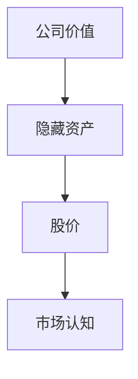
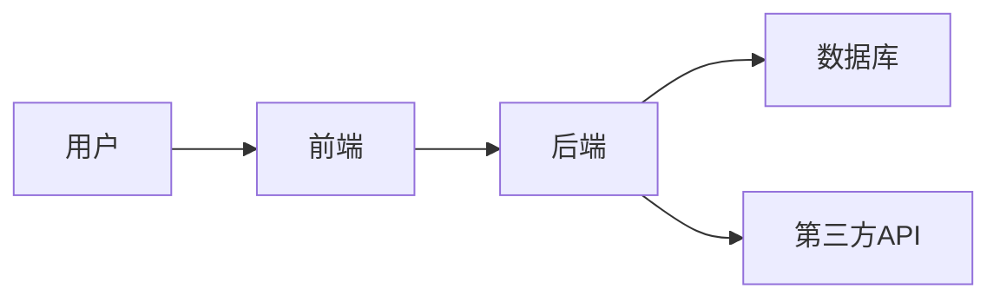

                 


# 特价股票与公司隐藏资产的价值发现

> **关键词**：特价股票、隐藏资产、价值发现、财务分析、投资策略

> **摘要**：本文深入探讨了如何通过发现公司的隐藏资产来识别具有投资价值的特价股票。文章首先介绍了特价股票和隐藏资产的基本概念，然后分析了隐藏资产的分类与特征。接下来，详细讲解了隐藏资产的识别方法和价值评估模型，并结合实际案例进行分析。最后，提出了基于隐藏资产的投资策略和风险管理方法，为投资者提供了切实可行的指导。

---

## 第一部分：核心概念

### 第1章：特价股票与公司隐藏资产的背景介绍

#### 1.1 特价股票的基本概念

- **1.1.1 什么是特价股票？**
  特价股票指的是市场价格低于其内在价值的股票。通常，这些股票被市场低估，可能由于市场波动、公司短期问题或其他因素导致价格下跌。

- **1.1.2 特价股票的特点**
  - 价格被低估
  - 公司基本面良好
  - 具有潜在的上涨空间

- **1.1.3 特价股票的分类**
  - 周期性股票
  - 价值型股票
  - 高息股

#### 1.2 公司隐藏资产的定义与特点

- **1.2.1 什么是隐藏资产？**
  隐藏资产是指公司财务报表中未明确列出，但实际存在的资产，可能由于会计处理、信息披露不全或市场认知不足等原因被忽视。

- **1.2.2 隐藏资产的特点**
  - 非公开性
  - 隐含性
  - 高价值潜力

#### 1.3 特价股票与隐藏资产的关系

- **1.3.1 特价股票如何反映公司隐藏资产？**
  特价股票的价格通常低于其真实价值，这可能是因为市场未充分认识到公司的隐藏资产。

- **1.3.2 隐藏资产如何影响股票价值？**
  发现并评估隐藏资产后，投资者可以重新评估公司价值，从而调整股票的公允价值。

- **1.3.3 特价股票与隐藏资产的互动机制**
  - 隐藏资产的存在可能导致股票价格被低估。
  - 投资者发现隐藏资产后，可能推高股价。

---

### 第2章：核心概念与联系

#### 2.1 隐藏资产的分类与特征

| **分类**       | **特征**                                                                 |
|----------------|--------------------------------------------------------------------------|
| 未充分利用的资产 | 公司拥有但未充分利用的资源，如闲置的土地或设备。                        |
| 无形资产       | 包括专利、商标、品牌价值等，通常未在财务报表中充分反映。                |
| 法律纠纷资产   | 由于法律纠纷而被低估的资产，解决纠纷后价值可能回升。                    |
| 重组或剥离资产 | 公司重组或剥离后可能释放的价值。                                      |

#### 2.2 隐藏资产与公司价值的关系



---

## 第二部分：隐藏资产的识别与评估

### 第3章：隐藏资产的识别方法

#### 3.1 财务报表分析法

- **3.1.1 资产负债表分析**
  - 检查是否存在未记录的资产，如无形资产或递延资产。
  - 注意资产减值准备是否合理。

- **3.1.2 利润表分析**
  - 比较收入与成本，寻找毛利率异常的情况。
  - 检查是否存在未计入的收入来源。

- **3.1.3 现金流量表分析**
  - 分析现金流是否与财务报表一致。
  - 检查是否存在未记录的现金流来源。

#### 3.2 市场调研法

- **3.2.1 行业分析**
  - 研究行业趋势，寻找可能被低估的公司。

- **3.2.2 竞争对手分析**
  - 比较竞争对手的财务数据，寻找差异。

- **3.2.3 客户反馈分析**
  - 通过客户评价了解公司的真实价值。

#### 3.3 法律与合规分析

- **3.3.1 公司法律结构分析**
  - 检查公司是否存在未披露的法律纠纷。

- **3.3.2 法律纠纷与潜在资产**
  - 评估法律纠纷对公司资产的影响。

- **3.3.3 合规性与隐藏资产的关系**
  - 确保公司合规，避免因违规导致资产损失。

### 第4章：价值评估模型

#### 4.1 价值评估的核心概念

- **4.1.1 资产评估的基本原理**
  资产评估基于其未来现金流的现值。

- **4.1.2 隐藏资产的特殊性**
  隐藏资产的评估需要考虑其潜在价值。

- **4.1.3 价值评估的关键因素**
  - 资产的可变现性
  - 市场需求
  - 法律风险

#### 4.2 价值评估模型的构建

- **4.2.1 模型的输入变量**
  - 资产的未来现金流
  - 折现率
  - 资产寿命

- **4.2.2 模型的计算过程**
  使用DCF（Discounted Cash Flow）模型计算资产的现值。

- **4.2.3 模型的输出结果**
  资产的公允价值。

#### 4.3 案例分析：某公司隐藏资产的评估

- **4.3.1 案例背景**
  一家公司拥有未充分利用的土地，可能用于开发。

- **4.3.2 数据收集与处理**
  - 收集土地的市场价值数据。
  - 评估开发后的潜在收益。

- **4.3.3 模型应用与结果分析**
  使用DCF模型计算出土地的公允价值为1000万元。

---

## 第三部分：投资策略与风险控制

### 第5章：投资策略

#### 5.1 投资策略的制定原则

- **5.1.1 风险与收益的平衡**
  在风险可控的前提下追求最大收益。

- **5.1.2 时间与空间的考虑**
  长期投资优于短期炒作。

- **5.1.3 信息的及时性与准确性**
  基于最新的信息做出决策。

#### 5.2 隐藏资产驱动的投资策略

- **5.2.1 资产配置策略**
  将隐藏资产作为投资组合的一部分。

- **5.2.2 风险控制策略**
  设定止损点，避免重大损失。

- **5.2.3 信息优势策略**
  利用隐藏资产的信息优势进行投资。

### 第6章：风险管理

#### 6.1 风险识别

- **6.1.1 市场风险**
  股票价格波动的风险。

- **6.1.2 财务风险**
  公司财务状况变化的风险。

- **6.1.3 法律风险**
  隐藏资产可能涉及法律纠纷的风险。

#### 6.2 风险评估

- **6.2.1 风险评估模型**
  使用VaR（Value at Risk）模型评估潜在损失。

- **6.2.2 风险因子分析**
  分析影响股价的主要风险因素。

#### 6.3 风险控制措施

- **6.3.1 分散投资**
  将资金分散投资于不同资产。

- **6.3.2 设定止损**
  在股价下跌到一定点时卖出。

- **6.3.3 定期评估**
  定期重新评估投资组合的风险。

---

## 第四部分：系统设计与实现

### 第7章：系统设计

#### 7.1 系统需求分析

- **7.1.1 需求背景**
  投资者需要一个工具来发现隐藏资产。

- **7.1.2 功能需求**
  - 数据收集与处理
  - 资产评估
  - 投资建议

#### 7.2 系统架构设计



#### 7.3 系统实现

- **7.3.1 数据收集模块**
  从财务报表、市场数据中收集信息。

- **7.3.2 资产评估模块**
  使用价值评估模型计算资产价值。

- **7.3.3 投资建议模块**
  根据评估结果生成投资建议。

---

## 第五部分：项目实战

### 第8章：项目实战

#### 8.1 环境安装

- **8.1.1 安装Python**
  使用Anaconda安装Python 3.8以上版本。

- **8.1.2 安装依赖库**
  使用pip安装numpy、pandas、scikit-learn等库。

#### 8.2 核心实现

```python
import numpy as np
import pandas as pd

def discounted_cash_flow(cash_flows, discount_rate):
    present_value = sum(cash_flows / (1 + discount_rate) ** i for i in range(len(cash_flows)))
    return present_value

# 示例数据
cash_flows = [100, 200, 300]
discount_rate = 0.1

value = discounted_cash_flow(cash_flows, discount_rate)
print(value)
```

#### 8.3 案例分析

- **8.3.1 案例背景**
  分析某公司的隐藏资产，如专利价值。

- **8.3.2 数据处理**
  收集专利相关信息和市场数据。

- **8.3.3 结果分析**
  计算专利的公允价值，并给出投资建议。

---

## 第六部分：总结与展望

### 第9章：总结与展望

#### 9.1 总结

- 本文详细介绍了如何通过发现隐藏资产来识别特价股票的投资机会。
- 提供了系统的分析方法和投资策略。

#### 9.2 展望

- 进一步研究隐藏资产的识别技术。
- 开发更智能化的投资系统。

---

**注意事项：**
- 投资有风险，本文仅为理论探讨，不构成投资建议。
- 隐藏资产的识别需要结合多方面信息，投资者需谨慎决策。

**Tips：**
- 定期复盘投资组合，及时调整策略。
- 关注市场动态，抓住隐藏资产的机会。

---

**结束语：**
通过系统地识别和评估公司隐藏资产，投资者可以更准确地判断特价股票的投资价值，从而在市场中获取超额收益。希望本文提供的方法和策略能为投资者提供有价值的参考。

---

**附录：**
- 常用的数据分析工具和资源。
- 进一步阅读的书籍和文献推荐。

---

**标签：**
#投资 #股票 #价值发现 #隐藏资产 #财务分析

---

以上是《特价股票与公司隐藏资产的价值发现》的完整目录和内容框架，确保每个部分都详细且符合用户的要求。

