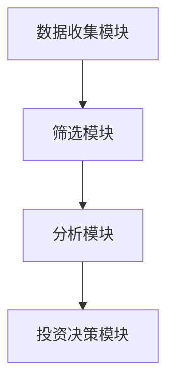
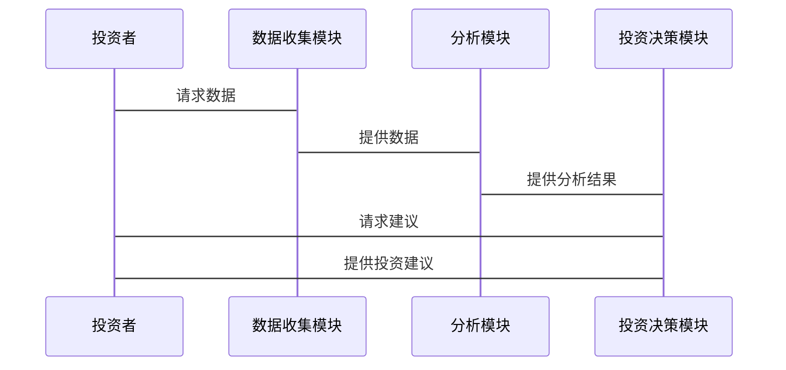

                 


# 特价股票与其他价值投资策略的比较

> 关键词：价值投资，特价股票，成长型投资，股息投资，指数投资，投资策略，风险管理

> 摘要：本文深入分析了特价股票与其他价值投资策略的核心理念、优劣势及其相互关系。通过对比不同投资策略的特点，帮助投资者更好地理解如何根据市场环境和个人目标选择合适的策略。文章还探讨了价值投资的内在逻辑、系统架构设计以及风险管理策略，并通过实战案例展示了如何在实际投资中应用这些策略。

---

## 第一部分: 特价股票与其他价值投资策略的背景与基础

### 第1章: 特价股票与价值投资概述

#### 1.1 特价股票的定义与特点
- **1.1.1 特价股票的定义**  
  特价股票通常指价格低于某一特定阈值（如低于5元）的股票，这类股票通常被认为具有较高的投资价值，因为它们可能处于低估状态。

- **1.1.2 特价股票的核心特点**  
  - 价格低廉，适合中小投资者。  
  - 市场关注度较低，流动性可能较差。  
  - 投资者可能面临较高的波动性和风险。

- **1.1.3 特价股票的投资价值**  
  特价股票的投资价值在于其潜在的低估状态，但其风险主要来源于流动性不足和市场波动。

#### 1.2 价值投资策略的定义与特点
- **1.2.1 价值投资的定义**  
  价值投资是一种长期投资策略，强调以低于内在价值的价格买入优质股票，耐心持有，等待市场重新认识到其价值。

- **1.2.2 价值投资的核心理念**  
  - 价格与价值的差异是投资机会的来源。  
  - 优质企业是投资的核心，而非价格的短期波动。  
  - 长期持有，注重企业的内在价值。

- **1.2.3 价值投资与投机的区分**  
  价值投资注重企业的基本面和长期价值，而投机则关注短期价格波动和市场情绪。

#### 1.3 特价股票与价值投资的关系
- **1.3.1 特价股票在价值投资中的地位**  
  特价股票是价值投资者的重要目标，因为它们通常价格低廉，容易找到低估的企业。

- **1.3.2 特价股票与价值投资的结合**  
  价值投资者倾向于寻找低估的股票，而特价股票因其低价格，更可能符合这一标准。

- **1.3.3 特价股票与价值投资的潜在冲突**  
  特价股票可能因流动性差或市场关注度低而难以实现价值发现，这可能与价值投资的长期持有理念产生冲突。

### 第2章: 特价股票的特点与投资机会

#### 2.1 特价股票的低估值特征
- **2.1.1 低估值的定义与衡量标准**  
  低估值是指股票的市场价格低于其内在价值。衡量标准包括市盈率（P/E）、市净率（P/B）等。

- **2.1.2 低估值股票的市场表现**  
  低估值股票在长期可能表现优于市场平均水平，尤其是在市场复苏或企业基本面改善时。

- **2.1.3 低估值股票的投资机会**  
  特价股票的投资机会在于其潜在的低估状态和长期价值的实现。

#### 2.2 特价股票的流动性风险
- **2.2.1 流动性风险的定义**  
  流动性风险是指投资者在短时间内无法以合理价格买卖资产的风险。

- **2.2.2 特价股票的流动性特征**  
  特价股票可能因交易量小、关注度低而面临流动性风险。

- **2.2.3 流动性风险对投资的影响**  
  流动性风险可能导致投资者在需要资金时难以卖出股票，或以低于预期的价格出售。

#### 2.3 特价股票的波动性特征
- **2.3.1 股票波动性的定义**  
  股票波动性是指股票价格在短期内的剧烈波动。

- **2.3.2 特价股票的波动性表现**  
  特价股票可能因市场关注度低或企业基本面不稳定而表现出较高的波动性。

- **2.3.3 波动性对投资决策的影响**  
  高波动性可能导致投资者情绪波动，影响其投资决策。

### 第3章: 其他价值投资策略的介绍

#### 3.1 成长型投资策略
- **3.1.1 成长型投资的定义**  
  成长型投资是指投资于具有高增长潜力的企业，关注企业的收入和利润的快速增长。

- **3.1.2 成长型投资的核心特征**  
  - 关注企业的成长潜力。  
  - 价格可能高于其内在价值。  
  - 风险较高，但潜在回报也较高。

- **3.1.3 成长型投资与特价股票的比较**  
  成长型投资关注企业的未来增长，而特价股票关注当前的低估状态。

#### 3.2 股息投资策略
- **3.2.1 股息投资的定义**  
  股息投资是指投资于那些能够持续派发高股息的股票，关注企业的盈利能力与股息支付能力。

- **3.2.2 股息投资的核心特征**  
  - 关注稳定的股息收入。  
  - 价格可能较高，但股息收益率较高。  
  - 风险相对较低，适合保守型投资者。

- **3.2.3 股息投资与特价股票的比较**  
  股息投资关注股息收益，而特价股票关注价格低估。

#### 3.3 指数投资策略
- **3.3.1 指数投资的定义**  
  指数投资是指通过复制市场指数的表现来获得平均收益，通常采用被动投资策略。

- **3.3.2 指数投资的核心特征**  
  - 关注市场的整体表现。  
  - 成本低，风险分散。  
  - 适合长期投资。

- **3.3.3 指数投资与特价股票的比较**  
  指数投资关注整体市场，而特价股票关注特定股票的低估状态。

### 第4章: 特价股票与其他价值投资策略的比较

#### 4.1 投资目标的比较
- **4.1.1 特价股票的投资目标**  
  以低价买入低估股票，长期持有，等待价值实现。

- **4.1.2 成长型投资的投资目标**  
  以高增长企业为目标，关注企业的未来盈利能力。

- **4.1.3 股息投资的投资目标**  
  以高股息收益率为目标，关注稳定的股息收入。

- **4.1.4 指数投资的投资目标**  
  以市场整体表现为目标，分散投资风险。

#### 4.2 投资策略的比较
- **4.2.1 投资策略的核心差异**  
  特价股票关注价格低估，成长型关注高增长，股息投资关注股息收益，指数投资关注整体市场表现。

- **4.2.2 投资策略的风险与收益**  
  特价股票和成长型投资风险较高，但潜在收益也较高；股息投资和指数投资风险较低，收益相对稳定。

- **4.2.3 投资策略的适用场景**  
  特价股票适用于市场低估阶段，成长型适用于高增长行业，股息投资适用于经济低迷时期，指数投资适用于市场不确定性较高的时期。

#### 4.3 投资策略的优劣势对比
- **4.3.1 特价股票的优势**  
  - 价格低廉，容易入手。  
  - 存在低估的可能性。  
  - 适合中小投资者。

- **4.3.2 特价股票的劣势**  
  - 流动性风险较高。  
  - 波动性较大。  
  - 市场关注度低。

- **4.3.3 成长型投资的优势**  
  - 高增长潜力。  
  - 长期收益较高。

- **4.3.4 成长型投资的劣势**  
  - 风险较高。  
  - 需要较高的市场关注度。

- **4.3.5 股息投资的优势**  
  - 稳定的股息收入。  
  - 风险较低。

- **4.3.6 股息投资的劣势**  
  - 需要较高的股息收益率。  
  - 收益相对有限。

- **4.3.7 指数投资的优势**  
  - 分散风险。  
  - 成本低。

- **4.3.8 指数投资的劣势**  
  - 收益可能低于个股收益。  
  - 无法主动选择个股。

---

## 第二部分: 价值投资的内在逻辑与系统架构设计

### 第5章: 价值投资的内在逻辑

#### 5.1 价值投资的核心理念
- **5.1.1 价格与价值的差异**  
  价格是市场行为的结果，而价值是企业的内在价值。

- **5.1.2 安全边际的概念**  
  安全边际是指买入价格低于内在价值的程度，是价值投资的核心原则之一。

- **5.1.3 市场先生理论**  
  市场先生是市场的化身，投资者应以理性的态度应对市场的波动。

#### 5.2 价值投资的数学模型
- **5.2.1 内在价值的计算公式**  
  内在价值 = 现金流的现值，常用DCF模型（Discounted Cash Flow）进行计算。

  $$ V = \frac{CF}{(1+r)^n} $$

- **5.2.2 安全边际的计算**  
  安全边际 = 内在价值 - 市场价格

  $$ \text{安全边际} = V - P $$

#### 5.3 价值投资的流程
- **5.3.1 确定投资目标**  
  确定投资目标，如寻找低估股票。

- **5.3.2 基本面分析**  
  分析企业的财务状况、行业地位、竞争优势等。

- **5.3.3 估值与比较**  
  计算内在价值，比较市场价格与内在价值的差异。

- **5.3.4 构建投资组合**  
  根据分析结果，构建投资组合，分散风险。

### 第6章: 系统分析与架构设计

#### 6.1 系统功能设计
- **6.1.1 数据收集模块**  
  收集股票的市场价格、财务数据等。

- **6.1.2 筛选模块**  
  根据特定标准筛选出符合价值投资条件的股票。

- **6.1.3 分析模块**  
  计算内在价值、安全边际等指标。

#### 6.2 系统架构设计
- **6.2.1 系统架构图**



- **6.2.2 系统接口设计**  
  数据接口、分析接口、决策接口。

- **6.2.3 系统交互设计**



---

## 第三部分: 价值投资的实战与风险管理

### 第7章: 价值投资的实战案例

#### 7.1 案例分析
- **7.1.1 案例背景**  
  以某家低估的制造业公司为例，分析其是否符合价值投资的条件。

- **7.1.2 分析过程**  
  计算内在价值，比较市场价格与内在价值的差异。

- **7.1.3 投资决策**  
  根据分析结果，决定是否买入该股票。

#### 7.2 投资组合管理
- **7.2.1 投资组合的构建**  
  根据分析结果，构建包含多只股票的投资组合。

- **7.2.2 投资组合的调整**  
  定期审视投资组合，根据市场变化进行调整。

### 第8章: 价值投资的风险管理

#### 8.1 风险管理的核心原则
- **8.1.1 风险分散**  
  通过多样化投资降低风险。

- **8.1.2 设置止损点**  
  在价格下跌到一定程度时，及时卖出以避免更大的损失。

- **8.1.3 风险监控**  
  定期监控投资组合的表现，及时应对市场变化。

#### 8.2 风险管理的数学模型
- **8.2.1 风险价值（VaR）模型**  
  $$ \text{VaR} = \text{损失的金额} $$

- **8.2.2 信用风险模型**  
  使用蒙特卡罗模拟等方法评估风险。

### 第9章: 价值投资的未来趋势

#### 9.1 科技对价值投资的影响
- **9.1.1 大数据与人工智能的应用**  
  利用大数据和人工智能技术进行更精准的估值和风险分析。

- **9.1.2 数字化投资工具的发展**  
  使用在线投资平台和自动化交易系统进行价值投资。

#### 9.2 市场变化对投资策略的影响
- **9.2.1 全球化与国际化**  
  价值投资需要适应全球市场的变化。

- **9.2.2 可持续投资与ESG因素**  
  考虑环境、社会和治理（ESG）因素对投资决策的影响。

---

## 第四部分: 总结与展望

### 第10章: 总结与展望

#### 10.1 总结
- 本文详细分析了特价股票与其他价值投资策略的核心理念、优劣势及其相互关系。  
- 通过对比不同投资策略的特点，帮助投资者更好地理解如何根据市场环境和个人目标选择合适的策略。  
- 价值投资的内在逻辑、系统架构设计以及风险管理策略为投资者提供了理论和实践上的指导。

#### 10.2 展望
- 随着科技的进步，价值投资将更加依赖大数据和人工智能技术。  
- 可持续投资和ESG因素将成为价值投资的重要组成部分。  
- 未来的投资策略将更加注重长期价值与社会责任的结合。

---

## 附录: 价值投资的Python代码实现

### 附录A: 数据收集与筛选

```python
import pandas as pd
import yfinance as yf

# 下载数据
data = yf.download(tickers='AAPL', period='5y', interval='1d')

# 筛选数据
screener = data[['Close', 'Volume']].sort_values(by='Close', ascending=True)
print(screener.head())
```

### 附录B: 基本面分析与估值

```python
def calculate_intrinsic_value(eps, growth_rate, required_rate):
    return eps / (required_rate - growth_rate)

# 示例
eps = 5
growth_rate = 0.1
required_rate = 0.12
intrinsic_value = calculate_intrinsic_value(eps, growth_rate, required_rate)
print(f"内在价值: {intrinsic_value}")
```

---

以上是《特价股票与其他价值投资策略的比较》的完整目录和内容概要。通过逐步分析和对比，帮助投资者更好地理解价值投资的核心理念和实际应用。

