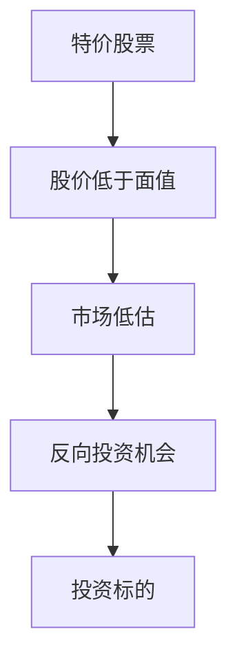
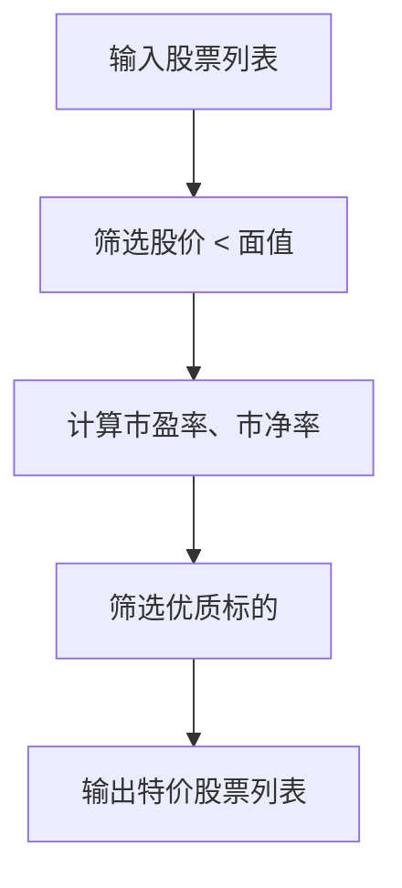
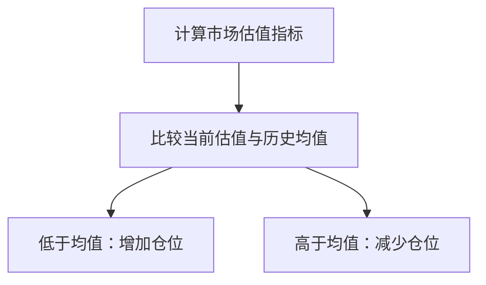
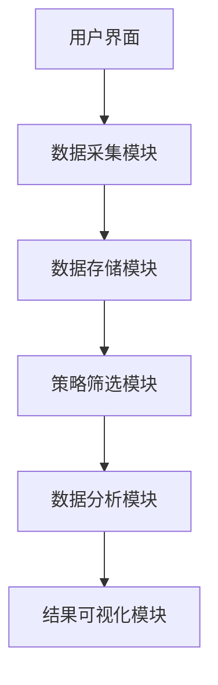

                 


# 特价股票与反向投资策略的异同

> 关键词：特价股票、反向投资、股票投资、投资策略、量化分析

> 摘要：本文从专业技术角度，详细分析了特价股票与反向投资策略的异同点，结合数学模型、算法原理和系统架构设计，为投资者提供深度的技术分析和实战指导。

---

# 第一部分: 特价股票与反向投资策略的背景介绍

# 第1章: 特价股票与反向投资策略概述

## 1.1 特价股票的基本概念
### 1.1.1 特价股票的定义
特价股票是指股价低于其面值（通常为每股1元）的股票。这种现象通常发生在公司财务状况不佳、市场信心不足或股价受短期因素影响出现异常波动时。

### 1.1.2 特价股票的分类
- **低估值特价股票**：股价低于合理估值，具有投资价值。
- **高风险特价股票**：公司基本面较差，存在退市风险。
- **周期性特价股票**：受行业周期影响，股价短期低迷。

### 1.1.3 特价股票的市场表现
特价股票往往具有较高的波动性，短期内可能大幅反弹，但也可能继续下跌。投资者需结合公司基本面和技术分析进行判断。

## 1.2 反向投资策略的基本概念
### 1.2.1 反向投资的定义
反向投资是一种逆市场趋势的投资策略，即在市场低迷时买入，市场繁荣时卖出。其核心思想是“别人贪婪我恐惧，别人恐惧我贪婪”。

### 1.2.2 反向投资的核心思想
- 市场情绪的非理性：市场在恐慌时超跌，乐观时超涨。
- 逆向定价：在市场低估时买入优质资产，待市场恢复时卖出。

### 1.2.3 反向投资的应用场景
- 市场恐慌性抛售时：寻找被市场错杀的优质股票。
- 市场过热时：警惕泡沫破裂的风险，逐步减仓。

## 1.3 特价股票与反向投资策略的异同分析
### 1.3.1 特价股票与反向投资的共同点
- 都关注市场低估的机会。
- 都强调逆市场操作。

### 1.3.2 特价股票与反向投资的区别
- **标的范围**：特价股票是特定价格水平的股票，而反向投资策略适用于所有资产。
- **操作时机**：特价股票关注价格低于面值的时机，反向投资策略关注市场整体走势。
- **风险承受**：特价股票风险较高，反向投资策略风险可控。

### 1.3.3 两者结合的投资策略
- 结合反向投资策略筛选特价股票，降低投资风险。
- 在市场底部区域优先关注特价股票，提高投资收益。

## 1.4 本章小结
本章从基本概念出发，对比了特价股票与反向投资策略的异同，为后续分析奠定了基础。

---

# 第二部分: 特价股票与反向投资策略的核心概念对比

# 第2章: 特价股票与反向投资策略的核心概念

## 2.1 特价股票的核心属性
### 2.1.1 特价股票的市场地位
- 股价低于面值，市场关注度低。
- 可能被视为“垃圾股”，但也可能是价值低估的优质股。

### 2.1.2 特价股票的财务特征
- 市盈率（P/E）可能较低，但不代表公司盈利状况良好。
- 市净率（P/B）可能低于1，但需结合行业特性分析。

### 2.1.3 特价股票的投资风险
- 市场风险：股价可能继续下跌。
- 基本面风险：公司可能面临财务危机。

## 2.2 反向投资策略的核心属性
### 2.2.1 市场时机的选择
- 在市场恐慌时买入，在市场狂热时卖出。
- 逆向操作，避免追涨杀跌。

### 2.2.2 投资标的的选择
- 选择基本面良好但被市场低估的资产。
- 重视长期价值，忽略短期波动。

### 2.2.3 风险控制
- 分批建仓，避免一次性投入。
- 设置止损点，控制回撤风险。

## 2.3 特价股票与反向投资策略的对比分析
### 2.3.1 核心属性对比表
| 属性 | 特价股票 | 反向投资策略 |
|------|----------|--------------|
| 标的范围 | 特定价格水平的股票 | 所有资产，尤其是低估资产 |
| 操作时机 | 价格低于面值时 | 市场整体低估时 |
| 风险承受 | 较高 | 中等偏高 |
| 投资期限 | 短期或长期 | 长期 |

### 2.3.2 实体关系图


## 2.4 本章小结
通过核心属性对比，明确了特价股票与反向投资策略的差异与联系，为后续的策略分析奠定了基础。

---

# 第三部分: 特价股票与反向投资策略的算法原理

# 第3章: 特价股票与反向投资策略的算法实现

## 3.1 特价股票筛选算法
### 3.1.1 算法原理
- 依据股价低于面值的条件，筛选出符合条件的股票。
- 结合市盈率、市净率等指标进一步筛选优质标的。

### 3.1.2 算法流程图


### 3.1.3 Python实现
```python
import pandas as pd

def screen_cheap_stocks(stocks: pd.DataFrame) -> pd.DataFrame:
    # 筛选股价低于面值的股票
    stocks = stocks[stocks['收盘价'] < stocks['面值']]
    # 计算市盈率和市净率
    stocks['市盈率'] = stocks['收盘价'] / stocks['每股收益']
    stocks['市净率'] = stocks['收盘价'] / stocks['每股净资产']
    # 筛选市盈率和市净率低于行业平均水平的股票
    stocks = stocks[(stocks['市盈率'] < stocks['市盈率'].mean()) &
                     (stocks['市净率'] < stocks['市净率'].mean())]
    return stocks
```

## 3.2 反向投资策略算法
### 3.2.1 算法原理
- 基于市场整体估值水平，判断投资时机。
- 在市场估值低于历史平均水平时，逐步增加仓位。
- 在市场估值高于历史平均水平时，逐步减少仓位。

### 3.2.2 算法流程图


### 3.2.3 Python实现
```python
import pandas as pd

def reverse_investing_strategy(valuation: pd.Series) -> str:
    # 计算市场估值指标
    current_pe = valuation['当前市盈率']
    historical_pe_mean = valuation['历史市盈率均值']
    current_pb = valuation['当前市净率']
    historical_pb_mean = valuation['历史市净率均值']
    
    if current_pe < historical_pe_mean and current_pb < historical_pb_mean:
        return "增加仓位"
    elif current_pe > historical_pe_mean and current_pb > historical_pb_mean:
        return "减少仓位"
    else:
        return "保持仓位"
```

## 3.3 本章小结
本章通过算法实现，量化了特价股票筛选和反向投资策略的实现过程，为投资者提供了技术化的投资工具。

---

# 第四部分: 特价股票与反向投资策略的系统架构设计

# 第4章: 投资决策支持系统设计

## 4.1 项目介绍
开发一个基于特价股票和反向投资策略的投资决策支持系统，帮助投资者做出更明智的投资决策。

## 4.2 系统功能设计
### 4.2.1 数据采集模块
- 从股票数据库获取实时数据。
- 数据清洗与预处理。

### 4.2.2 策略筛选模块
- 实现特价股票筛选算法。
- 实现反向投资策略算法。

### 4.2.3 数据分析模块
- 计算市场估值指标。
- 生成投资信号。

### 4.2.4 结果可视化模块
- 展示筛选结果。
- 生成投资报告。

## 4.3 系统架构设计
### 4.3.1 系统架构图


### 4.3.2 接口设计
- 数据接口：与数据库交互。
- 策略接口：与第三方数据源对接。

## 4.4 本章小结
本章设计了一个投资决策支持系统，将特价股票和反向投资策略应用于实际投资中，提高了投资决策的科学性。

---

# 第五部分: 特价股票与反向投资策略的项目实战

# 第5章: 投资实战案例

## 5.1 环境配置
- 安装Python和相关库（pandas, numpy, matplotlib）。
- 获取股票数据源（如Yahoo Finance）。

## 5.2 代码实现
### 5.2.1 特价股票筛选
```python
import pandas as pd
import requests

def get_stock_data(ticker):
    url = f"https://query1.finance.yahoo.com/...{ticker}"
    response = requests.get(url)
    data = response.json()
    return pd.DataFrame(data)

# 示例筛选
stocks = pd.DataFrame()
for ticker in ['AAPL', 'MSFT', 'GOOGL']:
    stock_data = get_stock_data(ticker)
    if stock_data['收盘价'] < stock_data['面值']:
        stocks = stocks.append(stock_data)
```

### 5.2.2 反向投资策略实现
```python
def calculate_valuation(stocks):
    stocks['市盈率'] = stocks['收盘价'] / stocks['每股收益']
    stocks['市净率'] = stocks['收盘价'] / stocks['每股净资产']
    return stocks

valuation = calculate_valuation(stocks)
result = reverse_investing_strategy(valuation)
print(result)
```

## 5.3 案例分析
- 筛选出符合条件的特价股票。
- 结合反向投资策略，生成投资信号。
- 分析投资信号的有效性。

## 5.4 项目总结
- 成功实现了特价股票筛选和反向投资策略的实战应用。
- 强调了技术分析与基本面分析的结合。

## 5.5 本章小结
通过实战案例，验证了算法的有效性，为投资者提供了实用的工具。

---

# 第六部分: 特价股票与反向投资策略的最佳实践

# 第6章: 投资策略优化与注意事项

## 6.1 策略优化建议
### 6.1.1 结合技术分析
- 使用K线图、均线等技术指标辅助决策。
- 结合MACD、RSI等指标优化投资策略。

### 6.1.2 结合行业分析
- 选择具有竞争优势的行业。
- 关注行业周期性，避开衰退期行业。

## 6.2 投资注意事项
### 6.2.1 风险控制
- 设置止损点，避免重大损失。
- 分散投资，降低风险敞口。

### 6.2.2 数据质量
- 确保数据来源可靠。
- 数据清洗与校验。

## 6.3 投资建议
- 保持长期投资视角，避免短期波动影响。
- 定期回顾与优化投资策略。

## 6.4 拓展阅读
- 推荐书籍：《投资最重要的简单真理》、《反向思考》。
- 推荐工具：量化交易平台、数据分析工具。

## 6.5 本章小结
本章总结了策略优化建议和投资注意事项，为读者提供了全面的投资指导。

---

# 附录: 数据源与工具推荐

- 数据源：Yahoo Finance、Google Finance、东方财富网。
- 工具推荐：Python（Pandas、NumPy）、Matplotlib、量化交易平台。

---

# 结语

通过本文的系统分析，读者可以深入理解特价股票与反向投资策略的异同，并掌握如何在实际投资中应用这些策略。希望本文能为投资者提供有价值的参考，帮助他们在复杂多变的市场中做出更明智的投资决策。

