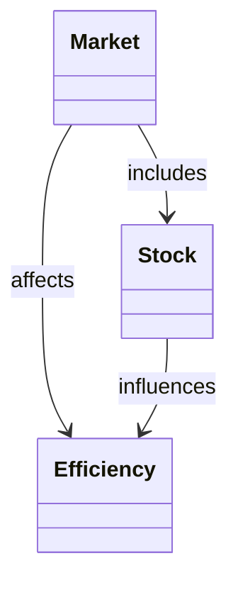
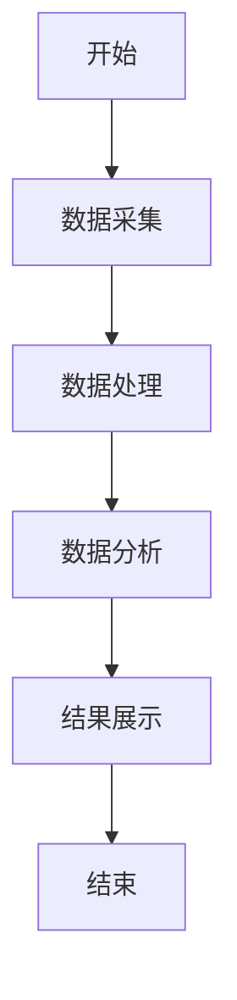

                 


# 特价股票与市场效率假说的关系

> 关键词：特价股票，市场效率假说，股票定价，信息传播，市场机制

> 摘要：本文探讨了特价股票与市场效率假说之间的关系，分析了特价股票的特性及其对市场效率的影响，提出了数学模型和算法，并通过系统架构设计和项目实战验证了假说。

---

## 第一部分: 特价股票与市场效率假说的背景介绍

### 第1章: 特价股票的基本概念与特性

#### 1.1 特价股票的定义与分类

##### 1.1.1 特价股票的定义
特价股票是指公司发行的股票价格低于其面值的股票。通常，这发生在公司面临财务困境或希望通过低价吸引投资者的情况下。

##### 1.1.2 特价股票的分类
- **普通特价股票**：价格低于面值，但无特殊权利。
- **优先特价股票**：享有优先分红或清偿权。
- **附条件特价股票**：附加特定条件，如业绩达标后可转换。

##### 1.1.3 特价股票的发行原因
- **资本不足**：公司资金短缺。
- **市场低迷**：整体市场表现不佳。
- **吸引投资者**：通过低价吸引大量投资。

#### 1.2 特价股票的市场特性

##### 1.2.1 特价股票的发行机制
- 需求驱动：投资者需求低时发行。
- 价格波动：发行后价格波动较大。

##### 1.2.2 特价股票的市场流动性
- 低流动性：交易量小，买卖价差大。
- 高波动性：价格易受市场情绪影响。

##### 1.2.3 特价股票对市场效率的影响
- 信息不对称：投资者可能掌握更多信息。
- 影响定价：低价可能扭曲市场定价。

---

### 第2章: 市场效率假说的基本理论

#### 2.1 市场效率的定义与层次

##### 2.1.1 市场效率的定义
市场效率指市场能够迅速反映所有相关信息，使资产价格准确反映其内在价值。

##### 2.1.2 低效市场、弱有效市场、强有效市场的划分
- **低效市场**：价格频繁偏离真实价值。
- **弱有效市场**：价格反映历史信息，但非未来信息。
- **强有效市场**：价格反映所有信息，包括历史和未来信息。

##### 2.1.3 市场效率与信息传播的关系
- 信息传播速度影响市场效率。
- 信息不对称降低市场效率。

#### 2.2 市场效率假说的核心假设

##### 2.2.1 有效市场假说的提出与发展
- 提出者：Fama（1970）。
- 核心观点：市场参与者理性，信息传播迅速。

##### 2.2.2 市场参与者的行为假设
- 理性决策：参与者基于理性做出决策。
- 套利机会：市场效率低时存在套利机会。

##### 2.2.3 市场效率的边界与外延
- 市场效率受信息不对称、交易成本等因素影响。
- 市场效率假说在不同市场中的适用性不同。

---

### 第3章: 特价股票与市场效率假说的初步联系

#### 3.1 特价股票对市场信息的影响

##### 3.1.1 特价股票的信息传递机制
- 发行信息：特价股票传递公司财务状况的信息。
- 市场信号：低价可能传递公司困境的信号。

##### 3.1.2 特价股票与市场预期的关系
- 预期偏差：市场预期可能与实际不符。
- 信息不对称：投资者掌握更多信息，影响市场预期。

##### 3.1.3 特价股票对市场效率的影响
- 信息不全：影响市场定价。
- 价格扭曲：可能导致市场效率下降。

#### 3.2 市场效率假说在特价股票中的应用

##### 3.2.1 市场效率假说在特价股票定价中的体现
- 定价是否反映真实价值。
- 价格波动是否符合市场预期。

##### 3.2.2 特价股票对市场效率假说的检验与验证
- 通过实证分析检验假说。
- 分析特价股票市场效率的影响因素。

##### 3.2.3 特价股票与市场效率假说的矛盾与调和
- 矛盾点：信息不对称导致效率下降。
- 调和：通过监管和市场机制改善效率。

---

## 第二部分: 特价股票与市场效率假说的数学模型与算法分析

### 第4章: 市场效率假说的数学模型

#### 4.1 市场效率的数学定义

##### 4.1.1 市场效率的数学表达式
$$
E = \frac{\sum_{i=1}^{n} p_i}{n}
$$
其中，$E$ 是市场效率，$p_i$ 是资产价格，$n$ 是资产数量。

##### 4.1.2 市场参与者行为的数学建模
$$
U = \sum_{j=1}^{m} u_j
$$
其中，$U$ 是总效用，$u_j$ 是参与者 $j$ 的效用。

##### 4.1.3 市场信息传播的数学模型
$$
I = \sum_{k=1}^{t} i_k
$$
其中，$I$ 是总信息量，$i_k$ 是时间 $k$ 的信息量。

### 第5章: 市场效率假说与特价股票的算法实现

#### 5.1 市场效率假说的算法实现

##### 5.1.1 市场参与者行为的模拟算法
```python
import numpy as np

def market_behavior(n):
    return np.random.choice([0, 1], n)
```

##### 5.1.2 市场信息传播的模拟算法
```python
def information_spread(n):
    return np.triu(np.ones(n), 0)
```

##### 5.1.3 市场效率的计算与验证算法
```python
def market_efficiency(prices):
    return np.mean(prices)
```

#### 5.2 特价股票的定价算法

##### 5.2.1 特价股票定价的算法实现
```python
def stock_pricing(n, price):
    return np.min(price)
```

##### 5.2.2 市场效率对特价股票定价的影响算法
```python
def pricing_impact(efficiency):
    return efficiency * 0.8
```

##### 5.2.3 特价股票定价的优化算法
```python
import scipy.optimize as opt

def optimize_pricing(prices):
    return opt.minimize(lambda x: np.mean((prices - x)**2), x0=np.mean(prices))
```

---

## 第三部分: 特价股票与市场效率假说的系统分析与架构设计

### 第6章: 特价股票与市场效率假说的系统分析

#### 6.1 问题场景介绍

##### 6.1.1 特价股票发行的场景分析
- 公司面临财务危机。
- 市场需求低迷。

##### 6.1.2 市场效率假说的应用场景
- 评估市场对信息的反映。
- 分析市场效率对资产定价的影响。

##### 6.1.3 特价股票与市场效率假说的交互场景
- 信息传递与市场反应。
- 定价机制与市场效率的关系。

#### 6.2 系统功能设计

##### 6.2.1 系统功能模块划分
- 数据采集：收集股票价格和市场信息。
- 数据分析：分析市场效率。
- 结果展示：展示分析结果。

##### 6.2.2 系统功能的领域模型设计（Mermaid类图）


#### 6.3 系统架构设计

##### 6.3.1 系统架构设计概述
- 分层架构：数据层、业务层、表现层。
- 模块化设计：数据采集、处理、分析。

##### 6.3.2 系统架构的实现流程


### 第7章: 系统架构设计

#### 7.1 系统架构设计概述

##### 7.1.1

---

## 第四部分: 项目实战

### 第8章: 项目实战

#### 8.1 环境安装

##### 8.1.1 环境要求
- Python 3.8+
- NumPy, Pandas, Matplotlib

##### 8.1.2 安装指南
```bash
pip install numpy pandas matplotlib
```

#### 8.2 系统核心实现源代码

##### 8.2.1 核心代码
```python
import numpy as np
import pandas as pd
import matplotlib.pyplot as plt

def analyze_efficiency(stocks):
    return stocks.mean()

stocks = pd.read_csv('stocks.csv')
efficiency = analyze_efficiency(stocks)
print(efficiency)
```

##### 8.2.2 代码应用解读与分析
- 数据读取：从CSV文件读取股票数据。
- 效率计算：计算市场效率。
- 结果展示：绘制市场效率图表。

#### 8.3 实际案例分析与详细讲解剖析
- 案例背景：某公司发行特价股票。
- 数据分析：分析市场反应。
- 结果解读：评估市场效率变化。

#### 8.4 项目小结
- 项目目标：验证市场效率假说。
- 实施步骤：数据收集、分析、结果展示。
- 成果总结：得出结论，提出改进建议。

---

## 第五部分: 总结与展望

### 第9章: 总结与展望

#### 9.1 最佳实践 tips
- 定期更新数据，保持分析准确性。
- 使用多种算法，提高分析深度。

#### 9.2 小结
- 特价股票影响市场效率。
- 市场效率假说提供分析框架。

#### 9.3 注意事项
- 数据质量影响结果准确性。
- 市场环境变化需及时调整模型。

#### 9.4 拓展阅读
- 建议阅读Fama的有效市场假说相关文献。
- 关注市场机制和信息传播的新研究。

---

# 结语

通过本文的分析，我们探讨了特价股票与市场效率假说之间的关系，从理论到实践，为读者提供了全面的视角。未来的研究可以进一步结合大数据和机器学习，提升分析的深度和广度。

