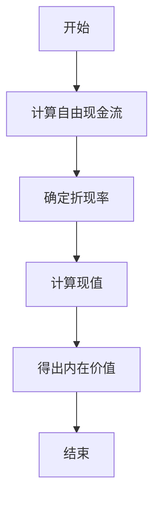
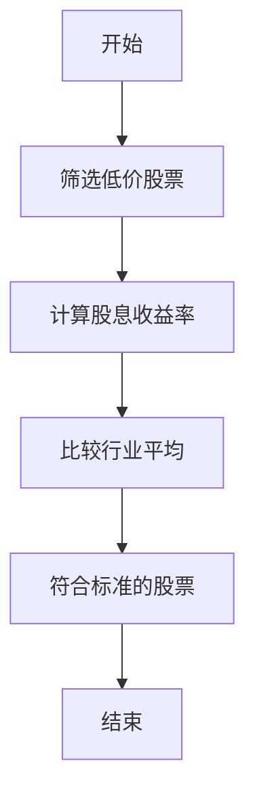
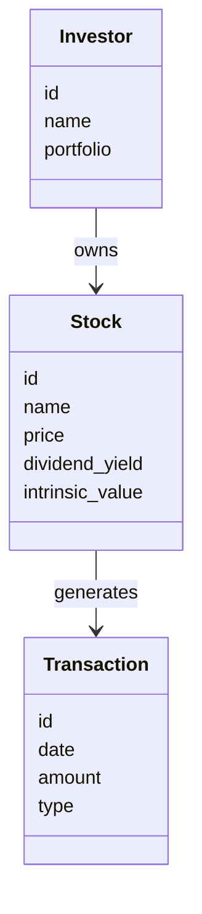
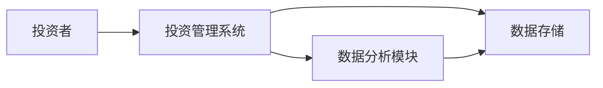
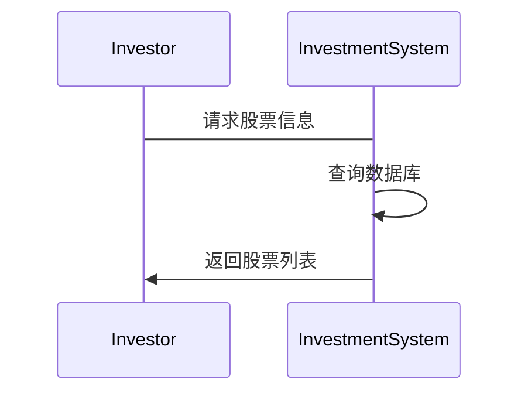

                 


```markdown
# 特价股票与股息投资策略的结合

## 关键词：特价股票、股息投资、股息收益率、内在价值评估、投资策略

## 摘要：  
本文深入探讨了特价股票与股息投资策略的结合，分析了两者的定义、特征及其结合的意义。通过数学模型和算法原理，详细讲解了如何评估特价股票的内在价值和计算股息收益率，结合实际案例和系统设计，展示了如何将理论应用于投资实践。最后，总结了最佳投资策略和注意事项，为读者提供了全面的指导。

---

# 第一部分: 特价股票与股息投资策略的背景与概念

## 1.1 特价股票的基本概念

### 1.1.1 什么是特价股票  
特价股票是指市场价格低于其内在价值的股票。这种低估通常源于市场短期波动、公司暂时困境或市场参与者对公司的误判。投资者通过识别这些低估股票，可以在市场回升时获得超额收益。

### 1.1.2 特价股票的特征  
- **低市盈率（P/E）**：市盈率低于行业平均水平，表明股票价格被低估。  
- **低市净率（P/B）**：股价相对于净资产价值较低，反映资产的低估。  
- **高股息率**：公司愿意将利润以股息形式返还给股东，表明公司盈利稳定且现金流充足。  

### 1.1.3 特价股票的投资价值  
- **潜在收益**：市场回归内在价值时，股价上涨空间大。  
- **风险较低**：低估股票通常具有较高的安全边际，降低投资风险。  

## 1.2 股息投资策略的基本概念  

### 1.2.1 股息投资的定义  
股息投资策略是指投资者选择那些能够稳定派发股息的公司进行投资，通过长期持有积累股息收入，实现财富增值。  

### 1.2.2 股息收益率的计算公式  
股息收益率 = 每股股息（Dividend per share, DPS） / 股票价格（Price per share）  

例如，某公司每股股息为1元，股价为10元，则股息收益率为10%。  

### 1.2.3 股息投资的优势与风险  
- **优势**：  
  - 稳定收入：股息收入为投资者提供持续现金流。  
  - 抗跌性：高分红公司通常具有较强的财务实力，在市场波动中表现相对稳定。  
- **风险**：  
  - 股息削减：公司可能因经营状况不佳而减少或取消股息。  
  - 市场波动：股息收益率受股价波动影响较大。  

## 1.3 特价股票与股息投资策略的结合  

### 1.3.1 结合的意义  
通过结合特价股票的低估值特性和股息投资的稳定收益，投资者可以在获取资本增值的同时，享受稳定的股息收入，实现收益与风险的双重优化。  

### 1.3.2 结合的核心要素  
- **低估股价**：选择市场价格低于内在价值的股票。  
- **高股息率**：优先考虑股息收益率高的公司。  
- **财务健康**：公司具有稳定的盈利能力和健康的财务状况。  

### 1.3.3 结合的适用场景  
- **熊市或市场低潮期**：此时更容易找到低估股票，同时股息收益率较高。  
- **价值投资者**：适合长期投资，追求安全边际和稳定收益的投资者。  

---

# 第二部分: 特价股票与股息投资策略的核心概念与联系

## 2.1 特价股票与股息投资的原理  

### 2.1.1 特价股票的内在价值评估  
内在价值是股票的合理价格，通常通过现金流折现模型（DCF）计算。  

#### 现金流折现模型（DCF）  
$$ \text{内在价值} = \frac{\text{自由现金流}}{\text{折现率}} $$  

例如，某公司自由现金流为100万元，折现率为8%，则内在价值为1250万元。  

### 2.1.2 股息投资的现金流模型  
股息投资的核心是通过股息再投资实现复利增长。  

$$ \text{股息再投资收益} = \text{股息收入} \times \text{投资收益} $$  

### 2.1.3 两者结合的数学模型  
综合考虑股价的低估和股息收益率，投资者可以通过以下公式筛选目标：  

$$ \text{目标股票} = \{ \text{股价} < \text{内在价值} \} \cap \{ \text{股息收益率} > \text{行业平均收益率} \} $$  

## 2.2 特价股票与股息投资的核心特征对比  

### 2.2.1 特价股票的特征  
| 特性 | 描述 |
|------|------|
| 低市盈率 | P/E < 行业平均 |
| 低市净率 | P/B < 行业平均 |
| 高股息率 | DPS/Price > 行业平均 |

### 2.2.2 股息投资的特征  
| 特性 | 描述 |
|------|------|
| 稳定股息收入 | 每股股息稳定或增长 |
| 高股息率 | 股息收益率高于市场平均水平 |
| 抗风险能力 | 公司财务状况健康，抗市场波动能力强 |

### 2.2.3 两者结合的特征  
| 特性 | 描述 |
|------|------|
| 低估股价 | 股价 < 内在价值 |
| 高股息率 | 股息收益率 > 行业平均 |
| 财务健康 | 公司盈利稳定，现金流充足 |

## 2.3 特价股票与股息投资的ER实体关系图  

```mermaid
erDiagram
    customer[National Investor] {
        key id: string
        stock: string
        dividend_yield: float
        intrinsic_value: float
    }
    company[Company] {
        id: string
        name: string
        dividend_per_share: float
        stock_price: float
        market_value: float
    }
    transaction[Investment Transaction] {
        id: string
        date: date
        amount: float
        type: string
    }
    customer --> company : owns
    company --> transaction : generates
```

---

# 第三部分: 特价股票与股息投资策略的算法原理

## 3.1 特价股票的内在价值评估算法  

### 3.1.1 现金流折现模型  



公式：  
$$ \text{内在价值} = \sum_{t=1}^{n} \frac{\text{CF}_t}{(1 + r)^t} $$  

其中，CF_t为第t年的自由现金流，r为折现率。  

### 3.1.2 市盈率与市净率分析  

- **市盈率（P/E）**：  
  $$ \text{P/E} = \frac{\text{股价}}{\text{每股收益}} $$  
- **市净率（P/B）**：  
  $$ \text{P/B} = \frac{\text{股价}}{\text{每股净资产}} $$  

## 3.2 股息收益率的计算算法  

公式：  
$$ \text{股息收益率} = \frac{\text{每股股息}}{\text{股价}} $$  

### 3.2.1 股息收益率的计算步骤  
1. 收集目标公司的每股股息数据。  
2. 获取目标公司的当前股价。  
3. 计算股息收益率，与行业平均水平比较。  

## 3.3 两者结合的算法流程  



---

# 第四部分: 系统分析与架构设计方案

## 4.1 系统功能设计  

### 4.1.1 领域模型  



### 4.1.2 系统架构设计  



## 4.2 系统接口设计  

- **API接口**：  
  - `GET /stocks`：获取所有股票信息。  
  - `GET /dividends`：获取股息数据。  

## 4.3 系统交互序列图  



---

# 第五部分: 项目实战

## 5.1 环境安装  

```bash
pip install pandas numpy matplotlib
```

## 5.2 核心代码实现  

```python
import pandas as pd

def calculate_intrinsic_value(free_cash_flow, discount_rate):
    return free_cash_flow / (1 + discount_rate)

def calculate_dividend_yield(dividend_per_share, price_per_share):
    return dividend_per_share / price_per_share

# 示例数据
data = {
    '公司名称': ['A公司', 'B公司'],
    '股价': [10, 15],
    '每股股息': [1, 2],
    '自由现金流': [100, 150],
    '折现率': [0.08, 0.08]
}

df = pd.DataFrame(data)

# 计算内在价值
df['内在价值'] = df.apply(lambda x: calculate_intrinsic_value(x['自由现金流'], x['折现率']), axis=1)
# 计算股息收益率
df['股息收益率'] = df.apply(lambda x: calculate_dividend_yield(x['每股股息'], x['股价']), axis=1)

print(df)
```

## 5.3 案例分析  

以某公司为例，假设其股价为20元，每股股息为2元，自由现金流为100万元，折现率为8%。  
- 内在价值 = 100 / 1.08 ≈ 92.59万元  
- 股息收益率 = 2 / 20 = 10%  

该股票同时满足低估和高股息率的条件，适合投资。

## 5.4 项目小结  

通过代码实现，投资者可以快速筛选出符合条件的股票，实现特价股票与股息投资策略的结合。

---

# 第六部分: 最佳实践

## 6.1 小结  

特价股票与股息投资策略的结合是一种有效的投资方式，通过筛选低估且高股息率的股票，投资者可以在获得资本增值的同时享受稳定的股息收入。

## 6.2 注意事项  

- **风险控制**：密切关注公司财务状况和市场变化。  
- **分散投资**：避免过度集中于单一股票或行业。  
- **长期视角**：价值投资需要时间，耐心持有是关键。  

## 6.3 拓展阅读  

- 格雷厄姆的价值投资理论  
- 股息投资的经典书籍《股息的艺术》  

---

# 结语  

通过本文的详细分析，读者可以全面了解特价股票与股息投资策略的结合，掌握从理论到实践的操作方法。希望这些内容能为投资者提供有价值的参考，帮助他们在复杂多变的市场中实现稳健投资。
```

