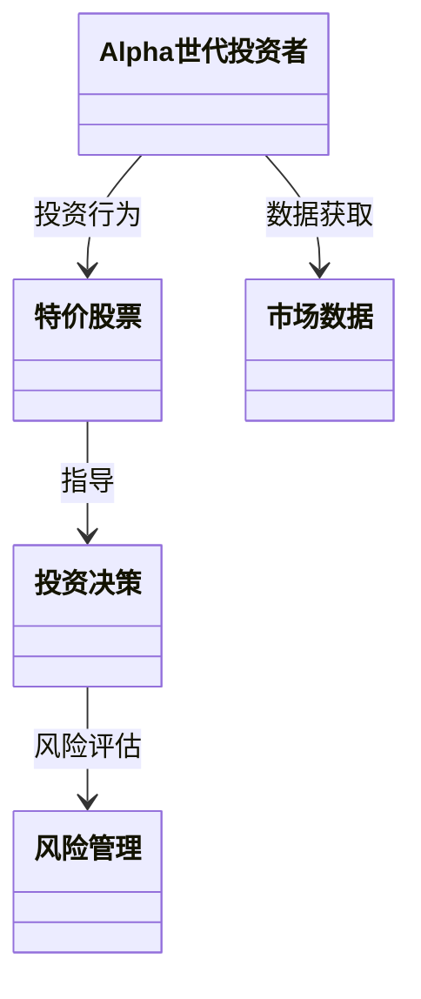
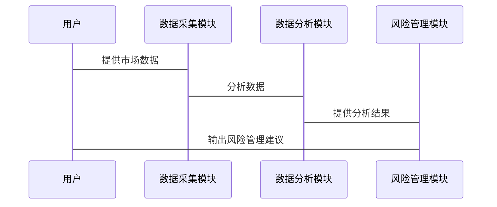

                 


# 特价股票投资中的Alpha世代消费行为分析与风险管理

## 关键词：特价股票投资、Alpha世代、消费行为分析、风险管理、机器学习、数据分析

## 摘要：  
本文探讨了在特价股票投资中，Alpha世代（主要指千禧一代和Z世代）的消费行为分析及其风险管理策略。通过结合数据分析和机器学习，本文提出了一个全面的消费行为分析框架，并详细分析了如何利用这些信息优化投资策略，降低风险。文章还通过实际案例展示了如何将理论应用于实践，并提出了未来的研究方向和投资建议。

---

# 第一部分: 特价股票投资中的Alpha世代消费行为分析

## 第1章: 特价股票投资的背景与Alpha世代消费行为概述

### 1.1 特价股票投资的背景

#### 1.1.1 特价股票的定义与特点  
特价股票通常指的是价格低于市场平均水平的股票，具有高流动性和高波动性的特点。这类股票往往被低估，但具有较高的增长潜力。  

#### 1.1.2 Alpha世代的定义与特征  
Alpha世代主要指千禧一代（出生于1981-1996年）和Z世代（出生于1997-2012年）。他们具有以下特征：  
- 数字原住民，熟悉互联网和金融科技工具。  
- 追求个性化投资体验，倾向于主动管理投资组合。  
- 更注重社会影响和可持续性投资（如ESG投资）。  

#### 1.1.3 特价股票投资与Alpha世代消费行为的关联性  
Alpha世代的消费行为受互联网和社交媒体影响较大，他们倾向于通过在线平台获取信息并做出投资决策。这种行为模式为特价股票投资提供了新的机会和挑战。

---

### 1.2 Alpha世代消费行为的核心要素

#### 1.2.1 Alpha世代的消费心理与行为模式  
Alpha世代投资者更倾向于短期交易和高频交易，他们依赖于实时数据和社交媒体信息做出决策。此外，他们对新兴技术和创新商业模式有较高的敏感度。  

#### 1.2.2 Alpha世代在股票投资中的行为特征  
- 喜欢利用技术工具（如量化交易算法）进行投资。  
- 注重投资的社交属性，倾向于分享和讨论投资策略。  
- 更关注公司基本面以外的因素，如品牌影响力和企业文化。  

#### 1.2.3 特价股票投资中的Alpha世代消费行为的边界与外延  
尽管Alpha世代在投资行为上表现出独特性，但其消费行为仍受到市场规律和经济周期的影响。特价股票投资的核心目标是通过分析Alpha世代的行为模式，找到投资机会并降低风险。

---

## 第2章: Alpha世代消费行为的分析框架

### 2.1 Alpha世代消费行为的分析维度

#### 2.1.1 消费心理分析  
Alpha世代投资者的心理特征包括：  
- 追求个性化和差异化投资体验。  
- 更倾向于冒险性投资，但对风险有较高的敏感性。  

#### 2.1.2 消费决策过程分析  
Alpha世代的消费决策过程可以分为以下几个阶段：  
1. 信息收集：通过社交媒体、新闻平台和金融网站获取信息。  
2. 信息处理：基于个人价值观和投资目标筛选信息。  
3. 决策制定：结合技术分析和基本面分析做出投资决策。  

#### 2.1.3 消费行为的影响因素  
- 经济环境：如市场波动、利率变化等。  
- 社会文化：如社交媒体的影响和朋友推荐。  
- 个人特质：如风险偏好、投资知识水平等。  

---

### 2.2 特价股票投资中的消费行为分析模型

#### 2.2.1 模型构建的逻辑  
消费行为分析模型的核心是通过数据分析和机器学习技术，预测Alpha世代投资者的行为模式，并将其与特价股票的投资机会相结合。  

#### 2.2.2 模型的输入变量与输出变量  
- 输入变量：投资者行为数据、市场数据、公司基本面数据等。  
- 输出变量：投资决策的概率、投资收益预测等。  

#### 2.2.3 模型的假设条件与限制  
- 数据的完整性和准确性。  
- 投资者行为的可预测性。  

---

## 第3章: 特价股票投资中的风险管理策略

### 3.1 风险管理的核心概念

#### 3.1.1 风险的定义与分类  
风险是指投资回报的不确定性。常见的风险类型包括市场风险、流动性风险和信用风险。  

#### 3.1.2 风险管理的目标与原则  
风险管理的目标是通过降低风险敞口，实现投资收益的最大化。风险管理的原则包括分散化、动态调整和成本效益原则。  

#### 3.1.3 风险管理在股票投资中的重要性  
有效的风险管理可以减少投资损失，提高投资组合的稳定性。  

---

### 3.2 Alpha世代消费行为对风险管理的影响

#### 3.2.1 消费行为与投资风险的关联性  
Alpha世代的消费行为具有较强的波动性，这可能导致投资风险的增加。例如，他们倾向于频繁交易，容易受到市场情绪的影响。  

#### 3.2.2 Alpha世代在风险管理中的独特挑战  
- 过度依赖技术工具可能导致决策失误。  
- 社交媒体的影响可能加剧市场波动。  

#### 3.2.3 风险管理策略的优化方向  
- 强化风险教育，提高投资者的金融素养。  
- 利用大数据和人工智能技术，优化风险管理模型。  

---

## 第4章: 特价股票投资中的行为分析与数学模型

### 4.1 Alpha世代消费行为的数学建模

#### 4.1.1 消费行为数据的收集与处理  
- 数据来源：社交媒体、金融平台和交易记录。  
- 数据处理：清洗、特征提取和数据标注。  

#### 4.1.2 消费行为的特征提取与分析  
- 特征提取：如交易频率、投资金额和投资品种。  
- 数据分析：使用聚类分析和回归分析，识别消费行为的模式和趋势。  

#### 4.1.3 消费行为分析的数学模型  
- 聚类分析：用于识别投资者的消费行为类型。  
- 回归分析：用于预测投资行为对市场的影响。  

---

### 4.2 风险管理的数学模型

#### 4.2.1 风险评估的数学公式  
$$ \text{风险值} = \sum_{i=1}^{n} w_i \times \text{风险因素}_i $$  
其中，\( w_i \) 是风险因素的权重。  

#### 4.2.2 风险对冲的数学模型  
$$ \text{最优对冲组合} = \argmin_{w} \left( \sum_{i=1}^{n} w_i^2 \times \text{风险}_i \right) $$  

#### 4.2.3 风险管理的优化算法  
- 线性回归算法：用于风险因素的权重计算。  
- 随机森林算法：用于风险分类和预测。  

---

## 第5章: 特价股票投资中的系统分析与架构设计

### 5.1 系统分析与设计的背景

#### 5.1.1 问题场景的描述  
Alpha世代投资者的行为分析需要一个高效的数据处理和分析系统，以支持实时决策和风险管理。  

#### 5.1.2 项目介绍  
本项目旨在构建一个基于大数据和人工智能的特价股票投资分析系统，帮助Alpha世代投资者优化投资策略。  

---

### 5.2 系统功能设计

#### 5.2.1 领域模型（Mermaid类图）  


---

### 5.3 系统架构设计

#### 5.3.1 系统架构图（Mermaid架构图）  
```mermaid
contextDiagram
    participant Alpha世代投资者 as 用户
    participant 数据采集模块 as 数据采集
    participant 数据分析模块 as 数据分析
    participant 风险管理模块 as 风险管理
    用户 -> 数据采集: 提供数据源
    数据采集 -> 数据分析: 分析数据
    数据分析 -> 风险管理: 输出分析结果
```

---

### 5.4 系统接口设计

#### 5.4.1 系统交互流程（Mermaid序列图）  


---

## 第6章: 特价股票投资中的项目实战

### 6.1 环境安装与配置

#### 6.1.1 环境要求  
- 操作系统：Windows/Mac/Linux  
- Python版本：3.8以上  
- 需要安装的库：Pandas、NumPy、Scikit-learn、TensorFlow  

---

### 6.2 核心代码实现

#### 6.2.1 数据采集代码  
```python
import pandas as pd
import requests

def get_stock_data(ticker):
    url = f"https://api.example.com/stock/{ticker}"
    response = requests.get(url)
    data = response.json()
    df = pd.DataFrame(data)
    return df
```

#### 6.2.2 数据分析代码  
```python
from sklearn.cluster import KMeans

def analyze_behavior(data):
    features = data[['交易频率', '投资金额']]
    model = KMeans(n_clusters=3)
    model.fit(features)
    data['消费行为类型'] = model.predict(features)
    return data
```

#### 6.2.3 风险管理代码  
```python
from sklearn.ensemble import RandomForestClassifier

def risk_assessment(data):
    features = data[['市场波动率', '交易活跃度']]
    model = RandomForestClassifier()
    model.fit(features, data['风险等级'])
    return model
```

---

### 6.3 实际案例分析

#### 6.3.1 案例背景  
假设我们有Alpha世代投资者的交易数据，包括交易频率、投资金额和市场数据。  

#### 6.3.2 数据分析与建模  
使用聚类分析识别投资者的消费行为类型，并使用随机森林模型进行风险评估。  

#### 6.3.3 投资决策优化  
根据模型结果，优化投资组合，降低高风险投资比例。  

---

## 第7章: 总结与展望

### 7.1 总结

#### 7.1.1 主要研究内容  
本文通过分析Alpha世代的消费行为，提出了一个基于大数据和机器学习的特价股票投资分析框架，并详细探讨了风险管理策略。  

#### 7.1.2 研究意义  
本文的研究为Alpha世代投资者提供了新的投资思路，同时为金融机构优化服务提供了理论支持。  

---

### 7.2 展望

#### 7.2.1 未来的研究方向  
- 结合区块链技术，优化投资行为分析模型。  
- 研究Alpha世代投资者的心理特征，进一步优化风险管理策略。  

#### 7.2.2 对投资者的建议  
- 提高金融素养，理性投资。  
- 利用技术工具，优化投资决策。  

---

## 第8章: 注意事项与拓展阅读

### 8.1 注意事项

#### 8.1.1 投资风险提示  
投资有风险，投资者需根据自身风险承受能力做出决策。  

#### 8.1.2 技术实现的局限性  
本文提出的方法仍需在实际应用中不断优化和验证。  

---

### 8.2 拓展阅读

#### 8.2.1 推荐书籍  
- 《算法驱动的投资》  
- 《大数据时代的投资策略》  

#### 8.2.2 推荐博客与资源  
- QuantInstints Blog  
- Towards Data Science（TDS）  

---

通过以上分析，我们可以看到，Alpha世代在特价股票投资中的消费行为具有独特性，但也面临较大的风险。通过结合数据分析和机器学习技术，我们可以更好地理解和管理这些风险，为投资者提供更科学的投资决策支持。

