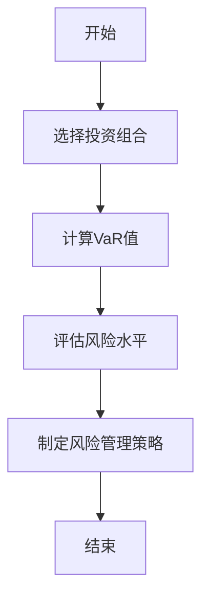
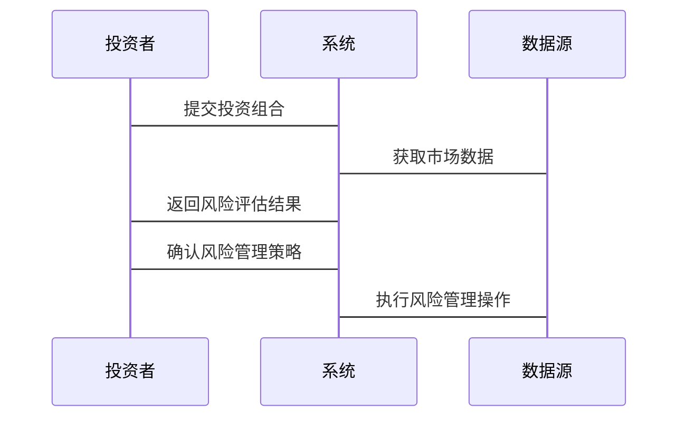

                 


# 特价股票投资中的Z世代消费行为分析与风险管理

> 关键词：特价股票投资，Z世代消费行为，风险管理，投资策略，数据分析

> 摘要：本文旨在分析Z世代在特价股票投资中的消费行为，探讨其风险特征，并提出相应的风险管理策略。通过结合金融学和心理学的理论，本文从行为特征、心理动机、风险偏好等多个维度深入剖析Z世代的投资行为，为投资者和市场参与者提供有益的参考。

---

# 第1章: 特价股票投资概述

## 1.1 特价股票的基本概念

### 1.1.1 特价股票的定义与特点
特价股票通常指价格低于市场平均水平的股票，具有高波动性和高风险的特点。这类股票可能因公司业绩不佳、市场地位较弱或处于转型期而价格被低估。投资者在追求高回报的同时，也需承担较高的市场风险。

### 1.1.2 特价股票的投资价值与风险
特价股票的投资价值在于其潜在的高回报，但其风险主要体现在市场波动性大、流动性不足以及公司基本面不稳定等方面。投资者需权衡风险与收益，制定合理的投资策略。

### 1.1.3 特价股票市场的基本结构
特价股票市场由投资者、上市公司、中介机构（如券商、基金公司）和监管机构组成。市场的运行机制包括价格发现、交易撮合和信息传递等环节。

## 1.2 Z世代消费行为概述

### 1.2.1 Z世代的定义与特征
Z世代指的是出生于1990年至2000年之间的年轻人，他们成长于互联网时代，具有较强的数字化意识和个性化消费观。Z世代注重体验和即时满足，消费行为受社交媒体和新兴技术影响较大。

### 1.2.2 Z世代的消费习惯与投资倾向
Z世代在消费上倾向于线上购物、个性化产品和品牌忠诚度较低。在投资方面，他们偏好高风险高回报的标的，如特价股票、 cryptocurrency等，且投资决策受情绪和社交影响较大。

### 1.2.3 Z世代与股票投资的关联性分析
Z世代普遍对新兴行业和技术趋势感兴趣，他们可能通过社交媒体获取投资信息，并参与新兴市场的投资。此外，Z世代对快速致富的渴望可能促使他们选择风险较高的投资标的。

## 1.3 特价股票投资中的Z世代行为分析

### 1.3.1 Z世代参与特价股票投资的动机
Z世代参与特价股票投资的动机包括追求高回报、跟风潮流、社交需求等。他们可能受社交媒体上的投资案例影响，认为特价股票是快速致富的机会。

### 1.3.2 Z世代在特价股票市场中的行为模式
Z世代在投资行为上表现出情绪化、频繁交易和对短期收益的关注。他们可能基于市场情绪而非基本面分析做出投资决策。

### 1.3.3 Z世代与传统投资者的对比分析
与传统投资者相比，Z世代更倾向于高风险投资，注重短期收益，且受外部信息影响较大。他们对新兴技术和社交媒体的依赖也影响了其投资行为。

## 1.4 本章小结
本章通过分析特价股票的基本概念和Z世代的消费行为特征，揭示了Z世代在特价股票投资中的行为动机和模式。这些分析为后续的风险管理策略提供了基础。

---

# 第2章: Z世代消费行为与股票投资的关联性分析

## 2.1 Z世代的消费心理与投资决策

### 2.1.1 Z世代的消费心理特征
Z世代具有较强的自我表达欲望和个性化需求，注重产品的体验和情感价值。他们倾向于通过消费表达个人价值观，且受社交媒体影响较大。

### 2.1.2 Z世代的投资决策过程
Z世代的投资决策过程通常受到情绪驱动，且依赖于社交媒体和网络信息。他们可能基于短期市场情绪而非长期基本面分析做出投资决策。

### 2.1.3 消费心理对投资行为的影响
Z世代的消费心理影响其投资行为，表现为追求独特性、注重品牌效应和受社交圈影响较大。这种心理特征可能导致他们在投资中表现出冲动性和情绪化。

## 2.2 Z世代在特价股票市场中的行为特征

### 2.2.1 Z世代对特价股票的关注点
Z世代关注特价股票的高增长潜力和市场关注度，他们可能倾向于选择具有创新性和高成长性的公司股票。

### 2.2.2 Z世代在特价股票市场中的交易频率
Z世代的交易频率较高，他们可能频繁买卖股票以追求短期收益，这增加了市场的波动性。

### 2.2.3 Z世代在特价股票市场中的风险偏好
Z世代的风险偏好较高，他们愿意承担较高的风险以追求高回报。这种偏好可能导致他们在市场下跌时面临更大的损失。

## 2.3 Z世代消费行为对股票市场的影响

### 2.3.1 Z世代消费行为对市场流动性的贡献
Z世代的高交易频率和活跃的市场参与提高了市场的流动性，但也可能导致市场波动加剧。

### 2.3.2 Z世代消费行为对市场波动性的影响
Z世代的行为可能导致市场情绪的快速变化，从而引发市场的短期波动。

### 2.3.3 Z世代消费行为对市场长期发展的潜在影响
尽管Z世代的高风险偏好可能影响市场的短期波动，但他们的投资行为也可能推动市场的创新和增长。

## 2.4 本章小结
本章分析了Z世代消费心理和投资决策过程，揭示了他们在特价股票市场中的行为特征及其对市场的影响。这些分析为后续的风险管理策略提供了理论支持。

---

# 第3章: 特价股票投资中的风险管理策略

## 3.1 风险管理的基本概念

### 3.1.1 风险管理的定义与作用
风险管理是指识别、评估和应对潜在风险的过程，旨在降低风险对投资目标的影响。它在投资决策中起到关键作用，帮助投资者避免重大损失。

### 3.1.2 风险管理的基本原则
风险管理应遵循全面性、主动性和可持续性原则，确保覆盖所有可能的风险源，并采取前瞻性的措施应对风险。

### 3.1.3 风险管理的实施步骤
风险管理的实施步骤包括风险识别、风险评估、风险应对和风险监控。这些步骤帮助投资者系统地应对潜在风险。

## 3.2 Z世代在特价股票投资中的风险特征

### 3.2.1 Z世代在特价股票投资中的常见风险
Z世代在特价股票投资中面临的主要风险包括市场波动风险、流动性风险和信息不对称风险。这些风险可能因他们的高风险偏好而加剧。

### 3.2.2 Z世代风险偏好的影响因素
Z世代的风险偏好受其消费心理、社会环境和投资经验的影响。他们倾向于追求高回报，忽视潜在风险。

### 3.2.3 Z世代在风险评估中的特殊性
Z世代的风险评估可能受到情绪和社交因素的影响，导致评估结果偏离实际风险水平。

## 3.3 针对Z世代的特殊风险管理策略

### 3.3.1 基于心理特征的风险管理方法
通过理解Z世代的心理特征，投资者可以采取个性化风险教育和心理辅导，帮助他们理性看待投资风险。

### 3.3.2 基于行为特征的风险管理方法
制定基于行为特征的风险管理策略，如限制频繁交易和情绪化决策，帮助Z世代投资者控制风险。

### 3.3.3 基于社交网络的风险管理方法
利用社交媒体和新兴技术，建立信息共享平台，帮助Z世代投资者获取准确信息，避免因信息不对称而做出错误决策。

## 3.4 本章小结
本章通过分析Z世代在特价股票投资中的风险特征，提出了针对其特殊性的情感特征和行为特征的风险管理策略，为投资者提供了实用的指导。

---

# 第4章: 风险管理的数学模型与算法实现

## 4.1 风险评估的数学模型

### 4.1.1 VaR模型（Value at Risk）
VaR模型用于衡量投资组合在给定置信水平下的潜在损失。通过计算VaR，投资者可以评估投资组合的风险水平。

$$ VaR = \text{Portfolio Value} \times \text{Loss Percentage} $$

### 4.1.2 风险调整后收益模型（RAROC）
RAROC模型将风险因素纳入收益计算，帮助投资者评估风险调整后的收益。

$$ RAROC = \frac{\text{Net Profit}}{\text{Risk Capital}} $$

## 4.2 风险管理的算法实现

### 4.2.1 风险评估算法
使用VaR模型和RAROC模型对投资组合进行风险评估。

```python
def calculate VaR(portfolio_value, confidence_level):
    # 计算VaR值
    return portfolio_value * VaR_percent(confidence_level)
```

### 4.2.2 风险应对算法
根据风险评估结果，制定相应的风险管理策略，如调整投资组合、设置止损点等。

```python
def risk_management_strategy(risk_level):
    if risk_level > 0.95:
        return "diversify_portfolio"
    else:
        return "set_stop_loss"
```

## 4.3 算法流程图


## 4.4 本章小结
本章通过数学模型和算法实现，为投资者提供了科学的风险管理工具，帮助他们在特价股票投资中有效应对风险。

---

# 第5章: 系统分析与架构设计方案

## 5.1 问题场景介绍
针对Z世代在特价股票投资中的风险管理需求，构建一个智能化的风险管理系统，帮助投资者实时监控风险并制定应对策略。

## 5.2 系统功能设计
### 5.2.1 风险评估模块
- 提供VaR和RAROC模型的计算功能
- 实时监控市场波动和投资组合风险

### 5.2.2 风险应对模块
- 根据风险评估结果，自动推荐风险管理策略
- 提供个性化风险教育和投资建议

## 5.3 系统架构设计


## 5.4 系统交互设计


## 5.5 本章小结
本章通过系统分析和架构设计，为投资者提供了一套智能化的风险管理系统，帮助他们在特价股票投资中实现科学化、系统化的风险管理。

---

# 第6章: 项目实战与案例分析

## 6.1 项目环境安装
- 安装Python和相关库（如pandas、numpy、scipy）
- 安装风险管理系统的前端和后端框架

## 6.2 核心算法实现
```python
import pandas as pd
import numpy as np

def calculate VaR(portfolio_value, confidence_level):
    # 假设损失分布为正态分布
    mu = 0
    sigma = 0.05
    VaR_percent = np.percentile(np.random.normal(mu, sigma, 1000), confidence_level)
    return portfolio_value * VaR_percent

portfolio_value = 1000000
confidence_level = 95
print("VaR:", calculate VaR(portfolio_value, confidence_level))
```

## 6.3 系统实现与应用
- 实现风险评估模块和风险应对模块
- 集成用户界面和数据接口

## 6.4 案例分析
通过具体案例分析，展示如何利用上述算法和系统进行风险管理。

## 6.5 本章小结
本章通过项目实战和案例分析，验证了上述算法和系统的有效性，为投资者提供了实际的应用指导。

---

# 第7章: 总结与展望

## 7.1 总结
本文分析了Z世代在特价股票投资中的消费行为，探讨了其风险特征，并提出了相应的风险管理策略。通过数学模型和系统设计，为投资者提供了科学的风险管理工具。

## 7.2 未来展望
未来研究可以进一步结合人工智能和大数据技术，提升风险管理的智能化水平。同时，需加强对Z世代消费行为的深入研究，为投资者提供更精准的风险管理策略。

---

# 参考文献
（此处列出相关的学术文献、书籍和在线资源）

---

通过以上结构和内容安排，本文旨在为投资者和市场参与者提供关于Z世代在特价股票投资中的行为分析与风险管理的系统性指导，帮助他们在复杂多变的市场环境中做出明智的投资决策。

