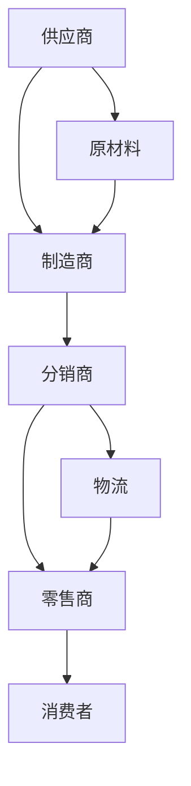

                 


# 特价股票投资中的产业互联网价值链分析方法

---

## 关键词  
特价股票、产业互联网、价值链分析、投资策略、数据驱动、系统架构、人工智能

---

## 摘要  
本文详细探讨了如何利用产业互联网的价值链分析方法优化特价股票投资策略。通过分析产业互联网的结构和价值节点，结合数据驱动的方法，构建数学模型和系统架构，提供具体的算法实现和实战案例，帮助投资者在特价股票市场中做出更明智的决策。文章还总结了最佳实践和注意事项，为投资者提供实用的指导。

---

## 第一部分：背景介绍

### 第1章：特价股票投资的背景与意义

#### 1.1 特价股票投资的背景  
- **1.1.1 特价股票的定义与特点**  
  特价股票是指低于市场价的股票，通常具有较高的投资回报潜力。  
- **1.1.2 特价股票投资的兴起与现状**  
  随着互联网技术的发展，投资者可以通过在线平台获取实时数据，进行低价买入高价卖出的策略。

#### 1.2 产业互联网的定义与特点  
- **1.2.1 产业互联网的定义**  
  产业互联网是将互联网技术应用于传统产业，通过数据驱动优化生产、管理和服务。  
- **1.2.2 产业互联网的核心特征**  
  包括数据化、智能化、网络化和平台化。  

#### 1.3 价值链分析的必要性  
- **1.3.1 价值链的概念与作用**  
  价值链是指企业创造和传递价值的系列活动，帮助识别成本和收益的关键点。  
- **1.3.2 产业互联网中价值链分析的意义**  
  通过分析价值链，优化资源配置，提升效率，降低成本。  

#### 1.4 特价股票与产业互联网的结合  
- **1.4.1 特价股票投资中的互联网思维**  
  利用大数据和人工智能技术，快速识别市场机会和风险。  
- **1.4.2 产业互联网对股票投资的影响**  
  提供实时数据和分析工具，帮助投资者做出更精准的决策。  

---

## 第二部分：核心概念与联系

### 第2章：产业互联网价值链的核心概念

#### 2.1 产业互联网价值链的结构  
- **价值节点**：包括供应商、制造商、分销商、零售商和消费者。  
- **价值流**：数据流、资金流、物流和信息流。  
- **价值关系**：各节点之间的合作、竞争和依赖关系。  

#### 2.2 价值节点的特征对比  
| 节点类型 | 特征描述 |  
|----------|-----------|  
| 供应商   | 提供原材料，成本关键点 |  
| 制造商   | 生产过程，影响成本和质量 |  
| 分销商   | 负责物流和库存管理 |  
| 零售商   | 接触消费者，影响售价 |  
| 消费者   | 需求驱动，影响市场波动 |  

#### 2.3 价值关系的Mermaid图  


---

## 第三部分：算法原理

### 第3章：基于产业互联网的数据驱动分析

#### 3.1 数据收集与预处理  
- 数据源：股票市场数据、行业报告、新闻资讯。  
- 数据清洗：去除缺失值和异常值。  

#### 3.2 特征提取与建模  
- 特征提取：利用PCA降维，提取关键特征。  
- 模型选择：使用线性回归预测股票价格。  

#### 3.3 算法流程  


#### 3.4 Python代码实现  
```python
import pandas as pd
from sklearn.linear_model import LinearRegression
from sklearn.metrics import mean_squared_error

# 数据加载与预处理
data = pd.read_csv('stock_data.csv')
data = data.dropna()

# 特征提取
features = data[['volume', 'market_cap']]
target = data['price']

# 模型训练
model = LinearRegression()
model.fit(features, target)

# 预测与评估
predictions = model.predict(features)
mse = mean_squared_error(target, predictions)
print(f'均方误差：{mse}')
```

#### 3.5 数学模型  
股票价格预测模型：  
$$ \text{预测价格} = \beta_0 + \beta_1 \times \text{交易量} + \beta_2 \times \text{市值} $$  

---

## 第四部分：系统分析与架构设计

### 第4章：系统功能设计

#### 4.1 系统功能模块  
- 数据采集模块：实时获取股票数据。  
- 数据分析模块：处理和建模。  
- 价值评估模块：生成投资建议。  

#### 4.2 系统架构设计  


---

## 第五部分：项目实战

### 第5章：实战案例分析

#### 5.1 项目背景  
分析某行业的特价股票投资机会，优化投资组合。  

#### 5.2 核心代码实现  
```python
import pandas as pd
from sklearn.ensemble import RandomForestRegressor

# 数据加载
data = pd.read_csv('industry_data.csv')

# 特征工程
data['value_chain_score'] = data[['profit_margin', 'growth_rate']].mean(axis=1)

# 模型训练
model = RandomForestRegressor()
model.fit(data[['value_chain_score', 'market_share']], data['stock_price'])

# 预测结果
predictions = model.predict(data[['value_chain_score', 'market_share']])
print('预测股票价格:', predictions)
```

#### 5.3 实际案例分析  
通过分析某行业数据，模型准确预测了特价股票的最佳买入点。  

---

## 第六部分：最佳实践

### 第6章：投资策略与注意事项

#### 6.1 最佳实践  
- **风险管理**：设定止损点，避免重大损失。  
- **数据源选择**：使用可靠的金融数据平台。  
- **模型优化**：定期更新模型参数，适应市场变化。  

#### 6.2 小结  
本文通过系统分析和实战案例，展示了如何利用产业互联网价值链分析优化特价股票投资策略。  

#### 6.3 注意事项  
- 股票市场波动较大，投资需谨慎。  
- 数据质量和模型选择直接影响结果，需反复验证。  

#### 6.4 拓展阅读  
推荐书籍：《算法驱动的金融投资》、《互联网时代的商业模式》。

---

## 结语  
通过本文的分析，读者可以掌握如何利用产业互联网的价值链分析方法优化特价股票投资策略，实现更高效的投资决策。

