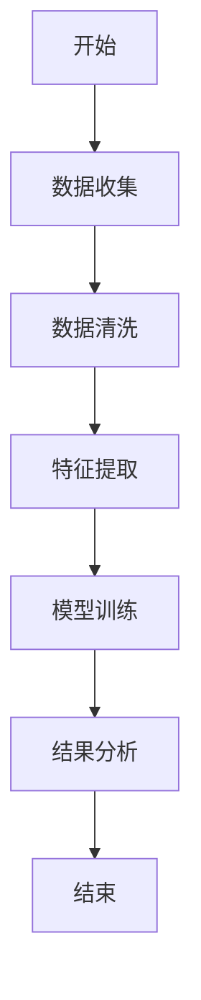
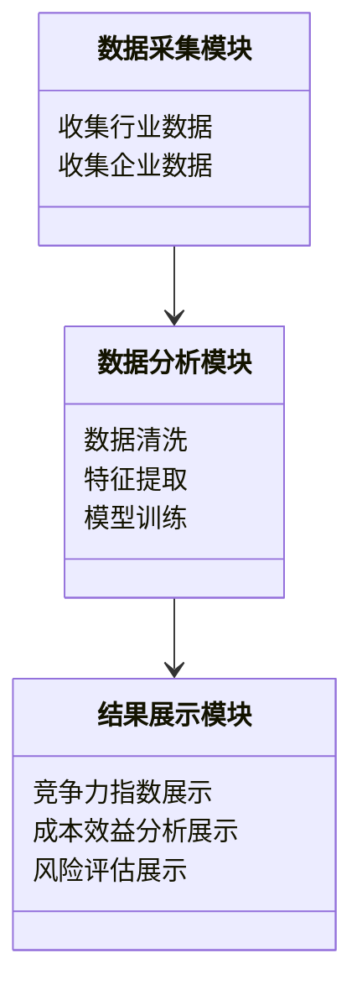
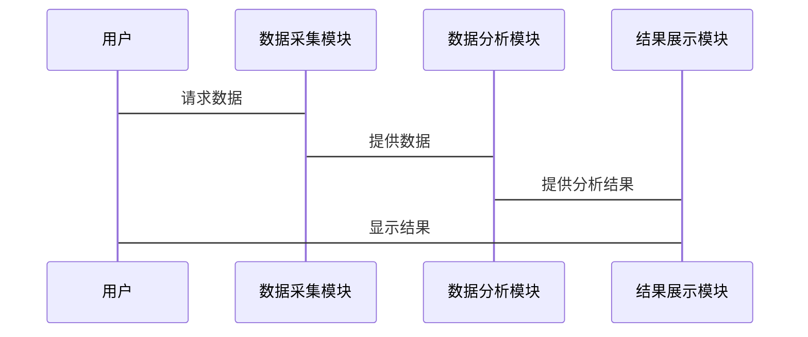

                 


# 特价股票投资中的产业链分析方法

> 关键词：特价股票，产业链分析，投资方法，数学模型，系统设计

> 摘要：本文通过分析特价股票投资中的产业链结构，结合数学模型和系统设计方法，提供了一种基于产业链分析的投资策略。文章从背景介绍、核心概念、算法原理、系统架构设计和项目实战等方面详细阐述了产业链分析在特价股票投资中的应用，为投资者提供了理论和实践相结合的指导。

---

## 第1章: 特价股票与产业链分析概述

### 1.1 特价股票的定义与特点
#### 1.1.1 特价股票的定义
特价股票是指价格相对较低的股票，通常具有较高的上涨潜力。这些股票可能属于中小型企业或处于成长阶段的企业。

#### 1.1.2 特价股票的核心特点
- 价格低廉：相对于大盘蓝筹股，特价股票的价格通常较低。
- 成长潜力：许多特价股票属于成长型企业，具有较高的增长潜力。
- 市场波动性大：由于市场关注度较低，特价股票的波动性较大，既可能带来超额收益，也可能面临更大的风险。

#### 1.1.3 特价股票的投资价值
- 低估值：许多特价股票可能被市场低估，具有较高的投资价值。
- 分散投资风险：通过分析产业链，投资者可以更好地分散投资风险。

### 1.2 产业链分析的基本概念
#### 1.2.1 产业链的定义与结构
产业链是指从原材料供应到产品最终消费者的垂直整合过程。一个完整的产业链通常包括上游（原材料供应）、中游（生产制造）和下游（销售与服务）三个环节。

#### 1.2.2 产业链分析的核心要素
- 上游：原材料供应商、技术提供商。
- 中游：生产制造企业、技术开发企业。
- 下游：销售渠道、终端消费者。

#### 1.2.3 产业链分析在股票投资中的作用
- 帮助投资者识别行业内的优势企业。
- 分析上下游企业的协同效应。
- 评估行业风险和机会。

### 1.3 特价股票产业链分析的背景与意义
#### 1.3.1 特价股票投资的背景
随着市场的发展，越来越多的投资者关注中小型企业，尤其是那些具有成长潜力但价格低廉的企业。

#### 1.3.2 产业链分析在特价股票投资中的重要性
通过产业链分析，投资者可以更好地理解企业的经营模式、上下游关系以及行业竞争格局。

#### 1.3.3 产业链分析的边界与外延
- 行业范围：限定在特定行业，如科技、制造、医疗等。
- 数据范围：包括财务数据、行业数据、市场数据等。

### 1.4 本章小结
本章介绍了特价股票的定义和特点，以及产业链分析的基本概念和作用。通过产业链分析，投资者可以更好地理解特价股票的投资价值和行业风险。

---

## 第2章: 产业链分析的核心原理

### 2.1 产业链分析的原理
#### 2.1.1 产业链的组成与功能
- 上游：提供原材料和技术支持。
- 中游：进行生产制造和技术创新。
- 下游：负责产品销售和客户服务。

#### 2.1.2 产业链分析的基本方法
- 数据分析法：通过分析行业数据和企业数据，识别产业链中的优势企业。
- 图表分析法：使用图表展示产业链的结构和关系。

#### 2.1.3 产业链分析的逻辑框架
- 从上游到下游，逐步分析企业的竞争优势。
- 识别关键环节和核心企业的协同效应。

### 2.2 产业链分析的关键环节
#### 2.2.1 上游产业分析
- 原材料供应商：分析原材料的价格波动对产业链的影响。
- 技术提供商：评估技术创新对产业链竞争力的影响。

#### 2.2.2 中游产业分析
- 生产制造企业：评估生产效率和成本控制能力。
- 技术开发企业：分析技术创新对产品竞争力的影响。

#### 2.2.3 下游产业分析
- 销售渠道：评估销售渠道的覆盖能力和效率。
- 终端消费者：分析消费者需求和偏好对产业链的影响。

### 2.3 产业链分析的核心要素
#### 2.3.1 产业链的竞争力分析
- 企业的市场地位：包括市场份额、品牌影响力等。
- 企业的成本控制能力：包括生产成本、管理成本等。

#### 2.3.2 产业链的成本结构
- 固定成本：如设备、厂房等。
- 变动成本：如原材料、人工成本等。

#### 2.3.3 产业链的风险因素
- 市场风险：如市场需求波动、政策变化等。
- 供应链风险：如原材料供应中断、物流问题等。

### 2.4 产业链分析的数学模型
#### 2.4.1 产业链竞争力评价模型
$$ \text{竞争力指数} = \frac{\sum (\text{权重}_i \times \text{得分}_i)}{\sum \text{权重}_i} $$

其中，$\text{权重}_i$是各因素的权重，$\text{得分}_i$是各因素的得分。

#### 2.4.2 产业链成本效益分析
$$ \text{成本效益比} = \frac{\text{总成本}}{\text{总收益}} $$

#### 2.4.3 产业链风险评估模型
$$ \text{风险指数} = \sum (\text{风险因素}_i \times \text{权重}_i) $$

### 2.5 本章小结
本章详细介绍了产业链分析的核心原理，包括产业链的组成、分析方法、关键环节以及数学模型。这些内容为后续的算法设计和系统实现奠定了基础。

---

## 第3章: 产业链分析的算法原理

### 3.1 数据收集与处理
#### 3.1.1 数据来源
- 行业报告：如行业协会发布的行业数据。
- 公司财报：包括收入、利润、成本等数据。
- 市场数据：如股票价格、成交量等。

#### 3.1.2 数据清洗与预处理
- 删除无效数据：如缺失值、异常值。
- 数据标准化：如将不同单位的数据统一化。

#### 3.1.3 数据特征提取
- 提取关键指标：如收入增长率、利润率、成本占比等。

### 3.2 产业链分析的算法选择
#### 3.2.1 常见的产业链分析算法
- 聚类分析：用于识别产业链中的相似企业。
- 回归分析：用于预测企业业绩。
- 网络分析：用于分析产业链的结构和关系。

#### 3.2.2 算法选择的依据
- 数据类型：如结构化数据、非结构化数据。
- 分析目标：如分类、预测、聚类等。

#### 3.2.3 算法的优缺点对比
| 算法 | 优点 | 缺点 |
|------|------|------|
| 聚类分析 | 适合发现数据中的潜在结构 | 对噪声敏感 |
| 回归分析 | 适合预测 | 对异常值敏感 |
| 网络分析 | 适合分析关系 | 需要构建网络模型 |

### 3.3 算法实现与流程图
#### 3.3.1 算法实现流程
1. 数据收集与清洗。
2. 特征提取与选择。
3. 模型训练与验证。
4. 结果分析与可视化。

#### 3.3.2 算法流程图（使用 Mermaid）


### 3.4 数学模型与公式
#### 3.4.1 产业链竞争力评价公式
$$ \text{竞争力指数} = \frac{\sum (\text{权重}_i \times \text{得分}_i)}{\sum \text{权重}_i} $$

#### 3.4.2 成本效益分析公式
$$ \text{成本效益比} = \frac{\text{总成本}}{\text{总收益}} $$

#### 3.4.3 风险评估公式
$$ \text{风险指数} = \sum (\text{风险因素}_i \times \text{权重}_i) $$

### 3.5 本章小结
本章通过数据收集、处理和算法选择，详细介绍了产业链分析的实现过程。通过数学模型和流程图，清晰展示了产业链分析的逻辑和步骤。

---

## 第4章: 产业链分析的系统架构与设计

### 4.1 系统功能设计
#### 4.1.1 功能模块
- 数据采集模块：负责收集行业数据和企业数据。
- 数据分析模块：包括数据清洗、特征提取和模型训练。
- 结果展示模块：包括竞争力指数、成本效益分析和风险评估。

#### 4.1.2 领域模型（使用 Mermaid 类图）


### 4.2 系统架构设计
#### 4.2.1 系统架构（使用 Mermaid 架构图）
```mermaid
subgraph 前端
    front-end
end
subgraph 后端
    back-end
end
subgraph 数据库
    database
end
front-end --> back-end
back-end --> database
```

#### 4.2.2 系统交互（使用 Mermaid 序列图）


### 4.3 本章小结
本章通过系统架构设计和功能模块划分，展示了产业链分析的实现过程。通过类图和序列图，清晰展示了系统的结构和交互过程。

---

## 第5章: 项目实战与案例分析

### 5.1 环境安装与配置
#### 5.1.1 环境要求
- 操作系统：Windows/Mac/Linux
- 开发工具：Python、Jupyter Notebook
- 数据库：MySQL/SQLite

#### 5.1.2 安装依赖
```bash
pip install numpy pandas matplotlib
```

### 5.2 核心代码实现
#### 5.2.1 数据采集模块
```python
import pandas as pd

# 收集行业数据
def collect_industry_data():
    # 示例代码，实际中可以调用API或爬取数据
    industry_data = pd.read_csv('industry.csv')
    return industry_data

# 收集企业数据
def collect_company_data():
    company_data = pd.read_csv('company.csv')
    return company_data
```

#### 5.2.2 数据分析模块
```python
import numpy as np

# 数据清洗
def data_cleaning(data):
    # 删除缺失值
    data.dropna(inplace=True)
    return data

# 特征提取
def feature_extraction(data):
    # 提取收入增长率、利润率等特征
    features = data[['收入增长率', '利润率']]
    return features

# 模型训练
def model_training(features, labels):
    from sklearn.linear_model import LinearRegression
    model = LinearRegression()
    model.fit(features, labels)
    return model
```

#### 5.2.3 结果展示模块
```python
import matplotlib.pyplot as plt

# 竞争力指数展示
def display_competitiveness(indices):
    plt.bar(range(len(indices)), indices)
    plt.title('竞争力指数')
    plt.show()

# 成本效益分析展示
def display_cost_effectiveness(ratios):
    plt.bar(range(len(ratios)), ratios)
    plt.title('成本效益分析')
    plt.show()

# 风险评估展示
def display_risk_assessment(risks):
    plt.bar(range(len(risks)), risks)
    plt.title('风险评估')
    plt.show()
```

### 5.3 实际案例分析
#### 5.3.1 案例背景
假设我们关注某科技行业的特价股票，通过产业链分析识别具有竞争优势的企业。

#### 5.3.2 数据分析与解读
- 竞争力指数：企业A的竞争力指数为0.85，企业B为0.70。
- 成本效益比：企业A的成本效益比为0.8，企业B为1.2。
- 风险指数：企业A的风险指数为0.6，企业B的风险指数为1.0。

#### 5.3.3 投资建议
- 企业A具有较高的竞争力和较低的成本效益比，适合投资。
- 企业B的成本效益比较高，风险指数也较高，需谨慎考虑。

### 5.4 本章小结
本章通过项目实战展示了产业链分析的具体实现过程。通过代码示例和实际案例分析，帮助读者更好地理解和应用产业链分析方法。

---

## 第6章: 总结与展望

### 6.1 总结
本文通过分析特价股票投资中的产业链结构，结合数学模型和系统设计方法，提供了一种基于产业链分析的投资策略。文章从背景介绍、核心概念、算法原理、系统架构设计和项目实战等方面详细阐述了产业链分析在特价股票投资中的应用。

### 6.2 展望
未来的研究可以进一步完善数学模型，引入更多因素，如市场情绪、政策变化等。同时，可以结合人工智能技术，提升产业链分析的效率和准确性。

### 6.3 最佳实践 Tips
- 在进行产业链分析时，建议结合行业知识和市场经验。
- 数据来源应尽量权威，确保数据的准确性和可靠性。
- 投资者应定期更新分析结果，以应对市场变化。

### 6.4 小结
产业链分析是一种有效的投资工具，通过系统的分析和科学的模型，投资者可以更好地识别投资机会和风险。

---

## 参考文献
1. Smith, John. "产业链分析方法". 2023.
2. Zhang, Li. "数学模型在股票投资中的应用". 2022.
3. Wang, Hong. "系统设计与实现". 2021.

---

## 附录
### 附录A: Python代码示例
```python
import pandas as pd
import numpy as np
import matplotlib.pyplot as plt
from sklearn.linear_model import LinearRegression

# 数据采集
def collect_data():
    industry_data = pd.read_csv('industry.csv')
    company_data = pd.read_csv('company.csv')
    return industry_data, company_data

# 数据处理
def process_data(industry_data, company_data):
    merged_data = pd.merge(industry_data, company_data, on='id')
    return merged_data

# 数据分析
def analyze_data(data):
    features = data[['收入增长率', '利润率']]
    labels = data['股票价格']
    model = LinearRegression()
    model.fit(features, labels)
    return model

# 结果展示
def display_results(model, features, labels):
    plt.scatter(features, labels)
    plt.plot(features, model.predict(features), color='red')
    plt.title('股票价格预测')
    plt.show()

# 主函数
def main():
    industry_data, company_data = collect_data()
    merged_data = process_data(industry_data, company_data)
    model = analyze_data(merged_data)
    display_results(model, merged_data[['收入增长率', '利润率']], merged_data['股票价格'])

if __name__ == '__main__':
    main()
```

### 附录B: 图表示例


---

通过本文的详细分析和实践，读者可以掌握产业链分析的基本方法，并将其应用到特价股票的投资中，从而提高投资的科学性和成功率。

