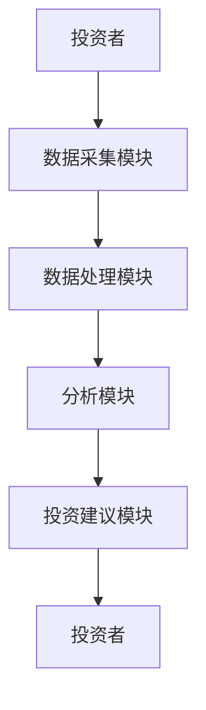

                 


# 特价股票投资中的产业集群分析方法

## 关键词：特价股票、产业集群、投资分析、算法原理、系统架构

## 摘要：本文详细探讨了在特价股票投资中，如何通过产业集群分析方法来识别投资机会。文章从产业集群的基本概念、分析方法、算法实现、系统架构设计、项目实战以及最佳实践等方面展开，帮助投资者利用产业集群的特性，优化投资决策。

---

## 第一部分: 特价股票与产业集群概述

### 第1章: 特价股票与产业集群概述

#### 1.1 特价股票的定义与特点

##### 1.1.1 特价股票的定义
特价股票通常指的是价格低于市场平均水平的股票，这些股票可能因为市场波动、公司业绩不佳或其他原因被低估。投资者可以通过分析这些股票的潜在价值，寻找投资机会。

##### 1.1.2 特价股票的特点
- **低估值**：市盈率、市净率等指标低于行业平均水平。
- **高波动性**：价格波动较大，可能存在短期反弹机会。
- **潜在增长点**：公司可能处于困境反转或行业复苏阶段。

##### 1.1.3 特价股票的投资价值
投资者可以通过分析特价股票的基本面，发现被市场忽视的潜在增长点，从而获得超额收益。

#### 1.2 产业集群的定义与特点

##### 1.2.1 产业集群的定义
产业集群是指在地理上相对集中、具有相似或相关联的企业群体，这些企业之间通过分工与协作，形成一个高效的生产网络。

##### 1.2.2 产业集群的核心要素
- **地理位置**：企业在同一区域聚集。
- **产业关联**：企业之间存在上下游关系或协同效应。
- **专业化分工**：企业专注于特定环节，提高效率。

##### 1.2.3 产业集群的优势与劣势
- **优势**：资源共享、成本降低、创新能力增强。
- **劣势**：可能面临区域经济波动风险。

#### 1.3 特价股票与产业集群的结合

##### 1.3.1 特价股票与产业集群的关系
特价股票可能集中在某一产业集群中，如某个行业的困境企业或低价股票可能聚集于某一区域。

##### 1.3.2 产业集群对特价股票投资的影响
产业集群的稳定性、增长潜力和区域政策可能影响相关股票的表现。

##### 1.3.3 特价股票投资中的产业集群分析意义
通过分析产业集群的结构和趋势，投资者可以更好地识别具有投资价值的特价股票。

---

## 第二部分: 产业集群分析的核心概念与联系

### 第2章: 产业集群分析的核心概念与联系

#### 2.1 产业集群分析的核心原理

##### 2.1.1 产业集群的形成机制
产业集群的形成通常由市场需求、资源集中、企业分工等因素驱动。

##### 2.1.2 产业集群的特征分析
- **规模效应**：集群内的企业可以共享资源，降低成本。
- **协同效应**：企业之间分工合作，提高整体效率。

##### 2.1.3 产业集群与经济发展的关系
产业集群是区域经济发展的重要驱动力，能够促进技术创新和就业增长。

#### 2.2 产业集群分析的数学模型

##### 2.2.1 产业集群竞争力评价模型
竞争力评价模型通常包括企业数量、产值、利润率等指标。

##### 2.2.2 产业集群影响力分析模型
影响力分析模型可以衡量产业集群对区域经济的贡献。

##### 2.2.3 产业集群与股票价格的关系模型
股票价格与产业集群的业绩、政策、市场预期等因素密切相关。

#### 2.3 产业集群分析的ER实体关系图

```mermaid
erDiagram
    投资者 {
        股票代码 : string
        股票名称 : string
        行业分类 : string
    }
    产业集群 {
        产业集群ID : integer
        产业集群名称 : string
        产业集群规模 : integer
    }
    特价股票 {
        股票代码 : string
        股票名称 : string
        股票价格 : float
    }
    投资者 --> 特价股票 : 持有
    产业集群 --> 特价股票 : 包含
```

---

## 第三部分: 算法原理

### 第3章: 算法原理

#### 3.1 算法选择与原理

##### 3.1.1 聚类分析
聚类分析用于识别具有相似特征的企业集群，帮助投资者发现潜在的投资机会。

##### 3.1.2 回归分析
回归分析用于预测股票价格与产业集群之间的关系。

#### 3.2 算法实现步骤

##### 3.2.1 数据预处理
- 数据清洗：处理缺失值、异常值。
- 数据标准化：统一数据尺度。

##### 3.2.2 算法实现
- 使用K-means算法进行聚类分析。
- 使用线性回归模型预测股票价格。

##### 3.2.3 模型验证
- 通过交叉验证评估模型性能。
- 使用实际数据进行回测验证。

#### 3.3 算法代码实现

##### 3.3.1 数据加载与预处理

```python
import pandas as pd
import numpy as np

# 加载数据
data = pd.read_csv('clusters.csv')

# 数据清洗
data.dropna(inplace=True)
data = data[~data.duplicated()]

# 标准化处理
from sklearn.preprocessing import StandardScaler
scaler = StandardScaler()
scaled_data = scaler.fit_transform(data[['revenue', 'profit']])
```

##### 3.3.2 聚类分析

```python
from sklearn.cluster import KMeans

# 聚类分析
kmeans = KMeans(n_clusters=3, random_state=0)
clusters = kmeans.fit_predict(scaled_data)

# 绘制结果
import matplotlib.pyplot as plt
plt.scatter(data['revenue'], data['profit'], c=clusters, cmap='viridis')
plt.xlabel('Revenue')
plt.ylabel('Profit')
plt.title('产业集群聚类分析')
plt.show()
```

##### 3.3.3 回归分析

```python
from sklearn.linear_model import LinearRegression

# 回归分析
model = LinearRegression()
model.fit(scaled_data, data['stock_price'])

# 预测结果
predicted_prices = model.predict(scaled_data)
plt.scatter(data['stock_price'], predicted_prices)
plt.xlabel('实际价格')
plt.ylabel('预测价格')
plt.title('回归分析结果')
plt.show()
```

#### 3.4 算法原理的数学模型

##### 3.4.1 聚类分析的数学模型
$$距离度量：d(x_i, x_j) = \sqrt{(x_i - x_j)^2 + (y_i - y_j)^2}$$

##### 3.4.2 回归分析的数学模型
$$y = \beta_0 + \beta_1x + \epsilon$$

---

## 第四部分: 系统分析与架构设计

### 第4章: 系统分析与架构设计

#### 4.1 系统功能设计

##### 4.1.1 数据采集模块
- 从股票市场获取数据。
- 数据清洗和预处理。

##### 4.1.2 分析模块
- 使用聚类和回归分析进行股票分类。
- 生成投资建议。

#### 4.2 系统架构设计



#### 4.3 接口设计
- 数据接口：与股票数据源对接。
- 用户接口：展示分析结果。

---

## 第五部分: 项目实战

### 第5章: 项目实战

#### 5.1 实战案例分析

##### 5.1.1 数据来源
使用公开的股票数据和行业数据。

##### 5.1.2 数据处理
清洗和预处理数据，提取关键指标。

##### 5.1.3 模型构建
应用聚类和回归分析，识别潜在投资机会。

##### 5.1.4 结果分析
评估模型的准确性和实用性。

#### 5.2 代码实现与解读

##### 5.2.1 数据加载与处理

```python
import pandas as pd
import numpy as np

# 加载数据
data = pd.read_csv('clusters.csv')

# 数据清洗
data.dropna(inplace=True)
data = data[~data.duplicated()]
```

##### 5.2.2 聚类分析

```python
from sklearn.cluster import KMeans

# 聚类分析
kmeans = KMeans(n_clusters=3, random_state=0)
clusters = kmeans.fit_predict(data[['revenue', 'profit']])

# 可视化
import matplotlib.pyplot as plt
plt.scatter(data['revenue'], data['profit'], c=clusters, cmap='viridis')
plt.xlabel('Revenue')
plt.ylabel('Profit')
plt.title('产业集群聚类分析')
plt.show()
```

##### 5.2.3 回归分析

```python
from sklearn.linear_model import LinearRegression

# 回归分析
model = LinearRegression()
model.fit(data[['revenue', 'profit']], data['stock_price'])

# 预测结果
predicted_prices = model.predict(data[['revenue', 'profit']])
plt.scatter(data['stock_price'], predicted_prices)
plt.xlabel('实际价格')
plt.ylabel('预测价格')
plt.title('回归分析结果')
plt.show()
```

---

## 第六部分: 最佳实践

### 第6章: 最佳实践

#### 6.1 投资策略
- 分散投资，降低风险。
- 定期评估模型，及时调整策略。

#### 6.2 风险控制
- 设置止损点，避免重大损失。
- 关注宏观经济和行业政策变化。

#### 6.3 注意事项
- 数据质量影响模型性能。
- 模型需定期更新，适应市场变化。

#### 6.4 拓展阅读
- 产业集群的经济影响。
- 股票投资的其他分析方法。

---

## 第七部分: 小结

通过产业集群分析方法，投资者可以更有效地识别特价股票的投资机会。本文详细介绍了分析方法和实现步骤，帮助投资者优化投资决策。

---

以上是《特价股票投资中的产业集群分析方法》的完整内容，涵盖背景介绍、核心概念、算法原理、系统架构、项目实战和最佳实践。希望对读者有所帮助！

