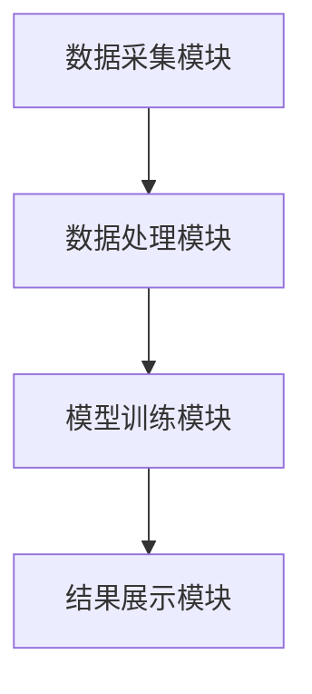

                 


# 特价股票投资中的人口结构变化趋势考量

> 关键词：特价股票、人口结构变化、投资策略、数据分析、数学建模

> 摘要：本文探讨了人口结构变化对特价股票投资的影响，通过数据分析和数学建模，提供了一种基于人口结构变化趋势的投资策略。文章从背景介绍、核心概念、算法原理、数学模型、系统架构、项目实战到最佳实践，全面分析了如何利用人口结构变化来优化投资决策。

---

## 第一部分：人口结构变化与特价股票投资的背景介绍

### 第1章：人口结构变化的定义与影响

#### 1.1 人口结构变化的定义
人口结构指的是一个地区内不同年龄段、性别和家庭结构的人口分布情况。变化的人口结构意味着这些分布比例随时间的改变，可能由自然增长、迁移、政策调整等因素引起。

#### 1.2 人口结构变化的影响
- **经济发展**：年轻人口多的国家可能推动科技创新和新兴产业，从而影响相关股票的投资价值。
- **消费习惯**：不同年龄段的人口对消费产品的需求不同，影响零售、科技、医疗等行业的股票表现。
- **投资行为**：人口结构变化影响投资者的风险偏好，年轻投资者可能更倾向于高风险投资，而年长投资者更倾向于稳健投资。

---

### 第2章：人口结构变化与股票投资的关联

#### 2.1 人口结构变化如何影响股票市场
人口结构变化影响劳动力市场、消费能力、储蓄率和投资需求，进而影响股票市场的供需和价格走势。

#### 2.2 数据建模与人口结构变化
通过收集和分析人口统计数据，建立数学模型，预测不同人口结构变化对股票市场的潜在影响。

---

## 第二部分：核心概念与联系

### 第3章：人口结构变化与股票市场的互动关系

#### 3.1 数据驱动的分析
- **数据来源**：包括政府统计数据、市场研究报告、行业分析等。
- **数据建模**：利用人口统计数据，建立预测模型，分析人口结构变化对股票市场的潜在影响。

#### 3.2 人口结构变化对股票市场的具体影响
- **年龄分布**：年轻人多的国家可能推动科技和互联网行业的股票价格上涨。
- **人口增长率**：高增长的人口可能推动消费行业股票上涨，而负增长可能影响房地产相关股票。

---

## 第三部分：算法原理与人口结构变化分析

### 第4章：基于人口结构变化的股票预测算法

#### 4.1 时间序列分析
- **ARIMA模型**：用于预测未来股票价格，基于历史数据和趋势分析。
- **步骤**：
  1. 数据预处理：清洗和归一化数据。
  2. 模型训练：使用历史数据训练ARIMA模型。
  3. 预测与验证：预测未来价格并验证模型准确性。

#### 4.2 回归分析
- **线性回归模型**：分析人口统计数据与股票价格之间的线性关系。
- **步骤**：
  1. 收集数据：人口统计数据和对应股票价格。
  2. 建立模型：确定自变量（人口统计数据）和因变量（股票价格）。
  3. 训练模型：使用最小二乘法拟合模型。
  4. 验证模型：检查模型的拟合度和显著性。

---

## 第四部分：数学模型与人口结构变化的量化分析

### 第5章：人口结构变化的数学建模

#### 5.1 建立回归模型
假设股票价格P与人口增长率GR呈线性关系：
$$P(t) = a \times GR(t) + b$$
其中，a是回归系数，b是截距。

#### 5.2 模型验证
- 使用历史数据验证模型的准确性。
- 计算R²值，评估模型拟合程度。

---

## 第五部分：系统分析与架构设计

### 第6章：数据收集与分析系统架构

#### 6.1 系统功能设计
- 数据采集模块：收集人口统计数据和股票市场数据。
- 数据处理模块：清洗、转换和存储数据。
- 模型训练模块：训练回归模型并预测股票价格。
- 结果展示模块：可视化分析结果。

#### 6.2 系统架构图


---

## 第六部分：项目实战

### 第7章：人口结构变化驱动的股票投资策略

#### 7.1 环境安装
- 安装Python、Pandas、Scikit-learn等库。

#### 7.2 核心代码实现
```python
import pandas as pd
from sklearn.linear_model import LinearRegression
import matplotlib.pyplot as plt

# 数据加载
data = pd.read_csv('population_stock.csv')

# 数据准备
X = data['Population_Growth'].values.reshape(-1, 1)
y = data['Stock_Price'].values

# 模型训练
model = LinearRegression()
model.fit(X, y)

# 预测与可视化
predictions = model.predict(X)
plt.scatter(X, y, color='blue')
plt.plot(X, predictions, color='red')
plt.xlabel('Population Growth')
plt.ylabel('Stock Price')
plt.show()
```

---

## 第七部分：最佳实践与小结

### 第8章：总结与建议

#### 8.1 投资建议
- 定期更新模型，适应人口结构变化。
- 综合考虑多因素，如政策、经济指标等。

#### 8.2 注意事项
- 数据的准确性和及时性影响模型预测的准确性。
- 模型仅供参考，投资需谨慎。

#### 8.3 拓展阅读
- 推荐书籍：《数据分析与投资策略》、《人口经济学入门》。

---

通过以上分析，本文详细探讨了人口结构变化对特价股票投资的影响，从理论分析到实际应用，为投资者提供了科学的决策依据。希望本文能为投资者在人口结构变化趋势下的投资策略提供新的视角和思路。

