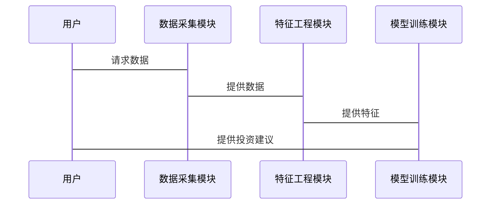

                 


# 特价股票投资中的人工智能应用

## 关键词：人工智能，股票投资，特价股票，机器学习，深度学习，算法交易

## 摘要：  
随着人工智能技术的飞速发展，其在金融领域的应用越来越广泛。本文详细探讨了人工智能在特价股票投资中的应用，从背景介绍、核心概念、算法原理、系统架构到项目实战，全面分析了如何利用人工智能技术提升股票投资的效率和准确性。文章还总结了最佳实践经验和投资策略，为读者提供了从理论到实践的全面指导。

---

# 第1章：背景介绍

## 1.1 特价股票的定义与特点  
特价股票是指价格被市场低估，具有潜在投资价值的股票。其特点包括低估值、高成长性和较高的安全边际。  

## 1.2 人工智能在金融领域的应用  
人工智能技术在金融领域的应用主要体现在数据分析、风险控制和投资决策等方面。  

## 1.3 AI在特价股票投资中的作用  
人工智能可以通过海量数据挖掘、模式识别和预测模型构建，帮助投资者发现潜在的投资机会，优化投资组合，并降低投资风险。  

---

# 第2章：核心概念与联系

## 2.1 数据处理与特征提取  
### 2.1.1 数据预处理  
数据清洗、标准化和缺失值处理是数据预处理的关键步骤。  

### 2.1.2 特征选择  
通过特征重要性分析，筛选出对股价预测影响最大的特征，如市盈率、市净率等。  

### 2.1.3 数据增强  
利用技术指标（如移动平均线、MACD）和市场情绪数据丰富特征集。  

## 2.2 算法模型与训练  
### 2.2.1 监督学习算法  
线性回归、随机森林等算法用于基于历史数据的股价预测。  

### 2.2.2 深度学习模型  
LSTM网络能够捕捉时间序列数据中的复杂模式，适合股票价格预测。  

## 2.3 模型评估与优化  
通过回测、风险调整后的收益评估模型性能，并进行超参数优化。  

---

# 第3章：算法原理讲解

## 3.1 监督学习算法  
### 3.1.1 线性回归  
$$ y = \beta_0 + \beta_1x + \epsilon $$  
线性回归通过最小二乘法拟合最佳直线，用于预测股票价格。  

### 3.1.2 随机森林  
随机森林通过构建多个决策树并集成预测结果，提高模型的鲁棒性。  

## 3.2 深度学习算法  
### 3.2.1 LSTM网络  
$$ f_t = \tanh(gate\_f \cdot f_{t-1} + gate\_i \cdot x_t) $$  
LSTM通过门控机制捕捉时间序列中的长期依赖关系，适合股票价格预测。  

---

# 第4章：系统分析与架构设计

## 4.1 系统架构设计  
系统架构包括数据采集模块、特征工程模块、模型训练模块和投资策略生成模块。  

## 4.2 模块设计  
### 4.2.1 数据采集模块  
负责获取股票数据，支持多数据源接入。  

### 4.2.2 特征工程模块  
进行数据清洗、特征选择和增强。  

### 4.2.3 模型训练模块  
实现模型训练、调优和评估。  

## 4.3 系统交互流程图  


---

# 第5章：项目实战

## 5.1 环境安装  
安装Python、TensorFlow、Pandas等工具，并配置股票数据源。  

## 5.2 核心实现  
### 5.2.1 数据获取  
使用Yahoo Finance API获取股票数据。  

### 5.2.2 特征提取  
编写脚本计算技术指标和市场情绪指标。  

### 5.2.3 模型训练  
训练LSTM模型并进行回测。  

## 5.3 代码示例  
```python
import pandas as pd
import numpy as np
from sklearn.metrics import accuracy_score
import tensorflow as tf
from tensorflow.keras.layers import LSTM, Dense, Dropout
from tensorflow.keras.models import Sequential

# 数据加载与预处理
data = pd.read_csv('stock_data.csv')
X = data.iloc[:, 0:-1].values
y = data.iloc[:, -1].values

# 模型构建
model = Sequential()
model.add(LSTM(units=50, return_sequences=True, input_shape=(X.shape[1], 1)))
model.add(Dropout(0.2))
model.add(LSTM(units=50))
model.add(Dense(1, activation='sigmoid'))

model.compile(loss='binary_crossentropy', optimizer='adam', metrics=['accuracy'])

# 训练
model.fit(X_train, y_train, epochs=10, batch_size=32, validation_data=(X_test, y_test))

# 预测
y_pred = model.predict(X_test)
print(accuracy_score(y_test, y_pred))
```

## 5.4 结果分析  
分析模型的预测准确率、回撤和夏普比率，评估模型的投资价值。  

---

# 第6章：最佳实践

## 6.1 投资策略总结  
结合技术分析和AI预测，制定多策略投资组合。  

## 6.2 风险管理建议  
设置止损点、分散投资和定期再平衡。  

## 6.3 AI的局限性  
AI无法预测黑天鹅事件，需结合基本面分析。  

## 6.4 未来趋势  
探索强化学习和GAN在股票投资中的应用。  

---

# 结语  
人工智能正在改变股票投资的方式，但其本质仍需结合金融知识和人类的判断。通过技术与金融的结合，投资者可以更好地把握特价股票的投资机会。

