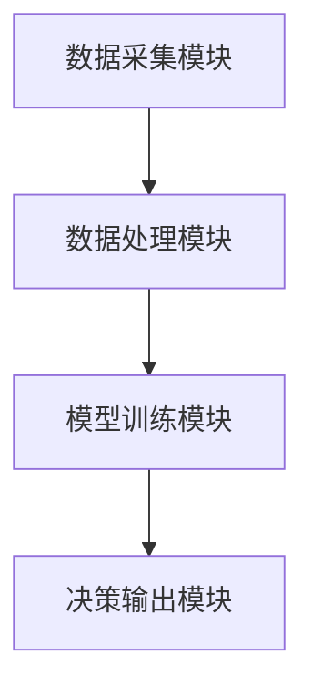

                 


# 特价股票投资中的人工智能辅助决策系统

> **关键词**：人工智能、股票投资、决策系统、机器学习、深度学习、数据挖掘

> **摘要**：本文探讨了人工智能在特价股票投资中的应用，分析了人工智能辅助决策系统的原理、算法和系统设计，并通过实际案例展示了其在投资中的优势。文章详细介绍了系统的各个模块，包括数据采集、模型训练和决策输出，并讨论了系统的优化与风险管理策略。

---

## 第1章: 特价股票投资的背景与概念

### 1.1 特价股票的定义与特点

#### 1.1.1 特价股票的基本概念
特价股票是指在特定条件下，如市场波动、公司公告或促销活动，价格低于正常水平的股票。这些股票通常具有较高的投资潜力，但伴随着较高的风险。

#### 1.1.2 特价股票与普通股票的区别
| 特性 | 特价股票 | 普通股票 |
|------|----------|----------|
| 价格 | 较低     | 正常     |
| 风险 | 较高     | 较低     |
| 投资机会 | 短期    | 长期     |

#### 1.1.3 特价股票的投资价值分析
投资者在选择特价股票时，应考虑公司的基本面、行业前景以及市场整体趋势。

### 1.2 股票投资的基本原理

#### 1.2.1 股票市场的基本运作机制
股票市场是通过买卖股票进行资金流动的市场，价格由供需关系决定。

#### 1.2.2 股票价格波动的规律
股票价格受多种因素影响，包括宏观经济、公司业绩和市场情绪。

#### 1.2.3 投资者行为对股票价格的影响
投资者的买卖行为直接影响股票价格，尤其是短期价格波动。

### 1.3 人工智能在金融投资中的应用

#### 1.3.1 人工智能在金融领域的应用现状
人工智能广泛应用于金融数据挖掘、风险评估和投资决策。

#### 1.3.2 人工智能在股票投资中的优势
人工智能能够处理大量数据，发现人类难以察觉的模式。

#### 1.3.3 人工智能辅助决策系统的概念
该系统通过分析历史数据和市场动态，提供投资建议。

### 1.4 本章小结
本章介绍了特价股票的基本概念和投资价值，分析了人工智能在股票投资中的应用及其优势。

---

## 第2章: 特价股票投资中的问题与挑战

### 2.1 特价股票投资的主要问题

#### 2.1.1 市场波动性对投资决策的影响
股票市场的波动性可能导致投资决策失误。

#### 2.1.2 信息不对称的问题
投资者可能无法获得所有相关信息，影响决策质量。

#### 2.1.3 投资者情绪对决策的影响
情绪化决策可能导致非理性投资行为。

### 2.2 人工智能在解决这些问题中的作用

#### 2.2.1 数据分析与预测能力
人工智能能够处理大量数据，提供准确的预测。

#### 2.2.2 自动化交易策略的优化
通过算法优化交易策略，提高投资效率。

#### 2.2.3 风险管理与控制
利用人工智能实时监控市场风险，制定应对策略。

### 2.3 本章小结
本章分析了特价股票投资中的主要问题，并探讨了人工智能在解决这些问题中的作用。

---

## 第3章: 人工智能辅助决策系统的原理与核心概念

### 3.1 数据驱动的决策机制

#### 3.1.1 数据来源与处理
数据来源包括历史价格、财务报表和市场新闻。

#### 3.1.2 数据特征提取
提取有用的特征，如趋势、均值和标准差。

#### 3.1.3 数据分析与建模
通过建模分析数据，发现潜在规律。

### 3.2 机器学习在股票预测中的应用

#### 3.2.1 监督学习与非监督学习
监督学习基于标记数据，非监督学习发现数据结构。

#### 3.2.2 时间序列预测模型
使用ARIMA或LSTM模型预测股票价格。

#### 3.2.3 神经网络在股票预测中的应用
深度学习模型能够捕捉复杂的价格模式。

### 3.3 系统架构与核心模块

#### 3.3.1 数据采集模块
从多个数据源收集实时数据。

#### 3.3.2 数据处理与分析模块
清洗数据并提取特征。

#### 3.3.3 模型训练与预测模块
训练模型并生成预测结果。

#### 3.3.4 决策输出与反馈模块
输出决策并收集反馈以优化模型。

### 3.4 本章小结
本章详细介绍了人工智能辅助决策系统的原理，包括数据处理、模型训练和决策输出。

---

## 第4章: 系统设计与实现

### 4.1 系统功能需求分析

#### 4.1.1 数据采集与处理
收集历史和实时数据，进行清洗和转换。

#### 4.1.2 模型训练与优化
训练模型并进行参数调整，以提高预测精度。

#### 4.1.3 决策输出与可视化
将预测结果可视化，并提供投资建议。

### 4.2 系统架构设计

#### 4.2.1 模块化设计
系统分为数据采集、数据处理、模型训练和决策输出四个模块。

#### 4.2.2 数据流设计
数据从采集模块流向处理模块，再流向模型训练模块，最后输出决策。

#### 4.2.3 系统交互设计
用户与系统交互，输入参数并接收决策建议。

### 4.3 系统实现

#### 4.3.1 数据预处理代码
```python
import pandas as pd

def preprocess_data(data):
    # 假设data是一个DataFrame
    data = data.dropna()  # 删除缺失值
    data = data.astype(float)  # 转换为浮点数
    return data

# 示例使用
data = pd.read_csv('stock_data.csv')
processed_data = preprocess_data(data)
```

#### 4.3.2 模型训练代码
```python
from sklearn.linear_model import LinearRegression

model = LinearRegression()
model.fit(X, y)
```

#### 4.3.3 系统接口设计
定义API接口，供其他模块调用。

### 4.4 本章小结
本章详细描述了系统的功能需求和架构设计，并给出了实现代码示例。

---

## 第5章: 项目实战与优化

### 5.1 项目实战

#### 5.1.1 环境配置
安装必要的库，如numpy、pandas和scikit-learn。

#### 5.1.2 代码实现
实现数据处理、模型训练和预测的代码。

#### 5.1.3 案例分析
分析实际数据，验证模型预测效果。

### 5.2 系统优化

#### 5.2.1 模型优化
调整模型参数，提高预测精度。

#### 5.2.2 性能优化
优化代码，提升运行效率。

#### 5.2.3 风险管理
制定风险管理策略，降低投资风险。

### 5.3 本章小结
本章通过实际案例展示了系统实现，并讨论了优化策略。

---

## 第6章: 总结与展望

### 6.1 总结
本文详细探讨了人工智能在特价股票投资中的应用，分析了系统设计和实现过程。

### 6.2 展望
未来，随着技术进步，人工智能在股票投资中的应用将更加广泛和深入。

### 6.3 最佳实践
- 定期更新模型参数
- 保持数据源的多样性
- 建立有效的风险管理机制

### 6.4 小结
人工智能辅助决策系统为股票投资提供了有力工具，值得进一步研究和应用。

### 6.5 注意事项
- 风险提示：投资有风险，决策需谨慎
- 数据来源：确保数据的准确性和及时性
- 系统维护：定期更新和维护系统

### 6.6 拓展阅读
建议阅读相关书籍和文献，深入了解机器学习和深度学习在金融中的应用。

---

## 附录

### 附录A: 数据预处理代码
```python
import pandas as pd

def preprocess_data(data):
    data = data.dropna()
    data = data.astype(float)
    return data

data = pd.read_csv('stock_data.csv')
processed_data = preprocess_data(data)
```

### 附录B: 模型训练代码
```python
from sklearn.linear_model import LinearRegression

model = LinearRegression()
model.fit(X, y)
```

### 附录C: 系统架构图


---

通过以上内容，我们详细介绍了人工智能在特价股票投资中的应用，从系统设计到实际实现，为投资者提供了有力的工具和方法。

