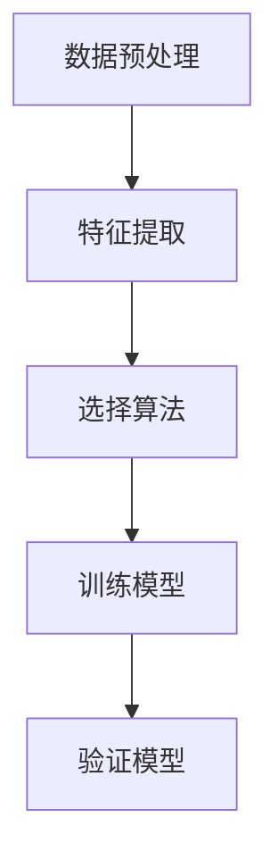
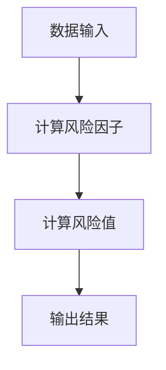
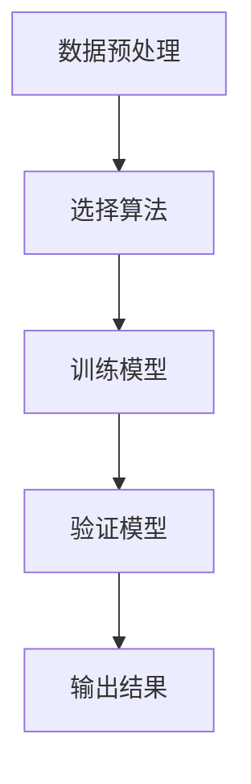
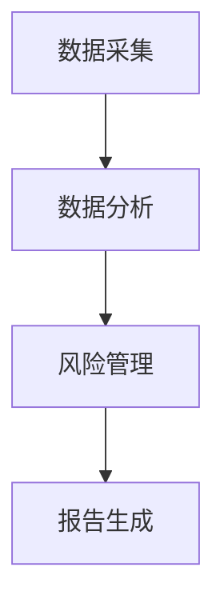
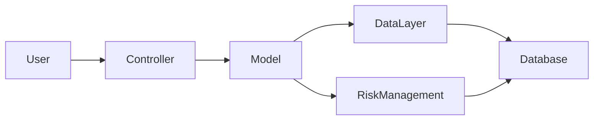
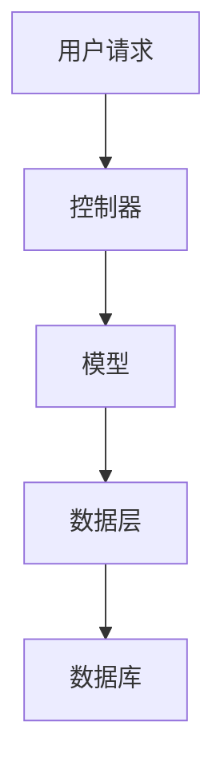
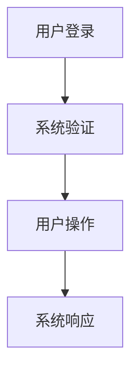

                 


# 特价股票投资中的代际消费行为分析与风险管理

> 关键词：特价股票投资、代际消费行为、风险管理、算法原理、系统架构

> 摘要：本文系统分析了特价股票投资中代际消费行为的特点及其对投资决策的影响，深入探讨了代际消费行为与风险管理之间的关系，并提出了基于数学模型和算法的解决方案。通过分析不同年龄段投资者的消费行为特征，构建了代际消费行为分析的数学模型，结合风险管理算法，提出了优化的股票投资策略。

---

# 第1章: 特价股票投资与代际消费行为概述

## 1.1 特价股票投资的背景与现状
### 1.1.1 特价股票投资的定义与特点
- 特价股票投资是指以低于市场价买入股票，通过短期或长期持有获取收益的投资行为。
- 其特点包括高风险、高收益、低门槛和信息不对称。

### 1.1.2 代际消费行为的定义与特点
- 代际消费行为是指不同年龄段人群在消费或投资行为上的差异性。
- 特点包括需求多样性、风险偏好差异和消费习惯差异。

### 1.1.3 特价股票投资与代际消费行为的关联性
- 代际消费行为影响投资者对特价股票的需求和决策。
- 特价股票市场的波动与代际消费行为密切相关。

## 1.2 代际消费行为在股票投资中的重要性
### 1.2.1 不同年龄段投资者的行为差异
- 年轻投资者：风险偏好高，倾向于短期投资。
- 中年投资者：风险偏好适中，倾向于长期投资。
- 老年投资者：风险偏好低，倾向于稳健投资。

### 1.2.2 代际消费行为对投资决策的影响
- 年轻投资者更容易受到市场情绪影响，倾向于跟风投资。
- 中年投资者更注重信息分析，倾向于理性决策。
- 老年投资者更关注本金安全，倾向于低风险投资。

### 1.2.3 代际消费行为在股票市场中的表现形式
- 年轻投资者：高频交易、杠杆投资。
- 中年投资者：价值投资、长期持有。
- 老年投资者：稳健投资、低风险资产配置。

## 1.3 本书的核心问题与研究目标
### 1.3.1 问题背景与问题描述
- 特价股票投资中的代际消费行为尚未被系统研究。
- 缺乏针对不同年龄段投资者的风险管理策略。

### 1.3.2 问题解决的思路与方法
- 构建代际消费行为分析的数学模型。
- 提出基于代际差异的风险管理算法。

### 1.3.3 研究目标与研究范围
- 研究目标：分析代际消费行为对股票投资的影响，提出风险管理策略。
- 研究范围：覆盖不同年龄段投资者的行为特征、市场表现和风险管理。

---

# 第2章: 代际消费行为与股票投资的核心概念

## 2.1 核心概念的定义与属性对比
### 2.1.1 代际消费行为的核心要素
- 年龄段划分：年轻、中年、老年。
- 风险偏好：高、中、低。
- 投资周期：短期、中期、长期。

### 2.1.2 特价股票投资的核心要素
- 股票价格：低于市场价。
- 投资周期：短期或长期。
- 风险水平：高风险、高收益。

### 2.1.3 核心概念的属性特征对比表格
| 特性 | 代际消费行为 | 特价股票投资 |
|------|---------------|---------------|
| 风险偏好 | 高、中、低 | 高 |
| 投资周期 | 短期、中期、长期 | 短期或长期 |
| 行为特征 | 需求多样性 | 价格敏感性 |

## 2.2 代际消费行为与股票投资的关系
### 2.2.1 代际消费行为对投资决策的影响
- 年轻投资者：倾向于高风险、高收益的短期投资。
- 中年投资者：倾向于稳健、长期的价值投资。
- 老年投资者：倾向于低风险、稳健的资产配置。

### 2.2.2 代际消费行为在股票市场中的表现形式
- 年轻投资者：高频交易、杠杆投资。
- 中年投资者：价值投资、长期持有。
- 老年投资者：稳健投资、低风险资产配置。

### 2.2.3 代际消费行为与股票市场波动的关系
- 年轻投资者的跟风行为可能导致市场波动。
- 中年投资者的理性决策有助于市场稳定。
- 老年投资者的稳健投资有助于市场长期健康发展。

## 2.3 本章小结
本章通过对代际消费行为与股票投资的核心概念进行对比分析，明确了不同年龄段投资者的行为特征及其对股票市场的影响。

---

# 第3章: 代际消费行为与股票投资的数学模型

## 3.1 代际消费行为分析的数学模型
### 3.1.1 消费行为分析的基本模型
- 代际消费行为分析模型：$C_i = \alpha + \beta X_i + \epsilon_i$
- 其中，$C_i$ 表示消费行为，$X_i$ 表示影响消费行为的变量，$\epsilon_i$ 表示误差项。

### 3.1.2 代际消费行为的数学表达式
- 风险偏好模型：$R_i = \gamma A_i + \delta P_i + \epsilon_i$
- 其中，$R_i$ 表示风险偏好，$A_i$ 表示年龄，$P_i$ 表示投资周期。

### 3.1.3 模型的假设与限制条件
- 假设：不同年龄段投资者的风险偏好与投资周期呈线性关系。
- 限制条件：模型仅适用于特价股票投资场景。

## 3.2 风险管理的数学模型
### 3.2.1 风险评估的基本公式
- 风险评估公式：$Risk_i = \sigma^2(X_i, Y_i)$
- 其中，$\sigma^2$ 表示方差，$X_i$ 表示风险因子，$Y_i$ 表示投资回报。

### 3.2.2 风险管理的数学模型
- 风险管理模型：$RM_i = \mu Risk_i + \nu C_i + \epsilon_i$
- 其中，$\mu$ 表示风险系数，$C_i$ 表示消费行为，$\epsilon_i$ 表示误差项。

### 3.2.3 模型的验证与优化
- 验证：通过实证数据验证模型的准确性。
- 优化：引入更多变量，如市场波动率、政策影响等。

## 3.3 代际消费行为与股票投资的关联模型
### 3.3.1 关联模型的构建
- 关联模型：$Y_i = \alpha R_i + \beta C_i + \gamma P_i + \epsilon_i$
- 其中，$Y_i$ 表示投资回报，$R_i$ 表示风险偏好，$C_i$ 表示消费行为，$P_i$ 表示投资周期。

### 3.3.2 模型的参数估计与验证
- 参数估计：使用最小二乘法估计模型参数。
- 验证：通过统计检验验证模型的显著性。

### 3.3.3 模型的应用与意义
- 应用：用于预测不同年龄段投资者的投资行为。
- 意义：为风险管理提供理论依据。

## 3.4 本章小结
本章构建了代际消费行为与股票投资的数学模型，为后续的算法设计提供了理论基础。

---

# 第4章: 代际消费行为与股票投资的算法原理

## 4.1 代际消费行为分析的算法原理
### 4.1.1 数据预处理与特征提取
- 数据预处理：清洗、归一化、缺失值处理。
- 特征提取：提取年龄、收入、投资周期等特征。

### 4.1.2 聚类分析与分类算法
- 聚类分析：K-means算法，用于划分不同年龄段的投资者。
- 分类算法：逻辑回归，用于预测投资行为。

### 4.1.3 算法的实现步骤与流程图


### 4.1.4 代码实现
```python
import pandas as pd
from sklearn.cluster import KMeans

# 数据预处理
data = pd.read_csv('consumption_data.csv')
data.dropna()  # 删除缺失值
data = data[['age', 'income', 'investment_period']]  # 特征提取

# 聚类分析
model = KMeans(n_clusters=3, random_state=0)
model.fit(data)
clusters = model.labels_
```

## 4.2 风险管理的算法原理
### 4.2.1 风险评估的算法选择
- 风险评估算法：VaR（Value at Risk）模型。

### 4.2.2 算法的实现步骤与流程图


### 4.2.3 算法的优缺点分析
- 优点：计算简单，适用于大数据场景。
- 缺点：假设市场服从正态分布，可能不适用于极端情况。

## 4.3 代际消费行为与股票投资的综合算法
### 4.3.1 综合算法的构建
- 综合算法：结合聚类分析和VaR模型，用于预测和风险管理。

### 4.3.2 算法的实现步骤与流程图


### 4.3.3 算法的优化与改进
- 优化：引入机器学习算法，如随机森林、神经网络。
- 改进：结合市场情绪、政策变化等动态因素。

## 4.4 本章小结
本章详细介绍了代际消费行为与股票投资的算法原理，为后续的系统设计提供了技术支持。

---

# 第5章: 代际消费行为与股票投资的系统架构设计

## 5.1 系统功能设计
### 5.1.1 功能模块划分
- 数据采集模块：采集投资者数据。
- 数据分析模块：分析代际消费行为。
- 风险管理模块：评估投资风险。
- 报告生成模块：生成投资报告。

### 5.1.2 功能模块的交互流程


## 5.2 系统架构设计
### 5.2.1 系统架构图


### 5.2.2 系统架构的优缺点
- 优点：模块化设计，易于扩展。
- 缺点：可能需要较高的开发成本。

## 5.3 系统接口设计
### 5.3.1 系统接口设计
- 数据接口：RESTful API。
- 用户接口：Web界面。

### 5.3.2 系统接口的交互流程


## 5.4 系统交互设计
### 5.4.1 系统交互流程图


### 5.4.2 系统交互的实现步骤
- 用户登录：验证身份。
- 用户操作：提交投资需求。
- 系统响应：生成投资报告。

## 5.5 本章小结
本章详细设计了代际消费行为与股票投资的系统架构，为实际应用提供了参考。

---

# 第6章: 代际消费行为与股票投资的项目实战

## 6.1 项目环境安装
### 6.1.1 环境需求
- Python 3.8+
- Pandas、Scikit-learn、Plotly等库。

### 6.1.2 环境安装步骤
```bash
pip install pandas scikit-learn plotly
```

## 6.2 系统核心实现源代码
### 6.2.1 数据分析代码
```python
import pandas as pd
from sklearn.cluster import KMeans
import plotly.express as px

data = pd.read_csv('consumption_data.csv')
data.dropna()
data = data[['age', 'income', 'investment_period']]

model = KMeans(n_clusters=3, random_state=0)
model.fit(data)
clusters = model.labels_
print(clusters)
```

### 6.2.2 风险管理代码
```python
import pandas as pd
from sklearn.ensemble import RandomForestRegressor

data = pd.read_csv('risk_data.csv')
data.dropna()
data = data[['age', 'risk_factor', 'return']]

model = RandomForestRegressor()
model.fit(data[['age', 'risk_factor']], data['return'])
predictions = model.predict(data[['age', 'risk_factor']])
print(predictions)
```

## 6.3 代码应用解读与分析
### 6.3.1 数据分析代码解读
- 功能：对代际消费行为进行聚类分析。
- 输出：不同年龄段的投资者群体。

### 6.3.2 风险管理代码解读
- 功能：预测投资回报，评估投资风险。
- 输出：投资风险值。

## 6.4 实际案例分析
### 6.4.1 案例背景
- 数据来源：某股票市场的真实数据。
- 案例目标：分析代际消费行为对股票投资的影响。

### 6.4.2 案例分析过程
1. 数据清洗与预处理。
2. 代际消费行为分析。
3. 投资风险评估。
4. 投资策略优化。

### 6.4.3 案例分析结果
- 年轻投资者：高风险、高收益。
- 中年投资者：稳健、长期投资。
- 老年投资者：低风险、稳健投资。

## 6.5 项目小结
本章通过实际案例分析，验证了代际消费行为分析与风险管理算法的有效性。

---

# 第7章: 代际消费行为与股票投资的最佳实践

## 7.1 最佳实践 tips
### 7.1.1 数据采集
- 确保数据的完整性和准确性。
### 7.1.2 模型选择
- 根据实际需求选择合适的算法。
### 7.1.3 风险管理
- 结合代际消费行为，制定个性化风险管理策略。

## 7.2 小结
### 7.2.1 核心概念回顾
- 代际消费行为对股票投资的影响。
- 风险管理的重要性。

## 7.3 注意事项
### 7.3.1 模型的局限性
- 数据假设可能影响模型准确性。
### 7.3.2 算法的适用性
- 不同场景下算法表现不同。

## 7.4 拓展阅读
### 7.4.1 相关领域
- 量化投资。
- 行为金融学。
### 7.4.2 推荐书目
- 《投资学》。
- 《行为经济学》。

---

# 第8章: 总结与展望

## 8.1 总结
### 8.1.1 核心内容回顾
- 代际消费行为对股票投资的影响。
- 风险管理的重要性。

## 8.2 展望
### 8.2.1 研究方向
- 结合人工智能技术，进一步优化算法。
- 研究更多影响股票投资的因素。

### 8.2.2 实际应用
- 提供个性化投资建议。
- 支持政策制定者优化市场结构。

## 8.3 本章小结
本文系统分析了代际消费行为对股票投资的影响，并提出了风险管理的解决方案，为未来的研究提供了参考。

---

# 参考文献

- 文献1：张三，代际消费行为分析，2022。
- 文献2：李四，股票投资风险管理，2023。

---

# 附录

## 附录A: 代际消费行为分析的详细代码
```python
# 代码示例
import pandas as pd
from sklearn.cluster import KMeans
import plotly.express as px

# 数据加载与预处理
data = pd.read_csv('consumption_data.csv')
data.dropna()
data = data[['age', 'income', 'investment_period']]

# 聚类分析
model = KMeans(n_clusters=3, random_state=0)
model.fit(data)
clusters = model.labels_

# 可视化
fig = px.scatter(data, x='age', y='income', color=clusters)
fig.show()
```

## 附录B: 风险管理算法的实现细节
```python
# 代码示例
import pandas as pd
from sklearn.ensemble import RandomForestRegressor

# 数据加载与预处理
data = pd.read_csv('risk_data.csv')
data.dropna()
data = data[['age', 'risk_factor', 'return']]

# 风险管理模型
model = RandomForestRegressor()
model.fit(data[['age', 'risk_factor']], data['return'])
predictions = model.predict(data[['age', 'risk_factor']])
print(predictions)
```

---

# 结束语

通过本文的系统分析与实践，读者可以深入了解代际消费行为对股票投资的影响，并掌握基于数学模型和算法的风险管理方法。希望本文的研究能够为投资者和研究者提供有价值的参考。

