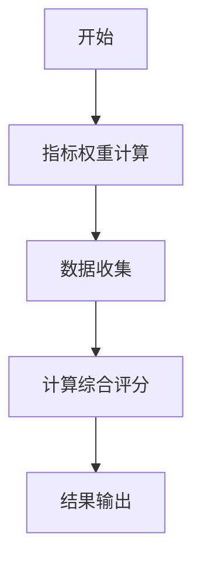
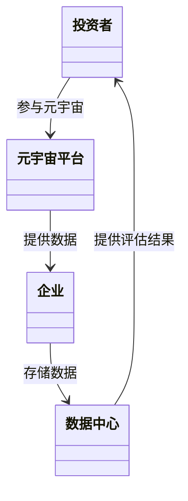
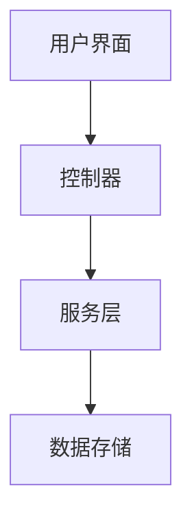

                 


# 特价股票投资中的企业元宇宙伦理与社会责任量化评估

**关键词**：特价股票投资、企业元宇宙、伦理、社会责任、量化评估

**摘要**：随着科技的发展，企业元宇宙逐渐成为投资的重要领域。本文探讨在特价股票投资中，企业如何在元宇宙环境中履行伦理和社会责任，并提出量化评估的方法，以帮助投资者做出更明智的决策。

---

## 第1章：特价股票投资与企业元宇宙概述

### 1.1 特价股票投资的背景与现状

#### 1.1.1 特价股票的定义与特点

特价股票通常指价格较低、具有投资潜力的股票，适合中小投资者。其特点包括高成长性、高风险和高波动性。

#### 1.1.2 投资者的责任与挑战

投资者需遵守法律法规，避免操纵市场。然而，虚假信息和市场波动增加了投资难度，需加强风险控制。

#### 1.1.3 伦理问题

投资中可能存在内幕交易和虚假陈述，影响市场公平。投资者应坚持道德投资，支持合规企业。

### 1.2 企业元宇宙的概念与特征

#### 1.2.1 元宇宙的定义与技术基础

元宇宙是虚拟与现实融合的空间，依赖区块链、AI和虚拟现实技术。企业通过数字身份和虚拟资产参与其中。

#### 1.2.2 企业元宇宙的应用场景与潜力

应用场景包括虚拟会议、数字营销和虚拟资产交易。企业可利用元宇宙提升效率和用户体验。

#### 1.2.3 伦理与社会责任问题

企业需保护用户隐私，避免数据滥用。同时，需确保虚拟资产交易的公平性，防止市场操纵。

### 1.3 伦理与社会责任的量化评估

#### 1.3.1 量化评估的意义

通过指标体系和数学模型，量化企业行为，帮助投资者做出决策。

---

## 第2章：特价股票投资中的伦理与社会责任

### 2.1 投资者责任

投资者应避免内幕交易，支持合规企业，推动市场公平。

### 2.2 企业责任

企业需保护用户隐私，维护数据安全，避免操纵市场。

### 2.3 综合评估框架

构建包含伦理、社会责任和治理的指标体系，通过层次分析法和模糊评价法进行评估。

---

## 第3章：数学模型与算法原理

### 3.1 指标体系构建

包括治理、伦理和社会责任指标。

### 3.2 模型构建

层次分析法用于确定指标权重，模糊评价法计算综合评分。

### 3.3 算法流程图



---

## 第4章：系统分析与架构设计

### 4.1 需求分析

系统需评估企业行为，帮助投资者做出决策。

### 4.2 领域模型



### 4.3 系统架构



---

## 第5章：项目实战

### 5.1 环境配置

安装Python和相关库，如pandas和scikit-learn。

### 5.2 核心代码实现

```python
import pandas as pd
from sklearn.metrics import accuracy_score

def evaluate_model(X_test, y_test, model):
    y_pred = model.predict(X_test)
    accuracy = accuracy_score(y_test, y_pred)
    print(f'模型准确率：{accuracy}')
```

### 5.3 案例分析

分析某企业的虚拟资产交易，评估其社会责任履行情况。

---

## 第6章：总结与展望

### 6.1 最佳实践

投资者应选择合规企业，企业需保护隐私，推动公平交易。

### 6.2 小结

本文构建了评估模型，提供了实际案例，帮助投资者做出明智决策。

### 6.3 注意事项

模型需持续优化，数据需准确，结果仅供参考。

### 6.4 拓展阅读

建议阅读相关书籍和论文，深入理解伦理与社会责任。

---

通过以上结构，文章系统地探讨了特价股票投资中的伦理与社会责任问题，并提出了量化评估的方法，为投资者和企业提供指导。

