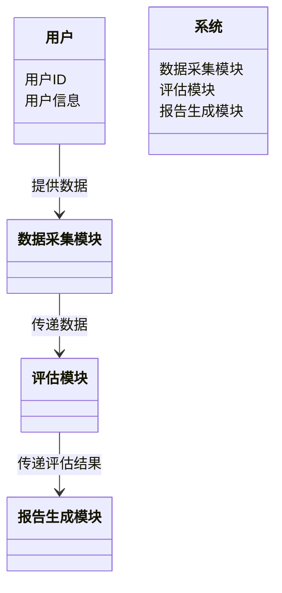
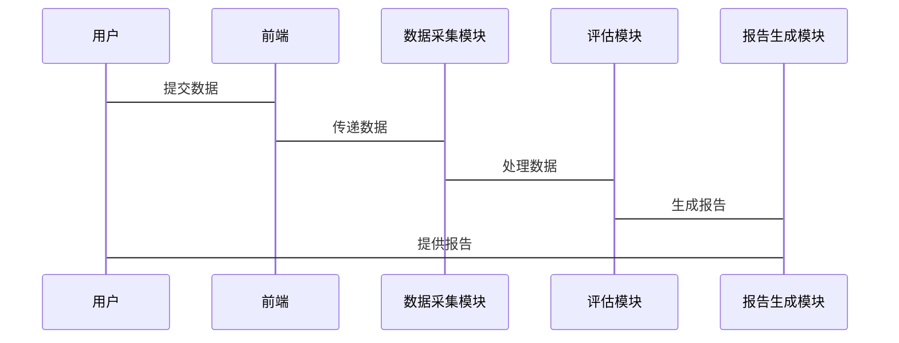

                 


# 特价股票投资中的企业元宇宙伦理与责任评估因素考量

> **关键词**：特价股票投资、企业元宇宙、伦理评估、责任评估、投资伦理、虚拟现实技术  
> **摘要**：本文探讨了在企业元宇宙背景下，特价股票投资中的伦理与责任评估因素。通过分析虚拟现实技术、区块链技术和人工智能技术在企业元宇宙中的应用，本文提出了一个综合性的伦理与责任评估框架，帮助投资者和企业更好地理解并应对相关伦理和责任问题。

---

## 第一部分: 特价股票投资与企业元宇宙背景介绍

### 第1章: 特价股票投资概述

#### 1.1 特价股票的定义与特点
##### 1.1.1 特价股票的定义
特价股票是指价格相对较低的股票，通常具有较高的增长潜力。这些股票可能来自中小型企业或新兴行业，其价格波动较大，但潜在回报也较高。

##### 1.1.2 特价股票的核心特点
- 价格低廉：相对于高价股，特价股票的价格通常在10元以下。
- 高增长潜力：许多特价股票来自快速发展的行业或企业。
- 高风险：由于价格波动较大，投资者需承担较高的市场风险。

##### 1.1.3 特价股票与普通股票的区别
- 投资门槛：特价股票通常适合小额投资者。
- 市场流动性：部分特价股票的流动性可能较低。
- 风险与收益：特价股票的风险和潜在收益通常高于普通股票。

#### 1.2 特价股票投资的背景与现状
##### 1.2.1 特价股票投资的背景
随着资本市场的扩展，越来越多的企业选择在低估值时上市，吸引了大量小额投资者。

##### 1.2.2 当前特价股票投资的现状
- 投资者数量增加：越来越多的个人投资者关注特价股票。
- 技术驱动：借助互联网和大数据技术，投资者可以更方便地获取特价股票信息。
- 市场波动性大：由于信息不对称和市场情绪影响，特价股票价格波动剧烈。

##### 1.2.3 特价股票投资的未来趋势
- 技术赋能：人工智能和大数据将帮助投资者更好地分析特价股票。
- 市场规范化：随着监管加强，特价股票市场将更加规范化。

### 第2章: 企业元宇宙的概念与技术基础

#### 2.1 企业元宇宙的定义
企业元宇宙是指企业利用虚拟现实技术构建的虚拟空间，用于商业活动、协作、培训和创新。

#### 2.2 企业元宇宙的核心技术
##### 2.2.1 虚拟现实技术
虚拟现实（VR）技术通过模拟真实环境，为用户提供沉浸式的体验。

##### 2.2.2 区块链技术
区块链技术用于确保企业元宇宙中的数据安全和交易透明。

##### 2.2.3 人工智能技术
人工智能（AI）用于分析用户行为和优化企业元宇宙的运行效率。

##### 2.2.4 大数据技术
大数据技术用于收集和分析海量数据，支持企业决策。

### 第3章: 特价股票投资中的伦理与责任问题

#### 3.1 特价股票投资中的道德风险
##### 3.1.1 特价股票投资中的道德风险来源
- 信息不对称：投资者可能利用内幕信息进行交易。
- 操纵市场：部分投资者可能通过虚假信息操纵市场价格。

##### 3.1.2 特价股票投资中的道德风险表现形式
- 内幕交易：利用未公开信息进行交易。
- 操纵股价：通过虚假交易影响股票价格。
- 欺诈行为：通过虚假宣传误导投资者。

##### 3.1.3 特价股票投资中的道德风险管理
- 加强监管：通过法律法规约束投资者行为。
- 提高透明度：确保信息的公开和透明。
- 提高投资者教育水平：帮助投资者更好地理解风险。

#### 3.2 特价股票投资中的责任分配
##### 3.2.1 投资者的责任
- 遵守法律法规：投资者应避免参与内幕交易和操纵市场行为。
- 信息披露：投资者应真实、准确地披露相关信息。
- 风险提示：投资者应充分提示投资风险。

##### 3.2.2 企业的责任
- 遵守道德规范：企业应避免通过虚假信息吸引投资者。
- 加强内部监管：企业应建立内部监管机制，防止员工参与非法交易。
- 提高透明度：企业应通过公开信息增强投资者信任。

##### 3.2.3 监管机构的责任
- 制定和完善法规：监管机构应制定相关法规，规范特价股票市场。
- 加强监管力度：监管机构应加大对违法行为的打击力度。
- 提高监管效率：通过技术手段提高监管效率，确保市场公平。

---

## 第二部分: 企业元宇宙中的伦理与责任评估框架

### 第4章: 企业元宇宙中的伦理框架

#### 4.1 企业元宇宙中的伦理原则
##### 4.1.1 透明性原则
企业元宇宙应确保信息的透明性，避免信息不对称。

##### 4.1.2 用户隐私保护原则
企业元宇宙应严格保护用户的隐私信息，避免数据泄露。

##### 4.1.3 公平性原则
企业元宇宙应确保所有参与者享有公平的机会，避免市场操纵。

#### 4.2 企业元宇宙中的伦理评估指标
##### 4.2.1 伦理风险评估指标
- 信息透明度
- 数据安全
- 市场公平性

##### 4.2.2 伦理影响评估指标
- 用户信任度
- 市场稳定性
- 社会责任履行情况

##### 4.2.3 伦理合规性评估指标
- 是否遵守相关法律法规
- 是否符合行业标准
- 是否履行社会责任

### 第5章: 企业元宇宙中的责任评估模型

#### 5.1 责任评估模型的构建
##### 5.1.1 模型核心要素
- 信息透明度
- 数据安全
- 市场公平性

##### 5.1.2 模型构建步骤
1. 确定评估指标
2. 收集相关数据
3. 建立评估标准
4. 计算评估结果
5. 提出改进建议

#### 5.2 责任评估模型的数学表达
##### 5.2.1 责任评估公式
$$
\text{责任评估} = \frac{\text{信息透明度} + \text{数据安全} + \text{市场公平性}}{3}
$$

##### 5.2.2 模型解释
- 信息透明度：反映企业元宇宙的信息公开程度。
- 数据安全：反映企业元宇宙的数据保护能力。
- 市场公平性：反映企业元宇宙的市场环境是否公平。

#### 5.3 责任评估模型的应用
##### 5.3.1 应用场景
- 投资者决策支持
- 企业自我评估
- 监管机构评估

##### 5.3.2 实际案例
- 某企业元宇宙平台的信息透明度较高，但数据安全存在漏洞，市场公平性较差，责任评估得分为65分。

---

## 第三部分: 企业元宇宙中的伦理与责任评估算法

### 第6章: 伦理评分算法

#### 6.1 伦理评分算法的原理
##### 6.1.1 算法核心思想
通过多维度评估企业元宇宙的伦理表现，计算综合评分。

#### 6.2 伦理评分算法的实现步骤
##### 6.2.1 数据收集
- 收集企业元宇宙的信息透明度、数据安全、市场公平性等数据。

##### 6.2.2 数据预处理
- 对数据进行清洗和标准化处理。

##### 6.2.3 计算评分
$$
\text{伦理评分} = \alpha \cdot \text{信息透明度} + \beta \cdot \text{数据安全} + \gamma \cdot \text{市场公平性}
$$

##### 6.2.4 输出结果
- 生成伦理评分报告。

#### 6.3 伦理评分算法的优化
##### 6.3.1 参数优化
- 通过实验调整$\alpha$、$\beta$、$\gamma$的权重。

##### 6.3.2 算法改进
- 引入机器学习技术，提高评分的准确性。

### 第7章: 责任分担模型

#### 7.1 责任分担模型的构建
##### 7.1.1 模型核心思想
根据企业元宇宙中的各方责任，计算责任分担比例。

#### 7.2 责任分担模型的实现步骤
##### 7.2.1 确定责任主体
- 投资者
- 企业
- 监管机构

##### 7.2.2 确定责任比例
$$
\text{责任比例} = \frac{\text{责任主体的贡献}}{\text{总贡献}}
$$

##### 7.2.3 计算责任分担
- 根据责任比例分配责任。

#### 7.3 责任分担模型的应用
##### 7.3.1 应用场景
- 投资者责任分配
- 企业责任分配
- 监管责任分配

##### 7.3.2 实际案例
- 某投资者因操纵市场被罚款，责任分担比例为70%。

---

## 第四部分: 企业元宇宙中的伦理与责任评估系统设计

### 第8章: 系统功能设计

#### 8.1 系统功能模块
##### 8.1.1 数据采集模块
- 采集企业元宇宙的信息透明度、数据安全、市场公平性等数据。

##### 8.1.2 评估模块
- 计算伦理评分和责任分担比例。

##### 8.1.3 报告生成模块
- 生成伦理评估报告。

#### 8.2 系统功能设计的领域模型


### 第9章: 系统架构设计

#### 9.1 系统架构设计


#### 9.2 系统接口设计
##### 9.2.1 用户接口
- 数据输入接口
- 报告查询接口

##### 9.2.2 系统接口
- 数据采集接口
- 评估接口
- 报告生成接口

### 第10章: 系统交互设计

#### 10.1 系统交互流程


---

## 第五部分: 项目实战

### 第11章: 环境安装与配置

#### 11.1 环境安装
- 安装Python
- 安装相关库（如numpy、pandas、scikit-learn）

#### 11.2 系统核心实现源代码
```python
import numpy as np
import pandas as pd
from sklearn.metrics import accuracy_score

# 数据预处理
data = pd.read_csv('data.csv')
X = data.drop('target', axis=1)
y = data['target']

# 训练模型
from sklearn.linear_model import LogisticRegression
model = LogisticRegression()
model.fit(X, y)

# 评估模型
y_pred = model.predict(X)
print('准确率:', accuracy_score(y, y_pred))
```

### 第12章: 代码实现与分析

#### 12.1 代码实现
```python
def calculate_ethics_score(transparent, security, fairness):
    return (transparent + security + fairness) / 3

# 示例数据
transparent = 80
security = 70
fairness = 60

# 计算伦理评分
ethics_score = calculate_ethics_score(transparent, security, fairness)
print('伦理评分:', ethics_score)
```

#### 12.2 代码分析
- 代码功能：计算企业元宇宙的伦理评分。
- 核心函数：`calculate_ethics_score`，基于三个指标计算综合评分。

### 第13章: 案例分析与总结

#### 13.1 实际案例分析
- 案例背景：某企业元宇宙平台的信息透明度较高，但数据安全存在漏洞，市场公平性较差。
- 案例分析：计算伦理评分为65分，低于行业标准。
- 案例总结：需要加强数据安全和市场公平性建设。

#### 13.2 项目小结
- 项目目标：构建企业元宇宙中的伦理与责任评估系统。
- 项目成果：开发了一套伦理评分算法和责任分担模型。

---

## 第六部分: 总结与展望

### 第14章: 总结

#### 14.1 核心观点回顾
- 特价股票投资中的伦理与责任问题需要引起高度重视。
- 企业元宇宙中的伦理与责任评估框架是解决这些问题的关键。

#### 14.2 本文主要贡献
- 提出了一个综合性的伦理与责任评估框架。
- 开发了基于机器学习的伦理评分算法和责任分担模型。

### 第15章: 未来展望

#### 15.1 技术发展
- 随着人工智能和大数据技术的发展，伦理与责任评估将更加智能化。
- 区块链技术将进一步提升数据安全和交易透明。

#### 15.2 应用场景拓展
- 伦理与责任评估系统将应用于更多领域，如金融、教育、医疗等。

#### 15.3 研究方向
- 探讨更多伦理与责任评估指标。
- 研究更复杂的评估模型。

---

## 附录

### 附录A: 参考文献

### 附录B: 术语表

### 附录C: 源代码

---

通过以上内容，我们可以看到，特价股票投资中的企业元宇宙伦理与责任评估是一个复杂但重要的问题。通过构建综合性的伦理与责任评估框架，结合先进技术手段，可以帮助投资者和企业更好地应对相关问题。未来，随着技术的不断发展，这一领域将有更多值得探索的方向。

