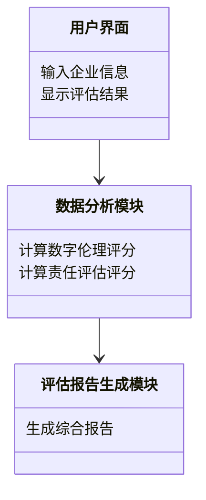

                 


# 特价股票投资中的企业数字伦理与责任评估因素考量

## 关键词：特价股票投资、数字伦理、责任评估、企业责任、投资决策

## 摘要：本文探讨了在特价股票投资中，企业数字伦理和责任评估的重要性及其对投资决策的影响。通过分析这些因素，本文提出了一种综合评估模型，并通过实际案例验证了其有效性。

---

# 第1章 特价股票投资的背景与概述

## 1.1 特价股票投资的定义与特点

### 1.1.1 特价股票的定义
特价股票是指价格低于其内在价值，具有较大上涨潜力的股票。投资者通常寻找被市场低估的企业进行投资。

### 1.1.2 特价股票投资的特点
- 价格优势：股票价格低于行业平均水平。
- 高成长性：企业具有良好的增长潜力。
- 风险与收益平衡：高回报伴随较高风险。

### 1.1.3 特价股票投资的市场现状
当前市场中，特价股票投资受到越来越多投资者的关注，尤其是在经济波动时期，投资者寻求高性价比的投资机会。

## 1.2 数字伦理与责任评估的定义

### 1.2.1 数字伦理的定义
数字伦理涉及企业在数字时代的行为准则，包括数据隐私、算法公平性等方面。

### 1.2.2 责任评估的定义
责任评估是对企业在社会责任、环境保护等方面的综合评价。

### 1.2.3 数字伦理与责任评估的核心要素
- 数据隐私
- 算法公平性
- 环境影响
- 社会责任

## 1.3 特价股票投资中的数字伦理与责任评估

### 1.3.1 数字伦理在投资中的重要性
企业的数字伦理直接影响其长期发展和投资价值。

### 1.3.2 责任评估在投资中的作用
评估企业是否符合社会责任标准，影响投资决策。

### 1.3.3 数字伦理与责任评估的结合
通过综合评估企业数字行为和责任履行情况，优化投资选择。

## 1.4 本章小结
本章介绍了特价股票投资的基本概念，以及数字伦理和责任评估在投资中的重要性。

---

# 第2章 企业数字伦理与责任评估的核心概念与联系

## 2.1 企业数字伦理的核心要素

### 2.1.1 企业数字伦理的定义与框架
数字伦理框架包括数据隐私、算法公平性等核心要素。

### 2.1.2 企业数字伦理的核心要素
- 数据隐私
- 算法公平性
- 数字安全

## 2.2 责任评估的定义与框架

### 2.2.1 责任评估的定义与框架
责任评估框架包括社会责任、环境保护等方面。

### 2.2.2 责任评估的核心要素
- 社会责任
- 环境保护
- 治理结构

## 2.3 数字伦理与责任评估的关系

### 2.3.1 数字伦理与责任评估的联系
两者共同影响企业的长期发展和投资价值。

### 2.3.2 数字伦理与责任评估的差异
数字伦理侧重技术层面，责任评估侧重企业行为。

## 2.4 本章小结
本章详细分析了企业数字伦理和责任评估的核心要素及其关系。

---

# 第3章 企业数字伦理与责任评估的算法与数学模型

## 3.1 数字伦理评分模型

### 3.1.1 模型定义与原理
数字伦理评分模型综合评估企业的数据隐私、算法公平性等因素。

### 3.1.2 模型实现
使用Python编写模型，根据各项指标计算伦理评分。

```python
def calculate_ethical_score(data_privacy, algorithm_fairness, digital_security):
    score = (data_privacy + algorithm_fairness + digital_security) / 3
    return score
```

## 3.2 责任风险评估模型

### 3.2.1 模型定义与原理
责任风险模型评估企业在社会责任和环境保护方面的表现。

### 3.2.2 模型实现
使用数学公式计算责任风险指数。

$$ \text{责任风险指数} = \frac{\text{社会责任评分} + \text{环境保护评分}}{2} $$

## 3.3 综合评估模型

### 3.3.1 综合评估模型的定义与原理
综合模型结合数字伦理和责任评估，提供全面的投资评估。

### 3.3.2 模型实现
通过权重分配，综合计算企业综合评分。

$$ \text{综合评分} = 0.4 \times \text{数字伦理评分} + 0.6 \times \text{责任评估评分} $$

## 3.4 本章小结
本章介绍了数字伦理和责任评估的算法模型，并展示了如何通过数学公式进行综合评分。

---

# 第4章 系统分析与架构设计

## 4.1 问题场景介绍

### 4.1.1 投资者需求
投资者需要评估企业的数字伦理和责任表现。

### 4.1.2 系统目标
构建一个评估系统，帮助投资者做出明智决策。

## 4.2 系统功能设计

### 4.2.1 系统功能模块
- 用户界面
- 数据分析模块
- 评估报告生成模块

### 4.2.2 系统功能设计的领域模型


## 4.3 系统架构设计

### 4.3.1 系统架构


## 4.4 系统接口设计

### 4.4.1 接口设计
- 数据输入接口
- 评估结果输出接口

## 4.5 系统交互设计

### 4.5.1 系统交互流程
```mermaid
sequenceDiagram
    用户 -> 系统: 提交企业信息
    系统 -> 分析模块: 开始评估
    分析模块 -> 返回结果
    系统 -> 用户: 显示报告
```

## 4.6 本章小结
本章设计了一个评估系统，展示了其架构和功能模块。

---

# 第5章 项目实战

## 5.1 环境安装

### 5.1.1 系统要求
- Python 3.8+
- 数据分析库（如Pandas、Scikit-learn）

## 5.2 核心代码实现

### 5.2.1 数据预处理
```python
import pandas as pd

data = pd.read_csv('企业数据.csv')
data = data.dropna()
```

### 5.2.2 模型训练
```python
from sklearn.model_selection import train_test_split
from sklearn.metrics import accuracy_score

X = data.drop('综合评分', axis=1)
y = data['综合评分']
X_train, X_test, y_train, y_test = train_test_split(X, y, test_size=0.2)
```

## 5.3 案例分析

### 5.3.1 案例介绍
选择某科技公司，分析其数字伦理和责任表现。

## 5.4 项目总结
通过案例分析，验证了模型的有效性，为企业评估提供了参考。

## 5.5 本章小结
本章通过实际案例展示了系统的应用，验证了模型的有效性。

---

# 第6章 最佳实践与小结

## 6.1 最佳实践 tips

### 6.1.1 投资前评估
全面评估企业的数字伦理和责任表现。

### 6.1.2 持续监控
定期更新评估结果，适应市场变化。

## 6.2 本章小结
总结了文章的核心内容，并提出了实际应用中的注意事项和未来发展方向。

---

# 第7章 附录

## 7.1 工具与资源

### 7.1.1 数据分析工具
- Python
- Pandas
- Scikit-learn

## 7.2 进一步阅读

### 7.2.1 推荐书籍
- 《企业数字伦理》
- 《投资决策与社会责任》

## 7.3 本章小结
本章提供了进一步学习的资源和工具，帮助读者深入研究相关领域。

---

# 结语

通过本文的分析，投资者可以更好地评估企业的数字伦理和责任表现，做出更明智的投资决策。未来，随着技术的发展，这些评估方法将更加重要。

--- 

感谢您的阅读，希望本文对您在特价股票投资中的企业数字伦理与责任评估因素考量有所启发！

