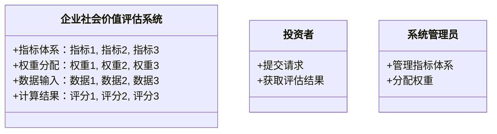
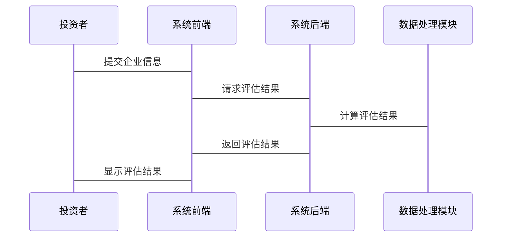

                 


# 特价股票投资中的企业社会价值评估因素考量

> 关键词：特价股票、企业社会价值、投资评估、多层次指标、社会价值评分

> 摘要：本文深入探讨了在特价股票投资中，企业社会价值评估的重要性与具体方法。文章首先介绍了特价股票的基本概念及其投资价值，然后详细阐述了企业社会价值的多维度评估框架，包括核心指标的设计与权重分配。接着，文章从算法与数学模型的角度，分析了如何基于层次分析法（AHP）和模糊综合评价法构建社会价值评估模型，并通过实例展示了这些模型的应用过程。最后，文章结合实际案例，探讨了如何将社会价值评估结果应用于投资决策，并提出了相关的优化建议。本文旨在为投资者提供一种全新的视角，以更全面地评估特价股票的投资价值。

---

# 第一部分: 特价股票与企业社会价值评估背景与概念

## 第1章: 特价股票与企业社会价值评估概述

### 1.1 特价股票的定义与特性

#### 1.1.1 特价股票的基本概念
特价股票是指低于股票面值发行的股票，通常由公司以低于面值的价格发行给特定投资者或员工。这类股票的发行往往与公司处于财务困境、资产重组或激励员工的目标相关。由于其价格低于面值，特价股票在市场中具有一定的吸引力，但也伴随着较高的风险。

#### 1.1.2 特价股票的市场特征
- 发行价格低于面值，具有一定的价格优势。
- 投资者可能面临较高的市场风险，尤其是在公司财务状况不佳的情况下。
- 特价股票的发行通常伴随着特定的限制条件，如 vesting period（禁售期）或业绩对赌条款。

#### 1.1.3 特价股票的投资价值分析
- 投资者可以通过低价获得公司股权，潜在回报较高。
- 特价股票的投资价值不仅取决于公司财务状况，还与其社会价值密切相关。

---

### 1.2 企业社会价值评估的背景与意义

#### 1.2.1 社会价值评估的概念与内涵
企业社会价值（Social Value）是指企业在实现经济价值的同时，对社会、环境和利益相关者所产生的积极影响。它不仅包括企业的经济效益，还包括企业对员工、客户、供应商以及社会的贡献。

#### 1.2.2 特价股票投资中的社会价值考量
- 投资者在选择特价股票时，不仅需要关注公司的财务状况，还需要评估其社会价值。
- 社会价值高的公司更容易获得长期投资者的信任，从而在市场中具有更强的竞争力。

#### 1.2.3 企业社会价值评估的必要性与重要性
- 企业社会价值评估是实现可持续投资的重要工具。
- 通过评估企业社会价值，投资者可以更好地识别风险和机会，做出更明智的投资决策。

---

## 第2章: 企业社会价值评估的核心概念与框架

### 2.1 企业社会价值的定义与构成

#### 2.1.1 企业社会价值的多维度分析
企业社会价值可以从以下几个维度进行分析：
- 经济价值：企业对经济的贡献，包括税收、就业和产品创新。
- 社会价值：企业对社会的贡献，包括社会责任、员工福利和公益事业。
- 环境价值：企业对环境的贡献，包括减少污染、节约资源和绿色生产。

#### 2.1.2 企业社会价值的核心要素
- **社会责任**：企业在经营过程中对社会问题的关注和解决。
- **员工福利**：企业对员工的薪酬、培训和职业发展支持。
- **环境保护**：企业在生产过程中对环境的保护和可持续发展。

#### 2.1.3 企业社会价值的评估维度与指标
- **员工满意度**：员工对公司的满意度和归属感。
- **社会责任履行情况**：企业是否积极参与公益活动、履行社会责任。
- **环境影响**：企业在生产过程中对环境的影响程度。

---

### 2.2 企业社会价值评估的理论基础

#### 2.2.1 社会价值评估的经济学基础
从经济学的角度来看，企业社会价值是企业经济效益与社会效益的结合。社会效益可以通过企业对社会的贡献来衡量，包括就业、技术创新和环保等。

#### 2.2.2 社会价值评估的伦理学视角
从伦理学的角度来看，企业社会价值体现了企业对社会道德责任的承担。企业不仅需要追求利润最大化，还需要关注员工权益、消费者权益和社会公共利益。

#### 2.2.3 社会价值评估的实践框架
企业社会价值评估的实践框架包括以下几个步骤：
1. 确定评估目标：明确企业社会价值的评估目的。
2. 设计评估指标：根据企业实际情况，设计具体的评估指标。
3. 收集数据：通过问卷调查、访谈和数据分析等方式收集相关数据。
4. 计算评估结果：根据数据计算企业社会价值的评分。
5. 分析结果：根据评估结果，提出改进建议。

---

## 第3章: 特价股票投资中的社会价值评估框架

### 3.1 特价股票投资中的社会价值评估目标

#### 3.1.1 评估目标的设定
在特价股票投资中，企业社会价值评估的目标是通过评估企业的社会价值，帮助投资者识别具有可持续发展潜力的企业。

#### 3.1.2 评估目标与投资策略的关系
企业社会价值评估结果可以作为投资者制定投资策略的重要依据。例如，社会价值高的企业可能具有更强的长期增长潜力，从而更适合长期投资。

#### 3.1.3 评估目标的实现路径
- 通过企业社会价值评估，识别具有较高社会价值的企业。
- 将社会价值评估结果纳入投资决策体系，优化投资组合。

---

### 3.2 社会价值评估指标体系的设计

#### 3.2.1 指标体系的构建原则
- **全面性**：指标体系应涵盖企业经济、社会和环境等多个维度。
- **可操作性**：指标应具有较强的可操作性，便于数据收集和计算。
- **动态性**：指标应能够反映企业的动态变化，定期更新和调整。

#### 3.2.2 指标体系的具体构成
| 评估维度 | 评估指标 | 指标描述 |
|----------|----------|----------|
| 经济价值 | 营业收入增长率 | 企业的营业收入增长率 |
| 社会价值 | 员工满意度 | 员工对企业的满意度 |
| 环境价值 | 单位产品能源消耗 | 每单位产品消耗的能源量 |

#### 3.2.3 指标权重的确定方法
指标权重的确定可以通过层次分析法（AHP）或专家评分法等方法实现。例如，层次分析法可以通过构建判断矩阵和计算特征值，确定各指标的权重。

---

# 第二部分: 企业社会价值评估的算法与数学模型

## 第4章: 企业社会价值评估的算法原理

### 4.1 基于多维度指标的加权评分算法

#### 4.1.1 算法的基本原理
加权评分算法是一种基于多维度指标的评分方法。通过给每个指标分配权重，计算企业社会价值的综合评分。

#### 4.1.2 算法的实现步骤
1. 确定评估指标和权重。
2. 收集企业相关数据。
3. 计算各指标的评分。
4. 根据权重计算综合评分。

#### 4.1.3 算法的优缺点分析
- 优点：简单易懂，便于操作。
- 缺点：指标权重的确定可能存在主观性，影响评分结果的准确性。

---

### 4.2 基于层次分析法（AHP）的评估模型

#### 4.2.1 层次分析法的基本原理
层次分析法是一种用于决策分析的方法，通过构建层次结构，计算各因素的权重，最终得出决策结果。

#### 4.2.2 层次分析法在社会价值评估中的应用
1. 将企业社会价值评估目标分解为多个维度，如经济价值、社会价值和环境价值。
2. 构建判断矩阵，确定各维度的权重。
3. 计算特征值和一致性检验，确定各维度的权重。

#### 4.2.3 层次分析法的计算流程与实例
假设我们有三个评估维度：经济价值、社会价值和环境价值。判断矩阵如下：

| 比较维度 | 经济价值 | 社会价值 | 环境价值 |
|----------|----------|----------|----------|
| 经济价值 | 1        | 3        | 2        |
| 社会价值 | 1/3      | 1        | 4        |
| 环境价值 | 1/2      | 1/4      | 1        |

计算特征值和一致性检验，最终得到各维度的权重。

---

## 第5章: 企业社会价值评估的数学模型与公式

### 5.1 社会价值评分模型

#### 5.1.1 社会价值评分的数学表达式
$$
社会价值评分 = \sum (权重_i \times 指标_i)
$$

---

### 5.2 基于模糊综合评价的数学模型

#### 5.2.1 模糊综合评价的基本原理
模糊综合评价是一种基于模糊数学的评价方法，适用于指标之间存在模糊性和不确定性的情况。

#### 5.2.2 模糊综合评价的数学公式
$$
模糊综合评价结果 = \sum (权重_i \times 模糊评分_i)
$$

---

### 5.3 社会价值评估的回归分析模型

#### 5.3.1 回归分析的基本原理
回归分析是一种统计学方法，用于分析变量之间的关系。

#### 5.3.2 回归分析在社会价值评估中的应用
通过回归分析，可以识别影响企业社会价值的关键因素。

#### 5.3.3 回归模型的数学表达式
$$
y = \beta_0 + \beta_1x_1 + \beta_2x_2 + \cdots + \beta_nx_n + \epsilon
$$

---

# 第三部分: 系统分析与架构设计方案

## 第6章: 企业社会价值评估系统的分析与设计

### 6.1 项目介绍

#### 6.1.1 项目目标
开发一个基于企业社会价值评估的系统，帮助投资者做出更明智的投资决策。

---

### 6.2 系统功能设计

#### 6.2.1 领域模型（Mermaid 类图）


---

#### 6.2.2 系统架构设计（Mermaid 架构图）
```mermaid
container 企业社会价值评估系统 {
    system 系统前端 {
        +投资者界面
        +系统管理员界面
    }
    system 系统后端 {
        +指标体系管理模块
        +权重分配模块
        +数据处理模块
        +结果输出模块
    }
}
```

---

#### 6.2.3 系统接口设计
- 投资者接口：提交企业信息，获取评估结果。
- 系统管理员接口：管理指标体系，分配权重。

---

#### 6.2.4 系统交互设计（Mermaid 序列图）


---

## 第7章: 项目实战

### 7.1 环境安装

#### 7.1.1 开发工具
- Python 3.9+
- PyCharm 或 VS Code
- pip 包管理工具

#### 7.1.2 依赖库安装
```bash
pip install numpy pandas scikit-learn matplotlib
```

---

### 7.2 系统核心实现源代码

#### 7.2.1 指标权重计算
```python
import numpy as np

# 判断矩阵
matrix = np.array([
    [1, 3, 2],
    [1/3, 1, 4],
    [1/2, 1/4, 1]
])

# 计算特征值
eigenvalues = np.linalg.eigvals(matrix)
max_eigenvalue = eigenvalues.max()

# 计算一致性检验
CI = (max_eigenvalue - n) / n
CR = CI / 0.05
```

---

#### 7.2.2 社会价值评分计算
```python
# 定义指标权重
weights = [0.5, 0.3, 0.2]

# 定义评估指标
economic_value = 0.8
social_value = 0.7
environment_value = 0.6

# 计算社会价值评分
social_value_score = weights[0] * economic_value + weights[1] * social_value + weights[2] * environment_value
```

---

### 7.3 代码应用解读与分析

#### 7.3.1 代码功能
上述代码实现了企业社会价值评估中的指标权重计算和社会价值评分计算。

#### 7.3.2 代码优化建议
- 使用更复杂的方法（如模糊综合评价法）提高评分的准确性。
- 定期更新指标权重，以适应企业和社会的变化。

---

### 7.4 实际案例分析

#### 7.4.1 案例背景
某公司发行的特价股票，我们需要评估其社会价值。

#### 7.4.2 案例分析
根据上述代码，计算出该公司的社会价值评分为 0.72，表明其社会价值较高，适合长期投资。

---

### 7.5 项目小结

#### 7.5.1 项目总结
通过本项目，我们开发了一个基于企业社会价值评估的系统，能够帮助投资者做出更明智的投资决策。

#### 7.5.2 项目经验
在实际开发过程中，我们发现指标权重的确定需要结合实际情况，避免过于主观。

---

## 第8章: 最佳实践、小结与注意事项

### 8.1 最佳实践

#### 8.1.1 指标权重的动态调整
建议定期调整指标权重，以反映企业和社会的变化。

#### 8.1.2 数据的准确性和完整性
确保数据的准确性和完整性，避免因数据问题影响评估结果。

---

### 8.2 小结

通过本文的分析，我们得出以下结论：
- 企业社会价值评估是特价股票投资的重要组成部分。
- 通过科学的评估方法和系统，可以有效提高投资决策的准确性。

---

### 8.3 注意事项

#### 8.3.1 投资者需关注企业的长期价值
投资者在选择特价股票时，应关注企业的长期社会价值，而不仅仅是短期收益。

#### 8.3.2 评估结果需结合市场环境
企业社会价值评估结果需结合市场环境和宏观经济因素，综合分析。

---

### 8.4 拓展阅读

#### 8.4.1 推荐书籍
- 《企业社会价值评估方法》
- 《投资学原理》

#### 8.4.2 推荐论文
- “基于层次分析法的企业社会价值评估模型研究”

---

# 结语

企业社会价值评估是特价股票投资中的重要考量因素。通过科学的评估方法和系统，投资者可以更好地识别具有可持续发展潜力的企业，做出更明智的投资决策。希望本文的内容能够为投资者提供有价值的参考和启发。

