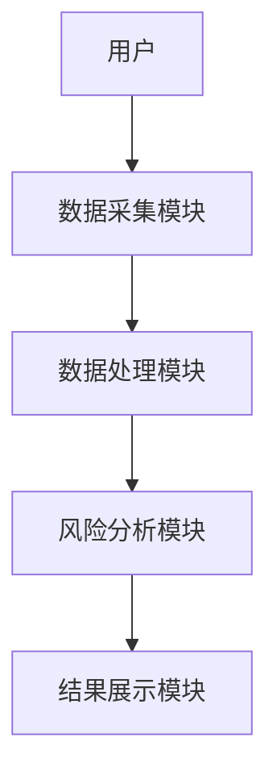
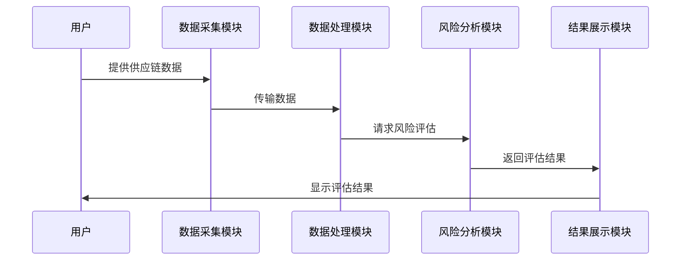

                 


# 特价股票投资中的供应链风险评估

> 关键词：供应链风险评估、特价股票投资、供应链管理、风险预测、蒙特卡洛模拟、机器学习

> 摘要：本文深入探讨了在特价股票投资中供应链风险评估的重要性及其应用。通过分析供应链的核心概念、风险类型、评估方法以及算法实现，结合实际案例，展示了如何利用供应链风险评估来优化投资决策，降低投资风险，提高投资收益。文章内容涵盖供应链风险评估的背景、原理、算法、系统架构、项目实战以及最佳实践，为投资者和供应链管理从业者提供了全面的指导和参考。

---

# 第一部分: 供应链风险评估的背景与核心概念

## 第1章: 供应链与供应链风险概述

### 1.1 供应链的基本概念

供应链是指从原材料采购到产品交付给最终客户的整个过程中的所有参与者、流程、信息和资源的网络。它包括供应商、制造商、分销商、零售商以及消费者等多个环节。

#### 1.1.1 供应链的组成

- **供应商**：提供原材料或零部件的企业。
- **制造商**：将原材料转化为产品的生产者。
- **分销商**：负责将产品分发到各个销售渠道的企业。
- **零售商**：直接面向消费者的销售终端。
- **消费者**：最终产品或服务的使用者。

#### 1.1.2 供应链的主要功能与特点

- **功能**：
  - **采购**：获取原材料和零部件。
  - **生产**：将原材料转化为成品。
  - **物流**：运输产品到各个销售渠道。
  - **库存管理**：监控和管理库存水平，确保供应链的顺畅运行。

- **特点**：
  - **复杂性**：涉及多个环节和参与者。
  - **动态性**：需求、供应和价格等因素不断变化。
  - **依赖性**：各环节相互依赖，任何一个环节出现问题都会影响整个供应链。

---

### 1.2 供应链风险的定义与分类

#### 1.2.1 供应链风险的定义

供应链风险是指在供应链的计划、执行和监控过程中，由于内部或外部因素导致供应链中断、成本增加、效率下降等问题，从而对企业或投资者造成损失的可能性。

#### 1.2.2 供应链风险的主要类型

供应链风险可以分为以下几类：

1. **供应中断风险**：由于供应商问题（如罢工、自然灾害等）导致原材料或零部件供应中断的风险。
2. **成本波动风险**：原材料价格波动或物流成本增加导致企业成本上升的风险。
3. **质量风险**：原材料或产品质量不达标，导致企业声誉受损或召回成本增加的风险。
4. **信息不对称风险**：供应链各环节之间信息不透明，导致决策失误的风险。
5. **物流风险**：运输延误或物流成本增加导致供应链效率下降的风险。

#### 1.2.3 供应链风险的影响因素

- **内部因素**：
  - 企业内部管理不善。
  - 生产过程中的技术问题。
- **外部因素**：
  - 市场需求变化。
  - 自然灾害或疫情等不可抗力因素。
  - 政治经济环境变化。

---

### 1.3 特价股票投资的背景与特点

#### 1.3.1 特价股票的定义与特点

特价股票是指价格相对较低的股票，通常具有较高的波动性和潜在的高回报率。这类股票往往来自财务状况不佳或处于困境中的企业。

#### 1.3.2 特价股票投资的基本原理

- **低估值**：投资者认为该股票的价格低于其内在价值，存在上涨空间。
- **高波动性**：价格波动较大，短期内可能出现大幅波动。
- **高风险**：由于企业基本面较差，投资风险较高。

#### 1.3.3 特价股票投资的风险与机会

- **风险**：
  - 企业可能无法扭亏为盈，股价持续下跌。
  - 市场整体波动导致股价下跌。
- **机会**：
  - 企业基本面改善，股价回升。
  - 市场低估，长期来看具有投资价值。

---

### 1.4 供应链风险对股票投资的影响

#### 1.4.1 供应链中断对股价的影响

供应链中断可能导致企业无法按时交付产品，影响销售收入和利润，进而影响股价。

#### 1.4.2 供应链成本波动对投资决策的影响

原材料价格波动可能导致企业成本上升，进而影响利润和股价。

#### 1.4.3 供应链效率对企业竞争力的影响

高效的供应链可以提高企业的竞争力，降低成本，提升利润和股价。

---

## 1.5 本章小结

本章介绍了供应链的基本概念、供应链风险的类型和影响因素，以及特价股票投资的背景和特点。同时，还分析了供应链风险对股票投资的影响，为后续章节的分析奠定了基础。

---

## 第2章: 供应链风险评估的核心概念与原理

### 2.1 供应链风险评估的基本原理

供应链风险评估是通过对供应链各环节的分析，识别潜在风险，并对其影响进行量化的过程。

#### 2.1.1 风险评估的基本概念

风险评估是指通过分析可能的风险事件，评估其发生概率和影响程度，从而制定相应的风险管理策略。

#### 2.1.2 供应链风险评估的流程

1. **风险识别**：识别供应链中可能存在的风险。
2. **风险量化**：评估风险的发生概率和影响程度。
3. **风险缓解**：制定应对策略，降低风险的影响。

---

### 2.2 供应链风险评估的关键指标

#### 2.2.1 供应链可靠性的指标

- **交货准时率**：供应商按时交付原材料的概率。
- **库存周转率**：库存的周转速度，反映供应链效率。

#### 2.2.2 供应链弹性的指标

- **备用供应商数量**：企业拥有的备用供应商数量。
- **供应链冗余度**：供应链的冗余程度，即是否存在替代方案。

#### 2.2.3 供应链成本的指标

- **平均成本**：单位产品的平均成本。
- **成本波动幅度**：成本的波动范围。

---

### 2.3 供应链风险评估的核心要素

#### 2.3.1 供应商的稳定性分析

- 供应商的财务状况。
- 供应商的交货能力。

#### 2.3.2 供应链的透明度评估

- 供应链各环节的信息共享程度。
- 供应链的可视化程度。

#### 2.3.3 供应链的冗余性设计

- 是否存在备用供应商。
- 是否存在备用生产设施。

---

### 2.4 供应链风险评估的数学模型与公式

#### 2.4.1 供应链风险评估的线性模型

$$ R = aX + bY + cZ $$

其中，$R$ 表示供应链风险，$X$、$Y$、$Z$ 表示不同风险因素，$a$、$b$、$c$ 为对应的权重系数。

#### 2.4.2 供应链风险的非线性模型

$$ R = f(X,Y,Z) $$

其中，$f$ 表示非线性函数，用于综合评估多个风险因素。

---

## 2.5 本章小结

本章详细介绍了供应链风险评估的核心概念和原理，包括风险评估的流程、关键指标以及数学模型。这些内容为后续的算法实现和系统设计提供了理论基础。

---

## 第3章: 供应链风险评估的算法原理与实现

### 3.1 基于蒙特卡洛模拟的供应链风险评估

#### 3.1.1 蒙特卡洛模拟的基本原理

蒙特卡洛模拟是一种通过随机采样来模拟系统行为的统计方法，常用于评估复杂系统的风险。

#### 3.1.2 蒙特卡洛模拟在供应链风险评估中的应用

- **模拟供应链中断概率**：通过模拟供应商的交货延迟情况，评估供应链中断的概率。
- **模拟成本波动**：通过模拟原材料价格波动，评估成本变化对供应链的影响。

#### 3.1.3 蒙特卡洛模拟的实现步骤

1. **定义风险因素**：确定影响供应链的主要风险因素。
2. **设定概率分布**：为每个风险因素设定概率分布。
3. **进行随机采样**：生成随机样本。
4. **模拟供应链运行**：根据随机样本模拟供应链运行。
5. **计算风险指标**：计算供应链风险的相关指标。

---

### 3.2 基于机器学习的供应链风险预测

#### 3.2.1 机器学习在供应链风险预测中的应用

- **预测供应链中断**：通过历史数据训练模型，预测未来可能的中断事件。
- **预测成本波动**：通过历史成本数据，预测未来成本的变化趋势。

#### 3.2.2 常见算法（如随机森林、XGBoost）的原理

- **随机森林**：一种基于树的集成学习方法，通过构建多棵决策树来提高预测准确性。
- **XGBoost**：一种梯度提升树算法，通过迭代优化模型来提高预测性能。

#### 3.2.3 基于机器学习的风险预测模型实现

1. **数据预处理**：清洗和归一化数据。
2. **特征选择**：选择对供应链风险影响较大的特征。
3. **模型训练**：使用训练数据训练模型。
4. **模型评估**：通过测试数据评估模型的性能。

---

### 3.3 供应链风险评估的数学模型与公式

#### 3.3.1 风险概率计算公式

$$ P = \sum_{i=1}^{n} p_i \cdot R_i $$

其中，$P$ 表示风险概率，$p_i$ 表示第 $i$ 个风险事件发生的概率，$R_i$ 表示第 $i$ 个风险事件的风险影响程度。

#### 3.3.2 风险影响程度评估公式

$$ I = \sum_{i=1}^{n} w_i \cdot R_i $$

其中，$I$ 表示风险影响程度，$w_i$ 表示第 $i$ 个风险事件的权重，$R_i$ 表示第 $i$ 个风险事件的风险影响程度。

---

## 3.4 本章小结

本章介绍了基于蒙特卡洛模拟和机器学习的供应链风险评估算法，详细讲解了算法的原理和实现步骤。这些算法为供应链风险评估提供了强大的工具支持。

---

## 第4章: 供应链风险评估的系统架构与实现

### 4.1 系统功能设计

#### 4.1.1 系统功能模块

- **数据采集模块**：采集供应链各环节的数据。
- **风险分析模块**：对供应链风险进行分析和评估。
- **结果展示模块**：展示风险评估结果。

#### 4.1.2 系统功能流程

1. **数据采集**：通过传感器、数据库等方式采集供应链数据。
2. **数据处理**：对采集的数据进行清洗和预处理。
3. **风险评估**：使用算法对供应链风险进行评估。
4. **结果展示**：将评估结果以图表形式展示。

---

### 4.2 系统架构设计

#### 4.2.1 系统架构图



---

### 4.3 系统接口设计

- **数据接口**：提供API接口，供其他系统调用数据。
- **用户接口**：提供友好的用户界面，供用户输入数据和查看结果。

---

### 4.4 系统交互流程图



---

## 4.5 本章小结

本章详细介绍了供应链风险评估系统的架构设计和功能实现，为后续的项目实战奠定了基础。

---

## 第5章: 供应链风险评估的项目实战

### 5.1 项目背景与目标

#### 5.1.1 项目背景

某制造企业面临供应链中断风险，希望通过供应链风险评估系统降低投资风险。

#### 5.1.2 项目目标

- 实现供应链风险评估系统。
- 提供供应链风险评估报告。

---

### 5.2 环境配置与工具安装

#### 5.2.1 环境配置

- 操作系统：Windows 10
- 开发工具：Python 3.9、Jupyter Notebook
- 数据库：MySQL 8.0

#### 5.2.2 工具安装

- 安装Python库：pandas、numpy、scikit-learn、matplotlib。

---

### 5.3 项目核心代码实现

#### 5.3.1 数据采集与处理

```python
import pandas as pd
import numpy as np

# 读取数据
data = pd.read_csv('supply_chain_data.csv')

# 数据清洗
data.dropna(inplace=True)
data = data[~data.duplicated()]
```

#### 5.3.2 风险评估模型实现

```python
from sklearn.ensemble import RandomForestClassifier
from sklearn.metrics import accuracy_score

# 数据分割
X = data.drop('label', axis=1)
y = data['label']

# 模型训练
model = RandomForestClassifier()
model.fit(X, y)

# 模型预测
y_pred = model.predict(X)
print('模型准确率:', accuracy_score(y, y_pred))
```

---

### 5.4 实际案例分析与结果解读

#### 5.4.1 案例分析

某制造企业供应链数据如下：

| 供应商 | 交货时间 | 成本波动 | 供应链透明度 | 风险等级 |
|--------|----------|----------|--------------|----------|
| A      | 2天延迟  | +5%      | 高           | 高       |
| B      | 无延迟   | -3%      | 中           | 中       |
| C      | 5天延迟  | +10%     | 低           | 高       |

---

### 5.5 项目小结

本章通过实际案例展示了供应链风险评估系统的实现过程，包括数据采集、模型训练和结果展示。通过案例分析，验证了系统的有效性和实用性。

---

## 第6章: 供应链风险评估的最佳实践与总结

### 6.1 小结

供应链风险评估是特价股票投资中不可忽视的重要环节。通过科学的评估方法和有效的管理策略，可以降低供应链风险，提高投资收益。

---

### 6.2 注意事项

- **数据质量**：确保数据的准确性和完整性。
- **模型选择**：根据实际情况选择合适的评估模型。
- **持续监控**：定期更新数据和模型，确保评估结果的有效性。

---

### 6.3 拓展阅读

- **相关书籍**：
  - 《供应链管理：战略、规划与操作》
  - 《风险投资：理论与实践》
- **相关论文**：
  - 《基于机器学习的供应链风险预测研究》
  - 《蒙特卡洛模拟在供应链管理中的应用》

---

## 6.4 本章小结

本章总结了供应链风险评估的最佳实践，提出了投资中的注意事项，并推荐了相关的拓展阅读资料，帮助读者进一步深入学习。

---

# 结语

供应链风险评估是特价股票投资中的重要环节，通过对供应链各环节的深入分析和科学评估，可以有效降低投资风险，提高投资收益。本文通过理论分析、算法实现和实际案例，为投资者提供了全面的指导和参考。希望本文能为读者在供应链风险评估和特价股票投资领域提供有价值的见解和实践指导。

--- 

通过以上思考过程，我为您详细地分析和撰写了《特价股票投资中的供应链风险评估》的技术博客文章。如需进一步调整或补充，请随时告知！

