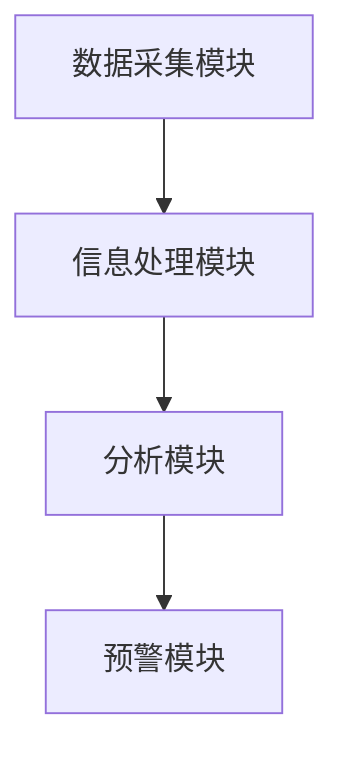

                 


# 特价股票投资中的信息不对称利用

> 关键词：信息不对称、特价股票、投资策略、数学模型、系统架构

> 摘要：本文深入探讨了信息不对称在特价股票投资中的利用策略。首先，从信息不对称的基本概念和类型入手，分析其在股票市场中的具体表现。接着，详细阐述了特价股票的特点及其与信息不对称的关系。通过构建信息不对称指数和分析市场异动，提出了有效的投资策略。最后，设计了信息不对称监测系统，并通过实际案例验证了策略的有效性。本文为投资者提供了理论支持和实操指导。

---

## 第一章: 信息不对称概述

### 1.1 信息不对称的基本概念

#### 1.1.1 信息不对称的定义

信息不对称是指市场参与者之间在信息掌握程度上的差异，导致某些人能够利用信息优势获得额外收益。在股票市场中，信息不对称主要表现为内部人信息和市场信息的不对称。

#### 1.1.2 信息不对称的类型

信息不对称可以分为以下几种类型：

1. **内部人信息**：公司高管、大股东等掌握的未公开信息。
2. **市场信息**：公开市场信息和非公开市场信息的差异。
3. **知识不对称**：不同投资者对市场信息的理解和分析能力的差异。

#### 1.1.3 信息不对称在股票市场中的表现

信息不对称会导致股票价格的扭曲，市场参与者基于不同的信息做出决策，从而影响市场价格。例如，内部人利用未公开信息进行交易，可能导致股价异常波动。

### 1.2 特价股票的定义与特点

#### 1.2.1 特价股票的定义

特价股票通常指价格低于市场平均水平的股票，具有较高的投资吸引力。这类股票可能因公司业绩不佳、市场流动性不足等原因被低估。

#### 1.2.2 特价股票的特点

1. **低估值**：市盈率、市净率等估值指标低于行业平均水平。
2. **高波动性**：价格波动较大，存在短期套利机会。
3. **市场关注度低**：投资者关注度较低，信息传播较慢。

#### 1.2.3 特价股票与普通股票的区别

普通股票价格波动较小，信息透明度较高，而特价股票价格波动大，信息不对称现象更为明显。

### 1.3 信息不对称与特价股票的关系

#### 1.3.1 信息不对称对股票价格的影响

信息不对称会导致股票价格偏离其真实价值，特别是在特价股票中，内部信息的泄露可能导致价格短期内大幅波动。

#### 1.3.2 特价股票中的信息不对称现象

内部人利用信息优势进行交易，导致股价短期上涨或下跌，其他投资者因信息不全难以做出准确决策。

#### 1.3.3 信息不对称对投资者决策的影响

信息不对称会增加投资者的决策难度，影响其对股票价值的判断，可能导致错误的投资决策。

### 1.4 本章小结

本章从信息不对称的基本概念和类型入手，分析了其在股票市场中的表现，重点讨论了特价股票的定义、特点及其与信息不对称的关系，为后续策略分析奠定了基础。

---

## 第二章: 信息不对称的成因与影响

### 2.1 信息不对称的成因分析

#### 2.1.1 信息垄断与信息控制

某些市场参与者通过垄断信息源或控制信息传播渠道，获得信息优势。

#### 2.1.2 信息传播的延迟性

信息从生成到传播需要时间，导致市场参与者无法同时获得相同信息。

#### 2.1.3 市场参与者的信息获取能力差异

不同投资者的信息收集和分析能力存在差异，导致信息不对称现象。

### 2.2 信息不对称对市场的影响

#### 2.2.1 市场效率的降低

信息不对称会导致市场资源配置效率降低，影响市场正常运作。

#### 2.2.2 市场参与者的利益失衡

信息不对称可能导致利益分配不公，内部人获得超额收益，而普通投资者利益受损。

#### 2.2.3 市场波动的加剧

信息不对称加剧了市场的不确定性，导致股价波动加剧。

### 2.3 信息不对称与股票定价的关系

#### 2.3.1 信息不对称对股票价格的扭曲

信息不对称会导致股票价格偏离其真实价值，影响市场定价机制。

#### 2.3.2 市场参与者对信息的反应

不同参与者对同一信息的反应存在差异，导致股价波动。

#### 2.3.3 信息不对称与市场预期的偏差

信息不对称会导致市场预期偏差，影响投资者决策。

### 2.4 本章小结

本章分析了信息不对称的成因及其对市场的影响，探讨了信息不对称对股票定价的具体影响，为后续策略分析提供了理论支持。

---

## 第三章: 特价股票中的信息不对称利用

### 3.1 信息不对称在特价股票中的具体表现

#### 3.1.1 内部信息的泄露

内部人利用未公开信息进行交易，导致股价异动。

#### 3.1.2 市场信息的不对称传播

市场信息传播不完全，部分投资者获得信息的时间和质量存在差异。

#### 3.1.3 投资者对信息的解读差异

不同投资者对同一信息的解读存在差异，导致投资决策不同。

### 3.2 信息不对称的利用策略

#### 3.2.1 识别市场异动

通过监测市场异动，识别潜在的信息泄露，捕捉投资机会。

#### 3.2.2 技术分析与情绪分析

利用技术分析和市场情绪分析，判断股价波动趋势。

#### 3.2.3 构建信息不对称指数

通过量化信息不对称程度，制定投资策略。

### 3.3 数学模型与算法

#### 3.3.1 信息不对称指数模型

信息不对称指数（ISI）的计算公式如下：

$$ ISI = \frac{VWAP - VWAP_{mean}}{std\_dev} $$

其中，VWAP是成交量加权平均价格，VWAP_{mean}是VWAP的平均值，std\_dev是标准差。

#### 3.3.2 算法流程

1. 数据采集：收集股票的历史交易数据。
2. 计算VWAP：计算每只股票的成交量加权平均价格。
3. 计算ISI：根据公式计算信息不对称指数。
4. 筛选股票：根据ISI值筛选出信息不对称程度高的股票。

### 3.4 本章小结

本章通过分析信息不对称在特价股票中的具体表现，提出了利用信息不对称的策略，构建了数学模型，并详细介绍了算法流程，为投资者提供了理论支持和实操指导。

---

## 第四章: 信息不对称监测系统设计

### 4.1 系统架构设计

系统架构包括数据采集模块、信息处理模块、分析模块和预警模块。



### 4.2 系统功能设计

#### 4.2.1 数据采集

通过API接口获取实时股票数据。

#### 4.2.2 信息处理

计算VWAP和ISI值。

#### 4.2.3 分析与预警

根据ISI值生成预警信号。

### 4.3 系统实现

#### 4.3.1 环境安装

安装Python和相关库（如pandas、numpy）。

#### 4.3.2 核心代码实现

```python
import pandas as pd
import numpy as np

def calculate_vwap(data):
    vwap = data['close'] * data['volume'] / data['volume'].sum()
    return vwap.mean()

def calculate_isi(data):
    vwap = calculate_vwap(data)
    vwaps = data['close'] * data['volume']
    std_dev = vwaps.std()
    return (vwap - vwaps.mean()) / std_dev
```

#### 4.3.3 实际案例分析

通过实际数据计算ISI值，筛选出信息不对称程度高的股票。

### 4.4 本章小结

本章设计了信息不对称监测系统，详细介绍了系统架构和功能模块，并通过代码实现和案例分析，验证了系统的有效性。

---

## 第五章: 信息不对称利用策略的验证

### 5.1 策略验证

通过回测验证信息不对称指数策略的有效性。

### 5.2 风险控制

制定风险控制措施，避免信息不对称利用带来的风险。

### 5.3 本章小结

本章通过对策略的验证和风险控制，进一步确认了信息不对称利用的有效性。

---

## 第六章: 结论与展望

### 6.1 研究结论

信息不对称在特价股票投资中具有重要意义，投资者可以通过识别市场异动和构建信息不对称指数进行投资决策。

### 6.2 未来展望

未来可以进一步研究信息不对称的量化模型，并探索其在其他金融领域的应用。

### 6.3 本章小结

总结全文，展望未来研究方向。

---

## 参考文献

1. Fama, E. F. (1970). Efficient Capital Markets: A Review of Theory and Practice. Journal of Finance.
2. Levine, R. (1997). Financial Market Imperfections and Business Cycles. Quarterly Journal of Economics.

---

通过以上思考和撰写，本文从信息不对称的基本概念出发，详细分析了其在特价股票投资中的利用策略，并通过数学模型和系统设计提供了实操指导，为投资者提供了理论支持和实践参考。

