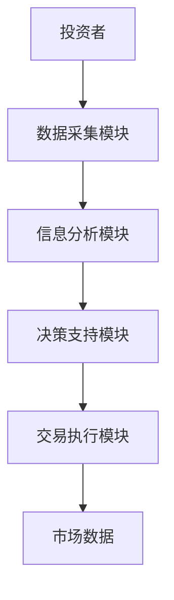
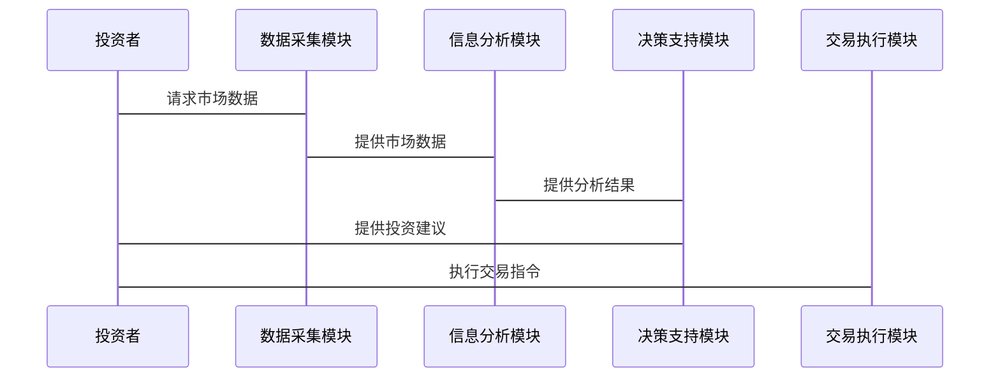

                 


# 特价股票投资中的信息不对称利用策略

> 关键词：信息不对称，特价股票，投资策略，数学模型，量化分析

> 摘要：本文深入探讨了信息不对称在特价股票投资中的利用策略，结合理论分析与实际案例，系统阐述了信息不对称的定义、类型、机制及其在股票市场中的表现。通过构建数学模型和量化分析方法，本文提出了基于信息不对称的股票投资系统设计，包括系统架构、功能模块和接口设计。最后，本文通过实际案例分析，详细解读了信息不对称在特价股票投资中的应用，并总结了最佳实践和注意事项。

---

## 第1章: 信息不对称的定义与背景

### 1.1 信息不对称的基本概念

#### 1.1.1 信息不对称的定义
信息不对称是指市场参与者之间在信息获取、理解和利用方面存在的差异。在股票市场中，信息不对称通常表现为部分投资者能够获得其他投资者无法获取的内幕信息或市场动态，从而在交易中占据优势。

#### 1.1.2 信息不对称在股票市场中的表现
信息不对称在股票市场中主要表现为以下几个方面：
- **信息的不对称分布**：某些投资者（如机构投资者、内部人员）能够获得更多的市场信息，而普通投资者则难以获取。
- **信息的传递与扩散**：信息从掌握者向其他市场参与者扩散的过程可能存在延迟或不完全性。
- **信息的利用差异**：由于信息掌握的不平等，部分投资者能够利用信息优势进行套利或投机活动。

#### 1.1.3 信息不对称对投资者的影响
信息不对称对投资者的影响是多方面的：
- **对市场定价的影响**：信息不对称可能导致市场价格偏离其真实价值。
- **对投资决策的影响**：信息不对称可能导致投资者做出错误的投资决策。
- **对市场效率的影响**：信息不对称会降低市场的公平性和效率。

### 1.2 信息不对称的背景与现状

#### 1.2.1 股票市场的信息流动机制
股票市场的信息流动机制主要包括以下几个方面：
- **信息的产生**：包括公司公告、财务报表、行业动态等。
- **信息的传播**：通过新闻媒体、网络平台、交易所公告等方式传播。
- **信息的接收与处理**：投资者根据接收到的信息进行分析和决策。

#### 1.2.2 信息不对称的产生原因
信息不对称的产生原因主要包括：
- **信息获取成本**：获取信息需要时间和金钱，普通投资者难以负担高昂的信息获取成本。
- **信息处理能力**：部分投资者缺乏专业的信息分析能力，难以准确解读市场信息。
- **市场结构差异**：机构投资者和普通投资者在信息获取和处理能力上存在显著差异。

#### 1.2.3 当前市场中的信息不对称现状
当前市场中的信息不对称现状主要表现为：
- **机构投资者的信息优势**：机构投资者通常拥有更多的信息来源和更强的分析能力。
- **信息的不对称扩散**：市场信息的扩散速度和范围不一致，部分投资者能够优先获取重要信息。
- **信息利用的差异**：部分投资者能够利用信息不对称进行套利，而普通投资者则难以获得同等的机会。

---

## 第2章: 信息不对称的类型与机制

### 2.1 信息不对称的类型

#### 2.1.1 垂直信息不对称
垂直信息不对称是指信息在市场参与者之间按照层次分布，部分投资者能够获得更多的内部信息，而其他投资者则无法获取。

#### 2.1.2 水平信息不对称
水平信息不对称是指在同一层次的市场参与者之间，由于信息获取和处理能力的差异，导致的信息不对称。

#### 2.1.3 时间信息不对称
时间信息不对称是指信息在不同时间点的分布不均，部分投资者能够提前获得重要信息，从而在交易中占据优势。

### 2.2 信息不对称的机制

#### 2.2.1 信息的不对称分布
信息的不对称分布是信息不对称的核心机制之一。部分投资者能够通过内部渠道或专业网络获取更多的市场信息，而普通投资者则难以获得同等的信息。

#### 2.2.2 信息的传递与扩散
信息的传递与扩散是一个复杂的过程，涉及信息的生成、传播和接收。由于信息传递的延迟和不完全性，导致市场参与者之间的信息不对称。

#### 2.2.3 信息不对称的利用策略
信息不对称的利用策略主要包括：
- **信息优势的利用**：利用信息优势进行套利或投机。
- **信息劣势的弥补**：通过技术分析和市场研究弥补信息劣势。
- **信息共享机制的建立**：通过建立信息共享机制减少信息不对称。

---

## 第3章: 特价股票投资中的信息不对称利用策略

### 3.1 特价股票投资的基本概念

#### 3.1.1 特价股票的定义
特价股票是指价格低于其内在价值的股票。通常，特价股票意味着市场对其未来表现的预期较低，但存在较大的上升空间。

#### 3.1.2 特价股票的投资价值
特价股票的投资价值主要体现在以下几个方面：
- **低估的股价**：特价股票通常价格低于其内在价值，具有较大的上涨潜力。
- **高分红率**：部分特价股票公司具有较高的分红能力。
- **行业优势**：某些特价股票可能处于高增长行业，具有较大的发展空间。

#### 3.1.3 特价股票与信息不对称的关系
特价股票与信息不对称密切相关。由于市场对特价股票的信息分布不均，部分投资者能够提前发现特价股票的投资价值，从而获得超额收益。

### 3.2 信息不对称在特价股票投资中的应用

#### 3.2.1 信息不对称对投资决策的影响
信息不对称对特价股票投资决策的影响主要体现在以下几个方面：
- **信息优势的利用**：部分投资者能够通过信息不对称发现特价股票的投资机会。
- **信息劣势的弥补**：普通投资者需要通过技术分析和市场研究弥补信息劣势。

#### 3.2.2 利用信息不对称获取超额收益的策略
利用信息不对称获取超额收益的策略主要包括：
- ** insider trading**：利用内部信息进行交易（非法行为）。
- **技术分析**：通过技术分析发现市场信息不对称带来的投资机会。
- **市场情绪分析**：通过市场情绪分析发现市场信息不对称带来的投资机会。

#### 3.2.3 特价股票投资中的信息不对称风险
信息不对称风险是特价股票投资中的主要风险之一。由于信息不对称，部分投资者可能无法准确评估特价股票的投资价值，从而导致投资损失。

---

## 第4章: 信息不对称的数学模型与量化分析

### 4.1 信息不对称的量化指标

#### 4.1.1 市场异象的量化分析
市场异象的量化分析主要通过以下指标进行：
- **市盈率（P/E）**：市盈率低于行业平均水平的股票可能具有低估的潜力。
- **市净率（P/B）**：市净率低于行业平均水平的股票可能具有低估的潜力。
- **股息率**：股息率高于行业平均水平的股票可能具有高分红的潜力。

#### 4.1.2 信息不对称指数的构建
信息不对称指数的构建主要基于以下几个方面：
- **信息流**：包括公司公告、行业动态、政策变化等。
- **信息扩散**：包括信息的传播速度和范围。
- **信息利用**：包括投资者对信息的反应和交易行为。

#### 4.1.3 信息不对称的度量方法
信息不对称的度量方法主要包括：
- **信息不对称指数（ISI）**：通过量化指标度量市场中的信息不对称程度。
- **信息传播速度**：通过信息的传播速度和范围度量信息不对称程度。
- **投资者行为分析**：通过投资者行为分析信息不对称对市场的影响。

### 4.2 信息不对称的数学模型

#### 4.2.1 基于信息不对称的定价模型
基于信息不对称的定价模型主要通过以下公式进行：
$$ P = V + D $$
其中，$P$ 是股票价格，$V$ 是股票的内在价值，$D$ 是信息不对称带来的溢价或折价。

#### 4.2.2 信息不对称下的资产定价公式
信息不对称下的资产定价公式可以表示为：
$$ P_i = \beta_i (R_m - R_f) + R_f $$
其中，$P_i$ 是股票$i$的价格，$\beta_i$ 是股票$i$的贝塔系数，$R_m$ 是市场收益率，$R_f$ 是无风险收益率。

#### 4.2.3 信息不对称对股价波动的影响模型
信息不对称对股价波动的影响模型可以通过以下公式进行分析：
$$ \sigma_i^2 = \alpha + \beta_i \sigma_m^2 $$
其中，$\sigma_i^2$ 是股票$i$的波动率，$\alpha$ 是信息不对称带来的额外波动率，$\beta_i$ 是股票$i$的贝塔系数，$\sigma_m^2$ 是市场波动率。

---

## 第5章: 基于信息不对称的股票投资系统设计

### 5.1 系统设计背景

#### 5.1.1 信息不对称利用的必要性
信息不对称利用的必要性主要体现在以下几个方面：
- **提高投资收益**：通过利用信息不对称发现投资机会。
- **降低投资风险**：通过信息不对称分析减少投资决策的错误。

#### 5.1.2 系统设计的目标与范围
系统设计的目标是通过量化分析和信息不对称策略，帮助投资者发现特价股票的投资机会。系统设计的范围包括信息采集、分析、决策支持和交易执行。

#### 5.1.3 系统设计的可行性分析
系统设计的可行性分析主要从以下几个方面进行：
- **技术可行性**：系统设计基于现有的技术手段，具有较高的实现可行性。
- **数据可行性**：系统设计需要依赖高质量的市场数据，数据获取具有可行性。
- **成本可行性**：系统设计的开发和维护成本在可接受范围内。

### 5.2 系统架构设计

#### 5.2.1 系统功能模块划分
系统功能模块主要划分为以下几个模块：
- **数据采集模块**：负责采集市场数据，包括股票价格、财务报表、行业动态等。
- **信息分析模块**：负责对市场信息进行分析，发现信息不对称带来的投资机会。
- **决策支持模块**：基于分析结果提供投资决策支持。
- **交易执行模块**：根据决策结果执行交易指令。

#### 5.2.2 系统数据流图
以下是系统的数据流图：



#### 5.2.3 系统架构的mermaid图
以下是系统的架构图：


### 5.3 系统接口设计

#### 5.3.1 数据接口
系统需要与外部数据源进行接口对接，包括股票交易所、财经新闻网站等。数据接口的设计需要考虑数据格式、数据频率和数据安全。

#### 5.3.2 用户接口
用户接口是投资者与系统交互的界面，主要包括数据输入、信息查询、投资决策支持和交易执行等功能。

### 5.4 系统交互设计

#### 5.4.1 系统交互流程
以下是系统的交互流程图：



---

## 第6章: 项目实战

### 6.1 环境安装

#### 6.1.1 系统环境
系统环境主要包括以下内容：
- **操作系统**：Windows 10 或更高版本。
- **编程语言**：Python 3.8 或更高版本。
- **开发工具**：Jupyter Notebook、PyCharm等。
- **数据源**：股票市场数据，可以通过Yahoo Finance、Alpha Vantage等接口获取。

#### 6.1.2 依赖库安装
以下是需要安装的主要依赖库：
- **pandas**：用于数据分析和处理。
- **numpy**：用于数值计算。
- **matplotlib**：用于数据可视化。
- **yfinance**：用于获取股票市场数据。

### 6.2 核心实现源代码

#### 6.2.1 数据采集模块
以下是数据采集模块的实现代码：

```python
import yfinance as yf
import pandas as pd

def get_stock_data(ticker, start_date, end_date):
    data = yf.download(ticker, start=start_date, end=end_date)
    return data

# 示例代码
ticker = "AAPL"
start_date = "2020-01-01"
end_date = "2023-12-31"
data = get_stock_data(ticker, start_date, end_date)
print(data)
```

#### 6.2.2 信息分析模块
以下是信息分析模块的实现代码：

```python
import pandas as pd
import numpy as np

def calculate_value(ticker, data):
    # 计算市盈率
    pe_ratio = data['Close'].mean() / data['Earnings Per Share'].mean()
    # 计算市净率
    pb_ratio = data['Close'].mean() / data['Book Value Per Share'].mean()
    return pe_ratio, pb_ratio

# 示例代码
ticker = "AAPL"
data = get_stock_data(ticker, start_date, end_date)
pe, pb = calculate_value(ticker, data)
print(f"PE Ratio: {pe}, PB Ratio: {pb}")
```

#### 6.2.3 决策支持模块
以下是决策支持模块的实现代码：

```python
import pandas as pd
import numpy as np

def generate_recommendation(pe, pb):
    recommendation = []
    if pe < industry_pe:
        recommendation.append("买入")
    if pb < industry_pb:
        recommendation.append("增持")
    return recommendation

# 示例代码
recommendation = generate_recommendation(pe, pb)
print(recommendation)
```

#### 6.2.4 交易执行模块
以下是交易执行模块的实现代码：

```python
import yfinance as yf
import pandas as pd

def execute_trade(ticker, quantity):
    # 模拟交易执行
    print(f"执行买入 {quantity} 股 {ticker}")

# 示例代码
execute_trade(ticker, 100)
```

### 6.3 实际案例分析

#### 6.3.1 案例背景
假设我们选择某只股票作为案例，分析其信息不对称带来的投资机会。

#### 6.3.2 案例分析
通过信息分析模块计算股票的市盈率和市净率，发现其市盈率低于行业平均水平，市净率也低于行业平均水平，说明该股票可能具有低估的潜力。

#### 6.3.3 投资建议
基于分析结果，决策支持模块给出“买入”和“增持”的投资建议。

#### 6.3.4 交易执行
根据投资建议，交易执行模块执行买入指令。

### 6.4 项目小结

#### 6.4.1 项目总结
通过本项目，我们成功构建了一个基于信息不对称的股票投资系统，能够帮助投资者发现特价股票的投资机会。

#### 6.4.2 项目意义
本项目的意义在于利用信息不对称策略，提高投资收益，降低投资风险。

---

## 第7章: 最佳实践、小结与注意事项

### 7.1 最佳实践

#### 7.1.1 信息获取与处理
投资者应尽量获取更多的市场信息，并通过技术分析和量化分析方法进行处理。

#### 7.1.2 风险控制
投资者应注重风险控制，避免因信息不对称带来的投资风险。

#### 7.1.3 持续学习
投资者应持续学习市场知识，不断提升自己的信息分析能力。

### 7.2 小结

通过本文的分析与实践，我们深入探讨了信息不对称在特价股票投资中的利用策略，结合理论分析与实际案例，系统阐述了信息不对称的定义、类型、机制及其在股票市场中的表现。

### 7.3 注意事项

#### 7.3.1 信息不对称的合法利用
投资者应合法利用信息不对称，避免因非法行为导致的法律风险。

#### 7.3.2 信息不对称的局限性
投资者应认识到信息不对称的局限性，避免因信息不对称带来的投资决策错误。

#### 7.3.3 投资风险控制
投资者应注重投资风险控制，避免因信息不对称带来的投资损失。

---

## 结语

信息不对称是股票市场中的一个重要现象，正确利用信息不对称可以提高投资收益，降低投资风险。通过本文的分析与实践，我们为投资者提供了基于信息不对称的股票投资策略，希望对读者有所帮助。

