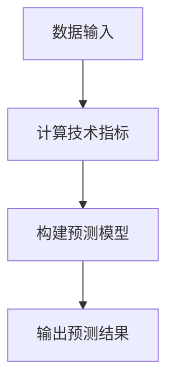

                 


# 特价股票投资中的信息优势如何获取

## 关键词：特价股票，信息优势，技术分析，基本面分析，算法模型，市场信息，投资策略

## 摘要：  
在股票投资中，信息优势是投资者获取超额收益的关键因素。本文从特价股票的特点出发，系统地探讨了如何通过市场信息、公司基本面分析和技术分析等方法获取信息优势，并结合实际案例，详细讲解了如何利用算法模型和数学模型进行投资决策。文章还提供了具体的项目实战，帮助读者更好地理解和应用这些方法。通过本文的学习，读者将能够掌握如何在特价股票投资中建立信息优势，从而提高投资成功率。

---

# 第1章: 特价股票投资概述

## 1.1 特价股票的基本概念

### 1.1.1 特价股票的定义  
特价股票是指价格相对较低、市场流动性较高、具有投资潜力的股票。这些股票通常来自中小型企业或处于特定周期的行业，具有较高的成长空间。

### 1.1.2 特价股票的特点  
- 价格低廉，适合中小投资者  
- 市场波动性较大，投资机会丰富  
- 具有较高的成长潜力  

### 1.1.3 特价股票与普通股票的区别  
- 投资门槛：特价股票通常价格较低，适合小额投资  
- 风险与收益：特价股票波动性较大，但潜在收益更高  

---

## 1.2 信息优势在股票投资中的作用

### 1.2.1 信息优势的定义  
信息优势是指投资者通过获取和分析更多的市场信息，能够在投资决策中占据优势地位，从而提高投资收益。

### 1.2.2 信息优势对投资决策的影响  
- 提前预判市场趋势  
- 减少投资风险  
- 提高投资收益  

### 1.2.3 获取信息优势的途径  
- 深入研究公司基本面  
- 关注市场动态和行业趋势  
- 利用技术分析工具  

---

# 第2章: 市场信息与特价股票

## 2.1 市场信息的获取与分析

### 2.1.1 市场信息的分类  
- 宏观经济信息：GDP、利率、通货膨胀等  
- 行业信息：行业发展趋势、政策影响等  
- 公司信息：财务报表、管理团队等  

### 2.1.2 数据分析工具的使用  
- 数据可视化工具：Excel、Tableau  
- 数据挖掘工具：Python（Pandas、NumPy）  

### 2.1.3 市场信息的解读方法  
- 趋势分析：通过历史数据寻找规律  
- 对比分析：横向对比行业内的公司表现  

---

## 2.2 技术分析与市场情绪

### 2.2.1 技术分析的基本原理  
技术分析通过研究股票价格的历史走势，预测未来的价格变动。常用的技术指标包括：  
- 移动平均线（MA）  
- 相对强弱指数（RSI）  
- 布林带（Bollinger Bands）  

### 2.2.2 市场情绪的分析方法  
- 利用社交媒体和新闻平台判断市场情绪  
- 通过成交量分析判断市场活跃度  

### 2.2.3 技术分析工具的实现  
```python
import pandas as pd
import numpy as np

# 示例：计算移动平均线
data = pd.read_csv('stock_data.csv')
data['MA_50'] = data['收盘价'].rolling(50).mean()
data['MA_20'] = data['收盘价'].rolling(20).mean()
```

---

# 第3章: 公司基本面分析

## 3.1 财务报表分析

### 3.1.1 资产负债表分析  
- 资产结构：流动资产、非流动资产  
- 负债结构：流动负债、非流动负债  

### 3.1.2 利润表分析  
- 收入与利润的关系  
- 净利润增长率  

### 3.1.3 现金流量表分析  
- 经营活动现金流  
- 投资活动现金流  

## 3.2 行业地位分析

### 3.2.1 行业竞争分析  
- 市场占有率  
- 行业集中度  

### 3.2.2 公司竞争优势  
- 技术优势  
- 资源优势  

---

# 第4章: 技术分析与算法模型

## 4.1 技术分析算法实现

### 4.1.1 算法原理  
- 基于历史价格数据，预测未来价格走势  
- 使用机器学习模型（如随机森林、神经网络）进行预测  

### 4.1.2 算法流程图  


### 4.1.3 算法实现代码  
```python
import pandas as pd
from sklearn.ensemble import RandomForestRegressor

# 示例：随机森林模型预测股票价格
data = pd.read_csv('stock_data.csv')
X = data[['收盘价', '成交量', 'MA_50', 'MA_20']]
y = data['收盘价'].shift(-1)
model = RandomForestRegressor(n_estimators=100)
model.fit(X[:-1], y[:-1])
predicted_price = model.predict(X[-1:])
```

---

# 第5章: 信息优势的数学模型与算法

## 5.1 数学模型构建

### 5.1.1 回归分析模型  
$$ y = \beta_0 + \beta_1 x_1 + \beta_2 x_2 + \epsilon $$  
其中，$y$ 是预测目标，$x_1, x_2$ 是自变量，$\epsilon$ 是误差项。

### 5.1.2 时间序列模型  
$$ ARIMA(p, d, q) $$  
其中，$p$ 是自回归阶数，$d$ 是差分阶数，$q$ 是移动平均阶数。

## 5.2 模型实现与优化

### 5.2.1 模型实现代码  
```python
from statsmodels.tsa.arima_model import ARIMA

# 示例：ARIMA模型预测股票价格
data = pd.read_csv('stock_data.csv')
model = ARIMA(data['收盘价'], order=(5, 1, 0))
model_fit = model.fit()
forecast = model_fit.forecast(steps=5)
```

### 5.2.2 模型优化  
- 超参数调优  
- 模型评估与验证  

---

# 第6章: 项目实战

## 6.1 环境安装与数据准备

### 6.1.1 环境安装  
- 安装Python和相关库（Pandas、NumPy、Scikit-learn）  

### 6.1.2 数据准备  
- 下载股票数据（CSV格式）  
- 数据清洗与预处理  

## 6.2 核心实现

### 6.2.1 数据分析与可视化  
```python
import matplotlib.pyplot as plt

data['收盘价'].plot()
plt.title('Stock Price Trend')
plt.show()
```

### 6.2.2 技术分析与预测  
```python
# 示例：计算移动平均线并绘制图表
data['MA_50'].plot()
data['MA_20'].plot()
plt.legend(['50日均线', '20日均线'])
plt.show()
```

---

# 第7章: 总结与展望

## 7.1 本章小结  
本文详细探讨了特价股票投资中的信息优势获取方法，包括市场信息分析、公司基本面分析和技术分析。通过算法模型和数学模型的应用，帮助投资者提高投资决策的准确性。

## 7.2 投资策略总结  
- 结合市场信息和公司基本面进行综合分析  
- 灵活运用技术分析工具和算法模型  
- 定期评估和优化投资策略  

## 7.3 展望  
随着大数据和人工智能技术的发展，未来信息优势的获取将更加依赖于高级算法和自动化工具。投资者需要不断学习和适应新的技术，才能在竞争激烈的股票市场中立于不败之地。

---

**Tips:**  
- 在进行股票投资时，建议投资者根据自身风险承受能力制定合理的投资策略。  
- 本文中的代码和模型仅为示例，实际应用中需结合具体数据和市场情况。  

--- 

通过本文的学习，读者可以系统地掌握特价股票投资中的信息优势获取方法，并在实际投资中灵活运用这些策略。希望本文能为投资者提供有价值的参考和启发。

