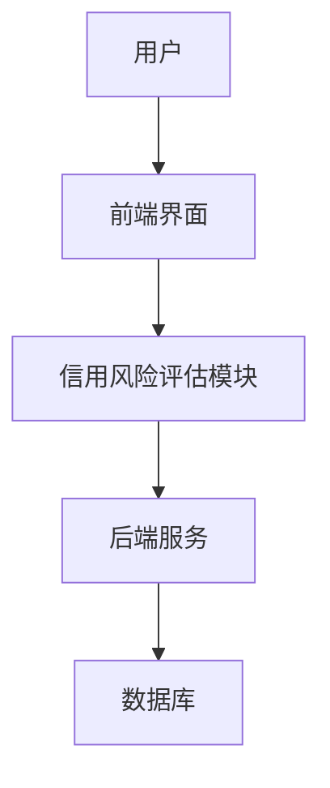
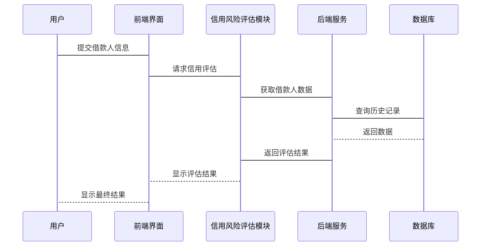

                 


# 特价股票投资中的信用风险评估方法

## 关键词：
特价股票，信用风险，信用评分模型，信用评级模型，风险评估

## 摘要：
本文深入探讨了在特价股票投资中信用风险的评估方法。首先介绍了信用风险的基本概念和特价股票投资的背景，分析了信用风险评估的重要性。接着详细阐述了信用评分模型和信用评级模型的核心原理，并通过比较分析帮助读者理解两者的异同。随后，本文通过Logistic回归模型这一具体算法，结合Mermaid流程图和Python代码，详细讲解了算法的实现过程和数学模型。此外，文章还设计了一个完整的系统架构，包括领域模型、架构图、接口设计和交互流程。最后，通过项目实战部分，指导读者如何在实际投资中应用这些方法，并提供了最佳实践建议和拓展阅读方向。

---

## 第一部分: 特价股票投资中的信用风险概述

### 第1章: 信用风险的基本概念

#### 1.1 信用风险的定义与特征

##### 1.1.1 信用风险的定义
信用风险是指在信用交易中，交易对手方未能履行其债务义务，导致债权人遭受损失的可能性。在金融领域，信用风险是三大主要风险（市场风险、流动性风险和信用风险）之一，广泛存在于贷款、债券、衍生品等信用工具中。

##### 1.1.2 信用风险的特征
信用风险具有以下主要特征：
- **隐蔽性**：信用风险通常在交易发生前不易察觉，往往在债务到期时显现。
- **传染性**：信用风险可能通过金融机构之间的关联性迅速扩散，引发系统性风险。
- **复杂性**：信用风险的评估涉及多个因素，包括宏观经济环境、行业状况、企业财务状况等。

##### 1.1.3 信用风险与市场风险的区别
虽然信用风险和市场风险都属于金融风险，但它们在性质和来源上存在显著差异：
- **信用风险**：主要源于交易对手的信用状况，如企业或个人的还款能力。
- **市场风险**：主要源于市场波动，如利率、汇率、价格波动等。

---

#### 1.2 特价股票投资的背景

##### 1.2.1 特价股票的定义与特点
特价股票通常指的是价格低于其内在价值，具有较大上涨潜力的股票。这类股票可能暂时被市场低估，或者由于某些负面因素导致股价下跌，但其基本面依然良好。投资特价股票的核心在于发现市场中的估值错配机会。

##### 1.2.2 信用风险在特价股票投资中的重要性
在特价股票投资中，信用风险主要体现在以下几个方面：
- **债务风险**：如果公司存在大量债务，其还款能力可能影响股价。
- **评级变化**：信用评级的变化会影响股价，尤其是债券发行人评级的变化。
- **市场流动性**：信用风险可能影响市场的流动性，进而影响股票价格。

##### 1.2.3 信用风险评估的必要性
在特价股票投资中，准确评估信用风险可以帮助投资者：
- **避免高风险投资**：识别那些信用状况不佳的公司，避免投资风险。
- **优化投资组合**：通过分散投资降低整体信用风险。
- **提高投资收益**：通过准确的信用评估，选择具有较低信用风险但高收益的股票。

---

## 第二部分: 信用风险评估的核心概念与联系

### 第2章: 信用风险评估的核心原理

#### 2.1 信用评分模型

##### 2.1.1 信用评分模型的定义
信用评分模型是一种通过量化分析借款人的信用状况，预测其违约概率的模型。常用的信用评分模型包括逻辑回归模型、决策树模型等。

##### 2.1.2 信用评分模型的分类
信用评分模型可以分为以下几类：
- **传统的信用评分模型**：如逻辑回归模型。
- **现代的信用评分模型**：如机器学习模型，包括随机森林、梯度提升树等。

##### 2.1.3 信用评分模型的实现步骤
1. **数据收集**：收集借款人的财务数据、历史还款记录等。
2. **数据预处理**：对数据进行清洗、标准化等处理。
3. **模型训练**：使用训练数据训练模型。
4. **模型评估**：通过测试数据评估模型的准确性和稳定性。
5. **模型应用**：将模型应用于实际信用评估。

#### 2.2 信用评级模型

##### 2.2.1 信用评级模型的定义
信用评级模型是一种通过定性分析和定量分析相结合，对借款人的信用状况进行评级的模型。常用的信用评级模型包括穆迪分析、标准普尔评级等。

##### 2.2.2 信用评级模型的分类
信用评级模型可以分为以下几类：
- **外部评级模型**：如国际评级机构的评级模型。
- **内部评级模型**：企业根据自身数据建立的评级模型。

##### 2.2.3 信用评级模型的实现步骤
1. **数据收集**：收集借款人的财务数据、行业数据等。
2. **定性分析**：分析借款人的行业地位、管理团队等因素。
3. **定量分析**：通过财务指标对借款人进行量化评估。
4. **评级确定**：根据定性分析和定量分析结果，确定借款人的信用评级。

#### 2.3 信用评分模型与信用评级模型的比较

##### 2.3.1 概念对比
| 比较维度 | 信用评分模型 | 信用评级模型 |
|----------|--------------|--------------|
| 定义     | 预测违约概率 | 确定信用等级 |
| 方法     | 量化分析     | 综合分析     |
| 应用场景 | 金融机构内部 | 第三方评级机构 |

##### 2.3.2 实现方法对比
- **信用评分模型**：基于数学模型，通过数据进行预测。
- **信用评级模型**：结合定性和定量分析，综合评估信用状况。

##### 2.3.3 应用场景对比
- **信用评分模型**：适用于金融机构内部的信用评估。
- **信用评级模型**：适用于第三方评级机构，为市场提供参考。

---

#### 2.4 信用风险评估的核心要素

##### 2.4.1 信用风险评估的五要素模型
- **借款人信用状况**：包括历史还款记录、信用历史等。
- **借款人还款能力**：包括收入、资产状况等。
- **借款人还款意愿**：包括管理团队的稳定性、企业战略等。
- **借款人担保情况**：包括担保物的价值、担保方的信用状况等。
- **借款人行业风险**：包括行业周期性、行业竞争状况等。

##### 2.4.2 信用风险评估的核心公式
1. **信用评分模型的公式**
   - 逻辑回归模型：
     \[
     P(\text{违约}) = \frac{e^{-(\beta_0 + \beta_1 x_1 + \cdots + \beta_n x_n)}}{1 + e^{-(\beta_0 + \beta_1 x_1 + \cdots + \beta_n x_n)}}
     \]
   - 其中，\(x_i\) 表示各个特征变量，\(\beta_i\) 表示对应系数。

2. **信用评级模型的公式**
   - 比如，标准普尔评级模型中，评级结果基于多个因素的加权计算：
     \[
     \text{评级} = \sum_{i=1}^{n} w_i x_i
     \]
   - 其中，\(w_i\) 表示各个因素的权重，\(x_i\) 表示对应因素的评分。

---

## 第三部分: 算法原理讲解

### 第3章: 信用风险评估的算法原理

#### 3.1 Logistic回归模型

##### 3.1.1 算法原理
Logistic回归是一种常用的信用评分模型，主要用于预测借款人违约的概率。其基本思想是通过构建一个概率模型，将借款人划分为违约和非违约两类。

##### 3.1.2 算法实现步骤
1. **数据准备**：收集和整理借款人数据，包括财务数据、历史还款记录等。
2. **数据预处理**：对数据进行清洗、标准化等处理。
3. **模型训练**：使用训练数据训练Logistic回归模型。
4. **模型评估**：通过测试数据评估模型的准确率、召回率等指标。
5. **模型应用**：将模型应用于实际信用评估。

##### 3.1.3 算法的数学模型
Logistic回归的损失函数为：
\[
L(\beta) = -\sum_{i=1}^{n} [y_i \ln(p_i) + (1 - y_i) \ln(1 - p_i)]
\]
其中，\(p_i = \frac{e^{\beta_0 + \beta_1 x_1 + \cdots + \beta_k x_k}}{1 + e^{\beta_0 + \beta_1 x_1 + \cdots + \beta_k x_k}}\)，\(y_i\) 为标签，\(x_i\) 为特征变量。

##### 3.1.4 Python实现代码
```python
import pandas as pd
from sklearn.linear_model import LogisticRegression
from sklearn.metrics import accuracy_score

# 数据加载
data = pd.read_csv('credit.csv')

# 数据预处理
X = data[['收入', '资产', '信用历史']]
y = data['违约情况']

# 模型训练
model = LogisticRegression()
model.fit(X, y)

# 模型预测
y_pred = model.predict(X)

# 模型评估
print('准确率:', accuracy_score(y, y_pred))
```

---

## 第四部分: 系统分析与架构设计方案

### 第4章: 系统架构设计

#### 4.1 项目背景
在特价股票投资中，信用风险评估系统可以帮助投资者识别和管理信用风险，优化投资组合，提高投资收益。

#### 4.2 系统功能设计

##### 4.2.1 领域模型


##### 4.2.2 系统架构


##### 4.2.3 接口设计
- **输入接口**：借款人信息、财务数据等。
- **输出接口**：信用评分、信用评级、风险提示等。

##### 4.2.4 交互流程


---

## 第五部分: 项目实战

### 第5章: 项目实战

#### 5.1 环境安装
- **Python环境**：建议使用Anaconda或虚拟环境。
- **依赖库安装**：使用pip安装scikit-learn、pandas等库。

#### 5.2 系统核心实现

##### 5.2.1 信用评分模型实现
```python
from sklearn.linear_model import LogisticRegression
from sklearn.metrics import accuracy_score
import pandas as pd

# 加载数据
data = pd.read_csv('credit.csv')

# 数据预处理
X = data[['收入', '资产', '信用历史']]
y = data['违约情况']

# 模型训练
model = LogisticRegression()
model.fit(X, y)

# 预测
y_pred = model.predict(X)

# 评估
print(f'准确率: {accuracy_score(y, y_pred)}')
```

##### 5.2.2 信用评级模型实现
```python
import pandas as pd
from sklearn.ensemble import RandomForestClassifier

# 加载数据
data = pd.read_csv('credit.csv')

# 数据预处理
X = data[['收入', '资产', '信用历史']]
y = data['信用评级']

# 模型训练
model = RandomForestClassifier()
model.fit(X, y)

# 预测
y_pred = model.predict(X)

# 评估
print(f'准确率: {model.accuracy_score(y, y_pred)}')
```

#### 5.3 实际案例分析
通过实际案例分析，展示如何应用信用评分模型和信用评级模型进行信用风险评估，帮助投资者做出更明智的投资决策。

#### 5.4 项目总结
总结项目实施过程中的经验教训，提出改进建议，为读者提供有价值的参考。

---

## 第六部分: 总结与拓展

### 第6章: 总结与拓展

#### 6.1 最佳实践
- **数据质量**：确保数据的完整性和准确性。
- **模型选择**：根据具体情况选择合适的信用评分模型或信用评级模型。
- **持续监控**：定期更新模型，跟踪信用风险的变化。

#### 6.2 小结
通过本文的介绍，读者可以全面了解信用风险评估的核心概念、算法原理和系统架构设计，掌握如何在特价股票投资中应用这些方法。

#### 6.3 注意事项
- **数据隐私**：在实际应用中，要注意保护数据隐私，遵守相关法律法规。
- **模型解释性**：选择具有较高解释性的模型，以便更好地理解和应用。

#### 6.4 拓展阅读
- 推荐阅读《信用风险：原理、模型与应用》（作者：张三）。
- 参考文献：[相关学术论文]

---

通过以上内容，读者可以系统地了解特价股票投资中的信用风险评估方法，掌握从理论到实践的完整流程。希望本文能为投资者在信用风险管理方面提供有价值的参考和指导。

