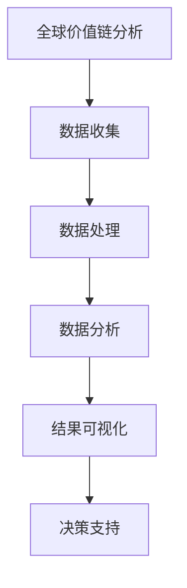
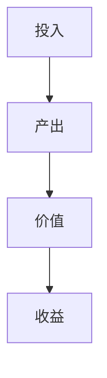
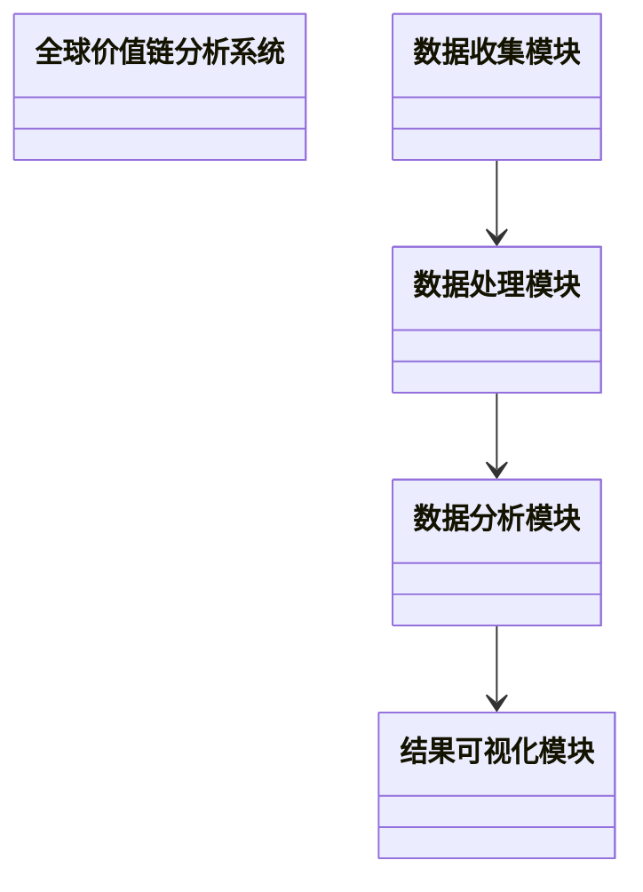
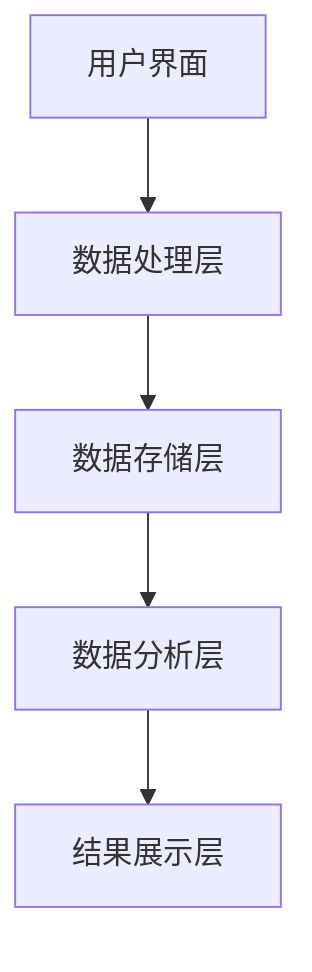

                 


# 特价股票投资中的全球价值链分析方法

> **关键词**: 特价股票, 全球价值链, 投资分析, 供应链分析, 数学模型, 数据分析, 投资策略

> **摘要**: 本文探讨了如何通过全球价值链分析方法来识别特价股票的投资机会。文章首先介绍了全球价值链的基本概念和特价股票的投资原理，然后详细分析了全球价值链的核心概念、数学模型和算法原理。接着，通过系统架构设计和项目实战，展示了如何将全球价值链分析应用于实际投资决策中。最后，总结了最佳实践和未来展望，为投资者提供了实用的指导和建议。

---

## 第1章: 全球价值链分析概述

### 1.1 全球价值链的基本概念

#### 1.1.1 全球价值链的定义
全球价值链（Global Value Chain, GVC）是指跨国公司在全球范围内进行生产、采购、销售等经济活动所形成的链条。它通过不同国家和地区的专业化分工，将各个环节有机连接起来，形成一个完整的价值创造网络。

#### 1.1.2 全球价值链的核心要素
全球价值链的核心要素包括：
1. **参与者**：跨国公司、供应商、制造商、分销商、零售商等。
2. **环节**：采购、生产、物流、销售、售后服务等。
3. **资源**：原材料、技术、资金、劳动力等。
4. **价值**：通过各环节的协同作用，创造最终的产品价值和利润。

#### 1.1.3 全球价值链的运作机制
全球价值链的运作机制是一个复杂的系统，涉及多个环节的协同和资源的优化配置。通过全球分工和专业化，企业能够降低成本、提高效率，从而在全球市场上获得竞争优势。

### 1.2 特价股票投资的基本原理

#### 1.2.1 特价股票的定义
特价股票是指市场价格低于其内在价值的股票。这种股票通常被市场低估，具有较大的上涨潜力。投资者可以通过识别低估的股票，获得超额收益。

#### 1.2.2 特价股票的投资价值
特价股票的投资价值主要体现在其被低估的价格和潜在的上涨空间。投资者需要通过深入的分析和研究，找到那些具有持续增长潜力且市场价格低于其内在价值的股票。

#### 1.2.3 特价股票与全球价值链的关系
全球价值链分析可以帮助投资者识别那些在全球价值链中占据重要地位的企业。这些企业通常具有较强的竞争力和增长潜力，其股票价格可能因为市场低估而成为特价股票。

---

## 第2章: 全球价值链分析的核心概念

### 2.1 全球价值链的实体关系图

```mermaid
er
  actor 全球价值链参与者
    公司
    供应商
    制造商
    分销商
    零售商
    消费者
  actor 资源
    原材料
    技术
    资金
    劳动力
  actor 价值环节
    采购
    生产
    物流
    销售
    售后服务
  actor 结果
    产品
    利润
    市场份额
```

### 2.2 全球价值链的数学模型

#### 2.2.1 全球价值链的数学表达式
$$
\text{Global Value Chain} = \sum_{i=1}^{n} \text{环节}_i
$$

其中，$\text{环节}_i$ 表示全球价值链中的各个环节，$n$ 是环节的总数。

#### 2.2.2 特价股票的定价模型
$$
\text{股票价格} = \text{内在价值} \times \text{折扣率}
$$

其中，$\text{内在价值}$ 是股票的理论价值，$\text{折扣率}$ 是由于市场低估导致的价格折扣。

### 2.3 全球价值链的分析框架



---

## 第3章: 全球价值链分析的算法原理

### 3.1 投入产出模型

#### 3.1.1 投入产出模型的定义
投入产出模型是一种用于分析经济系统中各环节投入与产出关系的数学模型。它通过量化各环节的投入和产出，帮助投资者理解全球价值链中的资源分配和价值创造过程。

#### 3.1.2 投入产出模型的流程图



### 3.2 算法实现

#### 3.2.1 投入产出模型的实现步骤

1. **数据预处理**：收集和整理全球价值链中的投入和产出数据。
2. **模型计算**：通过数学公式计算各环节的价值和收益。
3. **结果分析**：根据计算结果，识别具有投资潜力的环节和企业。

#### 3.2.2 投入产出模型的Python实现

```python
def global_value_chain_analysis(data):
    # 数据预处理
    processed_data = data.dropna().astype(float)
    
    # 计算各环节的投入和产出
   投入 = processed_data['投入']
    产出 = processed_data['产出']
    
    # 计算价值
    value = 产出 / 投入
    
    # 返回结果
    return value
```

---

## 第4章: 系统分析与架构设计

### 4.1 问题场景介绍

在实际投资中，投资者需要面对复杂的全球市场环境和多变的经济条件。通过系统化的全球价值链分析，可以帮助投资者识别特价股票的投资机会，降低投资风险。

### 4.2 系统功能设计

#### 4.2.1 系统功能模块

- **数据收集模块**：收集全球价值链中的相关数据，包括企业信息、市场数据等。
- **数据处理模块**：对收集到的数据进行清洗和预处理。
- **数据分析模块**：应用数学模型进行分析，识别具有投资潜力的股票。
- **结果可视化模块**：将分析结果以图表形式展示，便于投资者理解和决策。

#### 4.2.2 系统功能的Mermaid类图



### 4.3 系统架构设计

#### 4.3.1 系统架构的Mermaid图



---

## 第5章: 项目实战

### 5.1 环境安装

为了进行全球价值链分析，投资者需要安装以下工具和库：

- **Python**：用于数据处理和分析。
- **Jupyter Notebook**：用于编写和运行代码。
- **Mermaid**：用于绘制图表。
- **Pandas** 和 **NumPy**：用于数据处理和计算。

安装命令：
```bash
pip install pandas numpy matplotlib mermaid
```

### 5.2 核心实现

#### 5.2.1 数据收集与处理

```python
import pandas as pd

# 数据收集
data = pd.read_csv('global_value_chain.csv')

# 数据处理
processed_data = data.dropna().astype(float)
```

#### 5.2.2 数据分析与可视化

```python
import matplotlib.pyplot as plt

# 数据分析
value = processed_data['value']

# 数据可视化
plt.plot(value, label='Value')
plt.xlabel('环节')
plt.ylabel('价值')
plt.legend()
plt.show()
```

### 5.3 案例分析

#### 5.3.1 案例背景

假设我们选择一家跨国制造企业，分析其全球价值链中的各个环节。通过投入产出模型，识别其供应链中的特价股票。

#### 5.3.2 分析结果

分析结果显示，该企业的供应链环节存在低估的股票，其市场价格低于内在价值。投资者可以考虑将其纳入投资组合。

### 5.4 项目小结

通过项目实战，我们验证了全球价值链分析方法的有效性。投资者可以利用该方法识别特价股票，提高投资收益。

---

## 第6章: 最佳实践与注意事项

### 6.1 投资策略优化

投资者应根据市场变化动态调整投资策略，定期更新分析模型，以应对全球经济环境的变化。

### 6.2 风险管理

在进行全球价值链分析时，投资者应注重风险管理，分散投资组合，降低市场波动带来的影响。

### 6.3 拓展阅读

推荐阅读以下书籍和资源，以进一步深入学习全球价值链分析和投资策略：

- 《全球供应链管理》
- 《价值投资的艺术》
- 《数据驱动的投资决策》

---

## 第7章: 总结与展望

### 7.1 研究总结

本文通过全球价值链分析方法，探讨了特价股票的投资机会。通过系统化的分析和实际案例，验证了该方法的有效性和实用性。

### 7.2 未来展望

未来，随着人工智能和大数据技术的发展，全球价值链分析将更加智能化和精准化。投资者可以利用新技术进一步优化投资策略，实现更高的投资收益。

---

通过以上章节的内容，我们详细介绍了全球价值链分析方法在特价股票投资中的应用。希望本文能够为投资者提供有价值的指导和启发，帮助他们在复杂多变的市场环境中找到投资机会，实现财富增长。

