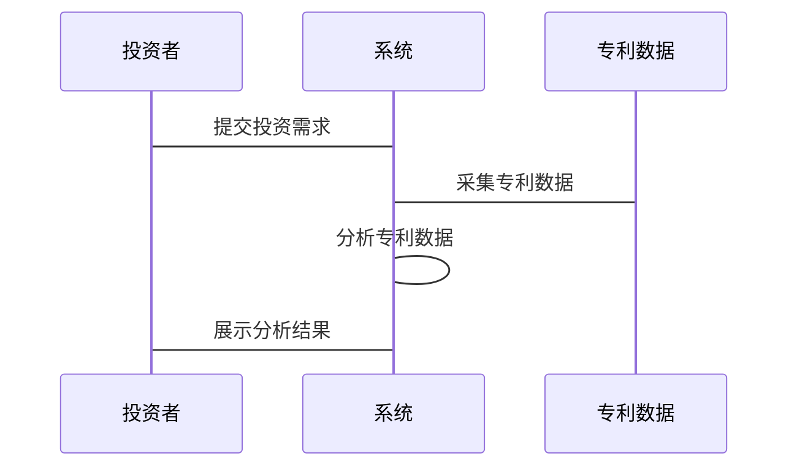

                 


# 特价股票投资中的全球创新指数与专利引用网络分析方法

## 关键词
特价股票投资、全球创新指数、专利引用网络、算法原理、系统架构设计、项目实战

## 摘要
本文探讨了如何将全球创新指数与专利引用网络分析方法应用于特价股票投资中。通过分析企业的创新能力及其在全球范围内的影响力，结合专利引用网络的数据，投资者可以更准确地评估企业的潜在价值，从而做出更明智的投资决策。文章详细介绍了全球创新指数和专利引用网络的核心概念、算法原理、系统架构设计以及实际项目案例，为投资者提供了科学的分析工具和方法。

---

## 第1章: 特价股票投资与全球创新指数概述

### 1.1 特价股票投资的基本概念
#### 1.1.1 特价股票的定义与特点
特价股票是指市场价格低于其内在价值的股票。其特点是价格低廉、潜在回报高，通常被视为被市场低估的投资机会。投资者通过分析公司的基本面、行业地位和市场趋势，寻找具有长期增长潜力的股票。

#### 1.1.2 特价股票投资的背景与意义
在全球经济波动加剧的背景下，投资者越来越关注如何通过技术创新和竞争优势来选择具有长期增长潜力的企业。特价股票投资的意义在于通过识别市场低估的股票，捕捉潜在的高回报机会。

#### 1.1.3 特价股票投资的核心要素
- 公司基本面分析：包括财务状况、盈利能力、成长性等。
- 行业竞争分析：包括行业地位、竞争优势、市场前景等。
- 市场情绪分析：包括市场波动、投资者情绪等。

### 1.2 全球创新指数的定义与作用
#### 1.2.1 全球创新指数的定义
全球创新指数（Global Innovation Index, GII）是衡量一个国家或地区创新能力的综合指标，涵盖创新投入、创新产出等多个维度。

#### 1.2.2 全球创新指数的核心指标
- 创新投入：包括研发经费、研究人员数量等。
- 创新产出：包括专利数量、技术影响力等。
- 创新环境：包括政策支持、市场环境等。

#### 1.2.3 全球创新指数与投资决策的关系
全球创新指数为投资者提供了评估企业创新能力的工具，帮助投资者识别具有持续创新能力的企业，从而提高投资决策的准确性。

### 1.3 专利引用网络分析的基本原理
#### 1.3.1 专利引用网络的定义
专利引用网络是指通过专利之间的引用关系构建的网络，反映了技术领域的创新动态和知识传播路径。

#### 1.3.2 专利引用网络的构建方法
- 数据收集：从专利数据库中获取专利数据。
- 引用关系构建：通过专利之间的引用关系构建网络。
- 网络分析：通过网络分析工具对专利网络进行分析。

#### 1.3.3 专利引用网络在投资分析中的应用
专利引用网络可以帮助投资者评估企业的技术领先性、技术布局和技术创新能力，从而判断企业的市场竞争力和投资价值。

---

## 第2章: 全球创新指数与专利引用网络的核心概念

### 2.1 全球创新指数的核心要素
#### 2.1.1 创新投入与产出指标
创新投入包括研发经费、研究人员数量等，创新产出包括专利数量、技术影响力等。

#### 2.1.2 企业创新能力评估
通过全球创新指数评估企业的创新能力，包括技术创新能力、研发能力等。

#### 2.1.3 行业创新指数分析
通过行业创新指数分析，评估行业内的创新趋势和竞争格局。

### 2.2 专利引用网络的实体关系图
#### 2.2.1 实体关系图的构建
通过专利引用关系构建实体关系图，反映技术领域的创新动态和知识传播路径。

#### 2.2.2 实体关系图的属性特征对比
| 属性 | 专利A | 专利B | 专利C |
|------|-------|-------|-------|
| 专利号 | A1234 | B5678 | C9101 |
| 发明人 | 张三 | 李四 | 王五 |
| 申请日期 | 2020-01-01 | 2020-02-01 | 2020-03-01 |

#### 2.2.3 实体关系图的分析方法
通过分析专利引用网络的结构特征，如中心性、聚类系数等，评估专利的技术影响力和创新潜力。

### 2.3 全球创新指数与专利引用网络的联系
#### 2.3.1 全球创新指数与专利引用网络的关联性
全球创新指数反映了企业的创新能力，专利引用网络反映了技术创新的动态和趋势。

#### 2.3.2 专利引用网络对全球创新指数的影响
专利引用网络分析可以为全球创新指数的评估提供数据支持，帮助投资者更准确地评估企业的创新能力。

#### 2.3.3 全球创新指数与专利引用网络的协同作用
通过结合全球创新指数和专利引用网络分析，投资者可以全面评估企业的创新能力，从而做出更科学的投资决策。

---

## 第3章: 全球创新指数与专利引用网络的算法原理

### 3.1 全球创新指数计算算法
#### 3.1.1 算法原理与流程图
```mermaid
graph TD
A[开始] -> B[收集数据]
B -> C[计算创新投入]
C -> D[计算创新产出]
D -> E[计算创新环境]
E -> F[综合评估]
F -> G[结束]
```

#### 3.1.2 算法实现的Python代码示例
```python
def calculate_global_innovation_index(data):
    innovation_input = data['创新投入']
    innovation_output = data['创新产出']
    innovation_env = data['创新环境']
    return (innovation_input + innovation_output + innovation_env) / 3
```

#### 3.1.3 算法的数学模型与公式
$$ \text{GII} = \frac{\text{创新投入} + \text{创新产出} + \text{创新环境}}{3} $$

### 3.2 专利引用网络分析算法
#### 3.2.1 算法原理与流程图
```mermaid
graph TD
A[开始] -> B[构建专利网络]
B -> C[计算节点中心性]
C -> D[识别网络社区]
D -> E[分析网络结构]
E -> F[结束]
```

#### 3.2.2 算法实现的Python代码示例
```python
import networkx as nx

def build_patent_network(patents):
    G = nx.Graph()
    for patent in patents:
        G.add_node(patent['专利号'])
        for cited_patent in patent['引用专利']:
            G.add_edge(patent['专利号'], cited_patent)
    return G
```

#### 3.2.3 算法的数学模型与公式
$$ \text{中心性} = \frac{\sum_{i=1}^{n} A_{ij}}{n} $$

---

## 第4章: 全球创新指数与专利引用网络的系统分析与架构设计

### 4.1 问题场景介绍
#### 4.1.1 投资决策中的创新指数需求
投资者需要通过创新指数评估企业的创新能力，从而做出更科学的投资决策。

#### 4.1.2 专利引用网络分析的系统需求
系统需要支持专利数据的采集、网络构建和分析功能，帮助投资者评估企业的技术创新能力。

### 4.2 系统功能设计
#### 4.2.1 领域模型Mermaid类图
```mermaid
classDiagram
    class 投资者 {
        基本信息
        投资需求
    }
    class 专利数据 {
        专利号
        发明人
        申请日期
    }
    class 系统 {
        数据采集
        数据分析
        结果展示
    }
    投资者 -> 系统: 提交投资需求
    系统 -> 专利数据: 采集专利数据
    系统 -> 系统: 分析专利数据
    系统 -> 投资者: 展示分析结果
```

#### 4.2.2 系统架构设计Mermaid架构图
```mermaid
docker
    service 投资者 {
        port 80
    }
    service 系统 {
        port 8080
    }
    service 专利数据 {
        port 3306
    }
    投资者 -->> 系统: 提交投资需求
    系统 -->> 专利数据: 采集专利数据
    系统 -->> 系统: 分析专利数据
    系统 -->> 投资者: 展示分析结果
```

#### 4.2.3 系统接口设计
- 投资者接口：提交投资需求，接收分析结果。
- 系统接口：采集专利数据，分析专利数据，展示分析结果。

#### 4.2.4 系统交互Mermaid序列图


---

## 第5章: 项目实战

### 5.1 环境安装
- 安装Python、网络分析库（如networkx）、数据采集库（如requests）。

### 5.2 系统核心实现源代码
```python
import requests
import networkx as nx

def collect_patent_data(url):
    response = requests.get(url)
    data = response.json()
    return data

def build_patent_network(patents):
    G = nx.Graph()
    for patent in patents:
        G.add_node(patent['专利号'])
        for cited_patent in patent['引用专利']:
            G.add_edge(patent['专利号'], cited_patent)
    return G

def analyze_patent_network(G):
    # 计算节点中心性
    centrality = nx.centrality(G)
    return centrality
```

### 5.3 实际案例分析
假设我们有一个专利数据集，其中包含多个专利及其引用关系。通过构建专利网络并计算节点中心性，我们可以识别出具有较高技术影响力的专利，从而评估企业的创新能力。

### 5.4 项目小结
通过项目实战，我们验证了全球创新指数与专利引用网络分析方法在特价股票投资中的应用价值，为投资者提供了科学的分析工具和方法。

---

## 第6章: 最佳实践与总结

### 6.1 最佳实践 tips
- 在进行专利引用网络分析时，需要注意数据的准确性和完整性。
- 在实际投资决策中，应结合多种因素进行综合评估。

### 6.2 小结
本文详细介绍了全球创新指数与专利引用网络分析方法在特价股票投资中的应用，为投资者提供了科学的分析工具和方法。

### 6.3 注意事项
- 专利引用网络分析需要大量的数据支持，数据质量直接影响分析结果。
- 投资者应结合企业的财务状况、行业竞争环境等多方面因素进行综合评估。

### 6.4 拓展阅读
- 《专利分析方法与应用》
- 《全球创新指数报告》

---

## 附录

### 附录1: 参考文献
- 网站链接
- 数据来源
- 相关文献

### 附录2: 代码示例
```python
import requests
import networkx as nx

def collect_patent_data(url):
    response = requests.get(url)
    data = response.json()
    return data

def build_patent_network(patents):
    G = nx.Graph()
    for patent in patents:
        G.add_node(patent['专利号'])
        for cited_patent in patent['引用专利']:
            G.add_edge(patent['专利号'], cited_patent)
    return G

def analyze_patent_network(G):
    centrality = nx.centrality(G)
    return centrality
```

---

通过本文的详细讲解，读者可以深入了解全球创新指数与专利引用网络分析方法在特价股票投资中的应用，为投资者提供了科学的决策工具和方法。

