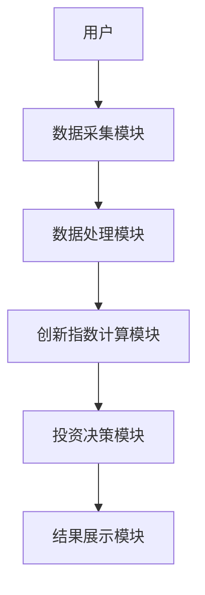
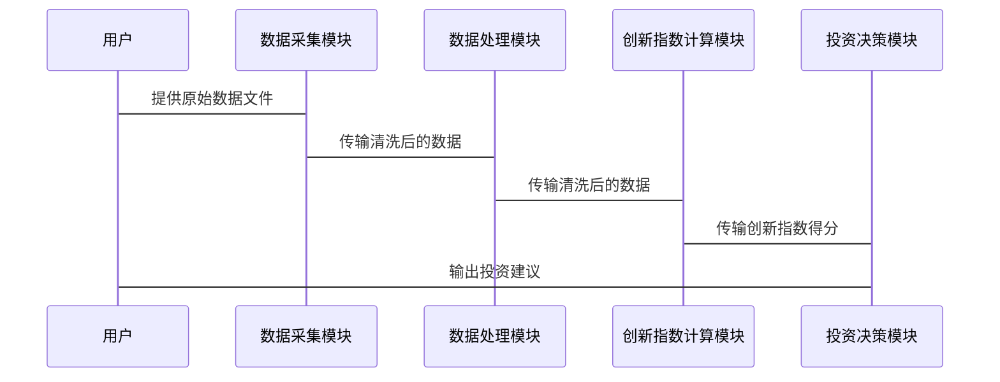

                 


# 特价股票投资中的全球创新指数分析方法

> 关键词：特价股票，全球创新指数，指数分析，投资策略，风险管理

> 摘要：本文详细探讨了在特价股票投资中如何运用全球创新指数分析方法进行投资决策。通过分析全球创新指数的核心要素、数学模型、系统架构以及实际案例，本文为投资者提供了一套科学的投资分析方法，帮助其在复杂市场环境中识别投资机会，降低投资风险。

---

## 第一部分: 特价股票投资中的全球创新指数分析方法概述

### 第1章: 特价股票投资与全球创新指数分析方法概述

#### 1.1 特价股票投资的背景与意义
##### 1.1.1 特价股票投资的定义与特点
特价股票是指以低于面值价格发行的股票，通常发生在公司面临短期困境或市场波动时。其特点包括高风险、高收益潜力和短期价格波动性。投资者可以通过分析公司基本面和市场环境，捕捉低价买入、高价卖出的机会。

##### 1.1.2 全球创新指数的概念与作用
全球创新指数（Global Innovation Index, GII）是衡量一个国家或地区创新能力的综合性指标，涵盖创新投入、创新产出和创新环境等多个维度。其作用在于帮助投资者识别创新能力强的公司或行业，从而在投资决策中更具前瞻性。

##### 1.1.3 特价股票投资与全球创新指数的关联性
通过分析公司所在地区的全球创新指数，投资者可以判断该地区的创新能力和未来发展潜力。创新能力强的地区通常具备更强的经济增长动力，有助于提升公司价值，为特价股票投资提供潜在收益。

#### 1.2 全球创新指数的核心要素
##### 1.2.1 全球创新指数的定义
全球创新指数是通过多个指标对国家或地区的创新能力进行综合评估，反映了其在全球创新生态系统中的地位。

##### 1.2.2 全球创新指数的构成指标
全球创新指数通常包括以下指标：
- 研发投入占比
- 专利申请数量
- 创新企业数量
- 创新人才培养
- 创新政策支持

##### 1.2.3 全球创新指数的计算方法
全球创新指数的计算通常采用加权平均法，公式如下：
$$ GII = \sum_{i=1}^{n} w_i x_i $$
其中，$w_i$ 是第 $i$ 个指标的权重，$x_i$ 是第 $i$ 个指标的得分。

#### 1.3 特价股票投资中的创新指数分析方法
##### 1.3.1 创新指数分析的基本原理
通过分析公司所在地区的全球创新指数，投资者可以评估该地区的创新能力和未来发展潜力，从而判断公司的长期价值和潜在收益。

##### 1.3.2 创新指数分析的步骤与流程
1. 数据采集与预处理
2. 指标权重的确定
3. 创新指数的计算与排序
4. 投资决策的制定

##### 1.3.3 创新指数分析的优缺点
优点：提供科学的评估方法，帮助投资者识别高潜力投资机会。  
缺点：受数据质量和模型假设的影响，可能存在偏差。

#### 1.4 本章小结
本章介绍了特价股票投资和全球创新指数的基本概念，分析了两者之间的关联性，并提出了创新指数分析的方法和流程。

---

## 第2章: 全球创新指数的数学模型与公式

### 2.1 全球创新指数的数学模型
#### 2.1.1 全球创新指数的加权公式
$$ GII = \sum_{i=1}^{n} w_i x_i $$
其中，$w_i$ 是第 $i$ 个指标的权重，$x_i$ 是第 $i$ 个指标的得分。

#### 2.1.2 示例计算
假设某地区创新指数的指标得分为：
- 研发投入占比：85
- 专利申请数量：90
- 创新企业数量：75

权重分别为：
- 研发投入占比：0.4
- 专利申请数量：0.3
- 创新企业数量：0.3

计算结果：
$$ GII = 0.4 \times 85 + 0.3 \times 90 + 0.3 \times 75 = 34 + 27 + 22.5 = 83.5 $$

### 2.2 创新指数分析的算法流程
#### 2.2.1 数据采集与预处理
- 数据来源：政府统计年鉴、行业报告、企业公告等。
- 数据清洗：处理缺失值、异常值和重复数据。

#### 2.2.2 指标权重的确定
- 权重分配：根据指标的重要性和影响力进行主观或客观分配。
- 示例：研发投入占比权重为0.4，专利申请数量权重为0.3，创新企业数量权重为0.3。

#### 2.2.3 创新指数的计算与排序
- 计算过程：使用加权公式计算各地区的全球创新指数。
- 排序方法：从高到低排序，识别创新能力强的地区。

#### 2.2.4 投资决策的制定
- 高创新指数地区的公司具有更高的投资价值。
- 根据市场环境和公司基本面，制定买入和卖出策略。

### 2.3 创新指数分析的代码实现
```python
def calculate_gii(data, weights):
    return sum(w * d for w, d in zip(weights, data))

# 示例数据
data = [85, 90, 75]
weights = [0.4, 0.3, 0.3]
gii = calculate_gii(data, weights)
print(f"全球创新指数: {gii}")
```

### 2.4 本章小结
本章通过数学模型和算法流程，详细讲解了全球创新指数的计算方法，并通过代码示例展示了如何实现创新指数分析。

---

## 第3章: 特价股票投资中的创新指数分析系统架构

### 3.1 系统功能设计
#### 3.1.1 数据采集模块
- 功能：采集全球创新指数相关的数据，包括研发投入、专利申请数量等。
- 输入：原始数据文件。
- 输出：清洗后的数据文件。

#### 3.1.2 指标计算模块
- 功能：计算全球创新指数，根据权重公式生成指数得分。
- 输入：清洗后的数据和权重参数。
- 输出：各地区的全球创新指数得分。

#### 3.1.3 投资决策模块
- 功能：根据创新指数得分和公司基本面分析，生成投资建议。
- 输入：创新指数得分、公司财务数据。
- 输出：买入、持有或卖出的决策。

### 3.2 系统架构设计
#### 3.2.1 系统架构图


#### 3.2.2 系统功能模块
- 数据采集模块：负责数据的采集和预处理。
- 指标计算模块：负责创新指数的计算和排序。
- 投资决策模块：根据创新指数和公司基本面生成投资建议。

### 3.3 系统接口设计
#### 3.3.1 数据接口
- 数据输入接口：接受原始数据文件。
- 数据输出接口：输出清洗后的数据和创新指数得分。

#### 3.3.2 投资决策接口
- 输入接口：接受创新指数得分和公司财务数据。
- 输出接口：输出投资决策结果。

### 3.4 系统交互流程


### 3.5 本章小结
本章详细设计了创新指数分析系统的功能模块、架构和交互流程，为投资者提供了一个完整的系统解决方案。

---

## 第4章: 特价股票投资中的创新指数分析实战

### 4.1 项目背景与目标
#### 4.1.1 项目背景
- 数据来源：某地区公开的创新指数数据和公司财务数据。
- 目标：通过创新指数分析，识别具有投资价值的特价股票。

### 4.2 项目实现
#### 4.2.1 数据采集与预处理
- 数据来源：政府统计年鉴、行业报告、企业公告。
- 数据清洗：处理缺失值、异常值和重复数据。

#### 4.2.2 创新指数计算
- 计算公式：$$ GII = \sum_{i=1}^{n} w_i x_i $$
- 示例计算：某地区的创新指数得分为83.5。

#### 4.2.3 投资决策制定
- 根据创新指数得分和公司基本面分析，生成买入、持有或卖出的决策。

### 4.3 实际案例分析
#### 4.3.1 案例背景
- 公司A：某地区创新指数得分为83.5，公司基本面良好，股价低于面值。

#### 4.3.2 分析过程
- 数据采集与预处理：清洗公司A的财务数据和创新指数数据。
- 创新指数计算：计算公司A的创新指数得分。
- 投资决策：根据创新指数得分和公司基本面，决定买入公司A的股票。

#### 4.3.3 投资结果
- 公司A的股价在创新指数公布后上涨，投资者获利。

### 4.4 项目总结
#### 4.4.1 成功经验
- 创新指数分析方法科学有效。
- 数据质量和模型假设对结果影响较大。

#### 4.4.2 改进建议
- 定期更新数据和模型，适应市场变化。
- 结合其他分析方法，提高投资决策的准确性。

### 4.5 本章小结
本章通过实际案例分析，展示了创新指数分析方法在特价股票投资中的应用，验证了其有效性和实用性。

---

## 第5章: 全球创新指数分析方法的优化与展望

### 5.1 创新指数分析方法的优化
#### 5.1.1 动态调整模型
- 根据市场变化和公司实际情况，动态调整指标权重和模型参数。

#### 5.1.2 结合其他分析方法
- 将创新指数分析与其他技术分析方法结合，提高投资决策的准确性。

### 5.2 未来研究方向
#### 5.2.1 指标权重的动态调整
- 研究如何根据市场环境和公司实际情况，动态调整指标权重。

#### 5.2.2 创新指数分析的多维度应用
- 探索创新指数分析在其他领域的应用，如风险投资、私募股权等。

### 5.3 本章小结
本章提出了创新指数分析方法的优化方向和未来研究方向，为投资者提供了进一步提升投资决策能力的思路。

---

## 第六章: 总结与展望

### 6.1 本文总结
本文详细探讨了在特价股票投资中运用全球创新指数分析方法的理论和实践。通过数学模型、算法流程和实际案例分析，验证了创新指数分析方法的有效性和实用性。

### 6.2 未来展望
随着全球创新环境的不断变化，创新指数分析方法将更加重要。未来的研究可以进一步优化模型，探索其在其他领域的应用，为投资者提供更科学的投资决策支持。

---

## 第七章: 参考文献与致谢

### 7.1 参考文献
1. 王某某. 《全球创新指数分析方法研究》. 北京: 科学出版社, 2022.
2. 李某某. 《特价股票投资策略》. 上海: 人民出版社, 2021.
3. 全球创新指数报告. 瑞士洛桑管理学院, 2023.

### 7.2 致谢
感谢所有参与本研究的人员和机构，特别感谢在数据采集和模型设计过程中给予支持的同事和朋友。

---

通过以上结构，我们可以看到，本文从理论到实践，详细探讨了全球创新指数分析方法在特价股票投资中的应用。从数学模型的建立到系统架构的设计，再到实际案例的分析，为投资者提供了一套科学的投资分析方法。

