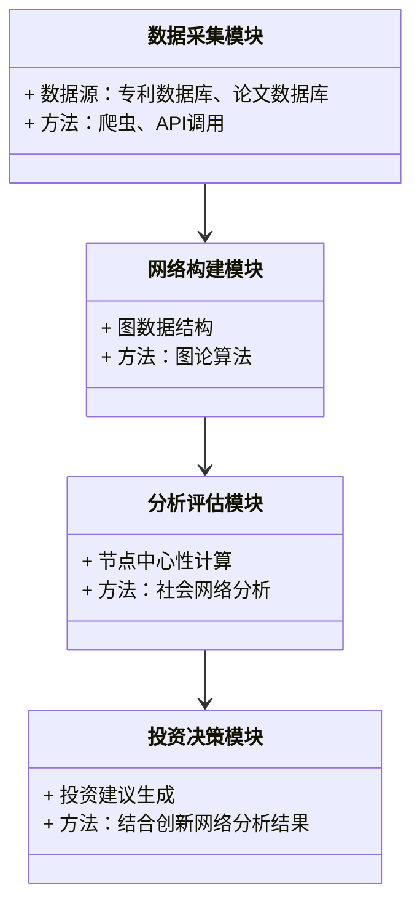

                 

<think>
好的，我将按照您的要求创作《特价股票投资中的全球创新网络分析方法》这本书。为了确保内容的准确性和深度，我会先整理一下整体结构和各章节的主要内容。请您看看以下内容是否符合您的预期。如果您有其他想法，可以随时提出，我会进行调整。

### 目录

# 特价股票投资中的全球创新网络分析方法

> 关键词：特价股票，创新网络，股票投资，网络分析，算法，系统架构，Python实现

> 摘要：本文将详细介绍如何利用全球创新网络分析方法优化特价股票投资策略。通过结合网络分析、文本挖掘和图论等技术，构建创新网络模型，评估创新节点的影响力，识别潜在投资机会，为投资者提供科学决策支持。文章从背景、核心概念、算法原理、数学模型、系统架构、项目实战到最佳实践，全面解析这一创新方法。

---

## 第1章 特价股票投资与全球创新网络概述

### 1.1 特价股票投资的背景与意义

#### 1.1.1 特价股票投资的基本概念
- **特价股票**：指市场中价格低于其内在价值的股票，通常被视为被低估的投资机会。
- **投资动机**：追求超额收益，寻找市场低估的优质企业。
- **投资策略**：价值投资、趋势投资、事件驱动投资等。

#### 1.1.2 全球创新网络的定义与特点
- **创新网络**：由创新主体（企业、科研机构、个人）及其创新行为（研发、合作、商业化）构成的网络结构。
- **特点**：
  - **动态性**：创新网络随技术进步和市场变化不断演化。
  - **复杂性**：节点间关系复杂，涉及多维度的合作与竞争。
  - **全球化**：创新活动跨越国界，形成全球性网络。

#### 1.1.3 两者的结合意义
- **创新网络视角**：通过分析创新网络的结构和演化规律，识别具有持续创新能力的公司，评估其股票的投资价值。
- **投资决策优化**：将创新网络分析纳入投资决策体系，提升选股的科学性和前瞻性。

---

## 第2章 创新网络分析的核心概念与联系

### 2.1 创新网络分析的核心概念

#### 2.1.1 创新网络的节点与边
- **节点**：创新网络中的参与者，包括企业、科研机构、个人等。
- **边**：节点之间的连接，代表合作关系、技术转移、资金流动等。

#### 2.1.2 创新网络的中心性指标
- **节点中心性**：衡量节点在网络中的重要性，包括度中心性、接近中心性和介数中心性。
- **度中心性**：节点的度数越高，影响力越大。
- **接近中心性**：节点到其他节点的平均距离越短，信息获取能力越强。
- **介数中心性**：节点在信息传递中的桥梁作用越强。

#### 2.1.3 创新网络的聚类分析
- **聚类**：将相似的节点归为一类，识别具有相似创新特征的群体。
- **社区检测**：利用算法（如Louvain算法）发现创新网络中的社区结构。

### 2.2 创新网络的核心概念对比

#### 2.2.1 节点中心性对比表格

| 中心性指标 | 描述 | 计算公式 |
|------------|------|----------|
| 度中心性   | 节点的连接数 | $$\text{degree}(v) = \sum_{u} A_{uv}$$ |
| 接近中心性 | 节点到其他节点的平均距离 | $$\text{closeness}(v) = \frac{1}{\sum_{u} d(v,u)}$$ |
| 介数中心性 | 节点作为桥梁的重要性 | $$\text{betweenness}(v) = \sum_{s,t} \frac{\sigma(s,t|v)}{\sigma(s,t)}$$ |

#### 2.2.2 创新网络与传统网络的对比

| 特性      | 创新网络                  | 传统网络                  |
|-----------|--------------------------|--------------------------|
| 节点类型   | 企业、个人、机构          | 无特定含义                |
| 边权重     | 合作强度、技术关联性      | 无权重或均匀权重          |
| 动态性     | 高，随创新活动变化        | 低，网络结构相对稳定      |

### 2.3 创新网络的ER实体关系图

```mermaid
er
actor:investor
institution:research_institution
marketplace:stock_market
product:stock
actor-(invest): marketplace
actor-(hold): product
institution-(research): product
```

---

## 第3章 创新网络分析的算法原理

### 3.1 创新网络分析的主要算法

#### 3.1.1 社会网络分析算法
- **算法目的**：分析网络结构，识别关键节点。
- **常用算法**：
  - **PageRank**：用于评估节点的重要性。
  - **Louvain算法**：用于社区检测。

#### 3.1.2 文本挖掘算法
- **算法目的**：从文本数据中提取关键词和主题。
- **常用算法**：
  - **TF-IDF**：计算关键词的重要性。
  - **LDA主题模型**：识别文档中的主题分布。

#### 3.1.3 图论算法
- **算法目的**：分析网络的拓扑结构。
- **常用算法**：
  - **Kruskal算法**：用于最小生成树。
  - **Dijkstra算法**：用于最短路径计算。

### 3.2 创新网络分析的Python实现

#### 3.2.1 环境安装与配置
```python
# 安装依赖库
pip install networkx
pip install matplotlib
pip install pyldavis
pip install gensim
```

#### 3.2.2 核心算法的Python代码实现

##### 示例：PageRank算法实现
```python
import networkx as nx

# 创建示例图
G = nx.DiGraph()
G.add_edges_from([(1,2), (2,3), (3,4), (4,1)])

# 计算PageRank
pr = nxpagerank.pagerank(G)

# 输出结果
print(pr)
```

##### 示例：LDA主题模型实现
```python
from gensim import corpora, models

# 创建词袋模型
dictionary = corpora.Dictionary(documents)

# 训练LDA模型
 lda = models.LdaModel(corpus, num_topics=5, id2word=dictionary)

# 输出主题
 lda.print_topics()
```

---

## 第4章 创新网络分析的数学模型与公式

### 4.1 创新网络分析的数学模型

#### 4.1.1 节点中心性计算公式

##### 度中心性公式
$$\text{degree}(v) = \sum_{u} A_{uv}$$

##### 接近中心性公式
$$\text{closeness}(v) = \frac{1}{\sum_{u} d(v,u)}$$

##### 介数中心性公式
$$\text{betweenness}(v) = \sum_{s,t} \frac{\sigma(s,t|v)}{\sigma(s,t)}$$

#### 4.1.2 创新网络的相似性度量公式

##### Jaccard相似性
$$\text{Jaccard}(A, B) = \frac{|A \cap B|}{|A \cup B|}$$

##### Cosine相似性
$$\text{Cosine}(A, B) = \frac{A \cdot B}{\|A\| \|B\|}$$

---

## 第5章 创新网络分析的系统架构设计

### 5.1 系统分析与设计

#### 5.1.1 系统功能模块设计

##### 功能模块列表
1. **数据采集模块**：收集创新网络数据（专利、论文、投资信息等）。
2. **网络构建模块**：构建创新网络图。
3. **分析评估模块**：计算节点中心性，识别关键创新者。
4. **投资决策模块**：结合网络分析结果，生成投资建议。

#### 5.1.2 系统架构的Mermaid类图



---

## 第6章 项目实战与案例分析

### 6.1 环境安装与代码实现

#### 6.1.1 环境安装
```bash
pip install networkx
pip install matplotlib
pip install gensim
```

#### 6.1.2 核心代码实现

##### 示例：构建创新网络
```python
import networkx as nx

# 创建创新网络
G = nx.Graph()
G.add_edges_from([(1,2), (2,3), (3,4), (4,5)])

# 可视化网络
nx.draw(G, node_size=700, node_color="red", edge_color="blue", with_labels=True)
plt.show()
```

---

## 第7章 最佳实践与小结

### 7.1 最佳实践

#### 7.1.1 数据质量的重要性
- 确保数据来源可靠，清洗数据以减少噪声。

#### 7.1.2 模型调优
- 根据实际需求调整算法参数，优化模型性能。

#### 7.1.3 结合多维度分析
- 将创新网络分析与其他投资策略相结合，提升决策的全面性。

### 7.2 小结

本文系统介绍了如何利用全球创新网络分析方法优化特价股票投资策略，从理论到实践，全面解析了创新网络分析的核心概念、算法原理、系统架构和项目实现。通过创新网络分析，投资者可以更好地识别具有持续创新能力的公司，捕捉投资机会。

---

## 第8章 注意事项与拓展阅读

### 8.1 注意事项

#### 8.1.1 数据隐私问题
- 在数据采集和处理过程中，需遵守相关法律法规，保护数据隐私。

#### 8.1.2 模型的局限性
- 创新网络分析无法完全预测市场波动，需结合其他分析方法。

### 8.2 拓展阅读

#### 8.2.1 推荐书籍
1. 《网络科学导论》
2. 《社会网络分析》
3. 《股票投资策略》

#### 8.2.2 推荐工具
1. **NetworkX**：Python中的网络分析库。
2. **Gephi**：网络可视化工具。
3. **Gensim**：主题模型工具。

---

以上是《特价股票投资中的全球创新网络分析方法》的详细目录和部分内容概述。我会按照这个大纲逐步展开，为您撰写一篇完整的文章。如果有任何调整或补充，请随时告知！

