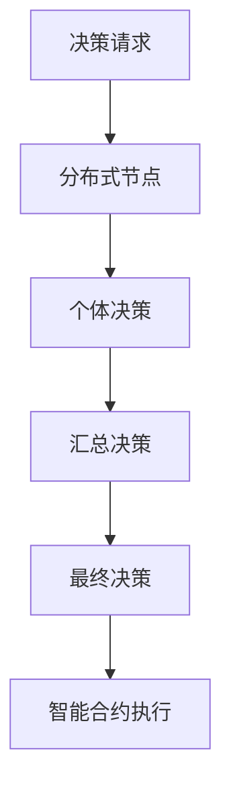
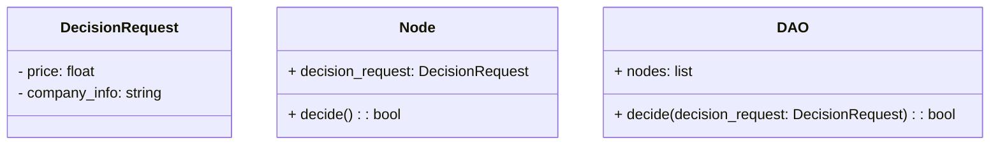
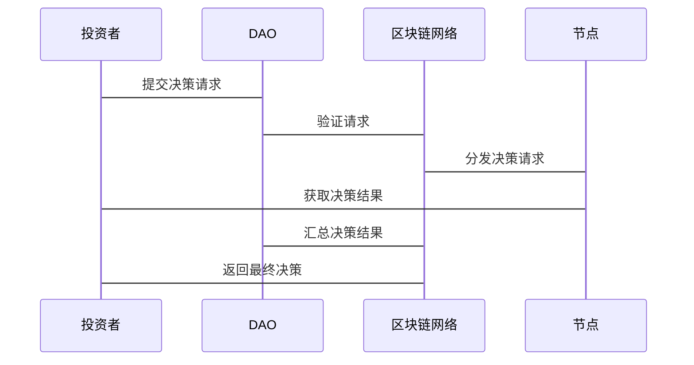

                 


# 特价股票投资中的分布式自治组织(DAO)决策方法

## 关键词：分布式自治组织（DAO）、特价股票投资、决策方法、区块链技术、集体决策

## 摘要：本文探讨了分布式自治组织（DAO）在特价股票投资中的决策方法，通过分析DAO的定义、结构及其在金融领域的应用，详细阐述了基于DAO的分布式决策算法的原理、实现及应用场景。文章结合实际案例，展示了如何利用DAO提高投资决策的透明度和集体智慧，降低个体风险，并提供了系统架构设计和代码实现的详细步骤。

---

## 第1章: 特价股票投资与分布式自治组织（DAO）的背景介绍

### 1.1 特价股票投资的背景与现状

#### 1.1.1 特价股票的定义与特点
特价股票是指市场价格低于面值的股票，通常具有较高的投资潜力。这类股票可能因市场波动或公司暂时性问题而被低估，但具备较大的增值空间。

#### 1.1.2 特价股票投资的市场现状
随着市场波动加剧，越来越多的投资者关注特价股票，希望通过低价买入高价卖出赚取利润。然而，特价股票的投资风险较高，需要投资者具备较高的市场分析能力和风险承受能力。

#### 1.1.3 投资者在特价股票中的行为模式
投资者在特价股票中的行为模式多样，包括短期交易、长期持有等。然而，个体投资者在面对复杂市场环境时，往往难以全面分析影响股票价格的各种因素，容易受到情绪影响做出错误决策。

### 1.2 分布式自治组织（DAO）的起源与特点

#### 1.2.1 DAO的定义与核心概念
DAO（Decentralized Autonomous Organization）是一种基于区块链技术的组织形式，通过智能合约自动执行决策和管理流程。DAO的核心特点包括去中心化、透明性和自治性。

#### 1.2.2 DAO与传统组织的对比
- **决策方式**：传统组织依赖少数高管的决策，而DAO通过分布式网络实现集体决策。
- **透明性**：DAO的所有决策和交易记录在区块链上，可追溯且不可篡改。
- **自治性**：DAO通过智能合约自动执行决策，减少人为干预。

#### 1.2.3 DAO在金融领域的应用现状
目前，DAO已在金融领域得到广泛应用，如去中心化交易所、资产管理等。通过DAO，投资者可以实现更加透明和高效的决策过程。

### 1.3 特价股票投资中引入DAO的意义

#### 1.3.1 提高投资决策的透明度
通过DAO的区块链技术，投资者可以实时追踪决策过程和交易记录，确保信息的透明性和公正性。

#### 1.3.2 增强投资决策的集体智慧
DAO通过分布式网络聚合多个投资者的意见和分析结果，形成更加全面的投资决策，避免个体决策的局限性。

#### 1.3.3 降低个体决策风险
通过集体决策和自动化执行，DAO能够有效分散投资风险，减少个体决策失误对整体投资的影响。

---

## 第2章: 特价股票投资中的分布式自治组织（DAO）决策方法的核心概念与联系

### 2.1 分布式自治组织（DAO）的决策机制

#### 2.1.1 DAO的决策流程
1. **决策请求**：投资者提出需要决策的请求，如买入某只股票。
2. **分布式节点处理**：请求通过区块链网络分发至多个节点。
3. **个体决策**：每个节点根据自身数据和算法进行决策。
4. **汇总决策**：节点将决策结果汇总，形成最终决策。
5. **自动执行**：通过智能合约自动执行决策结果。

#### 2.1.2 DAO的决策规则
- **多数决策规则**：通过投票机制，超过半数节点同意的决策生效。
- **权重决策规则**：根据节点的贡献或持有代币数量赋予不同权重，形成加权决策。
- **共识算法**：使用如PoS、Raft等共识算法确保决策的稳定性和一致性。

#### 2.1.3 DAO的决策工具与技术
- **智能合约**：用于自动执行决策和交易。
- **区块链网络**：提供分布式网络支持和数据存储。
- **分布式计算技术**：确保决策过程的高效和安全。

### 2.2 特价股票投资中的决策方法

#### 2.2.1 基于DAO的集体决策方法
通过DAO的分布式网络，投资者可以集体投票决定是否买入或卖出某只特价股票。集体决策能够减少个体决策的偏差，提高决策的准确性。

#### 2.2.2 基于DAO的个体决策方法
投资者可以根据自身分析和判断，通过DAO平台提交个人决策，与其他投资者的决策进行对比和参考。

#### 2.2.3 基于DAO的混合决策方法
结合集体决策和个体决策，形成混合决策模式。例如，集体决策作为主要决策依据，个体决策作为补充参考。

### 2.3 DAO决策方法与传统决策方法的对比

#### 2.3.1 决策主体的对比
- **传统决策**：依赖少数高管或专业团队。
- **DAO决策**：基于分布式网络，聚合多方意见。

#### 2.3.2 决策过程的对比
- **传统决策**：线性流程，决策过程可能较长。
- **DAO决策**：并行处理，决策过程高效且透明。

#### 2.3.3 决策结果的对比
- **传统决策**：可能存在信息不对称和决策偏差。
- **DAO决策**：通过区块链技术和集体智慧，确保决策的透明和公正。

---

## 第3章: 特价股票投资中的分布式自治组织（DAO）决策方法的算法原理

### 3.1 分布式决策算法的概述

#### 3.1.1 分布式决策算法的定义
分布式决策算法是一种基于分布式网络的决策方法，通过多个节点协作完成决策过程。

#### 3.1.2 分布式决策算法的核心原理
分布式决策算法通过节点之间的通信和协作，汇总多个节点的决策结果，形成最终决策。其核心在于通过算法确保决策的高效性、一致性和安全性。

#### 3.1.3 分布式决策算法的数学模型
分布式决策算法可以表示为：
$$ D = \sum_{i=1}^{n} w_i \cdot d_i $$
其中，$D$ 为最终决策，$w_i$ 为节点的权重，$d_i$ 为节点的决策结果。

### 3.2 基于DAO的分布式决策算法实现

#### 3.2.1 算法流程图（Mermaid）



#### 3.2.2 算法实现代码

```python
class DAO:
    def __init__(self, nodes):
        self.nodes = nodes

    def decide(self, decision_request):
        # 分布式决策算法
        decisions = [node.decide(decision_request) for node in self.nodes]
        # 汇总决策
        total = sum(decisions)
        return total > len(self.nodes) // 2

# 示例节点类
class Node:
    def decide(self, decision_request):
        # 简单决策逻辑，根据股价判断
        if decision_request['price'] < 10:
            return True
        else:
            return False

# 使用DAO进行决策
nodes = [Node() for _ in range(10)]
dao = DAO(nodes)
decision_request = {'price': 8}
result = dao.decide(decision_request)
print(result)  # 输出True或False
```

### 3.3 分布式决策算法的数学模型与公式

#### 3.3.1 投票机制
在DAO中，投票机制是常见的决策方式。假设每个节点有投票权，最终决策由超过半数的节点同意决定：
$$ \text{决策结果} = \text{多数节点同意} $$

#### 3.3.2 共识算法
为了确保决策的一致性，DAO通常采用共识算法，如RAFT算法。共识算法确保所有节点达成一致的决策结果：
$$ \text{共识结果} = \text{所有节点一致同意} $$

#### 3.3.3 权重决策
对于具有不同权重的节点，决策结果可以通过加权投票确定：
$$ \text{决策结果} = \sum_{i=1}^{n} w_i \cdot d_i \geq \theta $$
其中，$w_i$ 为节点权重，$d_i$ 为节点决策结果，$\theta$ 为决策阈值。

---

## 第4章: 特价股票投资中的分布式自治组织（DAO）决策方法的系统分析与架构设计

### 4.1 系统功能设计

#### 4.1.1 领域模型（Mermaid 类图）



#### 4.1.2 系统架构设计（Mermaid 架构图）


### 4.2 系统接口设计

#### 4.2.1 API 接口
- **提交决策请求**：`POST /api/decision_requests`
- **获取决策结果**：`GET /api/decision_results/{id}`
- **节点加入 DAO**：`POST /api/join_dao`

#### 4.2.2 接口交互流程（Mermaid 序列图）



---

## 第5章: 特价股票投资中的分布式自治组织（DAO）决策方法的项目实战

### 5.1 环境安装

#### 5.1.1 安装区块链平台
选择适合的区块链平台，如Ethereum、Solana等，安装并配置环境。

#### 5.1.2 安装智能合约开发工具
安装Solidity编译器、 Remix等智能合约开发工具。

### 5.2 系统核心实现

#### 5.2.1 智能合约实现
```solidity
// 智能合约代码示例
contract DAO {
    address[] public nodes;
    mapping(address => uint) public votes;

    function propose(address[] calldata _nodes) external {
        nodes = _nodes;
    }

    function decide(bytes calldata _decision_request) external returns (bool) {
        uint total = 0;
        for (uint i = 0; i < nodes.length; i++) {
            address node = nodes[i];
            if (votes[node] > 0) {
                total += votes[node];
            }
        }
        return total > nodes.length / 2;
    }
}
```

#### 5.2.2 应用程序实现
```python
class DAOApplication:
    def __init__(self, contract_address):
        self.contract = contract_address

    def submit_request(self, request):
        # 提交决策请求到智能合约
        pass

    def get_result(self, request_id):
        # 获取决策结果
        pass
```

### 5.3 实际案例分析

#### 5.3.1 案例背景
某投资者计划购买一只特价股票，希望通过DAO平台进行集体决策。

#### 5.3.2 案例实现
投资者在DAO平台上提交决策请求，DAO网络中的节点进行分析和投票，最终形成决策结果。

#### 5.3.3 案例分析
通过DAO平台，投资者能够获得更多的分析结果和决策依据，降低投资风险。

### 5.4 项目小结

#### 5.4.1 项目总结
通过DAO平台进行特价股票投资决策，能够提高决策的透明度和准确性，减少个体决策的风险。

#### 5.4.2 经验总结
在项目实施过程中，需注意智能合约的安全性、节点的参与度以及决策算法的优化。

---

## 第6章: 特价股票投资中的分布式自治组织（DAO）决策方法的最佳实践

### 6.1 小结

#### 6.1.1 核心观点总结
DAO通过分布式网络和智能合约，为特价股票投资提供了一种高效、透明的决策方法。

#### 6.1.2 主要收获
通过本章的学习，读者能够理解DAO在金融领域的应用价值，并掌握分布式决策算法的实现方法。

### 6.2 注意事项

#### 6.2.1 安全性
DAO平台的安全性至关重要，需防范黑客攻击和漏洞利用。

#### 6.2.2 透明性
确保所有决策过程透明可追溯，维护投资者的信任。

#### 6.2.3 可扩展性
DAO系统需具备良好的可扩展性，以应对不断增长的节点和决策请求。

### 6.3 拓展阅读

#### 6.3.1 推荐书籍
- 《区块链技术与智能合约》
- 《分布式系统的设计与实现》

#### 6.3.2 推荐文章
- "DAO在金融领域的创新应用"
- "区块链技术与投资决策的未来趋势"

---

## 总结

通过本文的详细阐述，读者可以全面了解分布式自治组织（DAO）在特价股票投资中的决策方法。从背景介绍到算法实现，再到项目实战和最佳实践，本文为读者提供了一个完整的解决方案。未来，随着区块链技术的不断发展，DAO在金融领域的应用将更加广泛，为投资者带来更多的机遇和挑战。

--- 

希望这篇文章能够为读者提供有价值的见解，并激发进一步的研究和实践。

