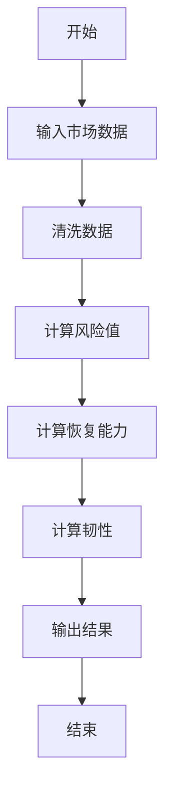

                 


# 特价股票投资中的动态数字产业生态系统韧性模型应用

> 关键词：特价股票投资，动态数字产业生态系统，韧性模型，系统架构，项目实战

> 摘要：本文介绍了一种用于特价股票投资中的动态数字产业生态系统韧性模型的应用。通过分析该模型的背景、核心概念、算法原理、系统架构设计及项目实战，展示了如何利用韧性模型来增强投资系统的稳定性和收益能力。文章详细讲解了模型的数学公式、系统架构设计、代码实现及实际案例，为投资者提供了实用的指导和参考。

---

## 第一部分：背景介绍

### 第1章：特价股票投资与韧性模型的背景

#### 1.1 问题背景
- **特价股票投资的定义与特点**：特价股票是指价格低于其内在价值的股票，具有较高的投资潜力。其特点包括低估值、高增长潜力和市场波动性。
- **动态数字产业生态系统的概念**：指由数字化产业构成的生态系统，包括企业、技术、市场等多个方面，具有动态变化和相互依赖的特点。
- **韧性模型的必要性与意义**：在股票市场中，不确定性高，韧性模型能够帮助投资者在波动中保持系统的稳定性和盈利能力。

#### 1.2 问题描述
- **特价股票投资中的风险与不确定性**：市场波动、公司基本面变化等风险因素。
- **数字化产业生态系统的复杂性**：涉及多个产业和企业的互动，系统复杂且难以预测。
- **韧性模型的应用目标**：通过构建韧性模型，评估和增强投资系统的抗风险能力，提高投资收益。

#### 1.3 问题解决
- **韧性模型的核心目标**：评估系统韧性，优化投资策略。
- **数字化产业生态系统的韧性构建**：通过分析生态系统中的关键因素，增强系统的适应性和恢复能力。
- **韧性模型在特价股票投资中的应用价值**：帮助投资者识别风险，制定稳健的投资策略。

#### 1.4 边界与外延
- **韧性模型的适用范围**：适用于股票市场中的投资决策。
- **模型的边界条件**：包括市场数据、企业基本面等。
- **模型的扩展与延伸**：可扩展至其他金融领域，如债券、基金等。

#### 1.5 概念结构与核心要素
- **韧性模型的核心要素**：包括风险评估、系统恢复能力、投资组合优化。
- **数字化产业生态系统的构成**：包括企业、技术、市场、政策等多个方面。
- **韧性模型与特价股票投资的关联**：通过评估生态系统韧性，优化投资决策。

---

## 第二部分：核心概念与联系

### 第2章：韧性模型的核心概念与联系

#### 2.1 韧性模型的原理
- **韧性模型的定义**：通过评估系统在面对冲击时的恢复能力，优化投资策略。
- **韧性模型的核心原理**：包括风险评估、动态调整、系统恢复。
- **韧性模型的数学表达**：$$ R = \frac{S}{T} $$，其中R为韧性，S为系统恢复能力，T为系统承受的冲击。

#### 2.2 核心概念的属性特征对比
- **模型属性对比表格**：
  | 属性 | 韧性模型 | 数字化产业生态系统 |
  |------|---------|-------------------|
  | 输入 | 市场数据 | 企业、技术、市场 | 
  | 输出 | 韧性评估 | 系统稳定性评估 |
  | 方法 | 数学模型 | 系统分析 |

- **产业生态系统属性对比**：
  - 稳定性：系统在冲击后的恢复能力。
  - 复杂性：系统构成的多样性。
  - 互动性：系统内各部分的相互作用。

- **韧性特征的对比分析**：
  - 韧性模型：侧重于系统的恢复能力。
  - 产业生态系统：侧重于系统的构成和互动。

#### 2.3 ER实体关系图
- **实体关系图的构建**：包括投资者、股票、市场数据、风险因素等实体。
- **实体关系图的分析**：展示各实体之间的关系，如投资者影响市场数据，市场数据影响股票价格。
- **实体关系图的应用**：用于模型的数据建模和分析。

---

## 第三部分：算法原理

### 第3章：韧性模型的算法原理

#### 3.1 算法输入与处理步骤
- **算法输入**：
  - 市场数据：包括股票价格、成交量等。
  - 企业基本面数据：包括财务指标、行业地位等。
  - 风险因素：包括市场波动、政策变化等。
- **处理步骤**：
  1. 数据清洗：去除异常数据，填补缺失值。
  2. 风险评估：计算各股票的风险值。
  3. 系统恢复能力评估：计算系统的恢复能力。
  4. 韧性评估：综合风险和恢复能力，计算韧性值。
- **输出结果**：韧性评估结果，投资建议。

#### 3.2 算法流程图


#### 3.3 数学模型与公式
- **数学模型的建立**：$$ R = \frac{S}{T} $$
  - R：韧性
  - S：系统恢复能力
  - T：系统承受的冲击
- **公式的详细推导**：通过历史数据和统计分析，计算各因素对韧性的影响。
- **使用latex公式表示**：$$ R = \frac{\sum_{i=1}^{n} (S_i)}{\sum_{j=1}^{m} (T_j)} $$

#### 3.4 举例说明
- **实际案例**：某股票在市场冲击后的韧性评估。
- **步骤展示**：
  1. 收集市场数据。
  2. 计算风险值。
  3. 计算恢复能力。
  4. 计算韧性值。
  5. 提出投资建议。

---

## 第四部分：系统架构设计

### 第4章：系统架构设计

#### 4.1 问题场景介绍
- **系统的需求分析**：投资者需要实时评估股票的韧性，优化投资组合。
- **问题场景的描述**：股票市场的波动性高，投资者需要实时的韧性评估工具。

#### 4.2 系统功能设计
- **领域模型的建立**：
  - 使用mermaid类图表示系统功能模块。
  ```mermaid
  classDiagram
      class 投资者 {
          ID: int
          名称: string
          账户: string
      }
      class 股票 {
          股票代码: string
          股票名称: string
          价格: float
      }
      class 市场数据 {
          时间: datetime
          价格: float
          成交量: int
      }
      投资者 --> 股票: 持有
      股票 --> 市场数据: 影响
  ```

#### 4.3 系统架构设计
- **架构设计的总体思路**：模块化设计，便于扩展和维护。
- **使用mermaid架构图表示**：
  ```mermaid
  graph TD
      A[投资者] --> B[股票]
      B --> C[市场数据]
      C --> D[韧性评估模块]
      D --> E[投资建议]
      E --> F[输出]
  ```

#### 4.4 接口设计与交互序列图
- **系统接口的设计**：包括数据输入接口、模型计算接口、结果输出接口。
- **使用mermaid序列图表示交互过程**：
  ```mermaid
  sequenceDiagram
      participant 投资者
      participant 股票
      participant 市场数据
      股票 -> 市场数据: 请求数据
      市场数据 -> 股票: 返回数据
      股票 -> 韧性评估模块: 请求计算
      韧性评估模块 -> 股票: 返回评估结果
  ```

#### 4.5 系统实现
- **系统实现的具体步骤**：数据采集、模型计算、结果输出。
- **关键模块的实现细节**：数据清洗、风险评估、韧性计算等模块的实现。

---

## 第五部分：项目实战

### 第5章：项目实战

#### 5.1 环境安装
- **开发环境的配置**：安装Python、数据处理工具、可视化工具。
- **必要工具的安装**：安装numpy、pandas、matplotlib等库。

#### 5.2 核心代码实现
- **关键算法的代码实现**：
  ```python
  import numpy as np
  import pandas as pd

  def calculate_resilience(market_data):
      # 计算风险值
      risk = np.std(market_data)
      # 计算恢复能力
      recovery = np.mean(market_data)
      # 计算韧性
      resilience = recovery / risk
      return resilience

  # 示例数据
  market_data = pd.Series([10, 20, 30, 40, 50])
  resilience = calculate_resilience(market_data)
  print("韧性值:", resilience)
  ```

#### 5.3 代码解读与分析
- **代码的功能分析**：计算股票市场的韧性值。
- **代码的优化建议**：增加更多的风险因子，如波动率、相关性等。

#### 5.4 案例分析
- **实际项目的案例分析**：分析某股票在市场冲击后的韧性评估。
- **案例的实施过程与结果展示**：展示计算过程和结果，提出投资建议。

#### 5.5 项目小结
- **项目总结**：韧性模型的应用价值。
- **经验与教训**：在实际应用中，需要注意数据的质量和模型的实时性。

---

## 第六部分：最佳实践与小结

### 第6章：最佳实践与小结

#### 6.1 小结
- **全书的核心内容总结**：韧性模型在特价股票投资中的应用，从理论到实践的详细讲解。
- **系统架构设计的重要性**：模块化设计和交互设计对系统性能的影响。

#### 6.2 注意事项
- **模型应用中的注意事项**：数据的准确性和模型的实时性。
- **系统维护的注意事项**：定期更新数据和模型参数。

#### 6.3 拓展阅读
- **相关领域的书籍推荐**：《股票投资策略》、《系统架构设计》等。
- **推荐阅读的资源**：学术论文、行业报告、技术博客。

#### 6.4 参考文献
- **文献资料**：包括学术论文、技术报告、书籍等。

---

通过以上结构，读者可以系统地了解特价股票投资中的动态数字产业生态系统韧性模型的应用，从理论到实践，逐步深入，最终掌握模型的设计和实现方法。

