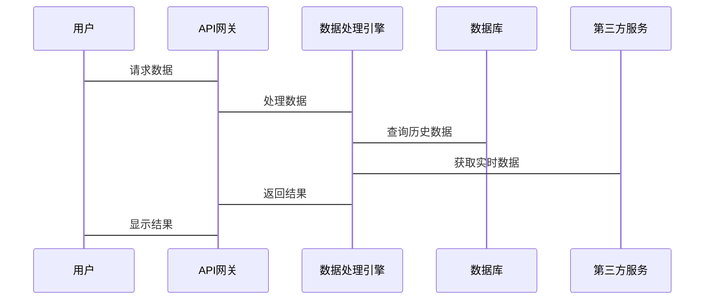

                 


# 特价股票投资中的另类数据挖掘与分析

> 关键词：特价股票、另类数据、数据挖掘、股票投资、机器学习

> 摘要：本文系统地探讨了特价股票投资中另类数据挖掘与分析的核心方法，结合实际案例，深入分析了数据挖掘技术在股票投资中的应用，帮助投资者利用另类数据提升投资决策的科学性和精准性。

---

## 第一部分：特价股票投资背景与另类数据概述

### 第1章：特价股票投资的背景与概念

#### 1.1 特价股票的定义与特点

##### 1.1.1 特价股票的定义
特价股票是指价格相对较低、具有较高投资潜力的股票。通常，这类股票可能因市场波动、公司基本面改善或其他因素而被低估，为投资者提供超额收益的机会。

##### 1.1.2 特价股票的特点与分类
- **特点**：
  - 价格低廉，适合中小投资者。
  - 市场关注度较低，可能存在挖掘潜力。
  - 基本面可能暂时被市场忽视。
- **分类**：
  - 按行业：科技、金融、制造等。
  - 按市值：小盘股、中盘股。
  - 按估值指标：市盈率（P/E）、市净率（P/B）等。

##### 1.1.3 特价股票的投资价值分析
通过分析公司财务数据、行业地位和市场趋势，投资者可以识别具有潜在增值空间的特价股票。

---

#### 1.2 另类数据在股票投资中的应用

##### 1.2.1 另类数据的定义与类型
- **定义**：另类数据指传统金融数据之外的非结构化数据，如社交媒体数据、新闻数据、专利数据等。
- **类型**：
  - 文本数据：新闻、社交媒体、公司财报。
  - 非结构化数据：图像、音频、视频。
  - 行为数据：用户点击流、交易数据。

##### 1.2.2 另类数据在股票投资中的优势
- 提供市场情绪、行业趋势等实时信息。
- 帮助发现传统数据无法捕捉的市场机会。
- 通过自然语言处理（NLP）技术挖掘隐含信息。

##### 1.2.3 另类数据与传统数据的对比
| 数据类型 | 特点 | 应用场景 |
|----------|------|----------|
| 传统数据 | 结构化、标准化 | 市盈率、市净率计算 |
| 另类数据 | 非结构化、多样化 | 市场情绪分析、新闻事件挖掘 |

---

#### 1.3 数据挖掘在股票投资中的重要性

##### 1.3.1 数据挖掘的基本概念
数据挖掘是从大量数据中提取有价值信息的过程，常用于模式识别、预测建模。

##### 1.3.2 数据挖掘在股票投资中的应用场景
- 股票筛选：通过聚类分析识别相似股票。
- 市场预测：利用回归模型预测股价走势。
- 风险管理：通过分类算法识别高风险股票。

##### 1.3.3 数据挖掘技术的最新发展
- 大数据技术的应用：实时数据处理能力提升。
- 人工智能的结合：深度学习模型在股票预测中的应用。

---

## 第二部分：另类数据挖掘的核心概念与技术

### 第2章：另类数据的类型与特征

#### 2.1 文本数据挖掘

##### 2.1.1 文本数据的获取与预处理
- 数据来源：新闻网站、社交媒体、公司财报。
- 预处理步骤：分词、去停用词、词干提取。

##### 2.1.2 文本挖掘的关键技术
- **情感分析**：通过NLP技术判断市场情绪。
- **关键词提取**：识别文本中的重要信息。
- **主题建模**：使用LDA模型发现文本主题。

##### 2.1.3 文本数据在股票投资中的应用案例
- 通过新闻情绪分析预测股价走势。
- 通过关键词提取识别行业趋势。

#### 2.2 社交媒体数据

##### 2.2.1 社交媒体数据的特征与挑战
- **特征**：实时性、情感性、多样性。
- **挑战**：数据量大、噪声多、隐私问题。

##### 2.2.2 社交媒体数据的清洗与处理
- 数据清洗：去除无效信息、重复数据。
- 数据处理：情感分析、用户行为分析。

##### 2.2.3 基于社交媒体的股票情绪分析
- 使用NLP技术分析社交媒体情绪。
- 结合情绪指标进行投资决策。

#### 2.3 非结构化数据

##### 2.3.1 非结构化数据的定义与分类
- **定义**：未组织成行的结构化格式的数据。
- **分类**：文本、图像、音频、视频。

##### 2.3.2 非结构化数据的处理方法
- **文本数据**：分词、情感分析。
- **图像数据**：目标检测、图像识别。
- **音频数据**：语音识别、声纹分析。

##### 2.3.3 非结构化数据在股票投资中的应用
- 通过图像识别分析公司产品创新。
- 通过语音识别分析行业会议内容。

---

### 第3章：数据挖掘算法与数学模型

#### 3.1 聚类分析

##### 3.1.1 聚类分析的定义与原理
- **定义**：将相似数据点分组的过程。
- **原理**：基于距离或密度的相似性度量。

##### 3.1.2 K-means算法的实现与应用
- **算法流程**：
  1. 初始化质心。
  2. 计算每个数据点到质心的距离。
  3. 重新计算质心，直到收敛。
- **应用案例**：将股票按市场表现分组。

##### 3.1.3 层次聚类算法的应用案例
- **算法流程**：逐步合并相似的股票数据。
- **应用案例**：识别市场趋势相似的股票群。

#### 3.2 分类与回归分析

##### 3.2.1 分类算法（如决策树、随机森林）在股票预测中的应用
- **决策树**：基于特征的树状结构进行分类。
- **随机森林**：通过集成学习提高分类准确率。

##### 3.2.2 回归分析的原理与应用
- **线性回归**：$$ y = \beta_0 + \beta_1x + \epsilon $$
- **应用案例**：预测股票价格走势。

##### 3.2.3 支持向量机（SVM）在股票分类中的应用
- **SVM原理**：通过超平面划分数据。
- **应用案例**：识别股票涨跌趋势。

#### 3.3 自然语言处理（NLP）技术

##### 3.3.1 NLP技术在文本数据处理中的应用
- **分词**：将文本分割为词语。
- **实体识别**：识别公司名称、行业术语。

##### 3.3.2 基于NLP的情感分析模型构建
- **模型原理**：通过词嵌入（如Word2Vec）计算情感倾向。
- **应用案例**：分析新闻对股价的影响。

##### 3.3.3 NLP在股票新闻分析中的应用
- **实时新闻监控**：通过NLP提取关键信息。
- **情绪指标计算**：量化市场情绪对股价的影响。

---

## 第三部分：系统分析与架构设计方案

### 第3章：系统分析与架构设计方案

#### 3.1 问题场景介绍
- **目标**：构建一个基于另类数据的股票投资分析系统。
- **场景**：投资者通过系统获取实时市场信息，辅助投资决策。

#### 3.2 系统功能设计
- **数据采集**：实时采集新闻、社交媒体数据。
- **数据处理**：清洗、转换、分析。
- **模型构建**：训练机器学习模型进行预测。
- **结果展示**：可视化分析结果。

#### 3.3 系统架构设计（Mermaid图）


#### 3.4 接口设计
- **输入接口**：API接口接收外部数据。
- **输出接口**：API接口返回分析结果。

#### 3.5 交互序列图（Mermaid图）



---

## 第四部分：项目实战

### 第4章：环境安装与系统实现

#### 4.1 环境安装
- **工具安装**：
  - Python：3.8+
  - 库：pandas、numpy、scikit-learn、nltk、spacy。

#### 4.2 核心代码实现

##### 4.2.1 数据采集与预处理
```python
import requests
from bs4 import BeautifulSoup

def fetch_news_data():
    url = "https://finance.yahoo.com"
    response = requests.get(url)
    soup = BeautifulSoup(response.text, 'html.parser')
    articles = soup.find_all('article')
    return articles
```

##### 4.2.2 情感分析模型构建
```python
from sklearn.feature_extraction.text import TfidfVectorizer
from sklearn.svm import SVC

vectorizer = TfidfVectorizer()
X = vectorizer.fit_transform(texts)
model = SVC()
model.fit(X, labels)
```

##### 4.2.3 股票预测模型实现
```python
import pandas as pd
from sklearn.linear_model import LinearRegression

data = pd.read_csv('stock_data.csv')
X = data[['PE', 'PB', 'Volume']]
y = data['Price']
model = LinearRegression()
model.fit(X, y)
```

#### 4.2.4 代码解读与分析
- 数据采集：使用requests和BeautifulSoup提取新闻数据。
- 情感分析：基于TF-IDF和SVM构建情感分类模型。
- 股票预测：使用线性回归模型预测股价走势。

#### 4.3 案例分析
- **案例1**：通过文本挖掘识别行业趋势。
- **案例2**：利用聚类分析筛选相似股票。

#### 4.4 项目小结
- 通过实战项目，验证了另类数据挖掘在股票投资中的有效性。
- 提供了从数据采集到模型构建的完整流程。

---

## 第五部分：总结与展望

### 5.1 最佳实践 tips
- 数据预处理是关键：确保数据质量和完整性。
- 结合多种数据源：提高分析的准确性和全面性。
- 持续优化模型：根据市场变化调整模型参数。

### 5.2 小结
本文系统地介绍了特价股票投资中的另类数据挖掘方法，结合实际案例，展示了如何利用数据挖掘技术提升投资决策的科学性。

### 5.3 注意事项
- 数据隐私：注意保护投资者的隐私信息。
- 模型风险：避免过度依赖单一模型。
- 市场波动：实时监控市场变化，及时调整策略。

### 5.4 拓展阅读
- 《Python机器学习实战》
- 《自然语言处理入门》
- 《股票投资技术分析》

---

# 结语
通过本文的学习，读者可以掌握特价股票投资中的另类数据挖掘方法，利用数据挖掘技术提升投资决策的科学性和精准性。未来，随着大数据和人工智能技术的不断发展，另类数据挖掘在股票投资中的应用将更加广泛和深入。

