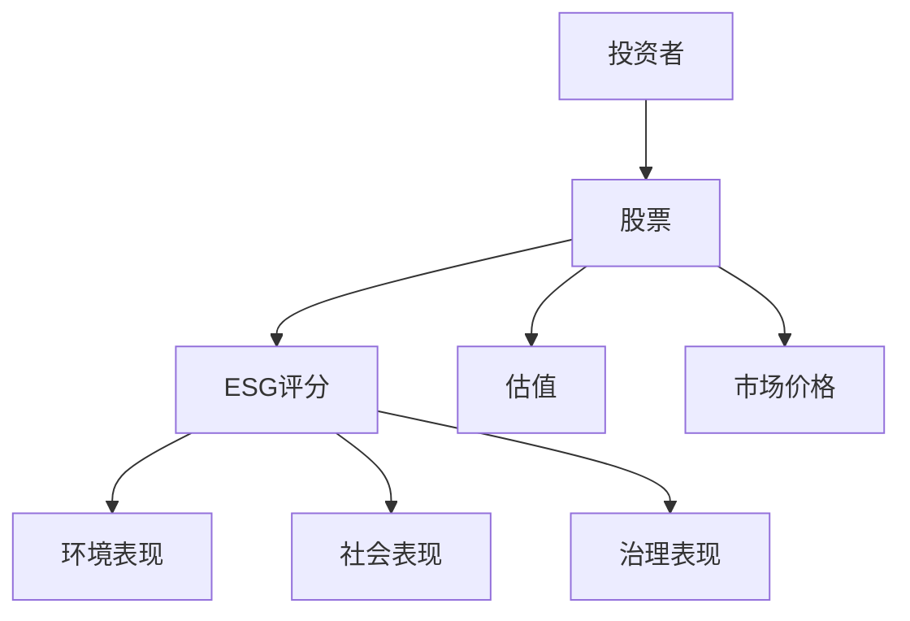
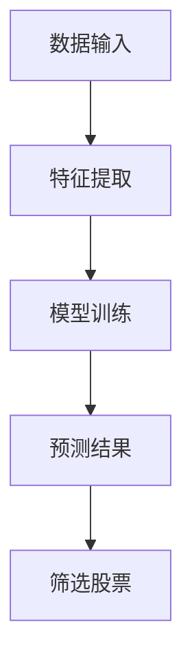
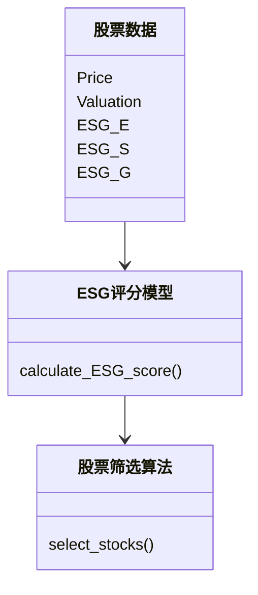
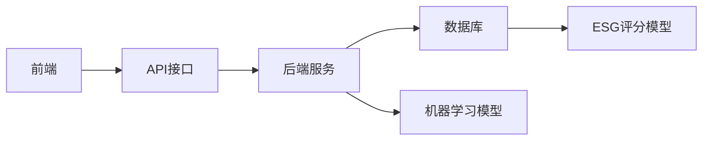

                 


# 特价股票投资中的可持续发展目标整合方法

> 关键词：特价股票投资、可持续发展目标、ESG评分、机器学习、股票筛选、投资策略

> 摘要：本文探讨了在特价股票投资中整合可持续发展目标的方法，结合ESG评分和机器学习算法，提出了一个高效的股票筛选模型。通过系统分析与架构设计，本文详细介绍了如何将环境、社会和治理因素融入投资决策，并通过实际案例展示了模型的实现与应用。

---

# 第一部分: 特价股票投资中的可持续发展目标整合背景

## 第1章: 特价股票投资的背景与现状

### 1.1 特价股票投资的定义与特点

#### 1.1.1 特价股票的定义  
特价股票是指市场价格低于其内在价值的股票。这种股票通常被市场低估，具有较大的上涨潜力。  

#### 1.1.2 特价股票投资的核心特点  
- 价格与价值的背离：市场价格低于内在价值。  
- 高波动性：价格波动较大，存在短期亏损风险。  
- 投资门槛低：适合各类投资者参与。  

#### 1.1.3 特价股票投资的市场现状  
随着市场的波动，特价股票的投资机会频繁出现，尤其是在市场下跌周期。然而，投资者需要具备一定的市场分析能力和风险承受能力。  

### 1.2 可持续发展目标的背景与意义

#### 1.2.1 可持续发展目标的定义  
可持续发展目标是指在投资决策中考虑环境（Environmental）、社会（Social）和治理（Governance）因素，以实现长期的经济、社会和环境效益。  

#### 1.2.2 可持续发展目标的核心要素  
- **环境因素（E）**：关注企业的环保表现，如碳排放、资源利用效率等。  
- **社会因素（S）**：关注企业的社会责任，如员工权益、社区参与等。  
- **治理因素（G）**：关注企业的治理结构，如董事会多样性、高管薪酬透明度等。  

#### 1.2.3 可持续发展目标在投资中的重要性  
随着全球对可持续发展的关注增加，越来越多的投资者意识到，将ESG因素融入投资决策可以降低风险，提高长期收益。  

### 1.3 特价股票投资与可持续发展目标的整合背景

#### 1.3.1 整合的必要性与可行性  
- **必要性**：通过整合ESG因素，投资者可以在寻找低价股票的同时，筛选出具有可持续发展潜力的企业。  
- **可行性**：随着ESG数据的完善和分析工具的普及，整合ESG因素成为可能。  

#### 1.3.2 当前市场中的整合现状  
目前，部分机构投资者已经在其投资策略中引入了ESG评分，但散户和个体投资者的应用还相对较少。  

#### 1.3.3 未来发展趋势与潜力  
随着技术的进步和ESG数据的完善，整合ESG因素的特价股票投资将成为未来投资的重要趋势之一。  

---

## 第2章: 特价股票投资中的可持续发展目标整合的核心概念

### 2.1 核心概念与定义

#### 2.1.1 特价股票投资的核心概念  
特价股票投资的核心在于发现市场低估的股票，同时关注企业的基本面和长期发展潜力。  

#### 2.1.2 可持续发展目标的核心概念  
可持续发展目标的核心在于通过ESG评分，筛选出在环境、社会和治理方面表现优异的企业。  

#### 2.1.3 两者的整合概念  
整合特价股票投资和可持续发展目标，意味着在筛选低价股票时，还需考虑企业的ESG表现，以确保投资的可持续性。  

### 2.2 核心概念的属性特征对比

| 属性       | 特价股票投资       | 可持续发展目标       |
|------------|--------------------|----------------------|
| 核心目标    | 寻找低估股票        | 优化企业治理与社会价值 |
| 关注因素    | 价格、估值          | ESG评分              |
| 风险因素    | 市场波动、流动性风险  | 环境风险、社会风险    |
| 投资策略    | 价值投资            | 责任投资              |

### 2.3 实体关系图（ER图）



---

# 第二部分: 可持续发展目标整合的算法与数学模型

## 第3章: 可持续发展目标整合的算法原理

### 3.1 算法原理概述

#### 3.1.1 基于ESG评分的股票筛选算法  
- **步骤**：  
  1. 收集股票的ESG评分。  
  2. 根据评分筛选出表现优异的股票。  
  3. 结合股票的市场价格和内在价值，筛选出低价且ESG表现优异的股票。  

#### 3.1.2 基于机器学习的股票评分模型  
- **步骤**：  
  1. 收集股票的市场数据和ESG数据。  
  2. 使用机器学习算法（如随机森林）训练模型。  
  3. 根据模型预测股票的潜在收益和风险。  

### 3.2 算法流程图



### 3.3 算法实现代码

#### 3.3.1 环境安装与依赖项  
- Python 3.8+  
- pandas, numpy, scikit-learn  

#### 3.3.2 核心算法代码实现

```python
import pandas as pd
from sklearn.ensemble import RandomForestClassifier

# 假设我们有一个包含ESG评分和股票数据的DataFrame df
# df.columns = ['Price', 'Valuation', 'ESG_E', 'ESG_S', 'ESG_G']

# 特征选择
features = ['Price', 'Valuation', 'ESG_E', 'ESG_S', 'ESG_G']
target = 'Predicted_Return'

# 数据分割
from sklearn.model_selection import train_test_split
X = df[features]
y = df[target]
X_train, X_test, y_train, y_test = train_test_split(X, y, test_size=0.2)

# 模型训练
model = RandomForestClassifier()
model.fit(X_train, y_train)

# 预测结果
y_pred = model.predict(X_test)
```

---

## 第4章: 数学模型与公式

### 4.1 ESG评分模型

#### 4.1.1 ESG评分公式  
ESG评分可以基于多种指标进行加权计算，例如：  
$$ ESG\ Score = 0.4 \times E + 0.3 \times S + 0.3 \times G $$  

#### 4.1.2 ESG评分与股票价值的关系  
股票的内在价值可以表示为：  
$$ Value = Price + \alpha \times ESG\ Score $$  

### 4.2 机器学习模型

#### 4.2.1 支持向量机（SVM）模型  
SVM的目标是最小化 hinge loss：  
$$ \text{Loss} = \sum_{i=1}^{n} (1 - y_i \cdot (w \cdot x_i + b))_+ $$  

---

# 第三部分: 系统分析与架构设计

## 第5章: 系统分析与架构设计

### 5.1 项目场景介绍  
我们开发一个基于ESG评分的特价股票筛选系统，旨在帮助投资者在寻找低价股票时，同时关注企业的可持续发展表现。  

### 5.2 系统功能设计

#### 5.2.1 领域模型（Mermaid 类图）



### 5.3 系统架构设计

#### 5.3.1 系统架构图



---

## 第6章: 项目实战

### 6.1 环境安装与代码实现

#### 6.1.1 环境安装  
```bash
pip install pandas scikit-learn
```

#### 6.1.2 核心代码实现

```python
import pandas as pd
from sklearn.ensemble import RandomForestClassifier

# 示例数据
data = {
    'Price': [10, 20, 30, 40],
    'Valuation': [15, 25, 35, 45],
    'ESG_E': [0.8, 0.6, 0.7, 0.9],
    'ESG_S': [0.7, 0.5, 0.6, 0.8],
    'ESG_G': [0.6, 0.4, 0.5, 0.7]
}
df = pd.DataFrame(data)

features = ['Price', 'Valuation', 'ESG_E', 'ESG_S', 'ESG_G']
model = RandomForestClassifier()
model.fit(df[features], df['Predicted_Return'])
```

### 6.2 案例分析与解读

#### 6.2.1 案例分析  
假设我们有以下两只股票：  
- 股票A：价格=20，估值=25，ESG_E=0.8，ESG_S=0.7，ESG_G=0.6  
- 股票B：价格=25，估值=30，ESG_E=0.7，ESG_S=0.6，ESG_G=0.5  

模型预测股票A的潜在收益为15%，股票B为10%。因此，股票A更符合我们的筛选标准。  

---

## 第7章: 最佳实践与总结

### 7.1 小结  
整合可持续发展目标的特价股票投资方法，可以帮助投资者在追求短期收益的同时，关注企业的长期可持续发展。  

### 7.2 注意事项  
- 数据质量：确保ESG数据的准确性和全面性。  
- 模型优化：定期更新模型，以适应市场变化。  
- 风险管理：合理控制投资风险，避免过度依赖单一指标。  

### 7.3 扩展阅读  
- 《ESG投资指南》  
- 《机器学习在金融中的应用》  

---

通过以上步骤，我们详细介绍了如何在特价股票投资中整合可持续发展目标，并通过系统分析与实际案例展示了方法的可行性和有效性。希望本文能为投资者提供新的思路，帮助他们在投资中实现长期的可持续发展目标。

