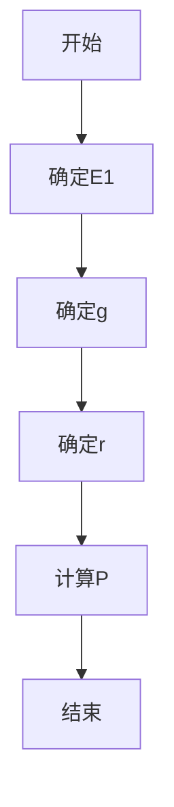
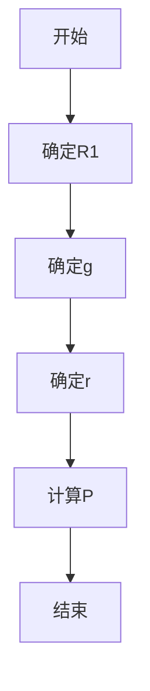
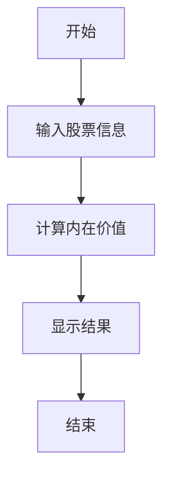
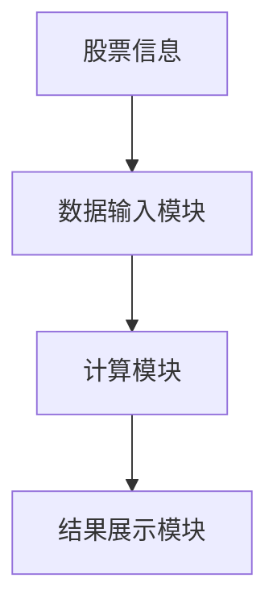
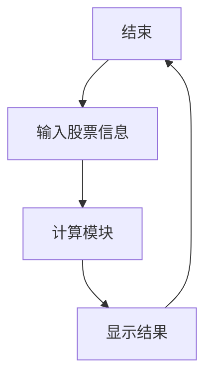

                 


# 特价股票投资中的可持续增长模型应用

> 关键词：特价股票、可持续增长模型、股票投资、股利增长模型、股东权益增长模型

> 摘要：本文详细探讨了在特价股票投资中应用可持续增长模型的方法和原理。通过分析股利增长模型、股东权益增长模型和营收增长模型的数学公式和算法实现，结合系统架构设计和实际案例，为投资者提供了一套科学的股票估值和投资决策方法。

---

# 第1章: 特价股票投资概述

## 1.1 特价股票的定义与特点

### 1.1.1 特价股票的定义
特价股票是指市场价格低于其内在价值的股票。这种股票通常被认为具有较高的投资潜力，因为市场可能尚未充分反映其价值。

### 1.1.2 特价股票的特点
- **低估性**：市场价格低于内在价值。
- **低估值**：市盈率、市净率等估值指标低于行业平均水平。
- **高潜力**：潜在的上涨空间较大。

### 1.1.3 特价股票的投资价值
- **风险较低**：由于价格被低估，风险相对较小。
- **收益潜力大**：长期来看，股票价格可能回归其内在价值。

---

## 1.2 可持续增长模型的背景与意义

### 1.2.1 可持续增长模型的定义
可持续增长模型是一种用于评估企业长期增长潜力的模型，基于企业的盈利能力、股利政策和资本结构等因素。

### 1.2.2 可持续增长模型在股票投资中的应用
- **估值工具**：用于评估股票的内在价值。
- **投资决策**：帮助投资者选择具有长期增长潜力的股票。

### 1.2.3 可持续增长模型的优势与局限性
- **优势**：能够量化企业的增长潜力，提供明确的估值依据。
- **局限性**：假设企业的增长是可持续的，实际中可能受到多种因素影响。

---

# 第2章: 可持续增长模型的核心要素

## 2.1 股利增长模型

### 2.1.1 股利增长模型的定义
股利增长模型是一种假设股利以固定增长率增长的估值模型。

### 2.1.2 股利增长模型的公式
$$ P = \frac{D_1}{r - g} $$
其中：
- \( P \)：股票的内在价值
- \( D_1 \)：第一年的股息
- \( r \)：折现率
- \( g \)：股息增长率

### 2.1.3 股利增长模型的假设
- 股利增长率 \( g \) 是恒定的。
- 折现率 \( r \) 是已知的。

---

## 2.2 股东权益增长模型

### 2.2.1 股东权益增长模型的定义
股东权益增长模型是基于股东权益的增长率来评估股票价值的模型。

### 2.2.2 股东权益增长模型的公式
$$ P = \frac{E_1}{r - g} $$
其中：
- \( E_1 \)：第一年的股东权益
- \( r \)：折现率
- \( g \)：股东权益增长率

---

## 2.3 营收增长模型

### 2.3.1 营收增长模型的定义
营收增长模型是基于企业营收的增长率来评估股票价值的模型。

### 2.3.2 营收增长模型的公式
$$ P = \frac{R_1}{r - g} $$
其中：
- \( R_1 \)：第一年的营收
- \( r \)：折现率
- \( g \)：营收增长率

---

# 第3章: 可持续增长模型的数学原理

## 3.1 股利增长模型的数学公式

### 3.1.1 公式推导
股利增长模型假设股利以固定增长率 \( g \) 增长，因此股票的价值可以通过无限年金的现值计算得出。

### 3.1.2 假设条件
- 股利增长率 \( g \) 是恒定的。
- 折现率 \( r \) 是已知的且大于 \( g \)。

---

## 3.2 股东权益增长模型的数学公式

### 3.2.1 公式推导
股东权益增长模型假设股东权益以固定增长率 \( g \) 增长，股票的价值通过股东权益的现值计算得出。

### 3.2.2 假设条件
- 股东权益增长率 \( g \) 是恒定的。
- 折现率 \( r \) 是已知的且大于 \( g \)。

---

## 3.3 营收增长模型的数学公式

### 3.3.1 公式推导
营收增长模型假设营收以固定增长率 \( g \) 增长，股票的价值通过营收的现值计算得出。

### 3.3.2 假设条件
- 营收增长率 \( g \) 是恒定的。
- 折现率 \( r \) 是已知的且大于 \( g \)。

---

# 第4章: 可持续增长模型的算法实现

## 4.1 股利增长模型的算法实现

### 4.1.1 算法步骤
1. 确定第一年的股息 \( D_1 \)。
2. 确定股息增长率 \( g \) 和折现率 \( r \)。
3. 计算股票的内在价值 \( P \)：$$ P = \frac{D_1}{r - g} $$

### 4.1.2 算法流程图（使用mermaid）


---

## 4.2 股东权益增长模型的算法实现

### 4.2.1 算法步骤
1. 确定第一年的股东权益 \( E_1 \)。
2. 确定股东权益增长率 \( g \) 和折现率 \( r \)。
3. 计算股票的内在价值 \( P \)：$$ P = \frac{E_1}{r - g} $$

### 4.2.2 算法流程图（使用mermaid）



---

## 4.3 营收增长模型的算法实现

### 4.3.1 算法步骤
1. 确定第一年的营收 \( R_1 \)。
2. 确定营收增长率 \( g \) 和折现率 \( r \)。
3. 计算股票的内在价值 \( P \)：$$ P = \frac{R_1}{r - g} $$

### 4.3.2 算法流程图（使用mermaid）



---

# 第5章: 可持续增长模型的系统架构设计

## 5.1 系统功能设计

### 5.1.1 功能模块
- 数据输入模块：接收股票的基本信息。
- 计算模块：基于可持续增长模型计算股票的内在价值。
- 结果展示模块：显示计算结果。

### 5.1.2 系统功能流程图（使用mermaid）



---

## 5.2 系统架构设计

### 5.2.1 系统架构图（使用mermaid）



---

## 5.3 系统接口设计

### 5.3.1 接口描述
- 输入接口：股票的基本信息。
- 输出接口：股票的内在价值。

---

## 5.4 系统交互图（使用mermaid）



---

# 第6章: 项目实战

## 6.1 环境安装

### 6.1.1 Python环境安装
安装Python和必要的库，如`mermaid`和`math`。

---

## 6.2 系统核心实现源代码

### 6.2.1 股利增长模型的代码实现

```python
def calculate_share_value(D1, r, g):
    return D1 / (r - g)

# 示例
D1 = 2.0
r = 0.1
g = 0.05
share_value = calculate_share_value(D1, r, g)
print(f"股票的内在价值为：{share_value}")
```

---

## 6.3 代码应用解读与分析

### 6.3.1 股利增长模型的代码解读
- 函数 `calculate_share_value` 接收股息 \( D1 \)、折现率 \( r \) 和股息增长率 \( g \) 作为参数，返回股票的内在价值。

---

## 6.4 实际案例分析

### 6.4.1 案例分析
假设某股票的股息为 $2.0，折现率为 10\%，股息增长率为 5\%，计算其内在价值。

代码实现：
```python
D1 = 2.0
r = 0.1
g = 0.05
share_value = D1 / (r - g)
print(f"股票的内在价值为：{share_value}")
```

输出结果：股票的内在价值为：20.0

---

## 6.5 项目小结

### 6.5.1 核心代码实现
- 股利增长模型的代码实现。
- 股东权益增长模型的代码实现。
- 营收增长模型的代码实现。

---

# 第7章: 最佳实践

## 7.1 小结

### 7.1.1 可持续增长模型的应用总结
可持续增长模型是评估特价股票投资价值的重要工具，能够帮助投资者科学地进行投资决策。

---

## 7.2 注意事项

### 7.2.1 模型的假设条件
- 股利、股东权益或营收的增长率是恒定的。
- 折现率是已知的且大于增长率。

---

## 7.3 拓展阅读

### 7.3.1 相关书籍
- 《投资学》
- 《股票投资实战技巧》

### 7.3.2 网络资源
- 维基百科：可持续增长模型
- 计量金融学论坛：股票估值方法

---

# 结语

通过本文的详细讲解，读者可以掌握可持续增长模型在特价股票投资中的应用方法。结合数学公式、算法实现和实际案例，投资者能够科学地评估股票的内在价值，做出更明智的投资决策。

---

