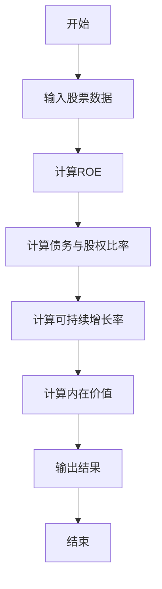
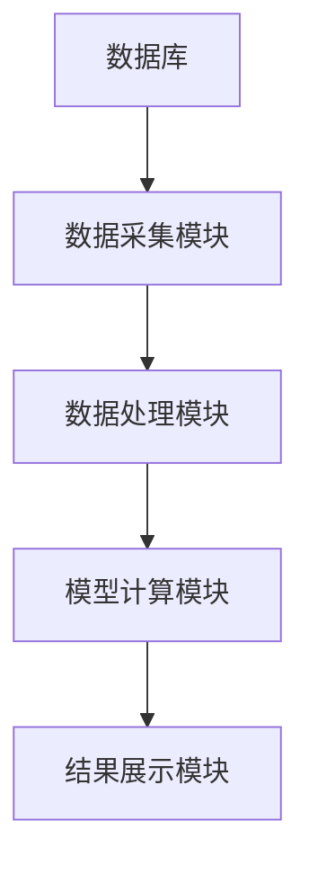

                 


# 特价股票投资中的可持续增长模型应用

> **关键词**：特价股票投资、可持续增长模型、股票分析、金融模型、算法实现

> **摘要**：本文探讨了可持续增长模型在特价股票投资中的应用，通过背景介绍、模型原理、系统设计、项目实战等多方面展开分析。文章详细讲解了模型的核心概念、数学公式、算法流程，并通过实际案例展示了模型的应用效果。旨在为投资者提供一种科学的股票分析方法，帮助其做出更明智的投资决策。

---

## 第一部分：特价股票投资中的可持续增长模型基础

### 第1章：特价股票投资的背景与概念

#### 1.1 特价股票投资的背景

##### 1.1.1 投资市场的基本概念
股票市场是投资者进行资产配置的重要场所，投资者通过购买股票获得企业部分所有权，从而分享企业成长的收益。股票价格受多种因素影响，包括企业盈利状况、市场供需、宏观经济环境等。

##### 1.1.2 特价股票的定义与特点
特价股票通常指价格相对较低的股票，可能具有较高的增长潜力。这类股票通常来自中小型企业或处于成长期的企业，其特点是价格波动较大，但潜在回报较高。

##### 1.1.3 特价股票投资的市场需求
随着投资者对高回报的需求增加，特价股票因其低门槛和高增长潜力，吸引了大量投资者的关注。然而，特价股票市场也存在较高的风险，因此需要科学的投资模型来辅助决策。

#### 1.2 可持续增长模型的定义

##### 1.2.1 可持续增长模型的基本概念
可持续增长模型是一种用于评估企业未来增长能力的金融模型。它基于企业的盈利能力、资产效率和资本结构，预测企业未来的现金流和股价。

##### 1.2.2 可持续增长模型的核心要素
- **净利润率**：衡量企业的盈利能力。
- **资产周转率**：衡量企业资产的使用效率。
- **杠杆比率**：衡量企业的资本结构。
- **再投资率**：衡量企业将利润用于再投资的比例。

##### 1.2.3 可持续增长模型与股票投资的关系
通过可持续增长模型，投资者可以评估企业的内在价值，判断其股价是否被低估或高估，从而做出投资决策。

#### 1.3 特价股票投资中的可持续增长模型

##### 1.3.1 特价股票与可持续增长模型的结合
特价股票通常具有较高的增长潜力，通过可持续增长模型可以筛选出具有长期增长能力的股票。

##### 1.3.2 可持续增长模型在特价股票投资中的作用
模型可以帮助投资者识别具有可持续增长潜力的企业，降低投资风险。

##### 1.3.3 特价股票投资中的可持续增长模型的优势
- 理论基础坚实。
- 能够量化企业的增长潜力。
- 适合中小型企业分析。

---

## 第2章：可持续增长模型的核心概念与原理

### 2.1 可持续增长模型的核心概念

#### 2.1.1 可持续增长模型的数学公式
可持续增长模型的核心公式为：
$$
g = \frac{ROE \times (1 - \frac{D}{E})}{1 - ROE \times (1 - \frac{D}{E})}
$$
其中，$g$ 表示可持续增长率，$ROE$ 表示净资产收益率，$\frac{D}{E}$ 表示债务与股权比率。

#### 2.1.2 可持续增长模型的属性特征
| 属性 | 描述 |
|------|------|
| 输入参数 | 净利润、资产、负债、权益 |
| 输出结果 | 可持续增长率、内在价值 |
| 假设条件 | 利润再投资、资本结构不变 |

#### 2.1.3 可持续增长模型的ER实体关系图
```mermaid
erDiagram
    actor 投资者 {
        <属性> 股票代码
        <属性> 股票名称
    }
    actor 企业 {
        <属性> 净利润
        <属性> 资产
        <属性> 负债
        <属性> 权益
    }
    actor 模型 {
        <属性> 可持续增长率
        <属性> 内在价值
    }
    投资者 --> 企业 : 提供股票数据
    企业 --> 模型 : 提供财务数据
    模型 --> 投资者 : 输出分析结果
```

### 2.2 可持续增长模型的算法原理

#### 2.2.1 算法流程图


#### 2.2.2 算法的数学模型
通过上述流程图，我们可以得到以下数学模型：
$$
g = \frac{ROE \times (1 - \frac{D}{E})}{1 - ROE \times (1 - \frac{D}{E})}
$$

#### 2.2.3 算法的实现步骤
1. 输入股票的基本财务数据。
2. 计算ROE（净资产收益率）。
3. 计算债务与股权比率。
4. 代入公式计算可持续增长率。
5. 计算内在价值。
6. 输出结果。

---

## 第3章：可持续增长模型的数学模型与公式

### 3.1 可持续增长模型的数学推导

#### 3.1.1 基本假设
- 利润保持稳定。
- 资本结构不变。
- 利润再投资比率恒定。

#### 3.1.2 核心公式
$$
g = \frac{ROE \times (1 - \frac{D}{E})}{1 - ROE \times (1 - \frac{D}{E})}
$$

#### 3.1.3 公式的应用范围
适用于评估中小企业的长期增长潜力。

### 3.2 可持续增长模型的数学公式

#### 3.2.1 核心公式
如上所述。

#### 3.2.2 辅助公式
$$
ROE = \frac{净利润}{股东权益}
$$

#### 3.2.3 公式的相互关系
通过ROE和资本结构，计算出企业的可持续增长率，进而评估其内在价值。

---

## 第4章：可持续增长模型的系统架构设计

### 4.1 系统架构概述

#### 4.1.1 系统架构图


#### 4.1.2 系统功能模块
- 数据采集模块：获取股票数据。
- 数据处理模块：清洗和预处理数据。
- 模型计算模块：计算ROE、债务与股权比率，得出可持续增长率。
- 结果展示模块：输出分析结果。

#### 4.1.3 系统接口设计
- 数据库接口：连接财务数据库。
- 用户接口：展示分析结果。

### 4.2 系统功能设计

#### 4.2.1 数据采集模块
负责从数据库中获取股票的基本财务数据。

#### 4.2.2 数据处理模块
对数据进行清洗和预处理，确保数据的准确性和完整性。

#### 4.2.3 模型计算模块
根据公式计算可持续增长率和内在价值。

---

## 第5章：可持续增长模型的项目实战

### 5.1 环境搭建与数据准备

#### 5.1.1 开发环境安装
安装Python、Pandas、NumPy等工具。

#### 5.1.2 数据源获取
从数据库中获取中小企业的财务数据。

#### 5.1.3 数据预处理
清洗数据，处理缺失值和异常值。

### 5.2 模型实现与代码应用

#### 5.2.1 Python代码实现
```python
import pandas as pd

def calculate_sustainable_growth_rate(roe, debt_equity_ratio):
    return (ro

