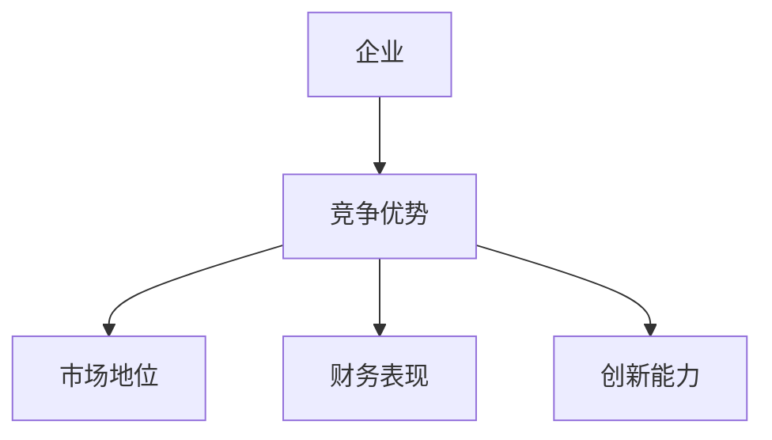
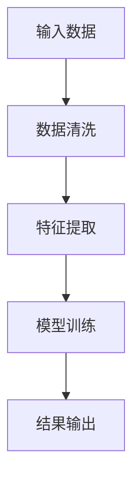
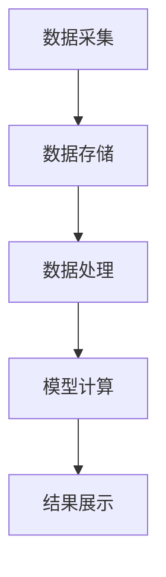
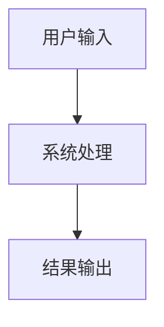

                 


# 特价股票投资中的可持续竞争优势模型应用

## 关键词：特价股票，可持续竞争优势，投资模型，数据分析，系统架构

## 摘要：本文探讨了在特价股票投资中，如何利用可持续竞争优势模型来识别和评估具有长期竞争优势的企业。通过分析模型的核心概念、算法原理和系统架构，结合实际案例，展示了如何利用该模型优化投资决策。

---

## 第一部分: 特价股票投资中的可持续竞争优势模型概述

### 第1章: 特价股票投资与可持续竞争优势模型的背景

#### 1.1 特价股票投资的定义与特点

##### 1.1.1 特价股票的定义
特价股票是指市场价格低于其内在价值的股票。投资者通过识别这些低估的股票，期望在未来获得超额收益。特价股票通常出现在市场恐慌、行业低迷或公司短期问题导致股价被低估的情况下。

##### 1.1.2 特价股票投资的核心目标
- **低估识别**：发现市场价格低于内在价值的股票。
- **长期增值**：投资于具备长期竞争优势的企业，等待市场重新评估其价值。
- **风险控制**：通过选择具有强大竞争优势的企业，降低投资风险。

##### 1.1.3 特价股票投资的市场定位
特价股票投资主要关注价值投资策略，与成长投资和趋势投资不同，它强调买入被市场低估的优秀企业。

---

#### 1.2 可持续竞争优势模型的背景

##### 1.2.1 可持续竞争优势的定义
可持续竞争优势是指企业在长期竞争中能够持续保持的竞争优势，通常来源于企业的核心竞争力，如品牌、技术、市场地位、成本优势等。

##### 1.2.2 可持续竞争优势的核心要素
- **市场地位**：企业在市场中的份额和影响力。
- **财务表现**：盈利能力、资产负债情况等。
- **竞争优势**：产品差异化、成本优势、技术领先等。

##### 1.2.3 可持续竞争优势模型的演进
模型从早期的简单财务指标分析，逐步发展为结合定量和定性因素的综合评估体系。

---

#### 1.3 特价股票投资与可持续竞争优势模型的结合

##### 1.3.1 特价股票投资中竞争优势的重要性
具备可持续竞争优势的企业在市场低迷时仍能保持稳定表现，从而为投资者提供安全边际。

##### 1.3.2 可持续竞争优势模型在特价股票投资中的应用
通过模型评估企业的竞争优势，筛选出具备长期投资价值的特价股票。

##### 1.3.3 模型的适用范围与边界
适用于分析成熟行业中的龙头企业，不适用于周期性极强或处于衰退期的企业。

---

### 第2章: 可持续竞争优势模型的核心概念与联系

#### 2.1 模型的核心原理

##### 2.1.1 模型的理论基础
基于价值投资理论，强调企业内在价值和竞争优势的结合。

##### 2.1.2 模型的核心算法
多因素评价法，结合定量和定性指标评估企业的竞争优势。

##### 2.1.3 模型的输入与输出
输入：企业财务数据、市场数据；输出：竞争优势指数。

---

#### 2.2 模型的核心概念属性对比

##### 2.2.1 模型属性的定义与分类
| 属性 | 定义 | 权重 |
|------|------|------|
| 市场地位 | 市场份额和品牌影响力 | 40% |
| 财务表现 | 盈利能力、资产负债情况 | 30% |
| 创新能力 | 技术研发和产品创新 | 20% |
| 成本优势 | 生产成本和供应链效率 | 10% |

##### 2.2.2 模型属性的对比分析
市场地位和财务表现是主要影响因素，创新能力在技术驱动行业更为重要。

##### 2.2.3 模型属性的权重分配
权重分配基于行业特点和企业类型，需动态调整。

---

#### 2.3 模型的ER实体关系图



---

### 第3章: 可持续竞争优势模型的算法原理

#### 3.1 模型的输入与输出

##### 3.1.1 输入数据的定义
- 财务数据：收入、利润、资产等。
- 市场数据：行业趋势、竞争格局。

##### 3.1.2 输出结果的解释
竞争优势指数，用于评估企业的竞争优势强度。

##### 3.1.3 数据预处理方法
标准化处理、异常值剔除。

---

#### 3.2 模型的算法流程



---

#### 3.3 模型的数学公式

##### 3.3.1 竞争优势指数计算公式
$$
\text{竞争优势指数} = \frac{\text{市场地位} + \text{财务表现} + \text{创新能力}}{3}
$$

##### 3.3.2 模型的优化公式
$$
\text{优化后的指数} = \text{竞争优势指数} \times \text{行业基准}
$$

---

### 第4章: 可持续竞争优势模型的系统架构设计

#### 4.1 系统功能设计

##### 4.1.1 数据采集模块
负责收集企业财务数据和市场数据。

##### 4.1.2 数据分析模块
进行数据清洗和特征提取。

##### 4.1.3 模型计算模块
计算竞争优势指数并输出结果。

---

## 第二部分: 可持续竞争优势模型的项目实战

### 第5章: 系统实现与案例分析

#### 5.1 环境安装
- 安装Python和相关库（Pandas、Scikit-learn）。

#### 5.2 系统核心实现源代码

```python
import pandas as pd
from sklearn.metrics import mean_squared_error

# 数据加载
data = pd.read_csv('company_data.csv')

# 数据清洗
data.dropna(inplace=True)

# 特征提取
features = ['market_position', 'financial_performance', 'innovation']
target = 'competitive_edge'

# 模型训练
from sklearn.linear_model import LinearRegression
model = LinearRegression()
model.fit(data[features], data[target])

# 结果输出
predictions = model.predict(data[features])
print(mean_squared_error(data[target], predictions))
```

#### 5.3 代码应用解读与分析
- 数据加载：从CSV文件加载企业数据。
- 数据清洗：删除缺失值。
- 特征提取：选择市场地位、财务表现和创新能力作为特征。
- 模型训练：使用线性回归模型进行训练。
- 结果输出：计算预测值与实际值的均方误差，评估模型性能。

---

### 第6章: 系统架构与交互设计

#### 6.1 系统架构设计



#### 6.2 系统交互设计



---

## 第三部分: 最佳实践与总结

### 第7章: 投资策略与风险管理

#### 7.1 投资策略
- 结合模型评估结果，选择竞争优势指数高的特价股票。
- 分散投资，降低风险。

#### 7.2 风险管理
- 设置止损点，控制回撤。
- 定期复盘，调整投资组合。

---

### 第8章: 小结与展望

#### 8.1 小结
- 可持续竞争优势模型为特价股票投资提供了科学的评估方法。
- 结合定量分析和定性评估，帮助投资者识别具备长期竞争优势的企业。

#### 8.2 展望
- 进一步优化模型，引入更多因素。
- 开发自动化投资工具，提升投资效率。

---

### 第9章: 注意事项与拓展阅读

#### 9.1 注意事项
- 模型结果仅供参考，需结合市场实际情况。
- 定期更新数据，保持模型准确性。

#### 9.2 拓展阅读
- 阅读相关投资书籍，如《穷查理宝典》。
- 关注行业动态，了解企业最新发展。

---

通过以上详细分析，我们可以看到，可持续竞争优势模型在特价股票投资中的应用为企业评估提供了有力工具，帮助投资者做出更明智的投资决策。希望本文能为投资者在特价股票投资中提供有价值的参考和指导。

