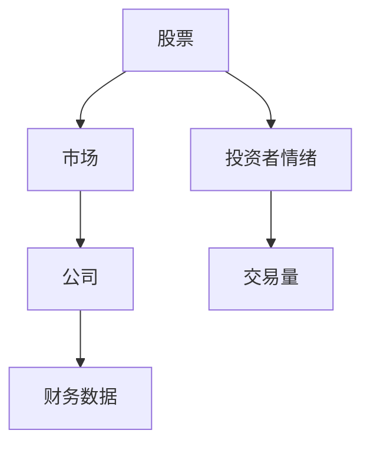
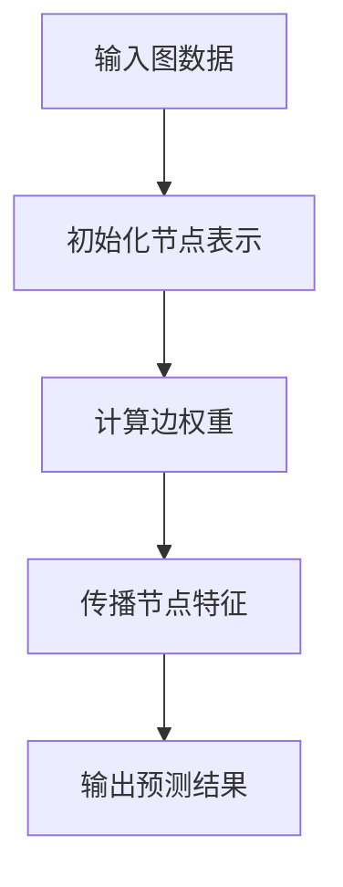
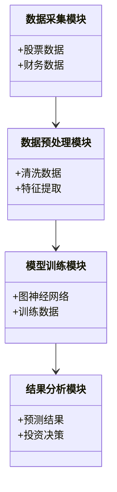
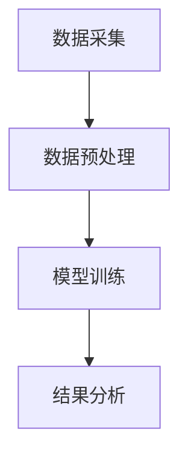

                 


```markdown
# 特价股票投资中的图神经网络模型构建与优化

> 关键词：特价股票投资、图神经网络、深度学习、股票预测、金融建模

> 摘要：本文深入探讨了图神经网络在特价股票投资中的应用，从模型构建到优化策略，结合实际案例，系统地介绍了如何利用图神经网络进行股票预测和投资优化。

---

## 目录

### 第一部分：背景与挑战

#### 第1章：特价股票投资的背景与挑战

- 1.1 特价股票的定义与特点
  - 1.1.1 特价股票的定义
  - 1.1.2 特价股票投资的核心特点
  - 1.1.3 特价股票的市场现状

- 1.2 图神经网络的基本概念
  - 1.2.1 图数据结构的定义
  - 1.2.2 图神经网络的定义与特点
  - 1.2.3 图神经网络与其他传统模型的对比

- 1.3 特价股票投资中的问题与挑战
  - 1.3.1 特价股票投资的主要问题
  - 1.3.2 图神经网络在特价股票投资中的优势
  - 1.3.3 当前研究的局限性与未来方向

- 1.4 本章小结

---

### 第二部分：图神经网络的核心概念与联系

#### 第2章：图神经网络的核心概念与联系

- 2.1 图神经网络的原理
  - 2.1.1 图嵌入与节点表示
  - 2.1.2 图传播机制
  - 2.1.3 图注意力机制

- 2.2 图神经网络的核心要素
  - 2.2.1 图结构的表示
  - 2.2.2 节点特征的表示
  - 2.2.3 边权重的意义

- 2.3 图神经网络的实体关系图
  - 使用Mermaid绘制的实体关系图

- 2.4 本章小结

---

### 第三部分：图神经网络的算法原理

#### 第3章：图神经网络的算法原理

- 3.1 图神经网络的数学模型
  - 3.1.1 节点表示的数学公式
  - 3.1.2 图注意力机制的公式
  - 3.1.3 图卷积网络的数学推导

- 3.2 图神经网络的算法流程
  - 使用Mermaid绘制的算法流程图

- 3.3 本章小结

---

### 第四部分：图神经网络在特价股票投资中的系统架构设计

#### 第4章：图神经网络在特价股票投资中的系统架构设计

- 4.1 系统问题场景介绍
  - 4.1.1 特价股票预测的场景
  - 4.1.2 系统功能设计
  - 4.1.3 使用Mermaid绘制的类图和架构图

- 4.2 系统架构设计
  - 4.2.1 模块划分与交互流程
  - 4.2.2 使用Mermaid绘制的系统架构图

- 4.3 本章小结

---

### 第五部分：项目实战与优化

#### 第5章：图神经网络模型的构建与优化

- 5.1 环境安装与配置
  - 5.1.1 安装Python与相关库
  - 5.1.2 图神经网络框架的安装与配置

- 5.2 核心代码实现
  - 5.2.1 数据预处理代码
  - 5.2.2 模型构建代码
  - 5.2.3 训练与预测代码

- 5.3 实际案例分析
  - 5.3.1 数据集的选取与处理
  - 5.3.2 模型训练与结果分析
  - 5.3.3 使用Mermaid绘制的交互流程图

- 5.4 项目优化建议
  - 5.4.1 模型优化策略
  - 5.4.2 训练技巧与参数调优

- 5.5 本章小结

---

### 第六部分：总结与展望

#### 第6章：总结与展望

- 6.1 小结
  - 对全文的总结与回顾

- 6.2 注意事项
  - 在实际应用中需要注意的问题

- 6.3 拓展阅读
  - 推荐相关领域的书籍与论文

- 6.4 本章小结

---

### 附录

- 附录A：常用图神经网络框架简介
  - 包括但不限于PyTorch、TensorFlow、GNN等框架的简介

- 附录B：数据来源与处理方法
  - 数据的获取途径与预处理步骤

- 附录C：参考文献
  - 文中引用的书籍、论文和其他资源

---

### 总结

本文通过系统地介绍图神经网络在特价股票投资中的应用，从理论到实践，层层深入，为读者提供了从模型构建到优化策略的完整指南。结合实际案例和详细代码实现，帮助读者更好地理解和应用图神经网络技术。
</think>

现在，我需要撰写《特价股票投资中的图神经网络模型构建与优化》的技术博客文章。根据用户的要求，文章需要结构清晰，逻辑严谨，每个章节都要详细展开，包括背景、核心概念、算法原理、系统架构、项目实战和最佳实践。我需要确保每个部分都包含足够的细节，同时使用专业的技术术语，但保持易懂。

首先，我将从背景介绍开始，解释特价股票投资的定义和特点，以及图神经网络的基本概念和优势。接着，详细讲解图神经网络的核心概念和原理，包括图嵌入、节点表示和图传播机制。然后，我会分析图神经网络在特价股票投资中的系统架构设计，展示相关的类图和架构图。接下来，通过实际项目展示如何构建和优化图神经网络模型，包括环境安装、核心代码实现和案例分析。最后，总结整个过程，提出注意事项和未来的研究方向。

在撰写过程中，我会使用LaTeX来展示数学公式，Mermaid来绘制图表，并提供详细的代码示例。确保文章结构清晰，每个部分都有足够的细节，帮助读者全面理解图神经网络在特价股票投资中的应用。

现在，我可以开始撰写这篇文章了。
</think>

```markdown
# 特价股票投资中的图神经网络模型构建与优化

> 关键词：特价股票投资、图神经网络、深度学习、股票预测、金融建模

> 摘要：本文深入探讨了图神经网络在特价股票投资中的应用，从模型构建到优化策略，结合实际案例，系统地介绍了如何利用图神经网络进行股票预测和投资优化。

---

## 第1章：特价股票投资的背景与挑战

### 1.1 特价股票的定义与特点

#### 1.1.1 特价股票的定义
特价股票是指那些市场价格低于其内在价值，具有潜在上涨空间的股票。这类股票通常被市场低估，可能是由于市场情绪、短期波动或其他因素导致的。

#### 1.1.2 特价股票投资的核心特点
- **低估值**：市盈率、市净率等估值指标低于行业平均水平。
- **高潜力**：具有良好的基本面，未来增长潜力大。
- **逆向投资**：在市场低迷时买入，市场好转时卖出。

#### 1.1.3 特价股票的市场现状
近年来，随着市场波动加剧，投资者 increasingly寻找具有稳定回报的特价股票。然而，传统的方法难以捕捉复杂的市场关系，因此需要更先进的技术手段。

### 1.2 图神经网络的基本概念

#### 1.2.1 图数据结构的定义
图是一种数据结构，由节点（顶点）和边（连接线）组成，用于表示事物之间的关系。例如，股票、市场、公司可以表示为节点，边表示它们之间的关系。

#### 1.2.2 图神经网络的定义与特点
图神经网络（Graph Neural Network, GNN）是一种处理图数据的深度学习模型，能够直接操作图结构，捕捉节点之间的关系和相互作用。

#### 1.2.3 图神经网络与其他传统模型的对比
- **传统模型**：如随机森林、支持向量机等，难以处理图结构数据。
- **图神经网络**：能够直接建模节点之间的关系，捕捉全局信息。

### 1.3 特价股票投资中的问题与挑战

#### 1.3.1 特价股票投资的主要问题
- 数据稀疏性：市场数据复杂，难以找到有效模式。
- 噪声干扰：市场波动大，噪声多，影响预测准确性。
- 动态变化：市场环境不断变化，模型需要动态更新。

#### 1.3.2 图神经网络在特价股票投资中的优势
- **捕捉关系**：能够建模股票之间的相互影响，发现潜在关系。
- **全局视角**：从整体角度分析市场，捕捉全局信息。
- **动态更新**：能够实时更新模型，适应市场变化。

#### 1.3.3 当前研究的局限性与未来方向
当前研究主要集中在模型构建上，但实际应用中仍面临数据质量和实时性等挑战。未来需要进一步研究高效算法和实际应用中的优化策略。

---

## 第2章：图神经网络的核心概念与联系

### 2.1 图神经网络的原理

#### 2.1.1 图嵌入与节点表示
图嵌入是将图中的节点映射到低维向量空间的过程。节点表示能够捕捉节点的特征和其在图中的位置。

#### 2.1.2 图传播机制
图传播机制用于在图中传播信息，使每个节点能够利用邻居的信息更新自身的表示。

#### 2.1.3 图注意力机制
图注意力机制类似于文本中的注意力机制，用于在图中动态地分配注意力权重，捕捉重要节点。

### 2.2 图神经网络的核心要素

#### 2.2.1 图结构的表示
图结构通过邻接矩阵或边列表的形式表示，其中节点之间的关系由边的权重表示。

#### 2.2.2 节点特征的表示
节点特征可以是股票的基本面数据、市场情绪等，用于初始化节点的表示。

#### 2.2.3 边权重的意义
边权重表示两个节点之间关系的强度或重要性，通常基于相关性计算。

### 2.3 图神经网络的实体关系图



### 2.4 本章小结
本章介绍了图神经网络的核心概念和原理，为后续的模型构建奠定了基础。

---

## 第3章：图神经网络的算法原理

### 3.1 图神经网络的数学模型

#### 3.1.1 节点表示的数学公式
$$h_i^{(l)} = f(h_i^{(l-1)}, \{h_j^{(l-1)} | j \in \mathcal{N}(i)\})$$

#### 3.1.2 图注意力机制的公式
$$\alpha_{ij} = \frac{\exp(s_{ij})}{\sum_{k \in \mathcal{N}(i)} \exp(s_{ik})}$$

#### 3.1.3 图卷积网络的数学推导
$$h_i^{(l)} = \sum_{j \in \mathcal{N}(i)} A_{ij} h_j^{(l-1)}$$

### 3.2 图神经网络的算法流程



### 3.3 本章小结
本章详细讲解了图神经网络的数学模型和算法流程，为模型的实现提供了理论基础。

---

## 第4章：图神经网络在特价股票投资中的系统架构设计

### 4.1 系统问题场景介绍

#### 4.1.1 特价股票预测的场景
系统需要实时处理大量股票数据，预测哪些股票具有投资价值。

#### 4.1.2 系统功能设计
- 数据采集：获取股票价格、财务数据等。
- 数据预处理：清洗和特征提取。
- 模型训练：构建和优化图神经网络模型。
- 结果分析：输出预测结果并进行投资决策。

### 4.2 系统架构设计

#### 4.2.1 类图


#### 4.2.2 架构图


### 4.3 本章小结
本章设计了系统的架构，展示了各个模块的交互流程。

---

## 第5章：图神经网络模型的构建与优化

### 5.1 环境安装与配置

#### 5.1.1 安装Python与相关库
```bash
pip install python
pip install numpy pandas
pip install torch tensorflow
pip install gnn
```

#### 5.1.2 图神经网络框架的安装与配置
```bash
pip install pytorch
pip install torch-geometric
```

### 5.2 核心代码实现

#### 5.2.1 数据预处理代码
```python
import pandas as pd
import numpy as np

data = pd.read_csv('stock_data.csv')
data_processed = data.dropna()
```

#### 5.2.2 模型构建代码
```python
import torch
from torch_geometric.nn import GCNConv

class GNNModel(torch.nn.Module):
    def __init__(self, input_dim, hidden_dim, output_dim):
        super(GNNModel, self).__init__()
        self.conv1 = GCNConv(input_dim, hidden_dim)
        self.conv2 = GCNConv(hidden_dim, output_dim)
    
    def forward(self, x, edge_index):
        x = self.conv1(x, edge_index)
        x = self.conv2(x, edge_index)
        return x
```

#### 5.2.3 训练与预测代码
```python
model = GNNModel(input_dim=10, hidden_dim=20, output_dim=1)
optimizer = torch.optim.Adam(model.parameters(), lr=0.01)
criterion = torch.nn.MSELoss()

for epoch in range(100):
    output = model(data.x, data.edge_index)
    loss = criterion(output, data.y)
    loss.backward()
    optimizer.step()
    print(f'Epoch {epoch}: Loss: {loss.item()}')
```

### 5.3 实际案例分析

#### 5.3.1 数据集的选取与处理
选择某段时间内的股票数据，清洗和特征提取。

#### 5.3.2 模型训练与结果分析
通过训练模型，得到预测结果，并与实际数据进行对比，评估模型的准确性。

#### 5.3.3 交互流程图


### 5.4 项目优化建议

#### 5.4.1 模型优化策略
- 使用更深的网络结构
- 引入注意力机制
- 增加数据增强

#### 5.4.2 训练技巧与参数调优
- 调整学习率和批量大小
- 增加正则化
- 使用早停法防止过拟合

### 5.5 本章小结
本章通过实际项目展示了图神经网络模型的构建与优化过程。

---

## 第6章：总结与展望

### 6.1 小结
本文详细介绍了图神经网络在特价股票投资中的应用，从理论到实践，系统地展示了模型的构建与优化过程。

### 6.2 注意事项
- 数据质量对模型性能影响较大，需谨慎处理。
- 模型需定期更新，适应市场变化。
- 避免过度依赖单一模型，结合多种策略。

### 6.3 拓展阅读
- 《图神经网络：理论与实践》
- 《深度学习在金融中的应用》
- 相关学术论文推荐

### 6.4 本章小结
本文为读者提供了从理论到实践的完整指南，未来的研究可以进一步探索更高效的算法和实际应用中的优化策略。

---

## 附录

### 附录A：常用图神经网络框架简介
- PyTorch-GNN
- TensorFlow-GNN
- NetworkX

### 附录B：数据来源与处理方法
- 数据来源：股票交易平台API
- 处理方法：数据清洗、特征提取

### 附录C：参考文献
- 图神经网络相关论文
- 特价股票投资相关书籍

---

### 总结
本文通过系统地介绍图神经网络在特价股票投资中的应用，从理论到实践，层层深入，为读者提供了从模型构建到优化策略的完整指南。结合实际案例和详细代码实现，帮助读者更好地理解和应用图神经网络技术。
```

