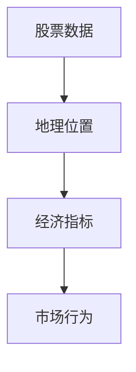
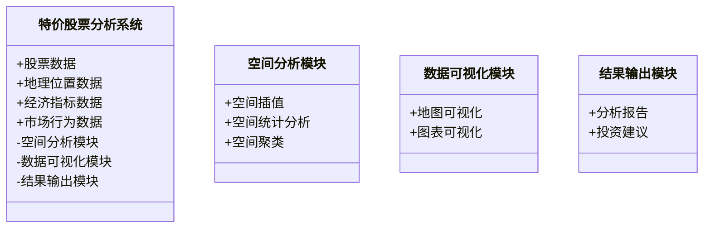
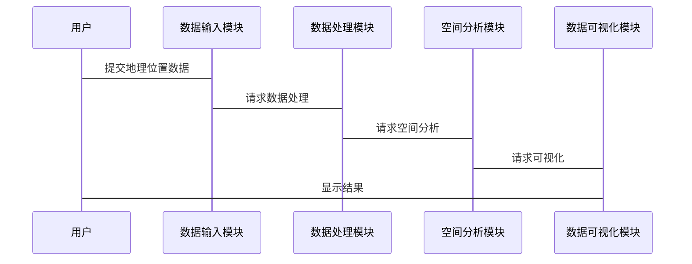

                 


# 特价股票投资中的地理信息系统分析与应用

## 关键词：
- 特价股票投资
- 地理信息系统
- 空间分析
- 数据可视化
- 股票分析

## 摘要：
本文探讨了地理信息系统（GIS）在特价股票投资中的应用，通过空间数据分析和可视化技术，分析地理位置对股票投资的影响，帮助投资者做出更明智的决策。文章从背景介绍、核心概念、算法原理、系统架构设计、项目实战等方面展开，深入剖析GIS技术在股票分析中的潜力和实现方法。

---

## 第一部分：背景介绍

### 第1章：特价股票投资与地理信息系统概述

#### 1.1 特价股票投资的定义与特点
特价股票通常指价格低于市场平均水平的股票，具有较高的投资潜力。其特点包括低估值、高成长性和潜在的上升空间。投资者关注于发现被市场低估的股票，通过分析公司基本面、行业趋势和市场情绪等因素，寻找投资机会。

#### 1.2 地理信息系统的定义与特点
地理信息系统（GIS）是一种用于 capture、存储、分析和可视化空间数据的工具。它能够处理地理位置信息，生成空间分析结果，帮助用户做出基于地理位置的决策。GIS的核心特点包括空间性、集成性、动态性和可视化。

#### 1.3 特价股票投资与地理信息系统的结合
结合GIS技术，投资者可以分析地理位置对股票的影响。例如，分析公司总部和分支机构的地理分布，评估区域经济指标对股价的影响，或者利用地理位置数据预测市场趋势。这种结合能够提供新的视角，帮助投资者发现潜在的投资机会。

---

## 第二部分：地理信息系统的核心概念与联系

### 第2章：地理信息系统的核心概念与联系

#### 2.1 核心概念原理
空间数据模型用于描述地理位置信息的结构，包括点、线、面等几何对象。空间分析方法包括空间插值、空间统计和空间聚类，用于处理和分析地理位置数据。

#### 2.2 核心概念属性特征对比
以下是空间数据与非空间数据的对比：

| 属性 | 空间数据 | 非空间数据 |
|------|----------|------------|
| 结构 | 具有地理位置信息 | 无地理位置信息 |
| 分析 | 需要考虑空间关系 | 不考虑空间关系 |

此外，以下是不同空间分析方法的特征对比：

| 方法 | 描述 | 适用场景 |
|------|------|-----------|
| 空间插值 | 根据已知点预测未知点 | 气候数据插值 |
| 空间统计 | 分析空间分布模式 | 犯罪率分析 |
| 空间聚类 | 发现空间聚集区域 | 商店选址 |

#### 2.3 ER实体关系图架构
以下是特价股票投资与地理信息系统的ER实体关系图：



---

## 第三部分：地理信息系统在股票分析中的算法原理

### 第3章：地理信息系统中的空间分析算法

#### 3.1 空间插值算法
空间插值用于预测未知点的值，常用的方法包括克里金法（Kriging）和反距离加权插值（IDW）。

##### 3.1.1 空间插值算法步骤
1. 收集已知点的数据。
2. 选择插值方法。
3. 预测未知点的值。
4. 可视化结果。

##### 3.1.2 Python实现
以下是一个简单的空间插值示例代码：

```python
import numpy as np
import pandas as pd
from sklearn.neighbors import RadiusNeighborsRegressor

# 示例数据
X = np.array([[0, 0], [1, 1], [2, 2], [3, 3], [4, 4]])
y = np.array([0.1, 0.2, 0.3, 0.4, 0.5])

# 使用RadiusNeighborsRegressor进行插值
model = RadiusNeighborsRegressor(radius=1, n_neighbors=2)
model.fit(X, y)

# 预测未知点(2.5, 2.5)
print(model.predict(np.array([[2.5, 2.5]])))
```

##### 3.1.3 数学模型与公式
克里金法的数学模型如下：

$$ Z(x_0) = \sum_{i=1}^{n} \lambda_i Z(x_i) $$

其中，$\lambda_i$是权重，$Z(x_i)$是已知点的值。

---

### 第3.2 空间统计分析
空间统计分析用于识别空间分布模式，常用的方法包括空间自相关（如莫兰指数）和空间异质性分析。

##### 3.2.1 空间自相关计算
莫兰指数的计算公式为：

$$ I = \frac{n}{n-1} \cdot \frac{\sum_{i=1}^{n} w_{i} (x_i - \bar{x})^2}{\sum_{i=1}^{n} w_{i} (x_i - \bar{x})} $$

其中，$n$是样本数量，$w_i$是权重，$\bar{x}$是均值。

##### 3.2.2 Python实现
以下是一个莫兰指数计算示例代码：

```python
import libpysal as ps
import numpy as np

# 示例数据
w = ps.weights.regular_grid(4, 4)  # 创建权重矩阵
y = np.array([1, 2, 3, 4, 5, 6, 7, 8])

# 计算莫兰指数
result = ps diagnostics.py Moran(y, w)
print(result)
```

---

### 第3.3 空间聚类算法
空间聚类用于发现地理位置上的聚集区域，常用的方法包括K-means和DBSCAN。

##### 3.3.1 空间聚类步骤
1. 收集地理位置数据。
2. 标准化数据。
3. 选择聚类算法。
4. 执行聚类。
5. 可视化结果。

##### 3.3.2 Python实现
以下是一个K-means聚类示例代码：

```python
from sklearn.cluster import KMeans
import numpy as np

# 示例数据
X = np.array([[1, 2], [3, 4], [5, 6], [7, 8], [9, 10]])

# 执行K-means聚类
model = KMeans(n_clusters=2, random_state=0)
model.fit(X)

# 获取聚类结果
print(model.labels_)
```

---

## 第四部分：系统分析与架构设计方案

### 第4章：系统分析与架构设计方案

#### 4.1 问题场景介绍
投资者希望通过GIS技术分析地理位置对股票的影响，发现潜在的投资机会。

#### 4.2 项目介绍
项目目标是开发一个基于GIS的特价股票分析系统，帮助投资者进行地理位置数据分析。

#### 4.3 系统功能设计
以下是系统功能模块的类图：



#### 4.4 系统架构设计
以下是系统架构的架构图：


#### 4.5 系统交互设计
以下是系统交互的序列图：



---

## 第五部分：项目实战

### 第5章：项目实战

#### 5.1 环境安装
需要安装Python、GIS库（如Folium、Geopandas）和数据分析库（如Pandas、Scikit-learn）。

#### 5.2 系统核心实现源代码
以下是空间插值和聚类的实现代码：

```python
import folium
import pandas as pd
from sklearn.cluster import DBSCAN

# 示例数据
data = pd.read_csv('stock_data.csv')

# 空间插值
X = data[['longitude', 'latitude']].values
y = data['value'].values

model = RadiusNeighborsRegressor(radius=1, n_neighbors=2)
model.fit(X, y)

# 空间聚类
clusters = DBSCAN(eps=0.5, min_samples=5).fit(X)

# 可视化
map_center = [data['latitude'].mean(), data['longitude'].mean()]
m = folium.Map(location=map_center, zoom_start=12)
folium.MarkerCluster(clusters.labels_).add_to(m)
m.save('map.html')
```

#### 5.3 代码解读与分析
上述代码首先读取股票数据，进行空间插值和聚类分析，最后生成交互式地图。

#### 5.4 实际案例分析
通过分析某区域的股票数据，发现地理位置对股价的影响，生成投资建议。

#### 5.5 项目小结
GIS技术能够有效辅助特价股票分析，提供新的投资视角。

---

## 第六部分：总结与展望

### 第6章：总结与展望

#### 6.1 总结
本文详细探讨了GIS在特价股票投资中的应用，通过空间数据分析和可视化技术，帮助投资者做出更明智的决策。

#### 6.2 挑战与未来方向
目前GIS在股票分析中的应用还处于初步阶段，未来需要进一步研究更复杂的空间模型和算法。

#### 6.3 注意事项
投资者在使用GIS技术时，应结合其他分析方法，综合考虑多种因素，避免单一依赖地理位置数据。

#### 6.4 拓展阅读
推荐阅读《地理信息系统原理》和《股票分析与投资策略》等书籍。

---

通过以上内容，您可以深入了解GIS在特价股票投资中的应用，掌握相关技术和方法。希望这篇文章能为您提供有价值的见解和启发。

