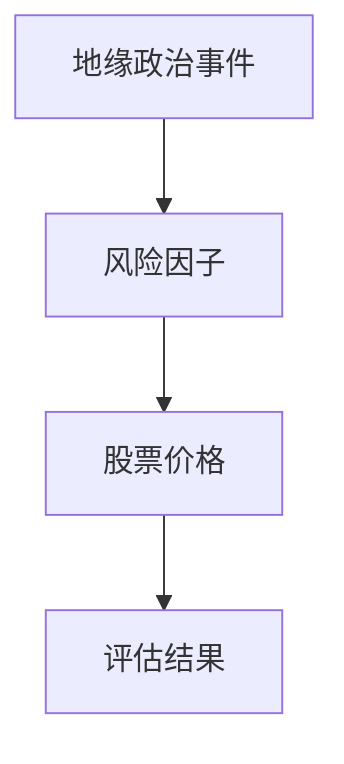
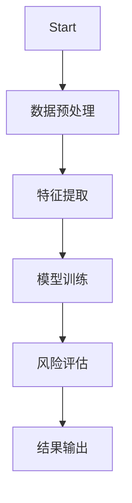
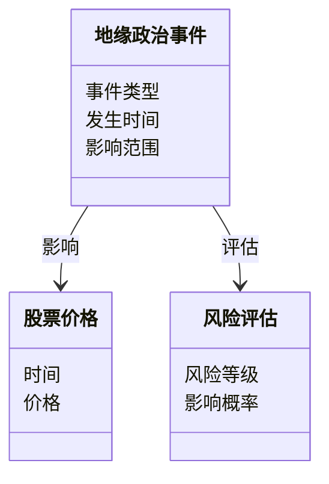
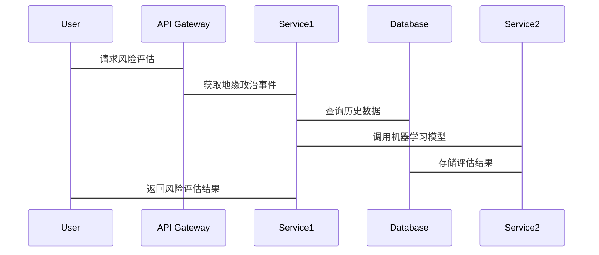

                 


# 特价股票投资中的地缘政治风险动态评估策略

## 关键词：
特价股票、地缘政治风险、动态评估、机器学习、风险管理、投资策略

## 摘要：
本文探讨了在特价股票投资中如何动态评估地缘政治风险，结合机器学习算法和数学模型，提出了一种系统化的评估策略。文章详细分析了地缘政治风险对股票投资的影响，介绍了动态评估模型的核心概念，讲解了基于时间序列分析和机器学习算法的实现方法，并通过实际案例展示了如何将这些模型应用于风险评估。最后，本文总结了评估策略的最佳实践，为投资者提供了科学的决策支持。

---

## 第一部分: 特价股票投资中的地缘政治风险动态评估背景

### 第1章: 地缘政治风险与股票投资概述

#### 1.1 地缘政治风险的基本概念

##### 1.1.1 地缘政治风险的定义
地缘政治风险是指由于国家间的政治、经济、军事冲突或合作变化所引发的不确定性，这些变化可能影响特定地区的经济环境和市场表现。地缘政治风险包括战争、贸易摩擦、政策变化等事件，这些事件可能会对股票市场产生短期或长期的影响。

##### 1.1.2 地缘政治风险的主要类型
1. **军事冲突**：如战争、恐怖袭击等，通常会导致市场波动加剧。
2. **政策变化**：如贸易制裁、关税调整、外交关系恶化等，可能影响企业的经营环境。
3. **经济制裁**：如对特定国家或企业的经济制裁，可能导致相关股票价格下跌。
4. **自然灾害**：虽然不属于地缘政治风险，但某些自然灾害可能引发政治或经济连锁反应。

##### 1.1.3 地缘政治风险对股票投资的影响
地缘政治风险可能引发市场的不确定性，导致股票价格波动。投资者需要识别潜在的地缘政治风险，并评估其对特定股票或行业的影响。特价股票由于价格较低，可能对市场波动更加敏感，因此地缘政治风险的动态评估尤为重要。

#### 1.2 特价股票投资的特点

##### 1.2.1 特价股票的定义与特点
特价股票通常指价格低于市场平均值的股票，可能处于低估值状态。这类股票可能因市场忽视或公司困境而价格被低估，但也可能因行业或公司基本面的改善而具有较高的上涨潜力。

##### 1.2.2 特价股票投资的风险与机会
- **风险**：特价股票通常具有较高的波动性，市场波动可能导致价格大幅波动，投资者可能面临较大的本金损失风险。
- **机会**：特价股票可能因市场低估而具有较高的潜在回报，尤其是在基本面改善的情况下，股价可能迅速回升。

##### 1.2.3 地缘政治风险在特价股票投资中的特殊性
特价股票的投资风险可能因地缘政治事件而加剧，例如涉及公司所在的国家或行业的冲突可能影响其股价。因此，投资者需要动态评估地缘政治风险，以便及时调整投资策略。

#### 1.3 本章小结
本章介绍了地缘政治风险的基本概念及其对股票投资的影响，重点分析了特价股票的特点及其在地缘政治风险下的特殊性。地缘政治风险是影响特价股票投资的重要因素，投资者需要对此进行动态评估。

---

## 第二部分: 地缘政治风险动态评估的核心概念与联系

### 第2章: 地缘政治风险动态评估模型

#### 2.1 模型的基本原理

##### 2.1.1 模型的输入与输出
- **输入**：包括历史股票价格数据、地缘政治事件数据（如战争、制裁）、经济指标（如GDP、通胀率）等。
- **输出**：生成地缘政治风险的评估结果，通常以概率或风险等级表示。

##### 2.1.2 模型的核心算法
模型结合时间序列分析和机器学习算法，对历史数据进行分析，识别地缘政治事件与股票价格之间的相关性，预测未来风险。

##### 2.1.3 模型的适用范围
适用于对特定股票或行业进行风险评估，尤其适合特价股票，因其价格波动较大，对地缘政治风险更为敏感。

#### 2.2 模型的属性对比

##### 2.2.1 模型的稳定性对比
- 时间序列模型：依赖历史数据，稳定性较高。
- 机器学习模型：依赖特征工程和数据质量，稳定性可能受数据分布影响。

##### 2.2.2 模型的预测精度对比
- 时间序列模型：适合趋势预测，但在复杂事件中的预测精度可能较低。
- 机器学习模型：能够捕捉复杂模式，预测精度较高，但需要大量数据支持。

##### 2.2.3 模型的计算复杂度对比
- 时间序列模型：计算复杂度较低。
- 机器学习模型：计算复杂度较高，尤其是深度学习模型。

#### 2.3 模型的ER实体关系图



#### 2.4 本章小结
本章介绍了地缘政治风险动态评估模型的基本原理、属性对比以及实体关系图。模型通过分析地缘政治事件和股票价格数据，生成风险评估结果，为投资者提供决策支持。

---

## 第三部分: 地缘政治风险动态评估的算法原理

### 第3章: 算法原理与实现

#### 3.1 算法选择与原理

##### 3.1.1 时间序列分析
时间序列分析用于分析股票价格的历史数据，识别趋势和周期性。常用的方法包括ARIMA（自回归积分滑动平均模型）和GARCH（广义自回归条件异方差模型）。

##### 3.1.2 机器学习模型
机器学习模型（如随机森林、支持向量机、神经网络）用于分析多维数据，识别复杂模式。这些模型能够捕捉地缘政治事件与股票价格之间的非线性关系。

##### 3.1.3 算法的优缺点对比
- **时间序列分析**：适合趋势预测，但难以捕捉复杂事件的影响。
- **机器学习模型**：能够捕捉复杂模式，但需要大量数据和计算资源。

#### 3.2 算法流程图



#### 3.3 算法实现

##### 3.3.1 数据预处理
- 数据清洗：处理缺失值、异常值。
- 数据标准化：归一化处理，确保模型收敛。

##### 3.3.2 特征提取
- 从历史数据中提取统计特征（均值、方差、趋势）。
- 从地缘政治事件中提取关键词和事件类型。

##### 3.3.3 模型训练
- 使用训练数据训练模型，调整超参数以优化性能。

##### 3.3.4 风险评估
- 使用测试数据评估模型性能，计算准确率、召回率等指标。

#### 3.4 算法代码实现

##### 3.4.1 时间序列模型（ARIMA）

```python
from statsmodels.tsa.arima_model import ARIMA
import pandas as pd

# 加载数据
data = pd.read_csv('stock_prices.csv')

# 拟合ARIMA模型
model = ARIMA(data['price'], order=(5, 1, 0))
model_fit = model.fit()

# 预测未来价格
forecast = model_fit.forecast(steps=10)
print(forecast)
```

##### 3.4.2 机器学习模型（随机森林）

```python
from sklearn.ensemble import RandomForestRegressor
from sklearn.model_selection import train_test_split
import pandas as pd

# 加载数据
data = pd.read_csv('risk_factors.csv')

# 分割数据
X = data.drop('risk_score', axis=1)
y = data['risk_score']
X_train, X_test, y_train, y_test = train_test_split(X, y, test_size=0.2)

# 训练模型
model = RandomForestRegressor(n_estimators=100)
model.fit(X_train, y_train)

# 预测风险
y_pred = model.predict(X_test)
print('预测风险:', y_pred)
```

#### 3.5 本章小结
本章详细介绍了地缘政治风险动态评估模型的算法选择与实现，包括时间序列分析和机器学习模型。通过代码示例展示了模型的训练和预测过程，为后续的风险评估提供了技术基础。

---

## 第四部分: 数学模型和公式

### 第4章: 数学模型和公式

#### 4.1 时间序列模型（ARIMA）

##### 4.1.1 ARIMA模型公式
$$ ARIMA(p, d, q) $$
其中，p为自回归阶数，d为差分阶数，q为移动平均阶数。

##### 4.1.2 ARIMA模型的预测公式
$$ \hat{y}_t = \phi_1 y_{t-1} + \phi_2 y_{t-2} + \dots + \phi_p y_{t-p} + \theta_1 \epsilon_{t-1} + \theta_2 \epsilon_{t-2} + \dots + \theta_q \epsilon_{t-q} $$

#### 4.2 机器学习模型（随机森林）

##### 4.2.1 随机森林模型公式
随机森林通过集成学习生成多个决策树，并对结果进行投票或平均。其预测结果为：
$$ y = \frac{1}{N} \sum_{i=1}^{N} y_i $$
其中，$N$为决策树的数量，$y_i$为第i棵树的预测结果。

#### 4.3 本章小结
本章通过数学公式详细推导了时间序列模型和机器学习模型的数学表达式，为后续的算法实现提供了理论基础。

---

## 第五部分: 系统分析与架构设计

### 第5章: 系统分析与架构设计

#### 5.1 项目背景
特价股票投资中的地缘政治风险动态评估系统旨在帮助投资者实时监控地缘政治事件，评估其对特定股票的影响，制定相应的投资策略。

#### 5.2 系统功能设计

##### 5.2.1 领域模型


##### 5.2.2 系统架构设计
```mermaid
graph TD
    User --> API Gateway
    API Gateway --> Service1
    Service1 --> Database
    Service1 --> Service2
    Service2 --> Database
    Database --> Service3
    Service3 --> User
```

##### 5.2.3 系统接口设计
- **输入接口**：接收地缘政治事件和股票价格数据。
- **输出接口**：提供风险评估结果。

##### 5.2.4 系统交互流程图


#### 5.3 本章小结
本章通过系统分析和架构设计，明确了地缘政治风险动态评估系统的功能模块和交互流程，为系统的实现提供了清晰的指导。

---

## 第六部分: 项目实战

### 第6章: 项目实战

#### 6.1 环境安装
- **工具安装**：安装Python、Jupyter Notebook、机器学习库（如Scikit-learn、XGBoost）。
- **数据获取**：通过API获取历史股票价格和地缘政治事件数据。

#### 6.2 核心代码实现

##### 6.2.1 数据预处理
```python
import pandas as pd

# 加载数据
data = pd.read_csv('data.csv')

# 处理缺失值
data = data.dropna()

# 标准化处理
from sklearn.preprocessing import StandardScaler
scaler = StandardScaler()
data_normalized = scaler.fit_transform(data)
```

##### 6.2.2 模型训练
```python
from sklearn.ensemble import RandomForestRegressor
from sklearn.model_selection import train_test_split

# 分割数据
X = data_normalized.drop('target', axis=1)
y = data_normalized['target']
X_train, X_test, y_train, y_test = train_test_split(X, y, test_size=0.2)

# 训练模型
model = RandomForestRegressor(n_estimators=100)
model.fit(X_train, y_train)

# 预测结果
y_pred = model.predict(X_test)
print('预测结果:', y_pred)
```

##### 6.2.3 结果分析
```python
from sklearn.metrics import mean_squared_error

print('均方误差:', mean_squared_error(y_test, y_pred))
print('R平方值:', model.score(X_test, y_test))
```

#### 6.3 实际案例分析

##### 6.3.1 案例背景
假设某公司受到贸易制裁，股价可能出现大幅波动。通过模型评估，投资者可以了解制裁对公司股价的具体影响。

##### 6.3.2 模型解读
- 模型预测结果显示，制裁可能导致股价下跌10%至20%。
- 投资者可以根据预测结果调整投资策略，避免在制裁期间持有相关股票。

#### 6.4 项目小结
本章通过实际案例展示了地缘政治风险动态评估系统的应用，证明了模型在风险评估中的有效性。

---

## 第七部分: 最佳实践、小结和注意事项

### 第7章: 最佳实践、小结和注意事项

#### 7.1 最佳实践
1. **数据质量**：确保数据来源可靠，数据清洗充分。
2. **模型选择**：根据具体情况选择合适的模型，避免过度依赖单一算法。
3. **实时监控**：建立实时监控机制，及时捕捉地缘政治事件的变化。
4. **风险管理**：制定风险管理策略，分散投资，降低单一股票的风险。

#### 7.2 小结
本文详细探讨了特价股票投资中的地缘政治风险动态评估策略，结合时间序列分析和机器学习算法，提出了一种系统化的解决方案。通过实际案例分析，验证了模型的有效性。

#### 7.3 注意事项
- **数据隐私**：确保数据处理符合隐私保护法规。
- **模型更新**：定期更新模型，适应市场变化。
- **风险提示**：投资者需认识到模型预测存在不确定性，决策时需结合其他因素。

#### 7.4 拓展阅读
推荐阅读相关书籍和文献，深入了解地缘政治风险的复杂性和多样性。

---

## 附录

### 附录A: 数据来源与获取方法
提供数据来源和获取方法，确保读者能够获取相关数据进行实验。

### 附录B: 工具安装与配置
详细说明工具的安装和配置步骤，帮助读者顺利完成环境搭建。

### 附录C: 参考文献
列出本文参考的文献和资料，供读者进一步查阅。

---

以上为《特价股票投资中的地缘政治风险动态评估策略》的详细目录和内容概要。通过系统的分析和详细的讲解，本文为投资者提供了一种科学的地缘政治风险动态评估方法，帮助其在特价股票投资中做出更明智的决策。

