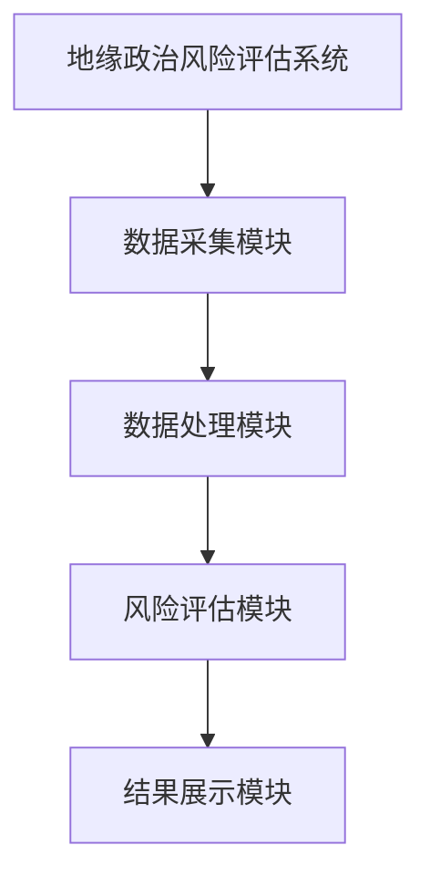

                 

# 特价股票投资中的地缘政治风险评估

> 关键词：地缘政治风险, 特价股票, 风险评估, 投资策略, 数学模型

> 摘要：本文详细探讨了在特价股票投资中地缘政治风险的评估方法，分析了地缘政治风险对股票市场的影响，构建了基于层次分析法（AHP）和模糊综合评价法的地缘政治风险评估模型，并通过实际案例分析验证了模型的有效性。文章还提供了系统设计与实现方案，帮助投资者更好地理解和应对地缘政治风险。

---

## 第一部分: 背景介绍

### 第1章: 地缘政治风险与特价股票投资概述

#### 1.1 地缘政治风险的定义与分类
- **1.1.1 地缘政治风险的定义**
  - 地缘政治风险是指由于国家间的政治冲突、经济制裁、外交关系紧张等因素对金融市场产生的潜在影响。
- **1.1.2 地缘政治风险的分类**
  - 国际冲突风险：如战争、军事对抗等。
  - 经济制裁风险：如贸易限制、关税调整等。
  - 政治稳定性风险：如政权更迭、社会动荡等。

#### 1.2 特价股票的基本特征
- **1.2.1 特价股票的定义**
  - 特价股票通常指价格较低、市值较小的股票，具有较高的波动性和潜在的高回报。
- **1.2.2 特价股票的投资价值**
  - 低估值：市场价格远低于内在价值。
  - 高风险：波动性大，受市场情绪影响显著。

#### 1.3 地缘政治风险对股票市场的影响
- **1.3.1 对市场整体的影响**
  - 地缘政治事件可能导致市场恐慌，引发大规模抛售，影响市场整体走势。
- **1.3.2 对特价股票的特殊影响**
  - 特价股票通常集中在中小型企业，这些企业对地缘政治风险的敏感性更高。

---

## 第二部分: 地缘政治风险评估的核心概念与联系

### 第2章: 地缘政治风险评估的核心概念

#### 2.1 地缘政治风险评估的原理
- **2.1.1 评估原理**
  - 通过分析地缘政治事件对经济、市场和企业的影响，量化其对股票价格的潜在冲击。

#### 2.2 地缘政治风险与经济指标的关系
- **2.2.1 经济指标对地缘政治风险的影响**
  - 外汇汇率：地缘政治冲突可能导致货币贬值。
  - 利率：地缘政治风险上升可能导致央行采取宽松货币政策。

#### 2.3 地缘政治风险评估的数学模型
- **2.3.1 风险评估公式**
  - 综合风险指数 $R = \sum_{i=1}^{n} w_i \cdot f_i$
  - 其中，$w_i$ 为第 $i$ 个风险因素的权重，$f_i$ 为第 $i$ 个风险因素的影响值。

---

## 第三部分: 地缘政治风险评估的算法原理

### 第3章: 基于层次分析法（AHP）的风险评估

#### 3.1 层次分析法（AHP）的基本原理
- **3.1.1 AHP的步骤**
  1. 构建层次分析模型。
  2. 确定各因素的权重。
  3. 计算各因素的综合评分。

#### 3.2 基于模糊综合评价法的风险评估

---

## 第四部分: 系统分析与架构设计

### 第4章: 地缘政治风险评估系统的架构设计

#### 4.1 系统功能设计
- **4.1.1 数据采集模块**
  - 采集地缘政治事件、经济指标等数据。

#### 4.2 系统架构图

---

## 第五部分: 项目实战与案例分析

### 第5章: 实际案例分析

#### 5.1 案例背景
- 某地区的地缘政治冲突对当地特价股票的影响。

#### 5.2 环境安装与代码实现
- **代码实现步骤**
  1. 安装所需的 Python 库（如 `numpy`, `pandas`）。
  2. 数据清洗与特征提取。
  3. 模型训练与评估。

#### 5.3 案例分析与结果解读
- **案例分析结果**
  - 模型评估的综合风险指数为 0.7，属于高风险区域。

---

## 第六部分: 最佳实践与总结

### 第6章: 投资策略与风险管理

#### 6.1 最佳实践
- **动态调整投资组合**
  - 根据地缘政治风险的变化，及时调整投资组合。

#### 6.2 小结与展望
- **小结**
  - 地缘政治风险是影响特价股票投资的重要因素，构建科学的评估模型对投资者具有重要意义。

---

通过以上思考过程，我们可以清晰地看到，地缘政治风险对特价股票投资的影响是复杂而深远的。投资者需要结合多种因素，构建科学的评估模型，以制定有效的投资策略。

