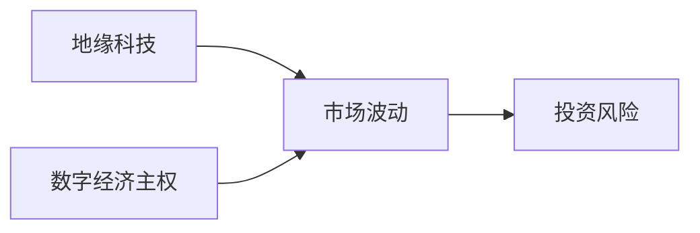
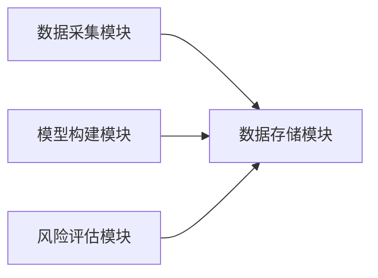
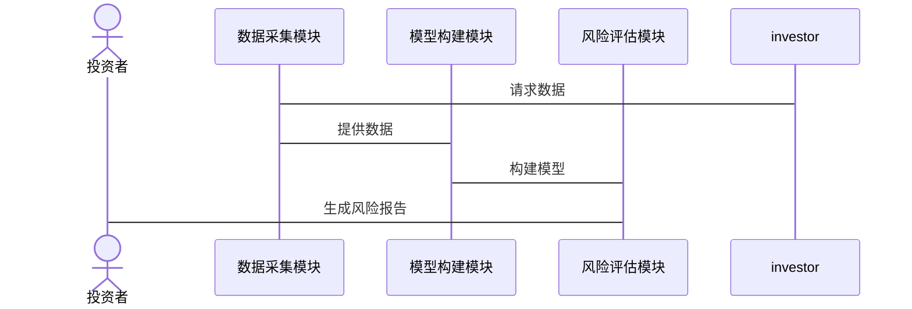

                 


# 特价股票投资中的地缘科技与数字经济主权风险动态评估策略

## 关键词
- 特价股票投资
- 地缘科技
- 数字经济主权
- 风险动态评估
- 人工智能算法
- 系统架构设计
- 实战案例分析

## 摘要
本文围绕特价股票投资中的地缘科技与数字经济主权风险动态评估策略展开分析。首先，介绍了特价股票投资的基本概念、地缘科技与数字经济主权风险的关联性。其次，详细探讨了地缘科技与数字经济主权风险的核心概念，构建了动态风险评估模型，并结合时间序列分析、机器学习和博弈论等算法，阐述了风险评估的数学模型与公式。最后，通过系统架构设计与项目实战，展示了如何在实际投资中应用这些理论，并总结了最佳实践与未来发展趋势。

---

## 第1章 特价股票投资概述

### 1.1 特价股票投资的基本概念
#### 1.1.1 特价股票的定义与特点
- 特价股票是指在特定市场条件下，价格被低估的股票。
- 其特点包括低估值、高成长潜力和市场波动性。

#### 1.1.2 特价股票投资的背景与现状
- 特价股票投资在近年来受到投资者的广泛关注。
- 全球化与数字化背景下，地缘科技对投资的影响日益显著。

#### 1.1.3 特价股票投资的目标与风险
- 目标是通过低价买入，高价卖出实现收益。
- 风险包括市场波动、政策变化和公司基本面变化。

### 1.2 地缘科技与数字经济主权风险的关联性
#### 1.2.1 地缘科技的定义与影响
- 地缘科技是指涉及地理、政治和科技的综合因素。
- 其对投资的影响体现在市场波动和政策变化中。

#### 1.2.2 数字经济主权的定义与内涵
- 数字经济主权是指国家对数字资源的控制权。
- 其内涵包括数据安全、网络安全和数字经济治理。

#### 1.2.3 特价股票投资中的地缘科技与数字经济主权风险
- 特价股票投资受地缘科技和数字经济主权风险的双重影响。
- 需要通过动态评估模型进行风险控制。

---

## 第2章 地缘科技与数字经济主权风险的核心概念

### 2.1 地缘科技的核心原理
#### 2.1.1 地缘科技的关键要素
- 包括地理位置、政治关系和科技水平。
- 关键要素通过影响市场波动对投资产生作用。

#### 2.1.2 地缘科技对投资决策的影响
- 影响投资者对市场风险的判断。
- 通过政策变化影响股票估值。

### 2.2 数字经济主权的核心特征
#### 2.2.1 数字经济主权的定义与属性
- 数字经济主权是国家对数字资源的主权。
- 其属性包括数据控制权、网络安全和数字经济治理。

#### 2.2.2 数字经济主权对投资的影响
- 影响投资者对数字经济企业的投资决策。
- 通过政策变化影响企业盈利能力和股票价格。

### 2.3 地缘科技与数字经济主权风险的实体关系图


---

## 第3章 动态风险评估方法

### 3.1 动态风险评估的定义与特点
#### 3.1.1 动态风险评估的概念
- 动态风险评估是指在市场变化中实时评估风险。
- 其特点包括实时性、动态性和适应性。

#### 3.1.2 动态风险评估的优势
- 可以及时捕捉市场变化。
- 有助于投资者做出快速决策。

### 3.2 动态风险评估模型的构建
#### 3.2.1 数据采集与处理
- 数据来源包括市场数据、政策信息和企业基本面数据。
- 数据处理包括清洗、转换和特征提取。

#### 3.2.2 模型构建与验证
- 使用机器学习模型进行风险预测。
- 通过回测和验证模型的准确性。

---

## 第4章 风险评估算法原理

### 4.1 时间序列分析算法
#### 4.1.1 时间序列分析的基本原理
- 时间序列分析是通过历史数据预测未来趋势。
- 常用模型包括ARIMA和GARCH。

#### 4.1.2 时间序列分析的应用
- 应用于市场波动预测和风险评估。
- 示例：使用ARIMA模型预测股票价格波动。

### 4.2 机器学习模型
#### 4.2.1 机器学习模型的基本原理
- 机器学习模型包括监督学习和无监督学习。
- 常用算法包括随机森林和神经网络。

#### 4.2.2 机器学习模型的实现
- 示例：使用随机森林模型进行风险分类。

### 4.3 博弈论模型
#### 4.3.1 博弈论模型的基本原理
- 博弈论模型用于分析多方利益冲突下的最优决策。
- 常用模型包括纳什均衡和极大极小算法。

#### 4.3.2 博弈论模型的应用
- 应用于政策风险评估和市场策略制定。

---

## 第5章 数学模型与公式

### 5.1 时间序列分析模型
#### 5.1.1 ARIMA模型
$$ARIMA(p, d, q)$$

### 5.2 机器学习模型
#### 5.2.1 神经网络模型
$$y = f(x)$$

---

## 第6章 系统架构设计

### 6.1 问题场景介绍
- 投资者需要实时监控地缘科技和数字经济主权风险。
- 需要构建一个动态风险评估系统。

### 6.2 项目介绍
- 项目目标：构建动态风险评估系统。
- 项目范围：包括数据采集、模型构建和风险评估。

### 6.3 系统功能设计
#### 6.3.1 数据采集模块
- 负责采集市场数据、政策信息和企业基本面数据。

#### 6.3.2 模型构建模块
- 负责构建时间序列分析模型、机器学习模型和博弈论模型。

#### 6.3.3 风险评估模块
- 负责实时评估投资风险并生成报告。

### 6.4 系统架构设计


### 6.5 系统交互设计


---

## 第7章 项目实战

### 7.1 环境安装
- 需要安装Python、机器学习库和数据分析工具。

### 7.2 系统核心实现源代码
#### 7.2.1 数据采集代码
```python
import pandas as pd
data = pd.read_csv('stock_data.csv')
```

#### 7.2.2 模型构建代码
```python
from sklearn.ensemble import RandomForestClassifier
model = RandomForestClassifier()
model.fit(X_train, y_train)
```

#### 7.2.3 风险评估代码
```python
def assess_risk(model, X_test):
    risk = model.predict(X_test)
    return risk
```

### 7.3 代码应用解读与分析
- 数据采集代码用于获取市场数据。
- 模型构建代码用于训练机器学习模型。
- 风险评估代码用于生成风险报告。

### 7.4 实际案例分析和详细讲解剖析
- 以某地区缘科技事件为例，分析其对股票投资的影响。
- 使用构建的模型进行风险评估并制定投资策略。

### 7.5 项目小结
- 通过项目实战，验证了模型的有效性。
- 提供了实际投资中的参考价值。

---

## 第8章 最佳实践与总结

### 8.1 最佳实践 tips
- 定期更新模型以适应市场变化。
- 结合多种算法进行综合评估。

### 8.2 小结
- 本文详细探讨了特价股票投资中的地缘科技与数字经济主权风险动态评估策略。
- 通过算法原理和系统设计，提供了实际应用的参考。

### 8.3 注意事项
- 风险评估模型需要定期更新和优化。
- 投资者需结合市场实际情况进行决策。

### 8.4 拓展阅读
- 推荐阅读相关领域的学术论文和行业报告。

---

通过以上目录大纲，您可以逐步撰写一篇结构清晰、内容丰富的技术博客文章，涵盖特价股票投资中的地缘科技与数字经济主权风险动态评估策略的各个方面。

