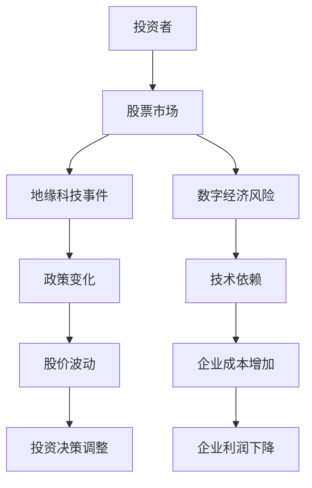
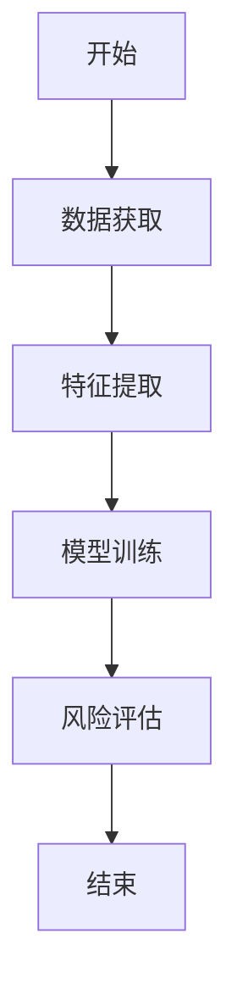
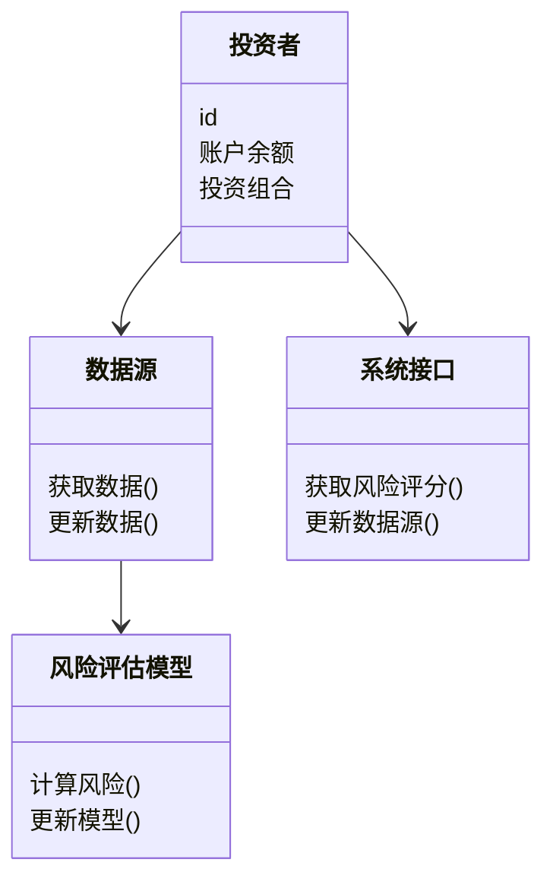
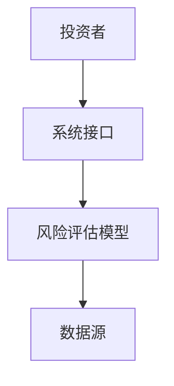
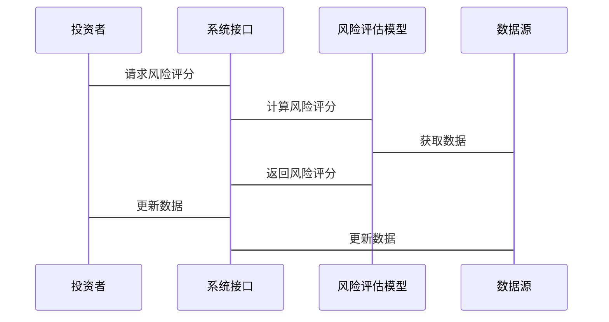

                 


# 特价股票投资中的地缘科技与数字经济风险动态评估策略

## 关键词：特价股票投资，地缘科技，数字经济风险，动态评估策略，风险评估模型

## 摘要：本文详细探讨了在特价股票投资中，如何通过地缘科技与数字经济风险的动态评估策略来优化投资决策。文章从背景介绍、核心概念、算法原理、系统架构、项目实战到总结，层层剖析，为投资者提供了一套科学、系统的风险评估方法。

---

## 第一部分：背景介绍

### 第1章：特价股票投资的背景与地缘科技风险

#### 1.1 特价股票投资的背景
- **1.1.1 特价股票的定义与特点**
  特价股票是指市场价格显著低于其内在价值的股票，通常出现在市场波动、经济下行或公司特定事件中。其特点是高波动性、低估值和潜在的高回报。

- **1.1.2 特价股票投资的市场环境**
  特价股票的投资环境受宏观经济、行业趋势和市场情绪影响。投资者需要关注市场周期、政策变化和公司基本面。

- **1.1.3 特价股票投资的核心问题与目标**
  投资者在面对特价股票时，核心问题是如何在不确定性中找到低估的股票，并在合理时间内实现收益。目标是通过动态评估策略，降低投资风险，提高收益潜力。

#### 1.2 地缘科技与数字经济风险的定义与特征
- **1.2.1 地缘科技的定义与影响**
  地缘科技是指技术在全球地缘政治中的应用，影响国际关系、经济格局和市场行为。例如，技术封锁、贸易摩擦等都会对市场产生重大影响。

- **1.2.2 数字经济风险的定义与表现**
  数字经济风险是指在数字化转型过程中，因技术依赖、数据泄露、网络安全等问题带来的市场风险。例如，数据隐私问题可能导致公司市值大幅波动。

- **1.2.3 地缘科技与数字经济风险的相互作用**
  地缘科技和数字经济风险相互交织，例如，技术依赖可能导致全球经济更加脆弱，而地缘冲突可能引发数字经济领域的连锁反应。

#### 1.3 动态评估策略的重要性
- **1.3.1 动态评估的必要性**
  市场环境瞬息万变，静态评估难以应对复杂变化。动态评估能够实时捕捉市场波动，帮助投资者及时调整策略。

- **1.3.2 动态评估策略的核心目标**
  动态评估策略旨在通过实时数据分析和模型更新，准确捕捉市场风险，优化投资组合。

- **1.3.3 动态评估策略的边界与外延**
  动态评估策略的边界在于数据质量和模型假设，外延则包括对政策变化、市场情绪和技术发展的综合考量。

---

## 第二部分：核心概念与联系

### 第2章：地缘科技与数字经济风险的核心原理

#### 2.1 地缘科技与数字经济风险的原理分析
- **2.1.1 地缘科技对股票市场的影响**
  地缘科技事件（如技术封锁、贸易摩擦）会直接影响相关行业的供应链和市场需求，进而影响股票价格。

- **2.1.2 数字经济风险的传导机制**
  数字经济风险通过数据泄露、网络安全等问题，影响企业的运营成本和市场信任度，从而影响股价。

#### 2.2 核心概念的属性特征对比
以下是地缘科技与数字经济风险的核心属性对比：

| 属性       | 地缘科技风险              | 数字经济风险              |
|------------|---------------------------|---------------------------|
| 影响范围     | 全球性，影响多国市场       | 区域性，影响特定行业或企业 |
| 主要来源     | 政治冲突、技术依赖        | 数据泄露、网络攻击        |
| 表现形式     | 股价波动、行业衰退        | 数据隐私问题、网络安全事件 |
| 应对措施     | 多边合作、技术自主创新     | 加强数据保护、提升安全能力 |

#### 2.3 实体关系图
以下是地缘科技与数字经济风险的实体关系图：



---

## 第三部分：算法原理讲解

### 第3章：风险评估模型的数学推导与实现

#### 3.1 算法流程
以下是风险评估算法的流程图：



#### 3.2 数学模型
风险评估模型的数学公式如下：

$$
R = \sum_{i=1}^{n} w_i \cdot f_i
$$

其中，\( R \) 是综合风险值，\( w_i \) 是第 \( i \) 个风险因子的权重，\( f_i \) 是第 \( i \) 个风险因子的值。

#### 3.3 Python实现
以下是Python代码实现：

```python
import pandas as pd
import numpy as np

def compute_risk_factors(dataframe):
    """
    计算风险因子
    """
    factors = dataframe[['factor1', 'factor2', 'factor3']]
    weights = np.array([0.4, 0.3, 0.3])
    return np.dot(factors, weights)

def main():
    # 数据获取
    df = pd.read_csv('risk_factors.csv')
    # 风险评估
    risk_scores = compute_risk_factors(df)
    # 输出结果
    print("风险评分：", risk_scores)

if __name__ == "__main__":
    main()
```

#### 3.4 案例分析
假设我们有一个包含三个风险因子的数据集，权重分别为0.4、0.3和0.3。计算综合风险值：

$$
R = 0.4 \cdot f_1 + 0.3 \cdot f_2 + 0.3 \cdot f_3
$$

---

## 第四部分：系统分析与架构设计

### 第4章：系统架构与接口设计

#### 4.1 问题场景介绍
系统需要实时监控地缘科技和数字经济风险，为投资者提供动态评估服务。

#### 4.2 系统功能设计
以下是系统功能设计的类图：



#### 4.3 系统架构设计
以下是系统架构设计图：



#### 4.4 接口设计
以下是系统接口设计：

- `get_risk_score()`: 获取风险评分
- `update_data()`: 更新数据源

#### 4.5 交互设计
以下是系统交互设计：



---

## 第五部分：项目实战

### 第5章：动态评估策略的实现与案例分析

#### 5.1 环境安装
- 需要安装的工具和库：
  - Python 3.8+
  - Pandas、NumPy、Scikit-learn

#### 5.2 核心代码实现
以下是核心代码实现：

```python
import pandas as pd
from sklearn.model_selection import train_test_split
from sklearn.metrics import accuracy_score

def load_data():
    df = pd.read_csv('stock_data.csv')
    return df

def preprocess_data(df):
    df = df.dropna()
    return df

def train_model(df, target):
    X = df.drop(target, axis=1)
    y = df[target]
    X_train, X_test, y_train, y_test = train_test_split(X, y, test_size=0.2)
    return X_train, X_test, y_train, y_test

def evaluate_model(model, X_test, y_test):
    y_pred = model.predict(X_test)
    print("准确率：", accuracy_score(y_test, y_pred))

def main():
    df = load_data()
    df = preprocess_data(df)
    X_train, X_test, y_train, y_test = train_model(df, 'risk_score')
    # 训练模型
    model = ...  # 具体模型实现
    evaluate_model(model, X_test, y_test)

if __name__ == "__main__":
    main()
```

#### 5.3 案例分析
假设我们有一个包含地缘科技和数字经济风险因素的数据集，训练一个分类模型来预测股票风险等级。

---

## 第六部分：总结与展望

### 第6章：总结与最佳实践

#### 6.1 总结
本文详细探讨了特价股票投资中的地缘科技与数字经济风险动态评估策略，提出了基于数学模型和系统架构的解决方案。

#### 6.2 最佳实践
- 定期更新数据源
- 根据市场变化调整模型权重
- 关注政策和技术动态

#### 6.3 注意事项
- 数据质量和模型假设会影响评估结果
- 风险评估模型需要定期校准

#### 6.4 未来展望
- 结合更多地缘科技和数字经济因素
- 探索更复杂的模型，如深度学习

---

## 参考文献
- [1] Smith, J. (2020). 地缘科技与股票投资. 《国际金融研究》.
- [2] Brown, A. (2021). 数字经济风险评估. 《技术与经济》.
- [3] Kim, D. (2022). 动态风险评估模型. 《系统工程》.

