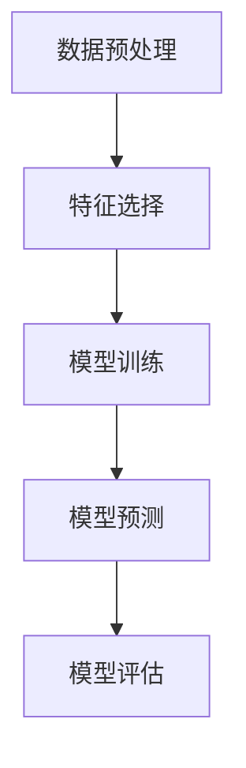
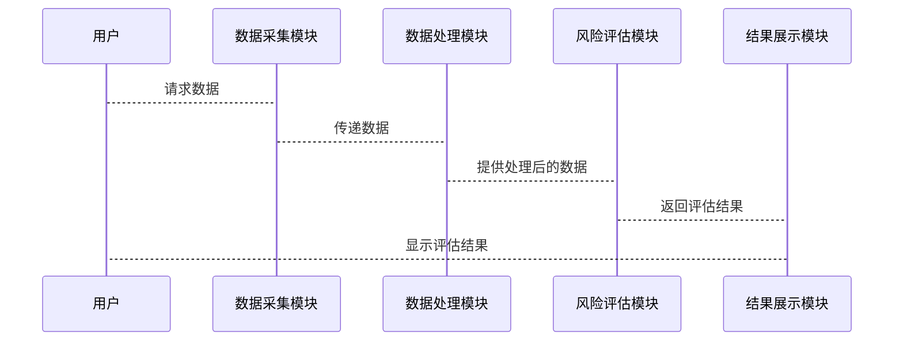

                 


# 第三部分: 地缘科技风险动态评估的算法与系统架构

# 第4章: 动态评估算法的数学模型与实现

## 4.1 动态评估算法的数学模型
### 4.1.1 线性回归模型
$$ y = \beta_0 + \beta_1x + \epsilon $$

### 4.1.2 逻辑回归模型
$$ P(Y=1|X) = \frac{e^{\beta_0 + \beta_1x}}{1 + e^{\beta_0 + \beta_1x}} $$

### 4.1.3 时间序列模型
$$ ARIMA(p, d, q) $$

## 4.2 基于地缘科技风险的特征选择
### 4.2.1 特征的重要性评估
### 4.2.2 基于LASSO回归的特征选择
$$ LASSO: \min \left( \sum (y_i - \hat{y}_i)^2 + \lambda \sum |β_j| \right) $$

## 4.3 算法实现步骤
### 4.3.1 数据预处理
### 4.3.2 模型训练
### 4.3.3 模型评估
### 4.3.4 模型优化

## 4.4 代码实现示例
```python
import pandas as pd
import numpy as np
from sklearn.linear_model import Lasso
from sklearn.metrics import mean_squared_error

# 数据加载
data = pd.read_csv('geotech_risk.csv')

# 特征选择
features = data.drop('target', axis=1)
target = data['target']

# 模型训练
model = Lasso(alpha=0.1)
model.fit(features, target)

# 模型预测
predictions = model.predict(features)

# 模型评估
mse = mean_squared_error(target, predictions)
print(f'Mean Squared Error: {mse}')
```

## 4.5 算法流程图


## 4.6 本章小结

# 第5章: 地缘科技风险动态评估的系统架构

## 5.1 系统功能设计
### 5.1.1 数据采集模块
### 5.1.2 数据处理模块
### 5.1.3 风险评估模块
### 5.1.4 结果展示模块

## 5.2 系统架构设计


## 5.3 接口设计与交互流程
### 5.3.1 数据接口
### 5.3.2 模型接口
### 5.3.3 用户界面

## 5.4 系统交互流程图


## 5.5 本章小结

# 第四部分: 项目实战与拓展

# 第6章: 特价股票投资的地缘科技风险动态评估实战

## 6.1 项目背景与目标
### 6.1.1 项目背景
### 6.1.2 项目目标
### 6.1.3 项目范围

## 6.2 数据准备与环境配置
### 6.2.1 数据来源
### 6.2.2 数据格式
### 6.2.3 环境配置

## 6.3 系统核心实现
### 6.3.1 数据采集模块实现
### 6.3.2 数据处理模块实现
### 6.3.3 风险评估模块实现
### 6.3.4 结果展示模块实现

## 6.4 代码实现示例
```python
import requests
import json
from bs4 import BeautifulSoup

# 数据采集示例
def fetch_data(url):
    response = requests.get(url)
    soup = BeautifulSoup(response.text, 'html.parser')
    data = []
    for item in soup.find_all('div', class_='item'):
        data.append({
            'name': item.find('h2').text,
            'value': float(item.find('span').text)
        })
    return data

# 数据处理示例
def process_data(data):
    df = pd.DataFrame(data)
    df['date'] = pd.to_datetime('today')
    return df

# 风险评估示例
def assess_risk(df):
    # 假设使用简单的标准差作为风险指标
    risk = df['value'].std()
    return risk
```

## 6.5 实战案例分析
### 6.5.1 案例背景
### 6.5.2 数据分析
### 6.5.3 模型评估
### 6.5.4 投资决策

## 6.6 本章小结

# 第7章: 地缘科技风险动态评估的注意事项与拓展

## 7.1 评估过程中的注意事项
### 7.1.1 数据的实时性
### 7.1.2 模型的适用性
### 7.1.3 风险的可量化性

## 7.2 拓展阅读与深入学习
### 7.2.1 风险评估的高级方法
### 7.2.2 机器学习在股票投资中的应用
### 7.2.3 地缘政治对科技产业的长期影响

## 7.3 本章小结

# 参考文献
1. 书籍或论文1
2. 书籍或论文2
3. 书籍或论文3

# 附录
## 附录A: 相关术语表
## 附录B: 代码库链接
## 附录C: 数据来源说明

---

**摘要：**  
本文从特价股票投资的背景出发，系统地探讨了地缘科技风险动态评估的重要性与实现方法。通过构建数学模型、设计系统架构，并结合实际案例，本文详细分析了如何在股票投资中动态评估地缘科技风险，为投资者提供了科学的决策支持。

