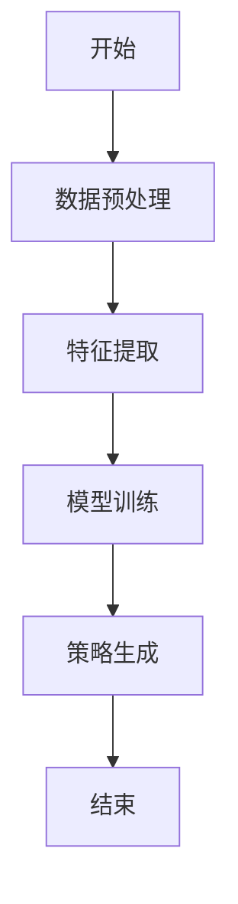
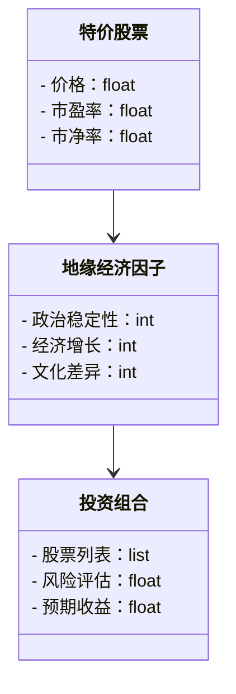
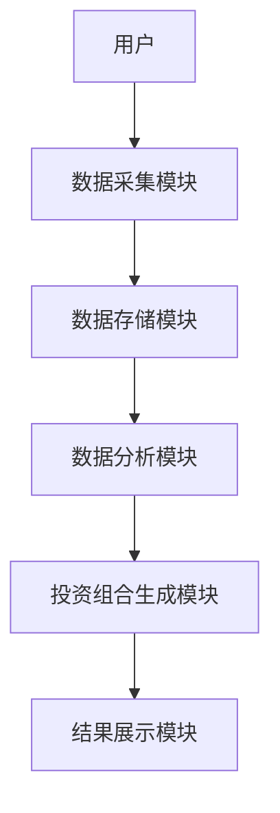
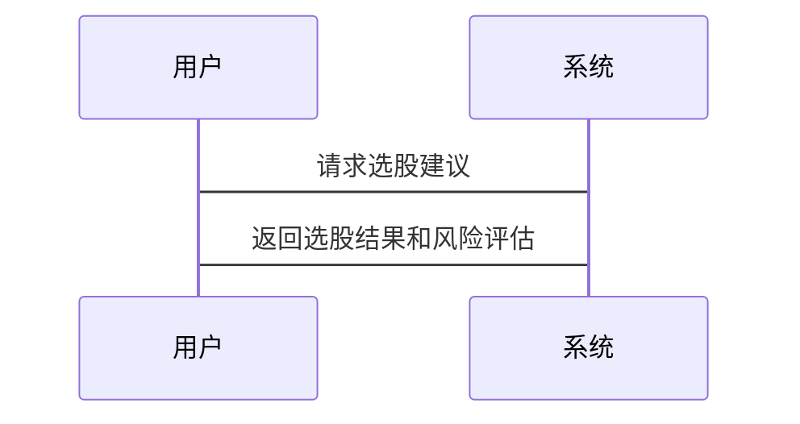

                 


# 特价股票投资中的地缘经济多样化策略研究

## 关键词：特价股票、地缘经济、多样化策略、风险管理、资产配置

## 摘要：  
本文深入探讨了特价股票投资中的地缘经济多样化策略，从地缘经济的多维度影响、数学模型构建到系统设计与实战应用，全面分析了如何通过地缘经济因素优化投资组合。文章结合理论与实践，提出了多因子模型和投资分析系统的构建方法，为投资者提供了有效的策略和工具。

---

# 第1章: 特价股票投资与地缘经济概述

## 1.1 特价股票投资的定义与特点

### 1.1.1 特价股票的定义  
特价股票（Cheap Stocks）通常指市场价格低于其内在价值的股票，具有较高的潜在增长空间。其特点包括：  
- **低估值**：市盈率、市净率等指标低于行业平均水平。  
- **高波动性**：价格波动较大，适合短期投资。  
- **高风险**：由于估值低，可能存在隐藏的财务问题。  

### 1.1.2 特价股票的核心特点  
- **周期性**：通常在经济低迷时出现，适合长期投资者。  
- **分散性**：分布在不同行业和市场中，适合多样化投资。  
- **潜在收益**：低价股可能因资产重组或业绩改善而大幅上涨。  

### 1.1.3 特价股票投资的边界与外延  
- **边界**：避免投资于基本面严重恶化的企业。  
- **外延**：扩展至地缘经济因素分析，寻找具有区域竞争优势的企业。  

---

## 1.2 地缘经济的定义与特点

### 1.2.1 地缘经济的定义  
地缘经济（Geoeconomic）是地理与经济的交叉学科，研究地理位置对经济活动的影响。其核心在于通过地理位置优势优化资源配置。  

### 1.2.2 地缘经济的核心要素  
| 要素 | 描述 |  
|------|------|  
| 政治环境 | 政治稳定性、政策支持等 |  
| 经济结构 | 产业链布局、资源分布等 |  
| 文化差异 | 消费习惯、商业习惯等 |  
| 社会因素 | 教育水平、人口结构等 |  

### 1.2.3 地缘经济与全球经济的关系  
地缘经济是全球经济的微观表现，通过区域间合作与竞争推动全球经济一体化。  

---

## 1.3 特价股票投资中的地缘经济策略

### 1.3.1 地缘经济对投资的影响  
- **正面影响**：区域经济优势可能带来企业盈利增长。  
- **负面影响**：地缘政治冲突可能引发市场波动。  

### 1.3.2 地缘经济多样化策略的必要性  
- **分散风险**：通过投资不同地区的股票降低区域风险。  
- **捕捉机会**：地缘经济优势区域可能隐藏高增长企业。  

### 1.3.3 策略实施的边界与限制  
- **边界**：避免过度分散导致流动性不足。  
- **限制**：需结合企业基本面，避免仅依赖地缘因素。  

---

## 1.4 本章小结  
本章介绍了特价股票和地缘经济的基本概念，分析了地缘经济对投资的影响，并提出了多样化策略的必要性和实施边界。  

---

# 第2章: 地缘经济对特价股票投资的影响因素分析

## 2.1 地缘政治对投资的影响

### 2.1.1 地缘政治事件的定义与分类  
- **定义**：涉及地理位置的国际政治事件，如战争、贸易摩擦等。  
- **分类**：区域冲突、政策变化、国际关系等。  

### 2.1.2 地缘政治事件对股票市场的冲击  
- **短期影响**：市场恐慌情绪可能导致股价暴跌。  
- **长期影响**：区域稳定后，市场可能恢复并增长。  

### 2.1.3 特价股票在地缘政治中的防御性特征  
- **防御性行业**：如公用事业、医疗等受地缘政治影响较小。  
- **低价优势**：地缘政治冲击下，低价股可能因市场低估而反弹。  

---

## 2.2 经济周期对投资的影响

### 2.2.1 经济周期的定义与阶段划分  
- **定义**：经济活动的波动周期，通常分为衰退、复苏、增长、过热四个阶段。  
- **阶段划分**：  
  1. 衰退期：企业盈利下降，股价承压。  
  2. 复苏期：经济逐步恢复，股价回升。  
  3. 增长期：企业盈利增长，股价上涨。  
  4. 过热期：市场泡沫，股价可能回调。  

### 2.2.2 经济周期对股票市场的影响  
- **衰退期**：低价股可能因企业盈利下降而进一步低估。  
- **过热期**：高价股可能因泡沫破裂而大幅下跌。  

### 2.2.3 特价股票在经济周期中的表现  
- **衰退期**：低价股可能因市场低估而成为抄底机会。  
- **过热期**：低价股可能因整体市场回调而受拖累。  

---

## 2.3 地缘经济中的文化与社会因素

### 2.3.1 文化差异对投资的影响  
- **消费习惯**：不同文化背景下，消费者偏好差异可能影响企业业绩。  
- **商业习惯**：不同地区的商业文化可能影响企业合作模式。  

### 2.3.2 社会稳定对股票市场的影响  
- **社会稳定**：社会稳定地区的企业可能因环境稳定而表现更好。  
- **社会动荡**：动荡地区的企业可能因经营中断而股价下跌。  

### 2.3.3 特价股票在文化多样性中的优势  
- **文化适应性**：企业在多元文化环境中可能更具竞争优势。  

---

## 2.4 本章小结  
本章分析了地缘政治、经济周期和社会文化对特价股票投资的影响，强调了多因素综合分析的重要性。  

---

# 第3章: 地缘经济多样化策略的理论基础

## 3.1 资产配置理论

### 3.1.1 资产配置的定义与分类  
- **定义**：将资金分配到不同资产类别以实现收益与风险的平衡。  
- **分类**：股票、债券、现金等。  

### 3.1.2 资产配置在投资中的作用  
- **分散风险**：通过投资不同资产降低整体风险。  
- **优化收益**：通过资产类别间的互补提高收益。  

### 3.1.3 地缘经济视角下的资产配置策略  
- **全球化配置**：投资于不同国家和地区的股票，分散地缘政治风险。  
- **区域化配置**：根据地缘经济优势选择重点投资区域。  

---

## 3.2 风险管理理论

### 3.2.1 风险管理的定义与方法  
- **定义**：通过识别、评估和控制风险来降低损失。  
- **方法**：风险分散、风险对冲、风险转移等。  

### 3.2.2 地缘经济中的风险因素分析  
- **地缘政治风险**：战争、政策变化等。  
- **经济周期风险**：经济波动对企业盈利的影响。  

### 3.2.3 风险分散在地缘经济策略中的应用  
- **多样化投资**：通过投资不同地区的股票分散风险。  
- **动态调整**：根据地缘经济变化及时调整投资组合。  

---

## 3.3 现金流分析与价值评估

### 3.3.1 现金流分析的定义与方法  
- **定义**：分析企业现金流入和流出的动态。  
- **方法**：自由现金流分析、净现值法等。  

### 3.3.2 地缘经济中的现金流预测  
- **区域经济稳定性**：稳定地区的企业现金流更可预测。  
- **政策影响**：政府政策对企业现金流的影响。  

### 3.3.3 价值评估在特价股票中的应用  
- **内在价值计算**：通过现金流折现法估算股票的合理价格。  
- **市场价值对比**：比较市场价格与内在价值，寻找低估股票。  

---

## 3.4 本章小结  
本章从资产配置和风险管理的角度，分析了地缘经济多样化策略的理论基础，并提出了基于现金流分析的价值评估方法。  

---

# 第4章: 地缘经济多样化策略的数学模型与算法

## 4.1 多因子模型在地缘经济策略中的应用

### 4.1.1 多因子模型的定义与特点  
- **定义**：通过多个因子（如价值、动量、规模等）筛选股票。  
- **特点**：综合考虑多维度因素，提高选股准确性。  

### 4.1.2 多因子模型的构建过程  
1. 确定因子：选择与地缘经济相关的因子，如市盈率、市净率、地理位置等。  
2. 数据采集：收集相关股票的历史数据。  
3. 因子计算：计算各因子的得分。  
4. 组合构建：根据因子得分筛选出表现优异的股票组合。  

### 4.1.3 多因子模型在地缘经济中的应用案例  
- **案例**：通过多因子模型筛选出具有低市盈率且位于经济稳定的地区的股票。  

---

## 4.2 算法原理与流程图

### 4.2.1 算法原理  
多因子模型通过线性回归或聚类分析，量化各因子对股票收益的贡献程度。  

### 4.2.2 算法流程图  


---

## 4.3 数学模型与公式

### 4.3.1 多因子模型的数学表达  
$$ E(R_i) = \alpha + \beta_1 F_1 + \beta_2 F_2 + \dots + \beta_n F_n $$  
其中，$E(R_i)$为股票i的预期收益，$F_j$为各因子，$\beta_j$为因子的权重。  

### 4.3.2 风险调整后的收益计算  
$$ R_{adj} = R_{exp} - \lambda \times RiskFactor $$  
其中，$\lambda$为风险调整系数，$RiskFactor$为风险因素值。  

---

## 4.4 本章小结  
本章通过多因子模型和数学公式，详细阐述了地缘经济多样化策略的实现方法。  

---

# 第5章: 地缘经济多样化策略的系统分析与设计

## 5.1 问题场景介绍

### 5.1.1 投资者需求  
- **需求1**：寻找具有地缘经济优势的特价股票。  
- **需求2**：需要实时监控地缘经济因素变化。  

### 5.1.2 系统目标  
- **目标1**：构建一个基于地缘经济因素的选股模型。  
- **目标2**：提供实时数据支持和策略调整建议。  

---

## 5.2 系统功能设计

### 5.2.1 领域模型（mermaid类图）  


---

## 5.3 系统架构设计

### 5.3.1 系统架构图  


---

## 5.4 系统接口设计

### 5.4.1 数据接口  
- **输入**：股票数据、地缘经济因子数据。  
- **输出**：选股结果、风险评估。  

---

## 5.5 系统交互设计

### 5.5.1 交互流程图  


---

## 5.6 本章小结  
本章通过系统设计，提出了基于地缘经济因素的选股模型，并通过架构图和交互图详细展示了系统的实现过程。  

---

# 第6章: 地缘经济多样化策略的项目实战

## 6.1 环境配置

### 6.1.1 工具安装  
- **Python**：安装Anaconda。  
- **数据源**：使用Yahoo Finance获取股票数据。  

---

## 6.2 核心实现代码

### 6.2.1 数据采集  
```python
import pandas as pd
import yfinance as yf

# 采集数据
tickers = ['AAPL', 'GOOGL', 'MSFT']
data = yf.download(tickers, start='2020-01-01', end='2023-12-31')
```

### 6.2.2 地缘经济因子计算  
```python
# 示例：计算政治稳定性指数
def calculate_political_stability(ticker):
    # 示例数据，实际应结合新闻和政策数据
    return 0.8  # 假设为稳定
```

### 6.2.3 多因子模型实现  
```python
from sklearn.linear_model import LinearRegression

# 训练模型
model = LinearRegression()
X = data[['Close', 'Volume']]
y = data['Adj Close']
model.fit(X, y)
```

---

## 6.3 代码应用解读与分析

### 6.3.1 数据采集的解读  
数据采集是策略实现的基础，确保数据的完整性和准确性。  

### 6.3.2 模型训练的解读  
通过线性回归模型，量化各因子对股票收益的贡献程度。  

---

## 6.4 案例分析与详细解读

### 6.4.1 案例分析  
- **案例1**：选择具有低市盈率且位于经济稳定地区的股票。  
- **案例2**：在地缘政治冲突前调整投资组合，降低风险。  

### 6.4.2 详细解读  
- **步骤1**：筛选低价股。  
- **步骤2**：评估地缘经济因子。  
- **步骤3**：构建投资组合。  

---

## 6.5 本章小结  
本章通过实际案例，详细展示了地缘经济多样化策略的实现过程，并提供了代码支持。  

---

# 第7章: 总结与展望

## 7.1 本章总结  
本文系统分析了地缘经济多样化策略在特价股票投资中的应用，提出了多因子模型和投资分析系统的构建方法。  

## 7.2 未来展望  
未来研究可以进一步结合人工智能技术，优化选股模型，并探索更多地缘经济因子对投资的影响。  

---

# 第8章: 附录

## 8.1 数据来源与工具  
- 数据来源：Yahoo Finance、公司财报等。  
- 工具：Python、Pandas、Scikit-learn等。  

## 8.2 参考文献  
- 文献1：《地缘经济与投资策略》  
- 文献2：《多因子模型在股票投资中的应用》  

---

通过以上结构，本文系统地分析了特价股票投资中的地缘经济多样化策略，结合理论与实践，为投资者提供了有效的策略和工具。

