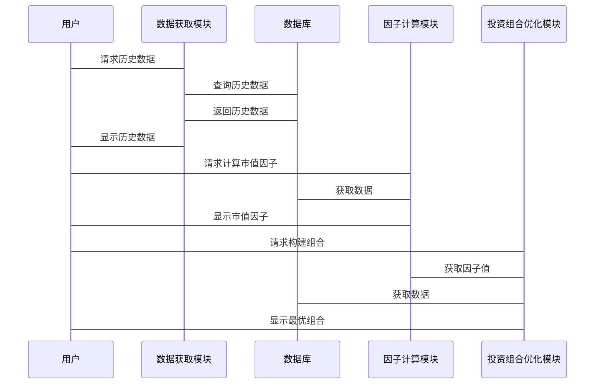

                 


# 特价股票投资中的多因子模型应用

---

## 关键词：多因子模型，特价股票，股票投资，算法，风险管理，投资组合

---

## 摘要

本文探讨了多因子模型在特价股票投资中的应用，详细分析了多因子模型的核心概念、算法原理、系统设计及实际案例。通过结合多因子模型的优势，本文展示了如何在特价股票投资中构建高效的筛选和优化策略，同时通过项目实战和风险控制，为投资者提供科学的决策支持。

---

# 第一部分: 多因子模型的背景与应用

## 第1章: 多因子模型的背景与应用

### 1.1 多因子模型的背景介绍

#### 1.1.1 传统股票投资方法的局限性

传统的股票投资方法主要依赖于基本面分析和市场情绪判断，这种方法存在主观性强、难以量化等缺点。多因子模型的出现弥补了这些不足，通过多个量化因子的综合评估，提供了更客观的投资依据。

#### 1.1.2 多因子模型的提出与发展

多因子模型起源于20世纪70年代，Fama-French三因子模型是其中的代表。随着计算能力的提升，多因子模型逐渐被广泛应用于股票投资领域。

#### 1.1.3 多因子模型在股票投资中的优势

- **全面性**：考虑多个因子，捕捉更多的市场信息。
- **稳定性**：通过因子的多元化，降低单一因子波动带来的风险。
- **可解释性**：每个因子都有明确的经济意义，便于理解和优化。

### 1.2 特价股票投资的概念与特点

#### 1.2.1 特价股票的定义与分类

特价股票是指市场价格低于其内在价值的股票。根据不同的评估标准，可以将特价股票分为低估型、价值型等类别。

#### 1.2.2 特价股票投资的基本策略

- **价值投资**：寻找被市场低估的股票。
- **趋势投资**：利用市场短期波动进行套利。

#### 1.2.3 特价股票与市场周期的关系

特价股票的投资机会往往出现在市场低迷期，而市场周期的波动性为投资者提供了套利机会。

### 1.3 多因子模型与特价股票投资的结合

#### 1.3.1 多因子模型在股票筛选中的作用

通过多个因子的综合评估，筛选出具有投资价值的特价股票。

#### 1.3.2 特价股票投资中多因子模型的应用场景

- **风险控制**：通过因子分析降低投资风险。
- **组合优化**：构建高效的股票组合。

#### 1.3.3 多因子模型的优势与挑战

- **优势**：因子的多元化提高了筛选的准确性。
- **挑战**：因子的选择和权重分配需要精细调整。

## 1.4 本章小结

本章介绍了多因子模型的背景及其在特价股票投资中的应用，为后续的分析奠定了基础。

---

## 第2章: 多因子模型的核心概念与原理

### 2.1 多因子模型的定义与分类

#### 2.1.1 多因子模型的定义

多因子模型是通过多个因子来解释股票收益的模型，常见的因子包括市值、价值、动量等。

#### 2.1.2 常见的多因子模型分类

- **Fama-French三因子模型**：考虑市值、价值和动量因子。
- **Carhart四因子模型**：在三因子基础上增加市场因子。

#### 2.1.3 多因子模型与单因子模型的区别

多因子模型通过综合多个因子，提高了收益预测的准确性。

### 2.2 多因子模型的核心要素

#### 2.2.1 市值因子（Size）

市值因子反映了公司规模对收益的影响。

#### 2.2.2 价值因子（Value）

价值因子通过市盈率、市净率等指标衡量股票的内在价值。

#### 2.2.3 动量因子（Momentum）

动量因子利用过去的价格走势预测未来收益。

#### 2.2.4 流动性因子（Liquidity）

流动性因子衡量股票的交易活跃程度。

### 2.3 多因子模型的数学表达

#### 2.3.1 多因子模型的线性回归公式

$$ R_i = \alpha + \beta_1F_1 + \beta_2F_2 + ... + \beta_nF_n + \epsilon $$

其中，$R_i$为股票i的收益，$F_j$为因子j，$\beta_j$为因子系数。

#### 2.3.2 因子权重的确定方法

通过回归分析确定每个因子的权重，权重反映了因子对收益的贡献程度。

#### 2.3.3 因子组合的构建逻辑

根据因子权重，构建最优的因子组合，以最大化收益并最小化风险。

### 2.4 多因子模型的优缺点分析

#### 2.4.1 多因子模型的优势

- **准确性高**：综合考虑多个因子，提高了收益预测的准确性。
- **风险分散**：通过多元化因子降低投资风险。

#### 2.4.2 多因子模型的局限性

- **复杂性**：因子选择和权重分配需要精细调整。
- **数据依赖性**：依赖于历史数据，可能无法预测未来市场变化。

#### 2.4.3 多因子模型的改进方向

- **动态调整因子权重**。
- **引入更多因子**。

## 2.5 本章小结

本章详细讲解了多因子模型的核心概念和数学原理，为后续的应用奠定了理论基础。

---

## 第3章: 多因子模型在特价股票投资中的应用

### 3.1 特价股票筛选的因子选择

#### 3.1.1 特价股票筛选的核心因子

- **市值因子**：选择中等市值的股票。
- **价值因子**：寻找低市盈率、低市净率的股票。

#### 3.1.2 因子权重的动态调整

根据市场环境的变化，动态调整因子的权重，以提高筛选的准确性。

#### 3.1.3 因子之间的相关性分析

避免因子之间的高度相关性，以降低组合的风险。

### 3.2 多因子模型在风险控制中的应用

#### 3.2.1 风险因子的识别与量化

通过波动率、流动性等因子量化投资组合的风险。

#### 3.2.2 多因子模型在风险分散中的作用

通过多元化因子降低投资组合的风险暴露。

#### 3.2.3 风险调整后的因子组合优化

在考虑风险的前提下，优化因子组合，以最大化收益。

### 3.3 多因子模型在投资组合管理中的应用

#### 3.3.1 投资组合的构建逻辑

根据多因子模型筛选出的股票，构建投资组合。

#### 3.3.2 因子暴露的监控与调整

定期监控因子暴露情况，根据市场变化进行调整。

#### 3.3.3 投资组合的绩效评估

通过回测和风险调整后的收益评估投资组合的绩效。

## 3.4 本章小结

本章探讨了多因子模型在特价股票投资中的应用，特别是在风险控制和投资组合管理中的作用。

---

## 第4章: 多因子模型的算法实现与优化

### 4.1 多因子模型的算法实现

#### 4.1.1 算法流程

1. 数据收集：收集历史价格、财务数据等。
2. 因子计算：计算各因子值。
3. 因子筛选：根据因子的显著性进行筛选。
4. 因子组合：构建最优因子组合。
5. 投资组合优化：根据因子组合构建投资组合。

#### 4.1.2 数据预处理

- 数据清洗：处理缺失值、异常值。
- 数据标准化：对因子进行标准化处理。

#### 4.1.3 因子回归分析

使用线性回归分析因子对收益的影响，确定因子权重。

### 4.2 多因子模型的优化

#### 4.2.1 动态调整因子权重

根据市场环境的变化，动态调整因子的权重。

#### 4.2.2 引入更多因子

扩展因子的种类，以提高模型的准确性。

#### 4.2.3 融合机器学习算法

将机器学习算法与多因子模型结合，提高预测能力。

### 4.3 本章小结

本章详细讲解了多因子模型的算法实现及优化方法，为实际应用提供了指导。

---

## 第5章: 多因子模型的系统架构与设计

### 5.1 系统功能设计

#### 5.1.1 领域模型（Mermaid类图）

```mermaid
classDiagram

    class 特价股票筛选系统 {
        + 数据库：存储股票数据、因子计算结果
        + 用户界面：供用户输入参数和查看结果
        + 因子计算模块：计算各因子值
        + 组合优化模块：优化因子组合
    }

    class 数据获取模块 {
        + 获取历史数据
        + 数据清洗
    }

    class 因子计算模块 {
        + 计算市值因子
        + 计算价值因子
        + 计算动量因子
    }

    class 投资组合优化模块 {
        + 确定因子权重
        + 构建投资组合
        + 评估组合绩效
    }

    特价股票筛选系统 <--| 数据获取模块
    特价股票筛选系统 <--| 因子计算模块
    特价股票筛选系统 <--| 投资组合优化模块
```

### 5.2 系统架构设计

#### 5.2.1 系统架构（Mermaid架构图）


### 5.3 系统接口设计

#### 5.3.1 数据获取接口

- 输入：股票代码、时间范围
- 输出：历史数据

#### 5.3.2 因子计算接口

- 输入：因子名称
- 输出：因子值

#### 5.3.3 投资组合优化接口

- 输入：因子权重
- 输出：最优组合

### 5.4 系统交互设计

#### 5.4.1 系统交互流程（Mermaid序列图）



### 5.5 本章小结

本章详细介绍了多因子模型的系统架构与设计，为实际应用提供了指导。

---

## 第6章: 项目实战——多因子股票筛选系统

### 6.1 项目简介

本项目旨在通过多因子模型，构建一个股票筛选系统，帮助投资者找到具有投资价值的特价股票。

### 6.2 环境配置

- **Python版本**：3.8+
- **依赖库**：Pandas、NumPy、Scikit-learn、Plotly

### 6.3 核心实现

#### 6.3.1 数据获取与预处理

```python
import pandas as pd
import numpy as np

# 数据获取
def get_data(tickers, start_date, end_date):
    data = pd.DataFrame()
    for ticker in tickers:
        df = pd.read_csv(f'data/{ticker}.csv')
        data[ticker] = df['Adj Close']
    return data
```

#### 6.3.2 因子计算

```python
def calculate_factors(data, window=20):
    # 计算市值因子
    market_cap = data.pct_change().rolling(window).mean()
    # 计算价值因子
    value_factor = data.div(data.rolling(window).mean()).shift(1)
    return market_cap, value_factor
```

#### 6.3.3 因子回归与组合优化

```python
from sklearn.linear_model import LinearRegression

def factor_regression(X, y):
    model = LinearRegression()
    model.fit(X, y)
    return model.coef_
```

#### 6.3.4 投资组合优化

```python
def optimize_portfolio(weights, returns, risk_free_rate=0.02):
    # 计算夏普比率
    portfolio_return = np.sum(weights * returns)
    portfolio_volatility = np.sqrt(np.dot(weights.T, np.dot(returns.cov(), weights)))
    sharpe_ratio = (portfolio_return - risk_free_rate) / portfolio_volatility
    return sharpe_ratio
```

### 6.4 项目实现步骤

1. 数据获取与预处理。
2. 因子计算与筛选。
3. 因子回归与组合优化。
4. 投资组合优化与绩效评估。

### 6.5 案例分析

#### 6.5.1 数据来源

假设我们选取了10只股票，数据来源为Yahoo Finance。

#### 6.5.2 因子计算

计算市值、价值、动量等因子，筛选出具有投资价值的股票。

#### 6.5.3 组合优化

通过回归分析确定因子权重，构建最优投资组合。

#### 6.5.4 绩效评估

通过回测和风险调整后的收益，评估投资组合的绩效。

### 6.6 本章小结

本章通过一个实际案例，详细讲解了多因子模型的应用，为读者提供了可操作的指导。

---

## 第7章: 总结与展望

### 7.1 本章总结

本文详细探讨了多因子模型在特价股票投资中的应用，从理论到实践，全面分析了多因子模型的优势和挑战。

### 7.2 未来展望

未来的研究方向包括引入更多的因子、动态调整因子权重、融合机器学习算法等，以提高多因子模型的预测能力和投资绩效。

### 7.3 最佳实践 tips

- **因子选择**：根据市场环境动态调整因子。
- **风险控制**：定期监控因子暴露情况。
- **数据质量**：确保数据的准确性和完整性。

### 7.4 本章小结

本文总结了多因子模型在特价股票投资中的应用，为投资者提供了科学的决策支持。

---

# 第二部分: 总结与展望

## 第7章: 总结与展望

### 7.1 本章总结

本文详细探讨了多因子模型在特价股票投资中的应用，从理论到实践，全面分析了多因子模型的优势和挑战。

### 7.2 未来展望

未来的研究方向包括引入更多的因子、动态调整因子权重、融合机器学习算法等，以提高多因子模型的预测能力和投资绩效。

### 7.3 最佳实践 tips

- **因子选择**：根据市场环境动态调整因子。
- **风险控制**：定期监控因子暴露情况。
- **数据质量**：确保数据的准确性和完整性。

### 7.4 本章小结

本文总结了多因子模型在特价股票投资中的应用，为投资者提供了科学的决策支持。

---

## 关键词

多因子模型，特价股票，股票投资，算法，风险管理，投资组合

---

## 摘要

本文探讨了多因子模型在特价股票投资中的应用，详细分析了多因子模型的核心概念、算法原理、系统设计及实际案例。通过结合多因子模型的优势，本文展示了如何在特价股票投资中构建高效的筛选和优化策略，同时通过项目实战和风险控制，为投资者提供科学的决策支持。

---

以上是《特价股票投资中的多因子模型应用》的完整目录和内容概要。

